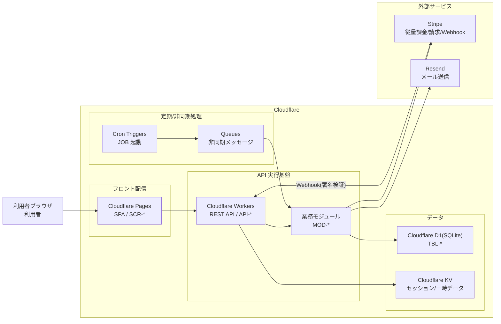

# 1. 概要

MeetRoom は Cloudflare 上に構築する会議室予約システムである。フロント(SPA)を Cloudflare Pages、REST API を Cloudflare Workers、業務データを Cloudflare D1(SQLite)、セッション等の一時データを Cloudflare KV、定期・非同期処理を Cloudflare Cron Triggers + Queues で実行し、メール送信を Resend、有料会議室の従量課金を Stripe と連携する。

# 2. システム構成図

フロント・API・モジュール・データベース・非同期処理・外部サービスの関係を示す。

# 3. 構成要素と責務

構成図に登場する各構成要素の役割と、詳細仕様の正本となる設計ドキュメントを示す。

| 構成要素 | 種別 | 関連ドキュメント | 責務 |
|---|---|---|---|
| 利用者ブラウザ | 利用者 | - | 利用者が MeetRoom を操作する入口 |
| Cloudflare Pages | フロント配信 | SCR-* | SPA(画面)を配信し、画面表示・入力チェック・API 呼び出しを担う |
| Cloudflare Workers | API 実行基盤 | API-*、API-COM_共通設計.md | REST API を実行する。Bearer JWT 認証・認可・入力検証を行い、業務モジュールを呼び出す。Stripe Webhook を受信する |
| 業務モジュール | モジュール | MOD-* | 認証・会議室検索・予約・通知・利用実績・課金などの業務処理を行う |
| Cloudflare D1(SQLite) | データ | TBL-* | ユーザー・会議室・予約・利用実績・利用量・請求などの業務データを保存する |
| Cloudflare KV | データ | - | JWT 失効・レート制御などのセッション/一時データを保持する(任意) |
| Cron Triggers | 定期/非同期処理 | JOB-* | JOB(リマインド・利用量計上・月次利用実績集計)を定期起動する |
| Queues | 定期/非同期処理 | JOB-* | JOB の処理単位を非同期メッセージとして受け渡し、失敗時に再試行する |
| Stripe | 外部サービス | 02_外部サービス連携.md、MOD-007 | 有料会議室の従量課金(従量サブスク・Meter Event・請求・Webhook)を担う |
| Resend | 外部サービス | 02_外部サービス連携.md、MOD-006 | リマインド・支払い方法登録完了・請求などのメールを送信する |

# 4. 外部連携

外部サービスとの連携の概要を示す。連携方式・入出力・失敗時方針の詳細は 02_外部サービス連携.md を正本とする。

| 連携先/連携点 | 用途 | 連携方式 | 入出力 | 失敗時の方針 | 関連ID |
|---|---|---|---|---|---|
| Stripe | 有料会議室の従量課金(支払い方法登録・利用量計上・月次請求) | Workers から Stripe API を REST 呼び出し／Stripe から Webhook を署名検証の上で受信 | 入力: Checkout セッション・Meter Event(利用量)／出力: 契約状態・請求・イベント | 冪等処理・リトライ。失敗は ERR-009 | MOD-007、API-010/011/012、JOB-002 |
| Resend | リマインド・支払い方法登録完了・請求などのメール送信 | Queue Consumer(Workers)から Resend API を REST 呼び出し | 入力: 宛先・本文／出力: 送信結果 | Queues で再試行。3回失敗で失敗状態に更新し管理者へ通知 | MOD-006、JOB-001 |

# 5. 非機能・運用方針

システム全体の非機能・運用方針を、実現元の非機能要件とともに示す。

| 観点 | 方針 | 関連ID |
|---|---|---|
| 可用性 | 平日8:00〜20:00の月次稼働率を確保する。JOB は Cron Triggers + Queues で再試行し処理欠落を防ぐ | NFR-002 |
| セキュリティ(通信) | 通信は HTTPS で暗号化する | NFR-004 |
| セキュリティ(認証) | パスワードはハッシュ保存し、Workers 上で Bearer JWT(有効期限24h)により認証・認可する。失効管理は KV を用いる | NFR-003、CFR-001、CFR-002 |
| データ保護 | D1 のデータを日次でバックアップ(エクスポート)する | NFR-005 |
| 監査 | 予約・課金・会議室管理などの重要操作の記録を保持する | NFR-006 |
| シークレット管理 | Stripe/Resend の API キー・Webhook 署名シークレットは Workers Secrets で管理し、コードに埋め込まない | - |
| 外部連携の堅牢性 | Stripe Webhook は署名検証の上で冪等に処理する。外部送信(Stripe/Resend)は Queues で再試行する | - |
| 初期ユーザー登録 | 本システムはアプリ上のユーザー登録(サインアップ)機能を持たない(スコープ外)。利用者(M_USERS)は、運用手順により MOD-008 で定義したハッシュ方式のパスワードを含むレコードを D1 へ投入(シード)して用意する。ログイン(UC-007)の前提条件はこの投入により満たす | CFR-001、TBL-001、MOD-008 |
