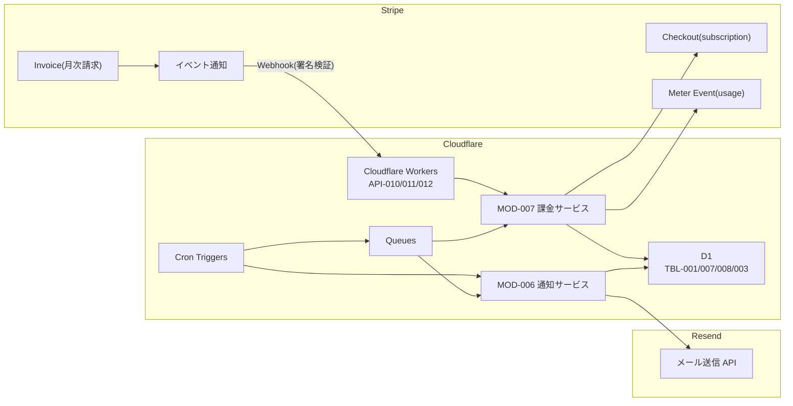

# 1. 概要

MeetRoom が利用する外部サービス(Stripe・Resend)と Cloudflare 各サービスの責務・連携方式・入出力・失敗時方針を定義する。Stripe は有料会議室の従量課金(従量サブスク・Meter Event・請求・Webhook)、Resend はメール送信を担う。連携内部の処理手順は各 MOD/API/JOB 設計が正本のため、本文書では ID で参照する。

# 2. システム構成図

外部サービスとの連携経路を示す。Workers を起点に Stripe API を呼び出し、Stripe からの Webhook を署名検証の上で受信する。メールは Queue Consumer から Resend へ送信する。

# 3. 構成要素と責務

外部サービスおよび連携に関与する Cloudflare 各サービスの責務を示す。詳細仕様は関連ドキュメントを正本とする。

| 構成要素 | 種別 | 関連ドキュメント | 責務 |
|---|---|---|---|
| Stripe | 外部サービス | MOD-007、API-010/011/012、JOB-002 | 従量サブスクによる支払い方法登録(Checkout)、利用量の計上(Meter Event)、月次請求(Invoice)、イベント通知(Webhook)を担う |
| Resend | 外部サービス | MOD-006、JOB-001 | リマインド・支払い方法登録完了・請求などのメールを送信する |
| Cloudflare Pages | フロント配信 | SCR-* | SPA を配信する。支払い方法登録は Stripe Checkout の遷移先 URL へ誘導する |
| Cloudflare Workers | API 実行基盤 | API-010/011/012 | Stripe API 呼び出しと Webhook 受信(署名検証)を実行する。認証・認可・入力検証を行う |
| Cloudflare D1(SQLite) | データ | TBL-001/007/008/003 | 課金契約状態(TBL-001)・利用量記録(TBL-007)・請求(TBL-008)・予約(TBL-003)を保存する |
| Cloudflare KV | データ | - | JWT 失効・レート制御などの一時データを保持する(任意) |
| Cloudflare Cron Triggers | 定期/非同期処理 | JOB-001/002 | リマインド・利用量計上 JOB を定期起動する |
| Cloudflare Queues | 定期/非同期処理 | JOB-001/002 | 外部送信(Resend 送信・Stripe Meter Event 送信)を非同期化し、失敗時に再試行する |

# 4. 外部連携

## Stripe(従量課金)

有料会議室(HOURLY_RATE>0)の利用時間に対する従量課金を担う。有料会議室の予約には支払い方法登録(従量サブスク契約、BILLING_STATUS=有効)が必要で、未契約は ERR-008。連携処理の失敗は ERR-009。

| 連携点 | 用途 | 連携方式 | 入力 | 出力 | 失敗時の方針 | 関連ID |
|---|---|---|---|---|---|---|
| Checkout(subscription) | 支払い方法登録・従量サブスク契約 | Workers→Stripe REST(Checkout Session 作成)。利用者は返却 URL で決済情報を入力 | Stripe 顧客ID・従量価格ID・成功/キャンセルURL | Checkout セッションURL | セッション作成失敗は ERR-009 を返す | API-010、MOD-007 |
| Webhook 受信 | 契約有効化・契約変更・請求結果の反映 | Stripe→Workers。Stripe-Signature を署名検証し冪等に処理 | イベント(checkout.session.completed / customer.subscription.updated / customer.subscription.deleted / invoice.paid / invoice.payment_failed) | TBL-001(BILLING_STATUS・サブスクID)、TBL-008(請求状態)更新 | 署名検証失敗は拒否。処理失敗は ERR-009。同一イベントは冪等に無視 | API-011、MOD-007、TBL-001/008 |
| Meter Event(usage) | 利用量(利用時間)の計上 | Workers→Stripe REST。予約完了時に利用量を送信 | 顧客(サブスク)識別・利用量(利用時間分)・冪等キー | Meter Event ID | Queues で再試行。3回失敗で TBL-007 を DEF-001/SET-013 にし次回実行で再送。失敗は ERR-009 | JOB-002、MOD-007、TBL-007 |
| Invoice(月次請求) | 月次の集計・請求 | Stripe が月末に Meter を集計し Invoice を発行。結果は Webhook で受領 | (Stripe 側で集計) | 請求金額・請求状態(invoice.paid/payment_failed) | 請求失敗(payment_failed)は TBL-008 を DEF-001/SET-015 に更新 | MOD-007、TBL-008、API-011 |

## Resend(メール送信)

リマインド・支払い方法登録完了・請求などのメールを送信する。送信は Cloudflare Queues 経由で非同期に行い、失敗時は再試行する。

| 連携点 | 用途 | 連携方式 | 入力 | 出力 | 失敗時の方針 | 関連ID |
|---|---|---|---|---|---|---|
| リマインド送信 | 予約開始前のリマインド通知 | Queue Consumer(Workers)→Resend REST | 宛先(予約者メール)・リマインド本文 | 送信結果 | Queues で再試行(最大3回)。3回失敗で DEF-001/SET-010 にし管理者へ通知 | JOB-001、MOD-006、TBL-003 |
| 支払い方法登録完了/請求メール | 支払い方法登録完了・請求などの通知 | Workers/Queue Consumer→Resend REST | 宛先・本文 | 送信結果 | Queues で再試行。継続失敗はログ記録し管理者へ通知 | MOD-006、MOD-007 |

# 5. 非機能・運用方針

外部連携に関する非機能・運用方針を示す。

| 観点 | 方針 | 関連ID |
|---|---|---|
| Webhook 真正性 | Stripe Webhook は Stripe-Signature を署名検証してから処理する。検証失敗のリクエストは拒否する | API-011 |
| 冪等性 | Webhook・Meter Event は冪等キー/イベントIDで冪等に処理し、重複受信・再送でも二重反映しない | MOD-007、TBL-007 |
| リトライ | 外部送信(Stripe Meter Event・Resend 送信)は Cloudflare Queues で再試行する。継続失敗は失敗状態に更新し管理者へ通知する | JOB-001、JOB-002 |
| シークレット管理 | Stripe API キー・Webhook 署名シークレット・Resend API キーは Workers Secrets で管理し、コード・リポジトリに含めない | - |
| 送信ドメイン | Resend の送信ドメインは SPF/DKIM を設定して認証済みドメインから送信する | NFR-004 |
| データ整合性 | 利用量は Stripe 送信前に TBL-007 へ記録し、Stripe 障害時も利用量が消失しないようにする | JOB-002、TBL-007 |
| 監査 | 課金(Checkout/Meter/Webhook/Invoice)の重要操作の記録を保持する | NFR-006 |
