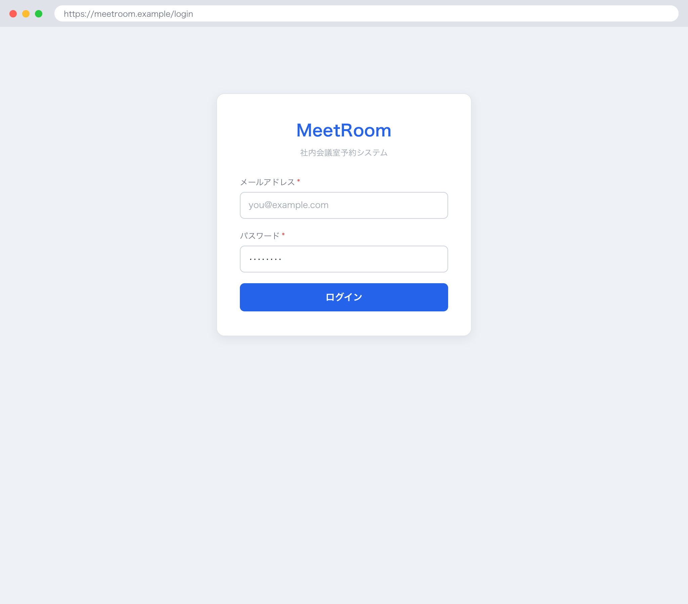

## 1. 基本情報

| 項目 | 内容 |
|---|---|
| 画面ID | SCR-001 |
| 画面名 | ログイン |
| 概要 | メールアドレスとパスワードで本人確認を行い、認証成功時に会議室検索へ遷移するログイン画面 |
| トレース元 | UC-007 |
| URL / ルート | /login |
| 利用可能ロール | 全員（未ログイン状態でアクセス可。認証後は一般 / 管理者） |

## 2. 画面レイアウト

## 3. 初期表示

| 項目 | 内容 |
|---|---|
| 表示時に呼び出すAPI | なし |
| デフォルト値 | メールアドレス・パスワードは空 |
| ソート順 | - |
| 0件時の表示 | - |

## 4. 画面項目

| 項目ID | 項目名 | 種別 | 表示/入力 | 必須 | 初期値 | 備考 |
|---|---|---|---|---|---|---|
| ITM-01 | メールアドレス | text | 入力 | Yes | - | ログインID。メール形式 |
| ITM-02 | パスワード | password | 入力 | Yes | - | 入力値はマスク表示 |
| ITM-03 | ログインボタン | button | 入力 | - | - | EVT-01 を発火 |

## 5. 画面イベント

| イベントID | イベント名 | 発火条件 | 呼び出しAPI | 成功時 | 失敗時 |
|---|---|---|---|---|---|
| EVT-01 | ログイン | ログインボタン押下 | API-001 | 発行された JWT をクライアントに保持し(以降の API 呼び出しは Authorization: Bearer ヘッダに付与。有効期限は API-001 の 24 時間)、SCR-002 へ遷移 | ERR-001 発生時 MSG-004 表示 / ERR-006 発生時 MSG-028 表示。いずれもログイン画面に留まる |

## 6. 入力チェック

<!-- クライアント側チェックのみ。サーバ側バリデーションは API 文書に記載 -->

| 対象項目 | チェック内容 | 表示メッセージ |
|---|---|---|
| メールアドレス | 必須・メール形式であること | MSG-027 |
| パスワード | 必須・8文字以上であること | MSG-028 |

## 7. 表示制御

| 条件 | 対象 | 制御内容 |
|---|---|---|
| メールアドレスまたはパスワードが未入力 | ログインボタン | 非活性 |

## 8. 画面遷移

| 遷移先 | トリガ |
|---|---|
| SCR-002 | ログイン成功時（EVT-01） |

## 9. メッセージ一覧

本画面が参照する画面表示文言(MSG)を以下にインライン定義する。対応ERR は当該メッセージの表示契機となるエラー(なしは -)。

| MSG ID | 種別 | 文言 | 対応ERR |
|---|---|---|---|
| MSG-004 | エラー | メールアドレスまたはパスワードが正しくありません。 | ERR-001 |
| MSG-027 | エラー | メールアドレスを正しい形式で入力してください。 | - |
| MSG-028 | エラー | パスワードは8文字以上で入力してください。 | ERR-006 |
