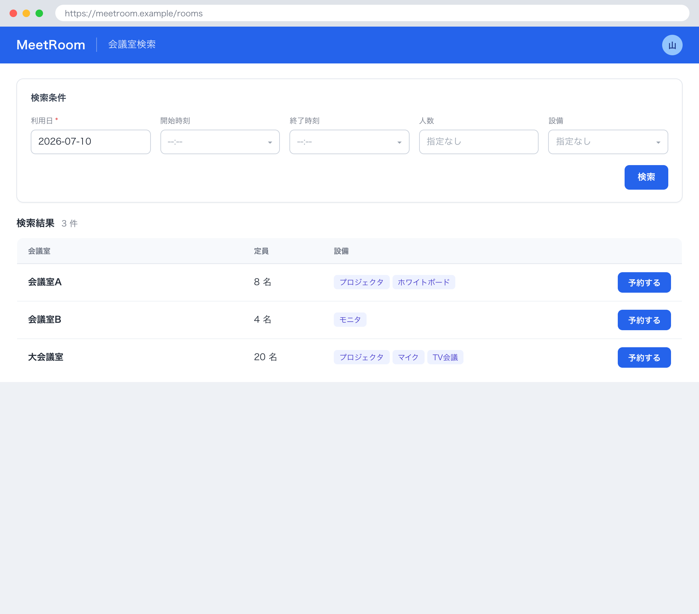

# 1. 基本情報

| 項目 | 内容 |
|---|---|
| 画面ID | SCR-002 |
| 画面名 | 会議室検索 |
| 概要 | 日時・人数・設備を条件に空き会議室を検索し、予約する会議室を選択する画面 |
| トレース元 | UC-001, UC-002 |
| URL / ルート | /rooms |
| 利用可能ロール | DEF-001/CODE-001 |

# 2. 画面レイアウト

# 3. 初期表示

| 項目 | 内容 |
|---|---|
| 表示時に呼び出すAPI | API-009(設備選択肢 ITM-05 の取得)。会議室検索(API-002)は検索ボタン押下(EVT-01)時に実行する |
| デフォルト値 | 利用日=当日。開始時刻・終了時刻・人数・設備=未指定 |
| ソート順 | 会議室名昇順(API-002 の返却順) |
| 0件時の表示 | MSG-007 を表示 |

# 4. 画面項目

| 項目ID | 項目名 | 種別 | 表示/入力 | 必須 | 初期値 | 備考 |
|---|---|---|---|---|---|---|
| ITM-01 | 利用日 | date | 入力 | Yes | 当日 | - |
| ITM-02 | 開始時刻 | select | 入力 | Yes | - | 15分刻み |
| ITM-03 | 終了時刻 | select | 入力 | Yes | - | 15分刻み |
| ITM-04 | 人数 | number | 入力 | No | - | 未指定時は収容人数で絞り込まない |
| ITM-05 | 設備 | select | 入力 | No | - | 選択肢は API-009(設備一覧取得)の結果から設定する(複数選択可) |
| ITM-06 | 検索ボタン | button | 入力 | - | - | EVT-01 を発火 |
| ITM-07 | 結果一覧 | 一覧 | 表示 | - | - | 表示列: 会議室名 / 収容人数 / 場所 / 設備一覧(API-002 レスポンス items[] の name / capacity / location / equipments[] に対応)。各行に「予約する」ボタンを持つ(EVT-02) |
| ITM-08 | ページャ | button | 入力 | - | - | 前へ / 次へ / ページ番号。EVT-03 を発火(API-002 §5(2)・API-COM §5 のページネーションに対応) |

# 5. 画面イベント

| イベントID | イベント名 | 発火条件 | 呼び出しAPI | 成功時 | 失敗時 |
|---|---|---|---|---|---|
| EVT-01 | 検索 | 検索ボタン押下 | API-002 | 検索結果を結果一覧(ITM-07)に表示。総件数に応じてページャ(ITM-08)を表示 | ERR-006 発生時 MSG-009 を表示し画面に留まる(再入力可能)。ERR-001 発生時は SCR-001(ログイン)へ遷移 |
| EVT-02 | 予約する | 結果行の「予約する」押下 | - | SCR-003 へ遷移(会議室ID・利用日・開始時刻・終了時刻を引き継ぐ) | - |
| EVT-03 | ページ切替 | ページャ(ITM-08)の操作 | API-002 | 指定ページの検索結果を結果一覧(ITM-07)に再表示(検索条件は維持し page のみ変更) | ERR-006 発生時 MSG-009 を表示。ERR-001 発生時は SCR-001(ログイン)へ遷移 |

# 6. 入力チェック

| 対象項目 | チェック内容 | 表示メッセージ |
|---|---|---|
| 利用日 | 必須であること | MSG-015 |
| 開始時刻・終了時刻 | 両方とも指定されていること(必須) | MSG-015 |
| 開始時刻・終了時刻 | 開始 < 終了 であること | MSG-008 |

# 7. 表示制御

| 条件 | 対象 | 制御内容 |
|---|---|---|
| 検索結果が0件 | 結果一覧 | 非表示 |
| 検索結果が0件 | 0件メッセージ(MSG-007) | 表示 |
| 総件数 ＜＝ 1ページ表示件数(API-COM §5 の既定 limit) | ページャ(ITM-08) | 非表示 |

# 8. 画面遷移

| 遷移先 | トリガ |
|---|---|
| SCR-003 | 結果行の「予約する」押下(EVT-02。会議室ID・利用日・開始時刻・終了時刻を引き継ぐ) |
| SCR-001 | API 呼び出しで ERR-001(認証失敗・トークン失効)を受信、または未認証で本画面へアクセス |

# 9. メッセージ一覧

本画面が参照する画面表示文言(MSG)を以下にインライン定義する。対応ERR は当該メッセージの表示契機となるエラー(なしは -)。

| MSG ID | 種別 | 文言 | 対応ERR |
|---|---|---|---|
| MSG-007 | 情報 | 条件に合う会議室がありません | - |
| MSG-008 | エラー | 終了時刻は開始時刻より後の時刻を指定してください。 | - |
| MSG-009 | エラー | 検索条件が正しくありません。入力内容を確認してください。 | ERR-006 |
| MSG-015 | エラー | 利用日・開始時刻・終了時刻を指定してください。 | - |
