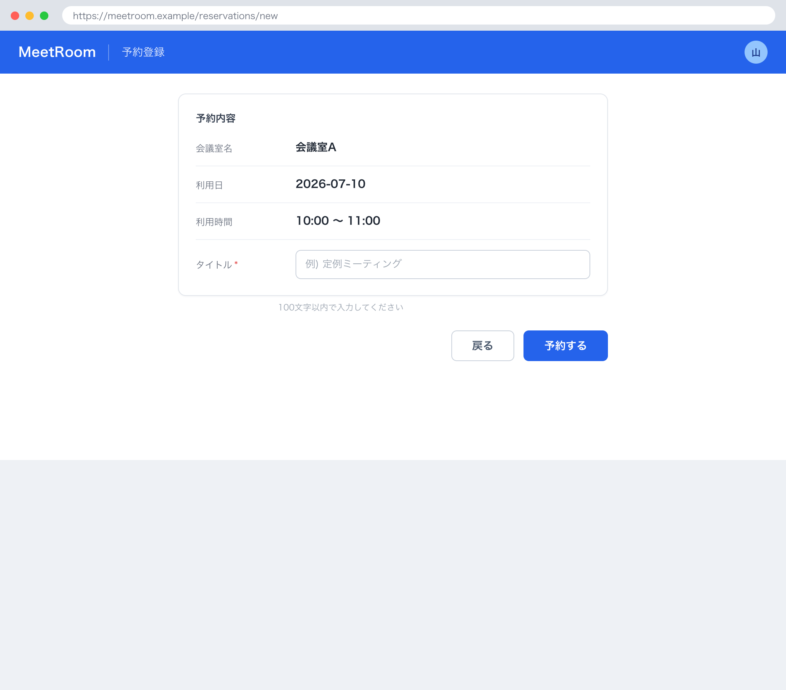

# 1. 基本情報

| 項目 | 内容 |
|---|---|
| 画面ID | SCR-003 |
| 画面名 | 予約登録 |
| 概要 | SCR-002 で選択した会議室・日時に対してタイトルを入力し、予約を登録する画面 |
| トレース元 | UC-002 |
| URL / ルート | /reservations/new |
| 利用可能ロール | DEF-001/CODE-001 |

# 2. 画面レイアウト

# 3. 初期表示

| 項目 | 内容 |
|---|---|
| 表示時に呼び出すAPI | なし(SCR-002 から会議室・日時を引き継いで表示) |
| デフォルト値 | 会議室名・利用日・開始/終了時刻は SCR-002 から引き継いだ値 |
| ソート順 | - |
| 0件時の表示 | - |

# 4. 画面項目

| 項目ID | 項目名 | 種別 | 表示/入力 | 必須 | 初期値 | 備考 |
|---|---|---|---|---|---|---|
| ITM-01 | 会議室名 | label | 表示 | - | SCR-002 から引き継ぎ | - |
| ITM-02 | 利用日 | label | 表示 | - | SCR-002 から引き継ぎ | - |
| ITM-03 | 開始/終了時刻 | label | 表示 | - | SCR-002 から引き継ぎ | - |
| ITM-04 | タイトル | text | 入力 | Yes | - | 最大100文字 |
| ITM-05 | 予約ボタン | button | 入力 | - | - | EVT-01 を発火 |
| ITM-06 | 戻るボタン | button | 入力 | - | - | EVT-02 を発火 |
| ITM-07 | 従量課金の案内 | label | 表示 | - | - | 有料会議室（利用単価>0）選択時に表示（MSG-012） |
| ITM-08 | 支払い方法登録リンク | button | 入力 | - | - | 有料会議室かつ未契約時に表示。EVT-03 を発火 |

# 5. 画面イベント

| イベントID | イベント名 | 発火条件 | 呼び出しAPI | 成功時 | 失敗時 |
|---|---|---|---|---|---|
| EVT-01 | 予約 | 予約ボタン押下 | API-003 | MSG-001 表示、SCR-004 へ遷移 | ERR-003 発生時 MSG-003 表示 / ERR-004 発生時 MSG-006 表示 / ERR-006 発生時 MSG-005 表示 / ERR-008 発生時 MSG-014 表示(SCR-007 への導線を示す) / ERR-010 発生時 MSG-016 表示。いずれも画面に留まり再入力を促す。ERR-001 発生時は SCR-001(ログイン)へ遷移 |
| EVT-02 | 戻る | 戻るボタン押下 | - | SCR-002 へ遷移 | - |
| EVT-03 | 支払い方法登録へ | 支払い方法登録リンク押下 | - | SCR-007 へ遷移 | - |

# 6. 入力チェック

| 対象項目 | チェック内容 | 表示メッセージ |
|---|---|---|
| タイトル | 必須・100文字以内 | MSG-005 |

# 7. 表示制御

| 条件 | 対象 | 制御内容 |
|---|---|---|
| 有料会議室（利用単価>0）を選択 | 従量課金の案内（MSG-012） | 表示 |
| 有料会議室かつ課金契約状態が未契約（DEF-001/CODE-002=1） | 支払い方法登録リンク | 表示 |
| 無料会議室（利用単価=0）を選択 | 従量課金の案内・支払い方法登録リンク | 非表示 |

# 8. 画面遷移

| 遷移先 | トリガ |
|---|---|
| SCR-004 | 予約成功時(EVT-01) |
| SCR-002 | 戻るボタン押下(EVT-02) |
| SCR-007 | 支払い方法登録リンク押下（EVT-03） |
| SCR-001 | API 呼び出しで ERR-001(認証失敗・トークン失効)を受信、または未認証で本画面へアクセス |

# 9. メッセージ一覧

本画面が参照する画面表示文言(MSG)を以下にインライン定義する。対応ERR は当該メッセージの表示契機となるエラー(なしは -)。

| MSG ID | 種別 | 文言 | 対応ERR |
|---|---|---|---|
| MSG-001 | 完了 | 会議室を予約しました。 | - |
| MSG-003 | エラー | 指定の時間帯は既に予約されています。時間を変えて再度お試しください。 | ERR-003 |
| MSG-005 | エラー | タイトルは必須です。100文字以内で入力してください。 | ERR-006 |
| MSG-006 | エラー | 過去の日時は予約できません。日時を確認してください。 | ERR-004 |
| MSG-012 | 案内 | この会議室は有料です。利用時間に応じて従量課金されます。 | - |
| MSG-014 | エラー | 有料会議室の利用には支払い方法の登録が必要です。 | ERR-008 |
| MSG-016 | エラー | この会議室は現在利用停止中のため予約できません。 | ERR-010 |
