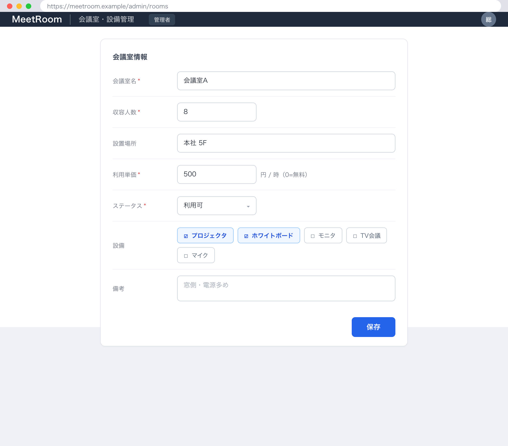

# 1. 基本情報

| 項目 | 内容 |
|---|---|
| 画面ID | SCR-005 |
| 画面名 | 会議室・設備管理 |
| 概要 | 管理者が会議室（利用単価を含む）の登録・編集を行い、設備を割り当てる管理画面 |
| トレース元 | UC-005 |
| URL / ルート | /admin/rooms |
| 利用可能ロール | 管理者 |

# 2. 画面レイアウト

# 3. 初期表示

| 項目 | 内容 |
|---|---|
| 表示時に呼び出すAPI | API-014(会議室一覧の取得。利用停止を含む), API-009(設備選択肢の取得) |
| デフォルト値 | 新規登録モード（各入力項目は空、利用単価=0、会議室ステータス=利用可）。会議室一覧で行の「編集」を押下(EVT-02)した場合は当該会議室の現在値を入力フォームに設定 |
| ソート順 | 会議室一覧は会議室名昇順、設備選択肢は設備名昇順 |
| 0件時の表示 | - |

# 4. 画面項目

| 項目ID | 項目名 | 種別 | 表示/入力 | 必須 | 初期値 | 備考 |
|---|---|---|---|---|---|---|
| ITM-01 | 会議室名 | text | 入力 | Yes | - | - |
| ITM-02 | 収容人数 | number | 入力 | Yes | - | 1以上の整数 |
| ITM-03 | 設置場所 | text | 入力 | No | - | - |
| ITM-04 | 利用単価 | number | 入力 | Yes | 0 | 円/時（HOURLY_RATE）。0=無料、1以上=有料 |
| ITM-05 | 会議室ステータス | select | 入力 | Yes | 利用可 | 選択肢は TBL-002/ENM-1（利用可 / 利用停止） |
| ITM-06 | 設備 | checkbox | 入力 | No | - | 選択肢は API-009（設備一覧）。複数選択可 |
| ITM-07 | 備考 | textarea | 入力 | No | - | - |
| ITM-08 | 保存ボタン | button | 入力 | - | - | EVT-01 を発火 |
| ITM-09 | 会議室一覧 | 一覧 | 表示 | - | - | API-014 の結果。会議室名・収容人数・場所・利用単価・ステータス（TBL-002/ENM-1、利用停止含む）を表示。各行に「編集」ボタン（EVT-02）を持つ |
| ITM-10 | 新規登録ボタン | button | 入力 | - | - | EVT-03 を発火（入力フォームを新規登録モードに初期化） |
| ITM-11 | 設備名（新規設備） | text | 入力 | No | - | 設備を新規登録する際の設備名。100文字以内 |
| ITM-12 | 設備登録ボタン | button | 入力 | - | - | EVT-04 を発火 |

# 5. 画面イベント

| イベントID | イベント名 | 発火条件 | 呼び出しAPI | 成功時 | 失敗時 |
|---|---|---|---|---|---|
| EVT-01 | 会議室保存 | 保存ボタン押下 | API-007 | MSG-010 表示、入力内容を保存後の値で更新し会議室一覧(ITM-09)を再取得 | ERR-006 発生時 MSG-011 表示 / ERR-007 発生時 MSG-020 表示し新規登録モードへ戻す / ERR-002 発生時 MSG-021 表示。ERR-001 発生時は SCR-001(ログイン)へ遷移 |
| EVT-02 | 会議室編集 | 会議室一覧(ITM-09)行の「編集」押下 | - | 当該会議室の現在値を入力フォーム(ITM-01〜07)に設定し編集モードにする | - |
| EVT-03 | 新規登録 | 新規登録ボタン(ITM-10)押下 | - | 入力フォームを新規登録モード(空値、利用単価=0、ステータス=利用可)に初期化する | - |
| EVT-04 | 設備登録 | 設備登録ボタン(ITM-12)押下 | API-013 | MSG-022 表示、設備選択肢(ITM-06)を API-009 で再取得し設備名(ITM-11)を空にする | ERR-006 発生時 MSG-023 表示 / ERR-011 発生時 MSG-024 表示。ERR-001 発生時は SCR-001(ログイン)へ遷移 |

# 6. 入力チェック

<!-- クライアント側チェックのみ。サーバ側バリデーションは API 文書に記載 -->

| 対象項目 | チェック内容 | 表示メッセージ |
|---|---|---|
| 会議室名 | 必須であること | MSG-011 |
| 収容人数 | 必須・1以上の整数であること | MSG-011 |
| 利用単価 | 必須・0以上の整数であること | MSG-011 |
| 設備名（新規設備） | 設備登録時は必須・100文字以内であること | MSG-023 |

# 7. 表示制御

| 条件 | 対象 | 制御内容 |
|---|---|---|
| ロールが一般ユーザー | 画面全体 | 非表示（アクセス不可） |
| 編集対象が未指定（新規登録モード） | 各入力項目 | 空値で活性 |
| 会議室一覧で編集対象を選択済み（編集モード） | 各入力項目 | 当該会議室の現在値で活性 |

# 8. 画面遷移

| 遷移先 | トリガ |
|---|---|
| SCR-001 | API 呼び出しで ERR-001(認証失敗・トークン失効)を受信、または未認証で本画面へアクセス |
| - | 上記以外の他画面への遷移なし（会議室・設備の登録・編集は本画面内で完結） |

# 9. メッセージ一覧

本画面が参照する画面表示文言(MSG)を以下にインライン定義する。対応ERR は当該メッセージの表示契機となるエラー(なしは -)。

| MSG ID | 種別 | 文言 | 対応ERR |
|---|---|---|---|
| MSG-010 | 完了 | 会議室情報を保存しました。 | - |
| MSG-011 | エラー | 会議室名・収容人数・利用単価は必須です。 | ERR-006 |
| MSG-020 | エラー | 対象の会議室が見つかりません。会議室一覧を再取得してください。 | ERR-007 |
| MSG-021 | エラー | この操作を行う権限がありません。 | ERR-002 |
| MSG-022 | 完了 | 設備を登録しました。 | - |
| MSG-023 | エラー | 設備名は必須です。100文字以内で入力してください。 | ERR-006 |
| MSG-024 | エラー | 同じ名称の設備が既に登録されています。 | ERR-011 |
