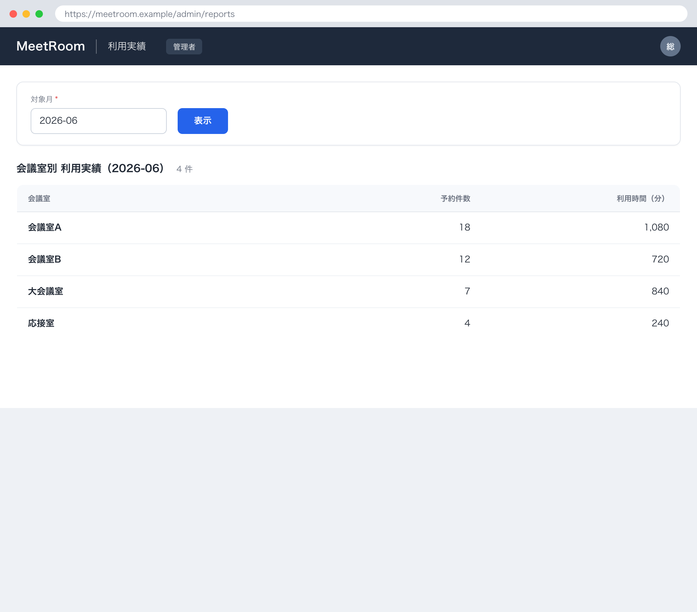

## 1. 基本情報

| 項目 | 内容 |
|---|---|
| 画面ID | SCR-006 |
| 画面名 | 利用実績 |
| 概要 | 管理者が対象月を指定し、会議室ごとの月次利用実績（予約件数・利用時間）を確認する画面 |
| トレース元 | UC-006 |
| URL / ルート | /admin/reports |
| 利用可能ロール | 管理者 |

## 2. 画面レイアウト

## 3. 初期表示

| 項目 | 内容 |
|---|---|
| 表示時に呼び出すAPI | API-008 |
| デフォルト値 | 対象月=当月 |
| ソート順 | 会議室名 昇順 |
| 0件時の表示 | MSG-007 を表示し、実績一覧を非表示にする |

## 4. 画面項目

| 項目ID | 項目名 | 種別 | 表示/入力 | 必須 | 初期値 | 備考 |
|---|---|---|---|---|---|---|
| ITM-01 | 対象月 | month | 入力 | Yes | 当月 | YYYY-MM 形式 |
| ITM-02 | 表示ボタン | button | 入力 | - | - | EVT-01 を発火 |
| ITM-03 | 実績一覧 | 一覧 | 表示 | - | - | 会議室名・予約件数・利用時間（分）を表示。集計対象は完了した予約 |

## 5. 画面イベント

| イベントID | イベント名 | 発火条件 | 呼び出しAPI | 成功時 | 失敗時 |
|---|---|---|---|---|---|
| EVT-01 | 実績表示 | 表示ボタン押下 | API-008 | 指定した対象月の会議室別実績を実績一覧に表示 | - |

## 6. 入力チェック

<!-- クライアント側チェックのみ。サーバ側バリデーションは API 文書に記載 -->

| 対象項目 | チェック内容 | 表示メッセージ |
|---|---|---|
| 対象月 | 必須・YYYY-MM 形式であること | - |

## 7. 表示制御

| 条件 | 対象 | 制御内容 |
|---|---|---|
| ロールが一般ユーザー | 画面全体 | 非表示（アクセス不可） |
| 実績が0件 | 実績一覧 | 非表示 |
| 実績が0件 | 0件メッセージ（MSG-007） | 表示 |

## 8. 画面遷移

| 遷移先 | トリガ |
|---|---|
| - | 他画面への遷移なし（利用実績の確認は本画面内で完結） |

## 9. メッセージ一覧

本画面が参照する画面表示文言(MSG)を以下にインライン定義する。対応ERR は当該メッセージの表示契機となるエラー(なしは -)。

| MSG ID | 種別 | 文言 | 対応ERR |
|---|---|---|---|
| MSG-007 | 情報 | 条件に合う会議室がありません | - |
