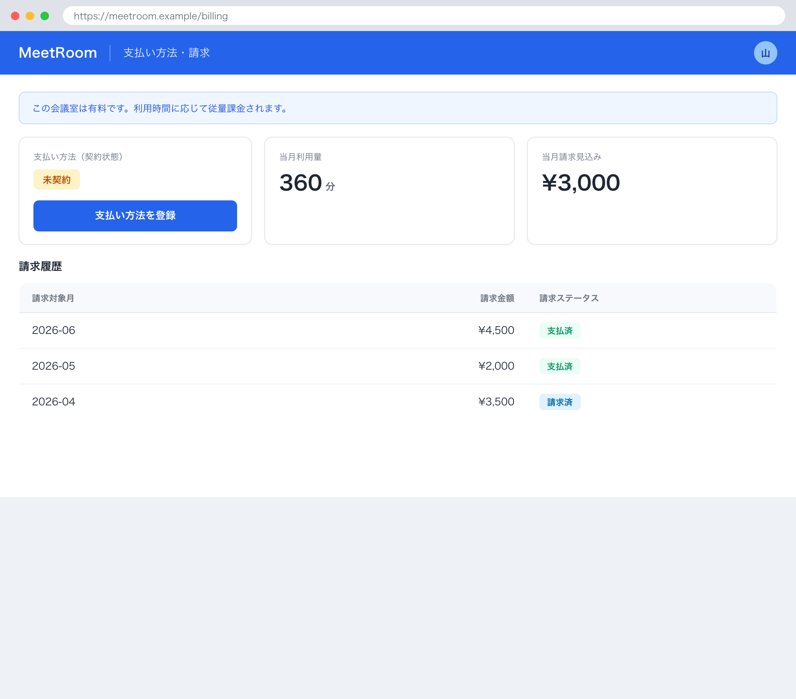

## 1. 基本情報

| 項目 | 内容 |
|---|---|
| 画面ID | SCR-007 |
| 画面名 | 支払い方法・請求 |
| 概要 | 有料会議室の従量課金に用いる支払い方法（従量サブスク）を登録し、当月の利用量・請求見込みと請求履歴を確認する画面 |
| トレース元 | UC-008, UC-009 |
| URL / ルート | /billing |
| 利用可能ロール | 一般 / 管理者 |

## 2. 画面レイアウト

## 3. 初期表示

| 項目 | 内容 |
|---|---|
| 表示時に呼び出すAPI | API-012 |
| デフォルト値 | 対象=当月。契約状態・当月利用量・当月請求見込み・請求履歴を表示 |
| ソート順 | 請求履歴は請求対象月 降順 |
| 0件時の表示 | 請求履歴が無い旨を表示し、請求履歴一覧を非表示にする |

## 4. 画面項目

| 項目ID | 項目名 | 種別 | 表示/入力 | 必須 | 初期値 | 備考 |
|---|---|---|---|---|---|---|
| ITM-01 | 契約状態 | label | 表示 | - | - | 課金契約状態（TBL-001/ENM-2：未契約 / 有効 / 停止） |
| ITM-02 | 支払い方法登録ボタン | button | 入力 | - | - | EVT-01 を発火（Stripe Checkout へ遷移） |
| ITM-03 | 当月利用量 | label | 表示 | - | - | 当月の利用時間（分） |
| ITM-04 | 当月請求見込み | label | 表示 | - | - | 当月の請求見込み金額（円） |
| ITM-05 | 請求履歴一覧 | 一覧 | 表示 | - | - | 請求対象月・請求金額・請求ステータス（TBL-008/ENM-1）を表示 |

## 5. 画面イベント

| イベントID | イベント名 | 発火条件 | 呼び出しAPI | 成功時 | 失敗時 |
|---|---|---|---|---|---|
| EVT-01 | 支払い方法登録 | 支払い方法登録ボタン押下 | API-010 | 生成された Stripe Checkout（サブスク登録）画面へ遷移 | ERR-009 発生時 CFR-004 に従いエラー表示 |
| EVT-02 | 登録完了 | Stripe Checkout 完了後に本画面へ戻った時 | - | MSG-013 表示、API-012 を再取得し契約状態・利用量・請求を更新 | - |

## 6. 入力チェック

<!-- クライアント側チェックのみ。サーバ側バリデーションは API 文書に記載 -->

| 対象項目 | チェック内容 | 表示メッセージ |
|---|---|---|
| - | クライアント側の入力チェックなし（入力フォームを持たない） | - |

## 7. 表示制御

| 条件 | 対象 | 制御内容 |
|---|---|---|
| 契約状態が未契約（1） | 支払い方法登録ボタン | 活性 |
| 契約状態が未契約（1） | 従量課金の案内（MSG-012） | 表示 |
| 契約状態が有効（2） | 支払い方法登録ボタン | 非活性 |
| 請求履歴が0件 | 請求履歴一覧 | 非表示 |

## 8. 画面遷移

| 遷移先 | トリガ |
|---|---|
| Stripe Checkout（外部・Stripe） | 支払い方法登録ボタン押下（EVT-01） |
| SCR-007 | Stripe Checkout 完了後に本画面へ戻る（EVT-02） |

## 9. メッセージ一覧

本画面が参照する画面表示文言(MSG)を以下にインライン定義する。対応ERR は当該メッセージの表示契機となるエラー(なしは -)。

| MSG ID | 種別 | 文言 | 対応ERR |
|---|---|---|---|
| MSG-012 | 案内 | この会議室は有料です。利用時間に応じて従量課金されます。 | - |
| MSG-013 | 完了 | 支払い方法を登録しました。 | - |
