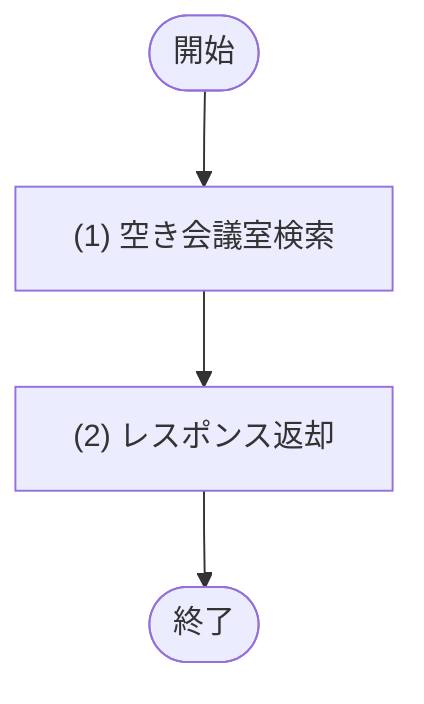

## 1. 基本情報

| 項目 | 内容 |
|---|---|
| API ID | API-002 |
| API名 | 会議室検索 |
| メソッド | GET |
| パス | /api/rooms |
| 認証 | 要 |
| 認可 | 一般=可, 管理者=可 |
| 冪等性 | あり(参照系) |
| トレース元 | UC-001, UC-002 |
| 概要 | 日時・人数・設備を条件に空き会議室を検索し、一覧を返す。 |

## 2. リクエスト

| 論理名 | 物理名 | 型 | 必須 | 説明・制約 |
|---|---|---|---|---|
| 利用日 | date | string | Yes | YYYY-MM-DD 形式 |
| 開始時刻 | start_time | string | No | HH:mm 形式 |
| 終了時刻 | end_time | string | No | HH:mm 形式 |
| 利用人数 | capacity | int | No | 1以上の整数 |
| 設備ID | equipment_id | int | No | 設備の一意な識別子 |

## 3. レスポンス

| 項目 | 内容 |
|---|---|
| HTTPステータス | 200 |

以下は items 配列の各要素。

| 論理名 | 物理名 | 型 | 説明 |
|---|---|---|---|
| 会議室ID | room_id | int | 会議室の一意な識別子 |
| 会議室名 | name | string | 会議室の名称 |
| 収容人数 | capacity | int | 会議室に収容できる人数 |
| 場所 | location | string | 会議室の場所 |
| 設備一覧 | equipments[] | array | 会議室に紐づく設備一覧。要素の構造は以下のとおり |
| 設備ID | equipments[].equipment_id | int | 設備の一意な識別子 |
| 設備名 | equipments[].name | string | 設備の名称 |

## 4. 処理フロー

この API の基本フローをフローチャートで定義する。

## 5. 処理詳細

処理フローの各処理で行う内容を定義する。

### (1) 空き会議室検索

指定された条件に合致し、指定時間帯に予約が入っていない会議室を取得する。

| MOD-ID | 処理名 |
|---|---|
| MOD-002 | 空き会議室検索 |

| 引数項目 | 値 |
|---|---|
| 利用日 | リクエスト.利用日 |
| 開始時刻 | リクエスト.開始時刻 |
| 終了時刻 | リクエスト.終了時刻 |
| 利用人数 | リクエスト.利用人数 |
| 設備ID | リクエスト.設備ID |

### (2) レスポンス返却

(1) 空き会議室検索の結果にページネーションを適用し、レスポンスとして返却する。

| 論理名 | 物理名 | 設定値 |
|---|---|---|
| 会議室一覧 | items | (1) 空き会議室検索の結果にページネーションを適用した一覧 |
| 会議室ID | items[].room_id | (1) 空き会議室検索の結果 |
| 会議室名 | items[].name | (1) 空き会議室検索の結果 |
| 収容人数 | items[].capacity | (1) 空き会議室検索の結果 |
| 場所 | items[].location | (1) 空き会議室検索の結果 |
| 設備一覧 | items[].equipments | (1) 空き会議室検索の結果 |
| 設備ID | items[].equipments[].equipment_id | (1) 空き会議室検索の結果 |
| 設備名 | items[].equipments[].name | (1) 空き会議室検索の結果 |
| 総件数 | total | (1) 空き会議室検索の結果の総件数 |

## 6. バリデーション

入力バリデーションの構文ルールを、成立条件(AND / OR の論理式)で定義する。成立条件を満たさない場合、エラー列のコードを返し、違反項目ごとに details[] へ {field=物理名, message=メッセージ列} を設定する。

| 論理名 | 物理名 | 成立条件 | エラー | メッセージ |
|---|---|---|---|---|
| 利用日 | date | 指定あり AND YYYY-MM-DD形式 | ERR-006 | 利用日は YYYY-MM-DD 形式で指定してください |
| 開始時刻 | start_time | 指定なし OR(指定あり AND HH:mm形式) | ERR-006 | 開始時刻は HH:mm 形式で指定してください |
| 終了時刻 | end_time | 指定なし OR(指定あり AND HH:mm形式) | ERR-006 | 終了時刻は HH:mm 形式で指定してください |
| 開始時刻 / 終了時刻 | start_time / end_time | (開始指定 AND 終了指定)OR(開始なし AND 終了なし) | ERR-006 | 開始時刻と終了時刻は、両方指定するか両方とも省略してください |
| 開始時刻 / 終了時刻 | start_time / end_time | 両方なし OR(両方指定 AND 開始時刻＜終了時刻) | ERR-006 | 開始時刻は終了時刻より前にしてください |
| 利用人数 | capacity | 指定なし OR(指定あり AND 整数 AND 1 ＜＝ 利用人数) | ERR-006 | 利用人数は1以上の整数で指定してください |

## 7. エラー

認証・入力バリデーションで発生する共通エラーは API-COM_共通設計.md §4.1 共通エラー一覧を参照する。本 API に適用される共通エラーは ERR-001(認証失敗) / ERR-006(バリデーションエラー)。この API 固有のエラーはない。
