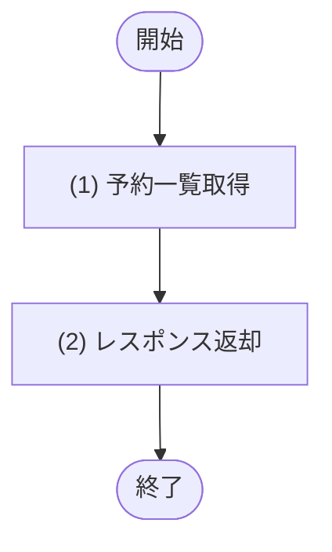

## 1. 基本情報

| 項目 | 内容 |
|---|---|
| API ID | API-006 |
| API名 | 予約一覧取得 |
| メソッド | GET |
| パス | /api/reservations |
| 認証 | 要 |
| 認可 | 一般=可, 管理者=可(いずれも本人の予約のみ) |
| 冪等性 | あり(参照系) |
| トレース元 | UC-003, UC-004 |
| 概要 | 認証済み利用者本人の予約一覧を取得する。予約ステータス・利用開始日の期間で絞り込み、ページネーションして返す。 |

## 2. リクエスト

| 論理名 | 物理名 | 型 | 必須 | 説明・制約 |
|---|---|---|---|---|
| 予約ステータス | status | int | No | TBL-003/ENM-1。指定時は該当ステータスの予約のみ |
| 期間開始 | from | string | No | YYYY-MM-DD 形式。利用開始日がこの日以降の予約を対象 |
| 期間終了 | to | string | No | YYYY-MM-DD 形式。利用開始日がこの日以前の予約を対象 |

## 3. レスポンス

| 項目 | 内容 |
|---|---|
| HTTPステータス | 200 |

以下は items 配列の各要素。

| 論理名 | 物理名 | 型 | 説明 |
|---|---|---|---|
| 予約ID | items[].reservation_id | int | 予約の一意な識別子 |
| 会議室ID | items[].room_id | int | 予約対象の会議室ID |
| 会議室名 | items[].room_name | string | 予約対象の会議室名 |
| 予約タイトル | items[].title | string | 予約タイトル |
| 利用開始日時 | items[].start_at | string | 利用開始日時(ISO 8601) |
| 利用終了日時 | items[].end_at | string | 利用終了日時(ISO 8601) |
| 予約ステータス | items[].status | int | TBL-003/ENM-1 |
| リマインド状態 | items[].remind_status | int | TBL-003/ENM-2 |

## 4. 処理フロー

この API の基本フローをフローチャートで定義する。

## 5. 処理詳細

処理フローの各処理で行う内容を定義する。

### (1) 予約一覧取得

認証済みユーザー本人の予約を、指定された条件(予約ステータス・期間)で絞り込んで取得する。該当が無い場合は空一覧を返す。

| MOD-ID | 処理名 |
|---|---|
| MOD-003 | 予約一覧取得 |

| 引数項目 | 値 |
|---|---|
| ユーザーID | 認証済みユーザーID |
| 予約ステータス | リクエスト.予約ステータス |
| 期間開始 | リクエスト.期間開始 |
| 期間終了 | リクエスト.期間終了 |

### (2) レスポンス返却

(1) 予約一覧取得の結果にページネーションを適用し、レスポンスとして返却する。

| 論理名 | 物理名 | 設定値 |
|---|---|---|
| 予約一覧 | items | (1) 予約一覧取得の結果にページネーションを適用した一覧 |
| 予約ID | items[].reservation_id | (1) 予約一覧取得の結果 |
| 会議室ID | items[].room_id | (1) 予約一覧取得の結果 |
| 会議室名 | items[].room_name | (1) 予約一覧取得の結果 |
| 予約タイトル | items[].title | (1) 予約一覧取得の結果 |
| 利用開始日時 | items[].start_at | (1) 予約一覧取得の結果 |
| 利用終了日時 | items[].end_at | (1) 予約一覧取得の結果 |
| 予約ステータス | items[].status | (1) 予約一覧取得の結果 |
| リマインド状態 | items[].remind_status | (1) 予約一覧取得の結果 |
| 総件数 | total | (1) 予約一覧取得の結果の総件数 |

## 6. バリデーション

入力バリデーションの構文ルールを、成立条件(AND / OR の論理式)で定義する。成立条件を満たさない場合、エラー列のコードを返し、違反項目ごとに details[] へ {field=物理名, message=メッセージ列} を設定する。任意項目は「指定なし OR(指定あり AND 制約)」の形で表す。

| 論理名 | 物理名 | 成立条件 | エラー | メッセージ |
|---|---|---|---|---|
| 予約ステータス | status | 指定なし OR(指定あり AND int AND 値 ∈ {1, 2, 3}) | ERR-006 | 予約ステータスは 1〜3 のいずれかで指定してください |
| 期間開始 | from | 指定なし OR(指定あり AND YYYY-MM-DD形式) | ERR-006 | 期間開始は YYYY-MM-DD 形式で指定してください |
| 期間終了 | to | 指定なし OR(指定あり AND YYYY-MM-DD形式) | ERR-006 | 期間終了は YYYY-MM-DD 形式で指定してください |
| 期間開始 / 期間終了 | from / to | 両方なし OR いずれか一方のみ OR(両方指定 AND 期間開始 ＜＝ 期間終了) | ERR-006 | 期間開始は期間終了以前にしてください |

## 7. エラー

認証・入力バリデーションで発生する共通エラーは API-COM_共通設計.md §4.1 共通エラー一覧を参照する。本 API に適用される共通エラーは ERR-001(認証失敗) / ERR-006(バリデーションエラー)。この API 固有のエラーはない。
