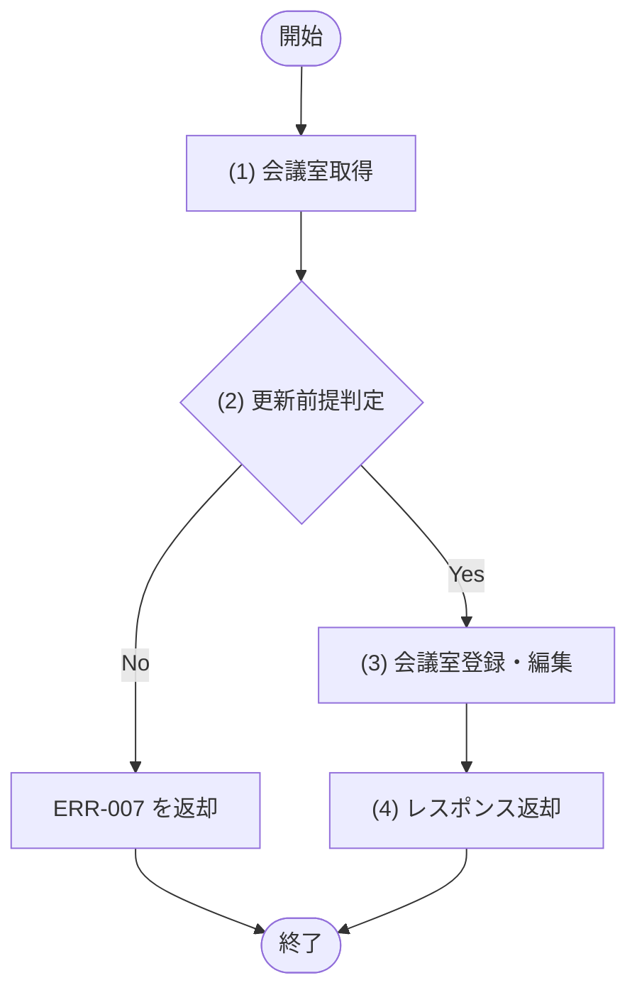

## 1. 基本情報

| 項目 | 内容 |
|---|---|
| API ID | API-007 |
| API名 | 会議室登録・編集 |
| メソッド | POST(登録) / PUT(編集) |
| パス | POST /api/rooms(登録) / PUT /api/rooms/{id}(編集) |
| 認証 | 要 |
| 認可 | 一般=不可, 管理者=可 |
| 冪等性 | POST=なし(再送で会議室が重複登録される可能性) / PUT=あり(同一内容の再送でも結果は同じ) |
| トレース元 | UC-005 |
| 概要 | 管理者が会議室(名称・収容人数・場所・利用単価・ステータス・設備)を新規登録、または既存会議室を編集する。利用単価(HOURLY_RATE)は円/時で 0=無料。 |

## 2. リクエスト

| 論理名 | 物理名 | 型 | 必須 | 説明・制約 |
|---|---|---|---|---|
| 会議室ID | id | int | Yes(PUT時) | パスパラメータ。編集対象の会議室ID。POST(登録)時は指定しない |
| 会議室名 | name | string | Yes | 100文字以内 |
| 収容人数 | capacity | int | Yes | 1以上の整数 |
| 設置場所 | location | string | No | 100文字以内 |
| 利用単価 | hourly_rate | int | Yes | 円/時。0以上の整数。0=無料 |
| 会議室ステータス | status | int | No | TBL-002/ENM-1(1=利用可 / 2=利用停止)。未指定時は 1 |
| 備考 | note | string | No | 会議室の備考。500文字以内 |
| 設備ID一覧 | equipment_ids | array | No | 会議室に紐づく設備IDの配列(各要素は int) |

## 3. レスポンス

| 項目 | 内容 |
|---|---|
| HTTPステータス | 201(登録) / 200(編集) |

| 論理名 | 物理名 | 型 | 説明 |
|---|---|---|---|
| 会議室ID | room_id | int | 会議室の一意な識別子 |
| 会議室名 | name | string | 会議室の名称 |
| 収容人数 | capacity | int | 収容できる人数 |
| 設置場所 | location | string | 会議室の場所 |
| 利用単価 | hourly_rate | int | 1時間あたり利用単価(円)。0=無料 |
| 会議室ステータス | status | int | TBL-002/ENM-1 |
| 備考 | note | string | 会議室の備考 |
| 設備一覧 | equipments[] | array | 会議室に紐づく設備一覧。要素の構造は以下のとおり |
| 設備ID | equipments[].equipment_id | int | 設備の一意な識別子 |
| 設備名 | equipments[].name | string | 設備の名称 |

## 4. 処理フロー

この API の基本フローをフローチャートで定義する。

## 5. 処理詳細

処理フローの各処理で行う内容を定義する。

### (1) 会議室取得

編集(PUT)の場合、会議室IDに一致する会議室を取得する。該当が無い場合は NULL を返す。登録(POST)の場合は取得を行わず NULL とする。

| MOD-ID | 処理名 |
|---|---|
| MOD-004 | 会議室取得 |

| 引数項目 | 値 |
|---|---|
| 会議室ID | リクエスト.会議室ID |

### (2) 更新前提判定

操作種別(登録／編集)を判別し、編集の場合は対象会議室が存在するかを判定する。

#### 条件定義

| No | 判定対象 | 条件 |
|---|---|---|
| 条件(1) | リクエスト.会議室ID | != NULL(編集操作である) |
| 条件(2) | (1) 会議室取得の結果 | != NULL |

#### 条件分岐マトリクス

条件は ◯=満たす・×=満たさない・-=判定しない、処理は ◯=そのパターンで実行・-=実行しない で表す。

| 条件・処理 | #1 新規登録 | #2 編集(対象あり) | #3 編集(対象なし) |
|---|---|---|---|
| 条件(1) | × | ◯ | ◯ |
| 条件(2) | - | ◯ | × |
| 処理 |  |  |  |
| (3) 会議室登録・編集へ進む | ◯ | ◯ | - |
| ERR-007 を返却する | - | - | ◯ |

レスポンス返却以外の処理のため、レスポンス設定は「なし」とする。

| 論理名 | 物理名 | 設定値 |
|---|---|---|
| なし | - | - |

### (3) 会議室登録・編集

会議室IDが指定されていれば該当会議室を更新し、指定されていなければ新規登録する。設備ID一覧に基づき、会議室と設備の紐づけ(M_ROOM_EQUIPMENTS)を再設定する。

| MOD-ID | 処理名 |
|---|---|
| MOD-004 | 会議室登録・編集 |

| 引数項目 | 値 |
|---|---|
| 会議室ID | リクエスト.会議室ID(編集時のみ) |
| 会議室名 | リクエスト.会議室名 |
| 収容人数 | リクエスト.収容人数 |
| 設置場所 | リクエスト.設置場所 |
| 利用単価 | リクエスト.利用単価 |
| 会議室ステータス | リクエスト.会議室ステータス |
| 備考 | リクエスト.備考 |
| 設備ID一覧 | リクエスト.設備ID一覧 |

### (4) レスポンス返却

登録・編集した会議室情報をレスポンスとして返却する。

| 論理名 | 物理名 | 設定値 |
|---|---|---|
| 会議室ID | room_id | (3) 会議室登録・編集の結果 |
| 会議室名 | name | (3) 会議室登録・編集の結果 |
| 収容人数 | capacity | (3) 会議室登録・編集の結果 |
| 設置場所 | location | (3) 会議室登録・編集の結果 |
| 利用単価 | hourly_rate | (3) 会議室登録・編集の結果 |
| 会議室ステータス | status | (3) 会議室登録・編集の結果 |
| 備考 | note | (3) 会議室登録・編集の結果 |
| 設備一覧 | equipments | (3) 会議室登録・編集の結果 |
| 設備ID | equipments[].equipment_id | (3) 会議室登録・編集の結果 |
| 設備名 | equipments[].name | (3) 会議室登録・編集の結果 |

## 6. バリデーション

入力バリデーションの構文ルールを、成立条件(AND / OR の論理式)で定義する。成立条件を満たさない場合、エラー列のコードを返し、違反項目ごとに details[] へ {field=物理名, message=メッセージ列} を設定する。任意項目は「指定なし OR(指定あり AND 制約)」の形で表す。会議室の存在確認など DB 参照を伴う判定は §5 個別処理フロー((2) 更新前提判定)に定義する。

| 論理名 | 物理名 | 成立条件 | エラー | メッセージ |
|---|---|---|---|---|
| 会議室ID | id | 指定なし OR(指定あり AND int) | ERR-006 | 会議室IDは整数で指定してください |
| 会議室名 | name | 指定あり AND string AND 文字数 ＜＝ 100 | ERR-006 | 会議室名は必須で、100文字以内で指定してください |
| 収容人数 | capacity | 指定あり AND int AND 1 ＜＝ 収容人数 | ERR-006 | 収容人数は必須で、1以上の整数で指定してください |
| 設置場所 | location | 指定なし OR(指定あり AND string AND 文字数 ＜＝ 100) | ERR-006 | 設置場所は100文字以内で指定してください |
| 利用単価 | hourly_rate | 指定あり AND int AND 0 ＜＝ 利用単価 | ERR-006 | 利用単価は必須で、0以上の整数で指定してください |
| 会議室ステータス | status | 指定なし OR(指定あり AND int AND 値 ∈ {1, 2}) | ERR-006 | 会議室ステータスは 1 または 2 で指定してください |
| 備考 | note | 指定なし OR(指定あり AND string AND 文字数 ＜＝ 500) | ERR-006 | 備考は500文字以内で指定してください |
| 設備ID一覧 | equipment_ids | 指定なし OR(指定あり AND 配列 AND 各要素が int) | ERR-006 | 設備ID一覧は整数の配列で指定してください |

## 7. エラー

認証・認可・入力バリデーションで発生する共通エラーは API-COM_共通設計.md §4.1 共通エラー一覧を参照する。本 API に適用される共通エラーは ERR-001(認証失敗) / ERR-002(権限なし。管理者以外による実行) / ERR-006(バリデーションエラー)。この API 固有のエラーを以下にインライン定義する。

| ERR ID | エラー名 | HTTPステータス | この API での発生条件 | 開発者向けメッセージ |
|---|---|---|---|---|
| ERR-007 | 会議室が存在しない | 404 | 編集(PUT)時、会議室IDに一致する会議室が存在しない((2) 更新前提判定) | Room not found |
