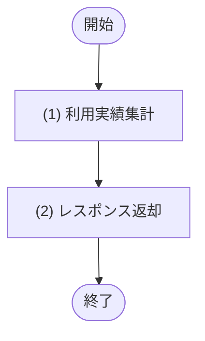

## 1. 基本情報

| 項目 | 内容 |
|---|---|
| API ID | API-008 |
| API名 | 利用実績取得 |
| メソッド | GET |
| パス | /api/reports/usage |
| 認証 | 要 |
| 認可 | 一般=不可, 管理者=可 |
| 冪等性 | あり(参照系) |
| トレース元 | UC-006 |
| 概要 | 管理者が指定月の会議室別利用実績(予約件数・利用時間)を取得する。完了予約を集計対象とし、ページネーションして返す。 |

## 2. リクエスト

| 論理名 | 物理名 | 型 | 必須 | 説明・制約 |
|---|---|---|---|---|
| 対象月 | month | string | Yes | YYYY-MM 形式。集計対象の月 |
| ページ | page | int | No | ページネーション(API-COM §5)。既定 1 |
| 取得件数 | limit | int | No | ページネーション(API-COM §5)。既定 20 |

## 3. レスポンス

| 項目 | 内容 |
|---|---|
| HTTPステータス | 200 |

| 論理名 | 物理名 | 型 | 説明 |
|---|---|---|---|
| 対象月 | month | string | 集計対象月(YYYY-MM) |
| 利用実績一覧 | items[] | array | 会議室別の利用実績。要素の構造は以下のとおり |
| 会議室ID | items[].room_id | int | 会議室の一意な識別子 |
| 会議室名 | items[].room_name | string | 会議室の名称 |
| 対象月 | items[].target_month | string | 集計対象月(YYYY-MM) |
| 予約件数 | items[].reservation_count | int | 完了予約の件数 |
| 利用時間分 | items[].total_minutes | int | 完了予約の合計利用時間(分) |

## 4. 処理フロー

この API の基本フローをフローチャートで定義する。

## 5. 処理詳細

処理フローの各処理で行う内容を定義する。

### (1) 利用実績取得

指定月の会議室別利用実績(集計済み)を会議室名昇順で取得する。集計自体は JOB-003(月次利用実績集計)が定期実行して TBL-006 に保存済みであり、本 API は保存済みの実績を参照する。ページネーションは MOD-005 側で適用する。該当が無い場合は空一覧を返す。

| MOD-ID | 処理名 |
|---|---|
| MOD-005 | 利用実績取得(getUsageReport) |

| 引数項目 | 値 |
|---|---|
| 対象月 | リクエスト.対象月 |
| ページ | リクエスト.page(未指定時は API-COM §5 の既定値) |
| 取得件数 | リクエスト.limit(未指定時は API-COM §5 の既定値) |

### (2) レスポンス返却

(1) 利用実績取得の結果(ページネーション適用済み)をレスポンスとして返却する。

| 論理名 | 物理名 | 設定値 |
|---|---|---|
| 対象月 | month | リクエスト.対象月 |
| 利用実績一覧 | items | (1) 利用実績取得の結果(ページネーション適用済みの一覧) |
| 会議室ID | items[].room_id | (1) 利用実績取得の結果 |
| 会議室名 | items[].room_name | (1) 利用実績取得の結果 |
| 対象月 | items[].target_month | (1) 利用実績取得の結果 |
| 予約件数 | items[].reservation_count | (1) 利用実績取得の結果 |
| 利用時間分 | items[].total_minutes | (1) 利用実績取得の結果 |
| 総件数 | total | (1) 利用実績取得の結果の総件数 |

## 6. バリデーション

入力バリデーションの構文ルールを、成立条件(AND / OR の論理式)で定義する。成立条件を満たさない場合、エラー列のコードを返し、違反項目ごとに details[] へ {field=物理名, message=メッセージ列} を設定する。

| 論理名 | 物理名 | 成立条件 | エラー | メッセージ |
|---|---|---|---|---|
| 対象月 | month | 指定あり AND string AND YYYY-MM形式 | ERR-006 | 対象月は必須で、YYYY-MM 形式で指定してください |
| ページ / 取得件数 | page / limit | 指定なし OR(指定あり AND 1 ＜＝ 整数) | ERR-006 | ページ・取得件数は1以上の整数で指定してください |

## 7. エラー

認証・認可・入力バリデーションで発生する共通エラーは API-COM_共通設計.md §4.1 共通エラー一覧を参照する。本 API に適用される共通エラーは ERR-001(認証失敗) / ERR-002(権限なし。管理者以外による実行) / ERR-006(バリデーションエラー)。この API 固有のエラーはない。
