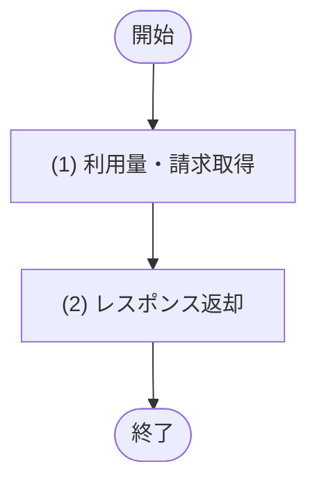

## 1. 基本情報

| 項目 | 内容 |
|---|---|
| API ID | API-012 |
| API名 | 利用量・請求取得 |
| メソッド | GET |
| パス | /api/billing/usage |
| 認証 | 要 |
| 認可 | 一般=可, 管理者=可(いずれも本人のデータのみ) |
| 冪等性 | あり(参照系) |
| トレース元 | UC-009 |
| 概要 | 認証済み利用者本人の当月の利用量(利用時間・請求見込み金額)、課金契約状態、および過去の請求履歴を取得する。 |

## 2. リクエスト

| 論理名 | 物理名 | 型 | 必須 | 説明・制約 |
|---|---|---|---|---|
| なし | - | - | - | 入力項目なし(対象は当月固定) |

## 3. レスポンス

| 項目 | 内容 |
|---|---|
| HTTPステータス | 200 |

| 論理名 | 物理名 | 型 | 説明 |
|---|---|---|---|
| 課金契約状態 | billing_status | int | TBL-001/ENM-2(1=未契約 / 2=有効 / 3=停止) |
| 当月対象月 | current_month | string | 当月(YYYY-MM) |
| 当月利用時間分 | current_usage_minutes | int | 当月の完了予約の合計利用時間(分) |
| 当月請求見込み金額 | current_estimated_amount | int | 当月の利用量に基づく請求見込み金額(円) |
| 請求履歴 | invoices[] | array | 過去の請求一覧。要素の構造は以下のとおり |
| 請求ID | invoices[].invoice_id | int | 請求の一意な識別子 |
| 請求対象月 | invoices[].billing_period | string | 請求対象月(YYYY-MM) |
| 請求金額 | invoices[].amount | int | 請求金額(円) |
| 請求ステータス | invoices[].status | int | TBL-008/ENM-1(1=確定前 / 2=請求済 / 3=支払済 / 4=失敗) |

## 4. 処理フロー

この API の基本フローをフローチャートで定義する。

## 5. 処理詳細

処理フローの各処理で行う内容を定義する。

### (1) 利用量・請求取得

認証済みユーザー本人の当月利用量(TBL-007 の合計利用時間・請求見込み金額)、課金契約状態(TBL-001)、および請求履歴(TBL-008)を取得する。該当が無い項目は 0 または空一覧を返す。

| MOD-ID | 処理名 |
|---|---|
| MOD-007 | 利用量・請求取得 |

| 引数項目 | 値 |
|---|---|
| ユーザーID | 認証済みユーザーID |
| 対象月 | 当月(サーバ日時から算出) |

### (2) レスポンス返却

(1) 利用量・請求取得の結果をレスポンスとして返却する。

| 論理名 | 物理名 | 設定値 |
|---|---|---|
| 課金契約状態 | billing_status | (1) 利用量・請求取得の結果 |
| 当月対象月 | current_month | (1) 利用量・請求取得の結果 |
| 当月利用時間分 | current_usage_minutes | (1) 利用量・請求取得の結果 |
| 当月請求見込み金額 | current_estimated_amount | (1) 利用量・請求取得の結果 |
| 請求履歴 | invoices | (1) 利用量・請求取得の結果 |
| 請求ID | invoices[].invoice_id | (1) 利用量・請求取得の結果 |
| 請求対象月 | invoices[].billing_period | (1) 利用量・請求取得の結果 |
| 請求金額 | invoices[].amount | (1) 利用量・請求取得の結果 |
| 請求ステータス | invoices[].status | (1) 利用量・請求取得の結果 |

## 6. バリデーション

入力項目がないため、入力バリデーションは行わない。

| 論理名 | 物理名 | 成立条件 | エラー | メッセージ |
|---|---|---|---|---|
| なし | - | - | - | - |

## 7. エラー

認証で発生する共通エラーは API-COM_共通設計.md §4.1 共通エラー一覧を参照する。本 API に適用される共通エラーは ERR-001(認証失敗)。入力項目がないため入力バリデーション(ERR-006)は発生しない。この API 固有のエラーはない。
