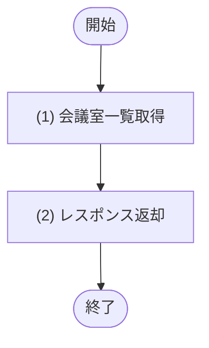

# 1. 基本情報

| 項目 | 内容 |
|---|---|
| API ID | API-014 |
| API名 | 会議室一覧取得 |
| メソッド | GET |
| パス | /api/admin/rooms |
| 認証 | 要 |
| 認可 | 一般=不可, 管理者=可 |
| 冪等性 | あり(参照系) |
| トレース元 | UC-005 |
| 概要 | 管理者向けに全会議室(利用停止を含む)を設備一覧付きで取得する。会議室・設備管理画面で編集対象を選択・現在値表示するために用いる。 |

# 2. リクエスト

| 項目名 | 型 | 必須 | 説明・制約 |
|---|---|---|---|
| なし | - | - | 入力項目なし(全会議室を返す) |

# 3. レスポンス

| 項目 | 内容 |
|---|---|
| HTTPステータス | 200 |

以下は items 配列の各要素。

| 項目名 | 型 | 説明 |
|---|---|---|
| 会議室ID | int | 会議室の一意な識別子 |
| 会議室名 | string | 会議室の名称 |
| 収容人数 | int | 収容できる人数 |
| 設置場所 | string | 会議室の場所 |
| 利用単価 | int | 1時間あたり利用単価(円)。0=無料 |
| 会議室ステータス | int | TBL-002/ENM-1(利用停止=2 を含む) |
| 備考 | string | 会議室の備考 |
| 設備一覧 | array | 会議室に紐づく設備一覧。要素の構造は以下のとおり |
| 設備ID | int | 設備の一意な識別子 |
| 設備名 | string | 設備の名称 |

# 4. 処理フロー

この API の基本フローをフローチャートで定義する。

# 5. 処理詳細

処理フローの各処理で行う内容を定義する。

## (1) 会議室一覧取得

利用停止を含む全会議室を設備一覧付きで取得する。該当が無い場合は空一覧を返す。

| MOD-ID | 処理名 |
|---|---|
| MOD-004 | 会議室一覧取得 |

| 引数項目 | 値 |
|---|---|
| なし | - |

## (2) レスポンス返却

(1) 会議室一覧取得の結果をレスポンスとして返却する。

| 項目名 | データ型 | 設定値 |
|---|---|---|
| 会議室一覧 | Object[] | (1) 会議室一覧取得の結果 |
| - 会議室ID | Integer | (1) 会議室一覧取得の結果 |
| - 会議室名 | String | (1) 会議室一覧取得の結果 |
| - 収容人数 | Integer | (1) 会議室一覧取得の結果 |
| - 設置場所 | String | (1) 会議室一覧取得の結果 |
| - 利用単価 | Integer | (1) 会議室一覧取得の結果 |
| - 会議室ステータス | Integer | (1) 会議室一覧取得の結果 |
| - 備考 | String | (1) 会議室一覧取得の結果 |
| - 設備一覧 | Object[] | (1) 会議室一覧取得の結果 |
| -- 設備ID | Integer | (1) 会議室一覧取得の結果 |
| -- 設備名 | String | (1) 会議室一覧取得の結果 |
| 総件数 | Integer | (1) 会議室一覧取得の結果の総件数 |

# 6. バリデーション

入力項目がないため、入力バリデーションは行わない。

| 項目名 | 成立条件 | エラー | メッセージ |
|---|---|---|---|
| なし | - | - | - |

# 7. エラー

認証・認可で発生する共通エラーは API-COM_共通設計.md §4.1 共通エラー一覧を参照する。本 API に適用される共通エラーは ERR-001(認証失敗) / ERR-002(権限なし。管理者以外による実行)。入力項目がないため入力バリデーション(ERR-006)は発生しない。この API 固有のエラーはない。
