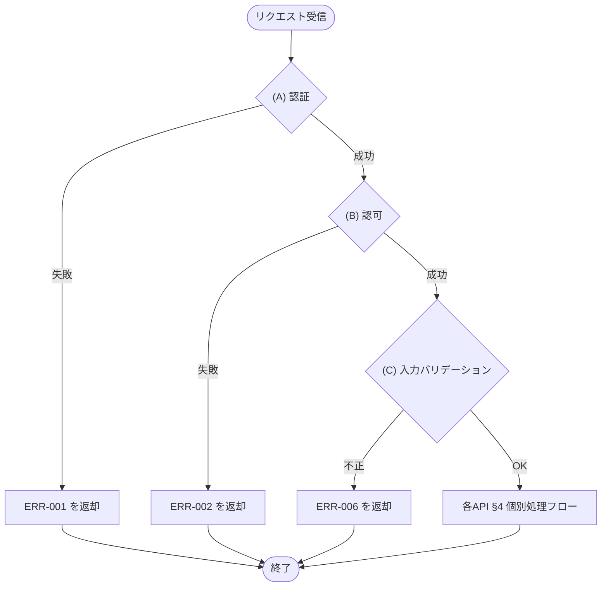

# 1. 概要

MeetRoom の全 REST API に適用される共通仕様(認証・共通ヘッダ・エラーレスポンス封筒・ページネーション・共通規約)の正本。
各 API 文書には本書との差分のみを記載する(再記載は禁止)。

# 2. 認証

| 項目 | 内容 |
|---|---|
| 方式 | Bearer JWT(Authorization: Bearer {token}) |
| トークン取得 | API-001 で取得 |
| 有効期限 | 24時間 |

## 2.1 JWT 仕様

JWT の発行・検証仕様を定義する。秘密鍵は実行基盤の秘密情報として管理し、コード・リポジトリには含めない。

| 項目 | 内容 |
|---|---|
| 署名方式 | HS256(HMAC-SHA-256) |
| 発行・検証方法 | LIB-001 認証暗号処理の JWT発行処理・JWT検証処理を利用する |
| 外部ライブラリ直接利用 | API・JOB・モジュールからの直接利用は禁止 |
| 秘密鍵 | 実行基盤の秘密情報として管理する JWT 署名秘密鍵 |
| 必須情報 | ユーザーID、ロール、発行日時、有効期限 |
| 有効期限判定 | 現在時刻が有効期限以下であること |

# 3. 共通リクエストヘッダ

| ヘッダ | 値 | 対象 |
|---|---|---|
| Authorization | Bearer {token} | 認証「要」の API |
| Content-Type | application/json | 全 API |

# 4. エラーレスポンス

全 API のエラーは以下の封筒形式で返す。message は §4.1 共通エラー一覧(共通エラー)または各 API 文書 §7 エラー(API 固有エラー)に定義する開発者向けメッセージを設定する。
ERR-XXX の定義はカタログにまとめず各文書へインラインする。全 API 共通の ERR-001 / ERR-002 / ERR-006 は本書 §4.1 共通エラー一覧を正本とし、各 API 固有のエラーは当該 API 文書 §7 エラーに「ERR ID / エラー名 / HTTPステータス / 発生条件 / 開発者向けメッセージ」の表でインライン定義する。

```json
{
  "error": {
    "code": "ERR-006",
    "message": "Validation failed",
    "details": [
      { "field": "start_time", "message": "開始時刻は HH:mm 形式で指定してください" }
    ]
  }
}
```

| 項目 | 内容 |
|---|---|
| error.code | ERR ID |
| error.message | 開発者向けメッセージ(§4.1 共通エラー一覧または各 API 文書 §7 エラーで定義) |
| error.details[] | 項目単位のエラー明細。どの項目のどのルールに反したかを判別できるようにする |
| error.details[].field | 対象項目のパラメータ名(各 API §2 リクエストのパラメータ名) |
| error.details[].message | 違反したルールの内容(各 API §6 バリデーションの成立条件に対応) |

バリデーションエラー(ERR-006)は、違反した項目ごとに details[] を1件ずつ設定する。details[] を持たないエラーは details を空配列 [] とする。

## 4.1 共通エラー一覧

共通処理フロー(§7)で全 API 共通に発生するエラーを定義する。各 API 文書はこれらを再掲せず「API-COM の共通エラー一覧(本書 §4.1)を参照」と記載する。

| ERR ID | エラー名 | HTTPステータス | 発生条件 | 開発者向けメッセージ |
|---|---|---|---|---|
| ERR-001 | 認証失敗 | 401 | 未認証・トークン無効・ログイン失敗 | Unauthorized |
| ERR-002 | 権限なし | 403 | ロールに許可されていない操作 | Forbidden |
| ERR-006 | バリデーションエラー | 400 | 必須欠落・型不正・制約違反 | Validation failed |

# 5. ページネーション

一覧系 API は以下のクエリパラメータとレスポンス形式を用いる。

| パラメータ | 配置 | 型 | 既定値 | 制約 |
|---|---|---|---|---|
| page | query | int | 1 | 1始まり |
| limit | query | int | 20 | 最大100 |

```json
{ "items": [...], "page": n, "limit": n, "total": n }
```

# 6. 共通規約

| 項目 | 規約 |
|---|---|
| 日時形式 | ISO 8601(保存UTC・表示 Asia/Tokyo) |
| 文字コード | UTF-8 |
| 認証エラー | 全APIで ERR-001 |
| 認可エラー | 全APIで ERR-002 |

# 7. 共通処理フロー

全 REST API は、各 API 文書 §4 の個別処理フローに入る前に以下の共通フローを経る。認証・認可・入力バリデーションは全 API 共通の前処理であり、各 API 文書のフロー(§4・§5)には記載しない。



| 段階 | 内容 | 失敗時 |
|---|---|---|
| (A) 認証 | §2 認証(Bearer JWT の検証) | ERR-001 |
| (B) 認可 | 各 API 文書 §1 基本情報の認可に従いロールを判定 | ERR-002 |
| (C) 入力バリデーション | 各 API 文書 §2 リクエスト・§6 バリデーションの構文ルールを検証 | ERR-006 |

入力バリデーション失敗時(ERR-006)は、§4 エラーレスポンスの details[] に違反した項目(field)とルール内容を設定し、どの項目で違反したかを判別できるようにする。

## 入力バリデーションの範囲

(C) 入力バリデーションが検証するのは、リクエスト単体で機械的に判定できる構文的チェックに限る。

| 区分 | 内容 |
|---|---|
| 必須 | 必須項目が指定されている |
| 型 | 値の型が正しい |
| 形式 | 日付・時刻・コード等の形式が正しい |
| 単項目制約 | 文字数・数値範囲・許可値など1項目で判定できる制約 |
| 項目間相関 | 開始＜終了など複数項目の相関 |

DB 参照や業務ルールを伴う判定(存在確認・重複・期間制約・状態遷移など)は共通フローに含めず、各 API 文書 §4 個別処理フローで業務判定として定義する(返すエラーは判定内容による)。
