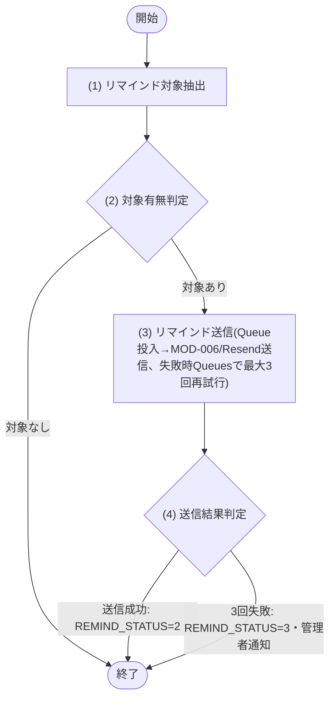

## 1. 基本情報

| 項目 | 内容 |
|---|---|
| ジョブID | JOB-001 |
| ジョブ名 | 予約リマインド通知 |
| 実行契機 | 定期(Cloudflare Cron Trigger) |
| スケジュール | */15 * * * *(15分毎、Cloudflare Cron Trigger) |
| 多重起動 | 禁止(Cron Trigger による起動は単一。Queue Consumer は REMIND_STATUS=1(未送信) 条件で冪等処理し二重送信しない) |
| 冪等性 | あり(REMIND_STATUS=1(未送信) のみ抽出するため再実行しても二重送信しない) |
| リトライ方針 | Resend への送信失敗時は Cloudflare Queues により再試行する(最大3回)。3回とも失敗した予約は REMIND_STATUS=3(失敗) に更新し、MOD-006 により ROLE=2(管理者) の全ユーザーへメールで通知する。送信に成功した予約は REMIND_STATUS=2(送信済) に更新する |
| 想定処理件数 / 時間 | 最大100件・1分以内(正常時) |
| トレース元 | FR-004 |
| 概要 | 開始30分以内の予約済・リマインド未送信の予約を抽出し、Cloudflare Queues 経由で MOD-006(通知サービス)が Resend により予約者へメールでリマインド通知する。送信成功した予約はリマインド送信済に更新する。 |

## 2. 起動パラメータ

| 論理名 | 物理名 | 型 | 必須 | 説明・制約 |
|---|---|---|---|---|
| なし | - | - | - | 定期実行のみ。起動パラメータは受け取らない |

## 3. 処理対象

| 対象 | 抽出条件 |
|---|---|
| TBL-003 | STATUS=1(予約済) AND REMIND_STATUS=1(未送信) AND START_AT が現在時刻から30分以内 |

## 4. 処理フロー

このジョブの基本フローをフローチャートで定義する。対象予約ごとに (3)〜(4) を繰り返す。

## 5. 処理詳細

処理フローの各処理で行う内容を定義する。

### (1) リマインド対象抽出

処理対象(§3 の抽出条件)に該当する予約を抽出する。該当が無い場合は NULL(0件)を返す。

| MOD-ID | 処理名 |
|---|---|
| なし | - |

| 引数項目 | 値 |
|---|---|
| 現在時刻 | ジョブ実行時刻 |

### (2) 対象有無判定

条件定義:

| No | 判定対象 | 条件 |
|---|---|---|
| 条件(1) | (1) リマインド対象抽出の結果 | != NULL(件数 ＞ 0) |

条件分岐マトリクス:

| 条件・処理 | #1 対象あり | #2 対象なし |
|---|---|---|
| 条件(1) | ◯ | × |
| 処理 |  |  |
| (3) リマインド送信へ進む | ◯ | - |
| ジョブを正常終了する | - | ◯ |

### (3) リマインド送信

(1) リマインド対象抽出の結果の各予約を Cloudflare Queues に投入し、Queue Consumer が MOD-006(通知サービス)経由で予約者へ Resend によるリマインドメールを送信する。送信失敗時は Cloudflare Queues により最大3回まで再試行する。

| MOD-ID | 処理名 |
|---|---|
| MOD-006 | リマインドメール送信(Resend) |

| 引数項目 | 値 |
|---|---|
| 宛先 | (1) リマインド対象抽出の結果.予約者 |
| 内容 | リマインド通知メール |

### (4) 送信結果判定

条件定義:

| No | 判定対象 | 条件 |
|---|---|---|
| 条件(1) | (3) リマインド送信の結果 | 3回以内に送信成功 = true |

条件分岐マトリクス:

| 条件・処理 | #1 送信成功 | #2 3回失敗 |
|---|---|---|
| 条件(1) | ◯ | × |
| 処理 |  |  |
| REMIND_STATUS=2(送信済) に更新する | ◯ | - |
| REMIND_STATUS=3(失敗) に更新し管理者へ通知する | - | ◯ |

DB を更新する処理では、更新対象と更新内容を定義する。

| 対象 | 更新内容 |
|---|---|
| TBL-003 | 送信成功: REMIND_STATUS=2(送信済)／3回失敗: REMIND_STATUS=3(失敗) |

## 6. 実行結果・出力

| 論理名 | 物理名 | 内容 |
|---|---|---|
| 対象件数 | target_count | (1) リマインド対象抽出の結果の件数 |
| 送信成功件数 | success_count | REMIND_STATUS=2(送信済) に更新した件数 |
| 失敗件数 | failure_count | REMIND_STATUS=3(失敗) に更新した件数 |
| 実行ログ | log | 開始・終了時刻、各件数、失敗した予約IDと理由 |

## 7. エラー時の対応

| エラー条件 | エラー | 対応 | 通知 |
|---|---|---|---|
| Resend への送信失敗(1〜2回目) | - | Cloudflare Queues により再試行する(最大3回) | 不要 |
| Resend への送信失敗(3回目) | - | REMIND_STATUS=3(失敗) に更新し、スキップして継続 | 要(MOD-006 により管理者へ通知) |
