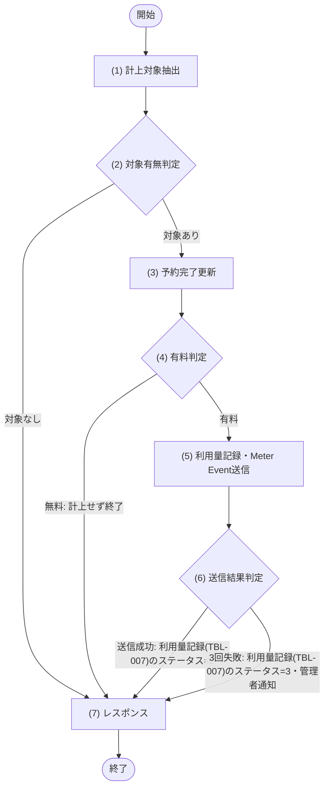

# 1. 基本情報

| 項目 | 内容 |
|---|---|
| ジョブID | JOB-002 |
| ジョブ名 | 利用量の従量課金計上 |
| 実行契機 | 定期(Cloudflare Cron Trigger) |
| スケジュール | */15 * * * *(15分毎、Cloudflare Cron Trigger) |
| 多重起動 | 禁止(Cron Trigger による起動は単一。予約は STATUS=1(予約済) 条件で抽出し、利用量記録は UX_USAGE_RECORDS_RESERVATION(予約IDユニーク) と STATUS 条件で冪等処理する) |
| 冪等性 | あり(完了処理は STATUS=1(予約済) のみ対象、利用量は予約IDユニークで二重記録せず、Meter Event 送信済(利用量記録(TBL-007)のステータス=2) は再送しないため、再実行しても二重計上しない) |
| リトライ方針 | Stripe への Meter Event 送信失敗時は Cloudflare Queues により再試行する(最大3回)。3回とも失敗した記録は 利用量記録(TBL-007)のステータス=3(失敗) に更新し、次回実行で再送対象として拾い直す。Stripe 障害時も TBL-007 への記録は保持し利用量を消失させない。継続失敗は MOD-007 により ユーザーロール=2(管理者) の全ユーザーへメールで通知する。送信に成功した記録は 利用量記録(TBL-007)のステータス=2(送信済) に更新する |
| 想定処理件数 / 時間 | 最大100件・1分以内(正常時) |
| トレース元 | FR-008 |
| 概要 | 終了時刻を過ぎた予約済(STATUS=1)の予約を完了(STATUS=3)にし、有料会議室(HOURLY_RATE>0)の予約は利用時間を TBL-007 へ記録して Stripe へ Meter Event として計上する。Meter Event 送信に失敗した記録は次回実行で再送する。 |

# 2. 起動パラメータ

| 項目名 | 型 | 必須 | 説明・制約 |
|---|---|---|---|
| なし | - | - | 定期実行のみ。起動パラメータは受け取らない |

# 3. 処理対象

| 対象 | 抽出条件 |
|---|---|
| TBL-003 | STATUS=1(予約済) AND END_AT < 現在時刻(完了・計上対象。M_ROOMS を結合し HOURLY_RATE を取得する) |
| TBL-007 | STATUS=3(失敗)(Stripe Meter Event の再送対象) |

# 4. 処理フロー

このジョブの基本フローをフローチャートで定義する。対象ごとに (3)〜(6) を繰り返す。

# 5. 処理詳細

処理フローの各処理で行う内容を定義する。

## (1) 計上対象抽出

このジョブで計上・再送すべき対象(終了した予約済の予約と Meter Event 再送対象の利用量記録)を抽出する。あわせて有料判定・計上に用いる会議室の利用単価も取得する。該当が無い場合は NULL(0件)を返す。

| 参照項目 | 値 |
|---|---|
| 現在時刻 | ジョブ実行時刻 |

| 項目名 | データ型 | 設定値 |
|---|---|---|
| 計上対象一覧 | Object[] | 終了した予約済の予約と Meter Event 再送対象の利用量記録。該当が無い場合は空配列 |
| - 予約 | Object | 終了済み予約 |
| - 利用量記録 | Object | Meter Event 再送対象の利用量記録 |
| - 利用単価 | Integer | 対象予約の会議室利用単価 |

## (2) 対象有無判定

条件定義:

| No | 判定対象 | 条件 |
|---|---|---|
| 条件(1) | (1) 計上対象抽出の結果 | != NULL(件数 ＞ 0) |

条件分岐マトリクス:

| 条件・処理 | #1 対象あり | #2 対象なし |
|---|---|---|
| 条件(1) | ◯ | × |
| 処理 |  |  |
| (3) 予約完了更新へ進む | ◯ | - |
| ジョブを正常終了する | - | ◯ |

## (3) 予約完了更新

計上対象の予約を完了状態にする。

・新規計上対象の予約は、予約ステータスを完了に更新する
・再送対象の利用量記録は、対応する予約が既に完了済みのため本処理をスキップする

| 参照項目 | 値 |
|---|---|
| 対象予約 | (1) 計上対象抽出の結果.終了済み予約 |

| 対象 | 更新内容 |
|---|---|
| TBL-003 | STATUS=1(予約済) → STATUS=3(完了) |

## (4) 有料判定

対象予約の会議室が有料かを判定する。

条件定義:

| No | 判定対象 | 条件 |
|---|---|---|
| 条件(1) | (1) 計上対象抽出の結果.利用単価 | ＞ 0 |

条件分岐マトリクス:

| 条件・処理 | #1 有料 | #2 無料 |
|---|---|---|
| 条件(1) | ◯ | × |
| 処理 |  |  |
| (5) 利用量記録・Meter Event送信へ進む | ◯ | - |
| 計上せず次の対象へ進む(課金対象外) | - | ◯ |

| 対象 | 更新内容 |
|---|---|
| なし | - |

## (5) 利用量記録・Meter Event送信

有料と判定された予約の利用量を記録し、Stripe へ Meter Event として計上する。

・新規計上対象は、利用時間(分)を算出して利用量を新規記録する
・再送対象は、既存の利用量記録を対象に送信し、重複記録しない

| MOD-ID | 処理名 |
|---|---|
| MOD-005 | 利用時間算出(利用時間算出処理) |
| MOD-007 | 利用量記録・Stripe Meter Event 送信 |

| 引数項目 | 値 |
|---|---|
| 予約 | (1) 計上対象抽出の結果.対象予約 |
| 利用時間(分) | (5) 利用時間算出の結果 |
| 適用単価 | (1) 計上対象抽出の結果.利用単価 |

| 対象 | 更新内容 |
|---|---|
| TBL-007 | 利用量を記録(USAGE_MINUTES・UNIT_PRICE・AMOUNT、STATUS=1(未送信))。再送対象は既存記録を対象に送信する |

## (6) 送信結果判定

条件定義:

| No | 判定対象 | 条件 |
|---|---|---|
| 条件(1) | (5) 利用量記録・Meter Event送信の結果 | 3回以内に送信成功 = true |

条件分岐マトリクス:

| 条件・処理 | #1 送信成功 | #2 3回失敗 |
|---|---|---|
| 条件(1) | ◯ | × |
| 処理 |  |  |
| STRIPE_METER_EVENT_ID を保存し 利用量記録(TBL-007)のステータス=2(送信済) に更新する | ◯ | - |
| 利用量記録(TBL-007)のステータス=3(失敗) に更新し管理者へ通知する | - | ◯ |

| 対象 | 更新内容 |
|---|---|
| TBL-007 | 送信成功: STRIPE_METER_EVENT_ID を保存し STATUS=2(送信済)／3回失敗: STATUS=3(失敗) |

## (7) レスポンス

ジョブの実行結果として返却・記録する項目を定義する。

| 項目名 | データ型 | 設定値 |
|---|---|---|
| 対象件数 | Integer | (1) 計上対象抽出の結果の件数 |
| 完了件数 | Integer | (3) 予約完了更新で STATUS=3(完了) に更新した予約件数 |
| 成功件数 | Integer | 利用量記録(TBL-007)のステータス=2(送信済) に更新した件数 |
| 失敗件数 | Integer | 利用量記録(TBL-007)のステータス=3(失敗) に更新した件数 |
| 実行ログ | Object | 開始・終了時刻、各件数、失敗した予約ID・利用量記録IDと理由 |

# 6. 実行結果・出力

| 項目名 | 内容 |
|---|---|
| 対象件数 | (1) 計上対象抽出の結果の件数 |
| 完了件数 | (3) 予約完了更新で STATUS=3(完了) に更新した予約件数 |
| 成功件数 | 利用量記録(TBL-007)のステータス=2(送信済) に更新した件数 |
| 失敗件数 | 利用量記録(TBL-007)のステータス=3(失敗) に更新した件数 |
| 実行ログ | 開始・終了時刻、各件数、失敗した予約ID・利用量記録IDと理由 |

# 7. エラー時の対応

| エラー条件 | エラー | 対応 | 通知 |
|---|---|---|---|
| 予約完了更新失敗(D1 更新エラー) | - | 該当予約をスキップして継続し、次回実行で再処理する | 要(管理者へ通知) |
| Stripe Meter Event 送信失敗(1〜2回目) | ERR-009 | Cloudflare Queues により再試行する(最大3回) | 不要 |
| Stripe Meter Event 送信失敗(3回目) | ERR-009 | 利用量記録(TBL-007)のステータス=3(失敗) に更新し、スキップして継続。次回実行で再送する | 要(MOD-007 により管理者へ通知) |
