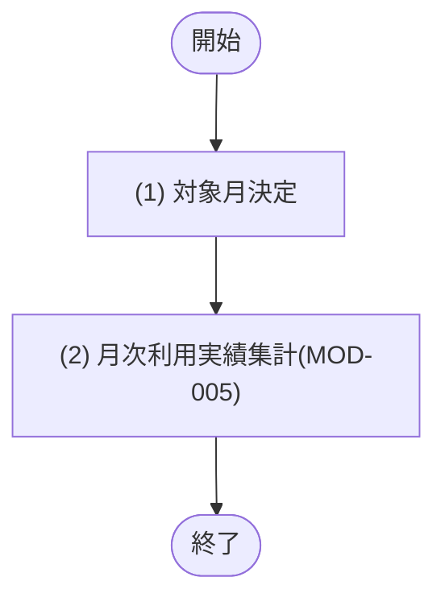

## 1. 基本情報

| 項目 | 内容 |
|---|---|
| ジョブID | JOB-003 |
| ジョブ名 | 月次利用実績集計 |
| 実行契機 | 定期(Cloudflare Cron Trigger) |
| スケジュール | 10 * * * *(毎時10分、Cloudflare Cron Trigger) |
| 多重起動 | 禁止(Cron Trigger による起動は単一。集計は TBL-006 の UX_USAGE_REPORTS_ROOM_MONTH による UPSERT で冪等) |
| 冪等性 | あり(会議室×対象月を UPSERT するため、同一対象月を再実行しても結果は同じ値で上書きされ二重計上しない) |
| リトライ方針 | 集計・保存に失敗した対象月は当該対象月をスキップして継続し、次回実行で再集計する。継続失敗は MOD-007 により ROLE=2(管理者) の全ユーザーへメールで通知する |
| 想定処理件数 / 時間 | 対象月2件(当月・前月)×全会議室・1分以内(正常時) |
| トレース元 | FR-006 |
| 概要 | 完了予約(STATUS=3)を会議室×対象月で集計し、月次利用実績を TBL-006 へ保存する。利用実績レポート(SCR-006/API-008)が参照する集計済みデータを最新化する。当月と前月を対象とし、月境界直後の完了予約も取り込む。 |

## 2. 起動パラメータ

| 論理名 | 物理名 | 型 | 必須 | 説明・制約 |
|---|---|---|---|---|
| なし | - | - | - | 定期実行のみ。起動パラメータは受け取らない |

## 3. 処理対象

| 対象 | 抽出条件 |
|---|---|
| 対象月 | 実行時刻(Asia/Tokyo 基準)の当月および前月('YYYY-MM')。前月は月境界直後の完了予約を取り込むために含める |
| TBL-003 | STATUS=3(完了) AND START_AT(+9時間)の年月 = 対象月(MOD-005/SQL-002 による集計対象) |

## 4. 処理フロー

このジョブの基本フローをフローチャートで定義する。対象月ごとに (2) を繰り返す。

## 5. 処理詳細

処理フローの各処理で行う内容を定義する。

### (1) 対象月決定

ジョブ実行時刻を Asia/Tokyo(+9時間)に変換し、当月と前月の 'YYYY-MM' を集計対象月として決定する。

| MOD-ID | 処理名 |
|---|---|
| なし | - |

| 引数項目 | 値 |
|---|---|
| 現在時刻 | ジョブ実行時刻 |

### (2) 月次利用実績集計

(1) 対象月決定の各対象月について、MOD-005 の月次利用実績集計を呼び出し、完了予約を会議室別に集計して TBL-006 へ保存(UPSERT)する。集計・保存ロジックの正本は MOD-005/SQL-002 とする。

| MOD-ID | 処理名 |
|---|---|
| MOD-005 | 月次利用実績集計(aggregateMonthlyUsage) |

| 引数項目 | 値 |
|---|---|
| 対象月 | (1) 対象月決定の結果(当月・前月それぞれ) |

| 対象 | 更新内容 |
|---|---|
| TBL-006 | 会議室×対象月の予約件数・利用時間(分)を UPSERT |

## 6. 実行結果・出力

| 論理名 | 物理名 | 内容 |
|---|---|---|
| 対象月数 | target_month_count | (1) 対象月決定で決定した対象月の件数(当月・前月=2) |
| 集計会議室件数 | aggregated_count | (2) 月次利用実績集計で UPSERT した会議室×対象月の延べ件数 |
| 実行ログ | log | 開始・終了時刻、対象月、集計件数、失敗した対象月と理由 |

## 7. エラー時の対応

| エラー条件 | エラー | 対応 | 通知 |
|---|---|---|---|
| 対象月の集計・保存に失敗 | - | 該当対象月をスキップして継続し、次回実行で再集計する | 要(継続失敗時は MOD-007 により管理者へ通知) |
