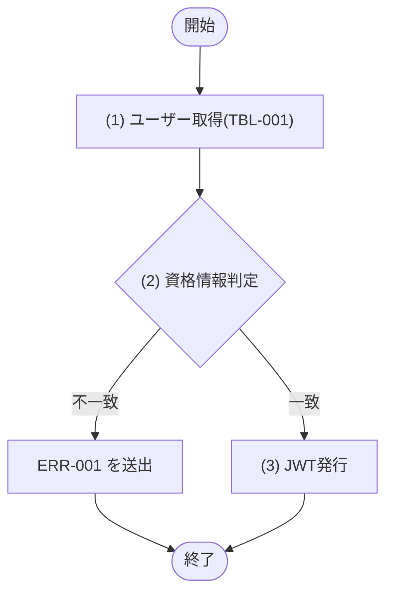

## 1. 基本情報

| 項目 | 内容 |
|---|---|
| モジュールID | MOD-001 |
| モジュール名 | 認証サービス(AuthService) |
| 種別 | Service |
| 概要 | ログイン時の資格情報検証と JWT の発行、および API 共通前処理での JWT 検証を行う |

## 2. 責務

| No | 責務 |
|---|---|
| 1 | ログイン資格情報(メールアドレス・パスワード)の検証 |
| 2 | 認証成功時の JWT 発行(有効期限24時間) |
| 3 | JWT の検証(署名・有効期限)と認証主体(ユーザーID・ロール)の取り出し |

## 3. 公開インターフェース

| メソッド名 | 概要 | 入力 | 出力 | 例外・エラー |
|---|---|---|---|---|
| login | 資格情報を検証し JWT を発行する | メールアドレス:email, パスワード:password | AuthToken(トークン:token, 有効期限:expiresAt, ユーザーID:userId, ロール:role) | ERR-001 相当 |
| verifyToken | JWT を検証し認証主体を取り出す | トークン:token | AuthPrincipal(ユーザーID:userId, ロール:role) | ERR-001 相当 |

## 4. 処理フロー

公開メソッドごとに、内部処理の基本フローをフローチャートで定義する。

### login

### verifyToken

## 5. 処理詳細

公開メソッドごとに、各処理の内容を定義する。

### login

#### (1) ユーザー取得

M_USERS(TBL-001)から EMAIL 一致(UX_USERS_EMAIL)かつ DELETED_AT IS NULL のユーザーを1件取得する。該当が無い場合は NULL を返す。

| MOD-ID | 処理名 |
|---|---|
| なし | - |

| 引数項目 | 値 |
|---|---|
| メールアドレス | 引数.email |

#### (2) 資格情報判定

取得したユーザーの存在と、パスワードハッシュ(PASSWORD_HASH, bcrypt)と入力パスワードの照合結果で分岐する。

条件定義:

| No | 判定対象 | 条件 |
|---|---|---|
| 条件(1) | (1) ユーザー取得の結果 | != NULL |
| 条件(2) | (1) ユーザー取得の結果.PASSWORD_HASH と 引数.password | bcrypt 照合が一致 |

条件分岐マトリクス:

| 条件・処理 | #1 一致 | #2 ユーザー不存在 | #3 パスワード不一致 |
|---|---|---|---|
| 条件(1) | ◯ | × | ◯ |
| 条件(2) | ◯ | - | × |
| 処理 |  |  |  |
| (3) JWT発行へ進む | ◯ | - | - |
| ERR-001 を送出する | - | ◯ | ◯ |

| 論理名 | 物理名 | 設定値 |
|---|---|---|
| なし | - | - |

#### (3) JWT発行

(1) ユーザー取得の結果を主体として JWT を発行する。ペイロードに ユーザーID(sub=ID)・ロール(ROLE)を含め、有効期限は発行時刻+24時間とする(API-COM §2 に整合)。署名はサーバ秘密鍵で行う。

| MOD-ID | 処理名 |
|---|---|
| なし | - |

| 引数項目 | 値 |
|---|---|
| ユーザーID | (1) ユーザー取得の結果.ID |
| ロール | (1) ユーザー取得の結果.ROLE |

| 論理名 | 物理名 | 設定値 |
|---|---|---|
| 認証トークン | AuthToken | 発行した JWT・有効期限(発行時刻+24時間)・ユーザーID・ロール |

### verifyToken

#### (1) JWT検証

引数.token の署名を検証し、有効期限(exp)を現在時刻と比較する。署名不正・期限切れ・改ざん・形式不正のいずれも検証失敗とする。検証成功時はペイロード(ユーザーID・ロール)を取り出す。

| MOD-ID | 処理名 |
|---|---|
| なし | - |

| 引数項目 | 値 |
|---|---|
| トークン | 引数.token |

#### (2) トークン有効判定

条件定義:

| No | 判定対象 | 条件 |
|---|---|---|
| 条件(1) | (1) JWT検証の結果 | 署名正当 AND 現在時刻 ＜＝ 有効期限(exp) |

条件分岐マトリクス:

| 条件・処理 | #1 有効 | #2 無効 |
|---|---|---|
| 条件(1) | ◯ | × |
| 処理 |  |  |
| (3) 認証主体生成へ進む | ◯ | - |
| ERR-001 を送出する | - | ◯ |

| 論理名 | 物理名 | 設定値 |
|---|---|---|
| なし | - | - |

#### (3) 認証主体生成

(1) JWT検証の結果のペイロードから認証主体を生成して返す。

| MOD-ID | 処理名 |
|---|---|
| なし | - |

| 引数項目 | 値 |
|---|---|
| なし | - |

| 論理名 | 物理名 | 設定値 |
|---|---|---|
| 認証主体 | AuthPrincipal | (1) JWT検証の結果.ユーザーID・ロール |

## 6. トランザクション・排他制御

| 項目 | 内容 |
|---|---|
| トランザクション境界 | なし(login・verifyToken ともに参照のみで DB 更新を伴わない) |
| 排他制御 | なし |

## 7. データアクセス

| テーブル | C | R | U | D | 用途 |
|---|---|---|---|---|---|
| TBL-001 |  | ✓ |  |  | メールアドレスによるユーザー取得・パスワード照合 |

## 8. エラー・例外

| 条件 | エラー | 対応 |
|---|---|---|
| ユーザーが存在しない、またはパスワードが不一致(login) | ERR-001 | 例外を送出する(認証失敗) |
| トークンが無効・改ざん・期限切れ(verifyToken) | ERR-001 | 例外を送出する(認証失敗) |
