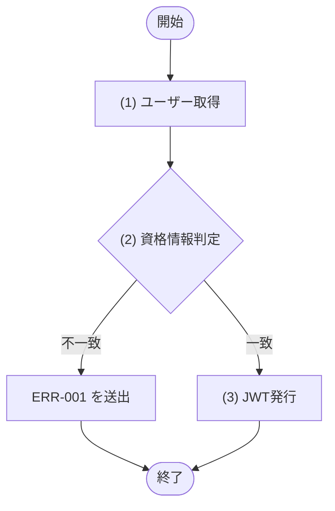
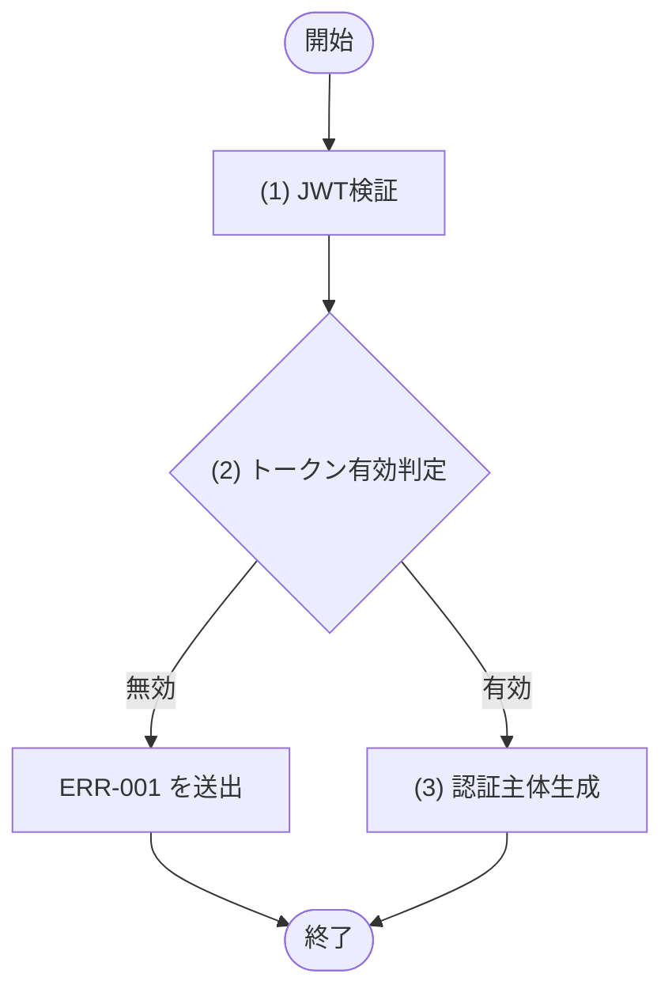

# 1. 基本情報

| 項目 | 内容 |
|---|---|
| モジュールID | MOD-001 |
| モジュール名 | 認証サービス |
| 種別 | Service |
| 概要 | ログイン時の資格情報検証と JWT の発行、および API 共通前処理での JWT 検証を行う |

# 2. 責務

| No | 責務 |
|---|---|
| 1 | ログイン資格情報(メールアドレス・パスワード)の検証 |
| 2 | 認証成功時の JWT 発行(有効期限24時間) |
| 3 | JWT の検証(署名・有効期限)と認証主体(ユーザーID・ロール)の取り出し |

# 3. インターフェース

## (1) ログイン処理

### 1. 概要

資格情報を検証し JWT を発行する処理。

### 2. 入力

| 入力項目 | データ型 | 説明 |
|---|---|---|
| メールアドレス | String | ログインするユーザーのメールアドレス |
| パスワード | String | 平文パスワード(bcrypt でハッシュ照合する) |

### 3. 出力

| 出力項目 | データ型 | 説明 |
|---|---|---|
| 認証トークン | Object | 発行した認証情報 |
| - トークン | String | 発行した JWT 文字列 |
| - 有効期限 | String | トークン有効期限(ISO8601形式) |
| - ユーザーID | Integer | ユーザーID |
| - ロール | Integer | ユーザーロール |

### 4. 例外

| エラーID | 説明 |
|---|---|
| ERR-001 | ユーザーが存在しない、またはパスワードが不一致(認証失敗) |

### 5. 処理フロー

### 6. 処理詳細

#### (1) ユーザー取得処理

資格情報を照合する対象の利用者を、メールアドレスをキーに取得する。該当が無い場合は NULL を返す。

| SQL-ID | クエリ名 |
|---|---|
| SQL-003 | ユーザー取得 |

| 引数項目 | 値 |
|---|---|
| メールアドレス | 引数.メールアドレス |

#### (2) 資格情報判定処理

取得した利用者の資格情報が正しいかを判定し、認証の成否を分岐する。

条件定義:

| No | 判定対象 | 条件 |
|---|---|---|
| 条件 | (1) ユーザー取得の結果 | != NULL |
| 条件 | (1) ユーザー取得の結果.パスワードハッシュ と 引数.パスワード | bcrypt 照合が一致 |

条件分岐マトリクス:

| 条件・処理 | #1 一致 | #2 ユーザー不存在 | #3 パスワード不一致 |
|---|---|---|---|
| 条件 | ◯ | × | ◯ |
| 条件 | ◯ | - | × |
| 処理 |  |  |  |
| (3) JWT発行へ進む | ◯ | - | - |
| ERR-001 を送出する | - | ◯ | ◯ |

| 項目名 | データ型 | 設定値 |
|---|---|---|
| なし | - | - |
#### (3) JWT登録処理

認証に成功した利用者を主体として JWT を発行する(発行仕様は API-COM §2 に準拠)。

| MOD-ID | 処理名 |
|---|---|
| なし | - |

| 引数項目 | 値 |
|---|---|
| ユーザーID | (1) ユーザー取得の結果.ID |
| ロール | (1) ユーザー取得の結果.ロール |

| 項目名 | データ型 | 設定値 |
|---|---|---|
| 認証トークン | - | 発行した JWT・有効期限(発行時刻+24時間)・ユーザーID・ロール |
## (2) トークン検証処理

### 1. 概要

JWT を検証し認証主体を取り出す処理。

### 2. 入力

| 入力項目 | データ型 | 説明 |
|---|---|---|
| トークン | String | 検証対象の JWT |

### 3. 出力

| 出力項目 | データ型 | 説明 |
|---|---|---|
| 認証主体 | Object | 認証主体 |
| - ユーザーID | Integer | ユーザーID |
| - ロール | Integer | ユーザーロール |

### 4. 例外

| エラーID | 説明 |
|---|---|
| ERR-001 | トークンが無効・改ざん・期限切れ(認証失敗) |

### 5. 処理フロー

### 6. 処理詳細

#### (1) JWT判定処理

検証対象の JWT の署名と有効期限を検証し、検証に成功した場合はペイロードから認証主体を取り出す。

| MOD-ID | 処理名 |
|---|---|
| なし | - |

| 引数項目 | 値 |
|---|---|
| トークン | 引数.トークン |

#### (2) トークン有効判定処理

リフレッシュトークンが有効か（有効期限内かつDBと一致するか）を判定する。

条件定義:

| No | 判定対象 | 条件 |
|---|---|---|
| 条件 | (1) JWT検証の結果 | 署名正当 AND 現在時刻 ＜＝ 有効期限 |

条件分岐マトリクス:

| 条件・処理 | #1 有効 | #2 無効 |
|---|---|---|
| 条件 | ◯ | × |
| 処理 |  |  |
| (3) 認証主体生成へ進む | ◯ | - |
| ERR-001 を送出する | - | ◯ |

| 項目名 | データ型 | 設定値 |
|---|---|---|
| なし | - | - |
#### (3) 認証主体取得処理

(1) JWT検証の結果のペイロードから認証主体を生成して返す。

| MOD-ID | 処理名 |
|---|---|
| なし | - |

| 引数項目 | 値 |
|---|---|
| なし | - |

| 項目名 | データ型 | 設定値 |
|---|---|---|
| 認証主体 | Object | (1) JWT検証の結果のペイロードから生成した情報 |
| - ユーザーID | Integer | (1) JWT検証の結果 |
| - ロール | Integer | (1) JWT検証の結果 |
# 4. トランザクション・排他制御

| 項目 | 内容 |
|---|---|
| トランザクション境界 | なし(ログイン処理・トークン検証処理 ともに参照のみで DB 更新を伴わない) |
| 排他制御 | なし |

# 5. データアクセス

| テーブル | C | R | U | D | 用途 |
|---|---|---|---|---|---|
| TBL-001 |  | ✓ |  |  | メールアドレスによるユーザー取得・パスワード照合 |

# 6. エラー・例外

| 条件 | エラー | 対応 |
|---|---|---|
| ユーザーが存在しない、またはパスワードが不一致 | ERR-001 | 例外を送出する(認証失敗) |
| トークンが無効・改ざん・期限切れ | ERR-001 | 例外を送出する(認証失敗) |
