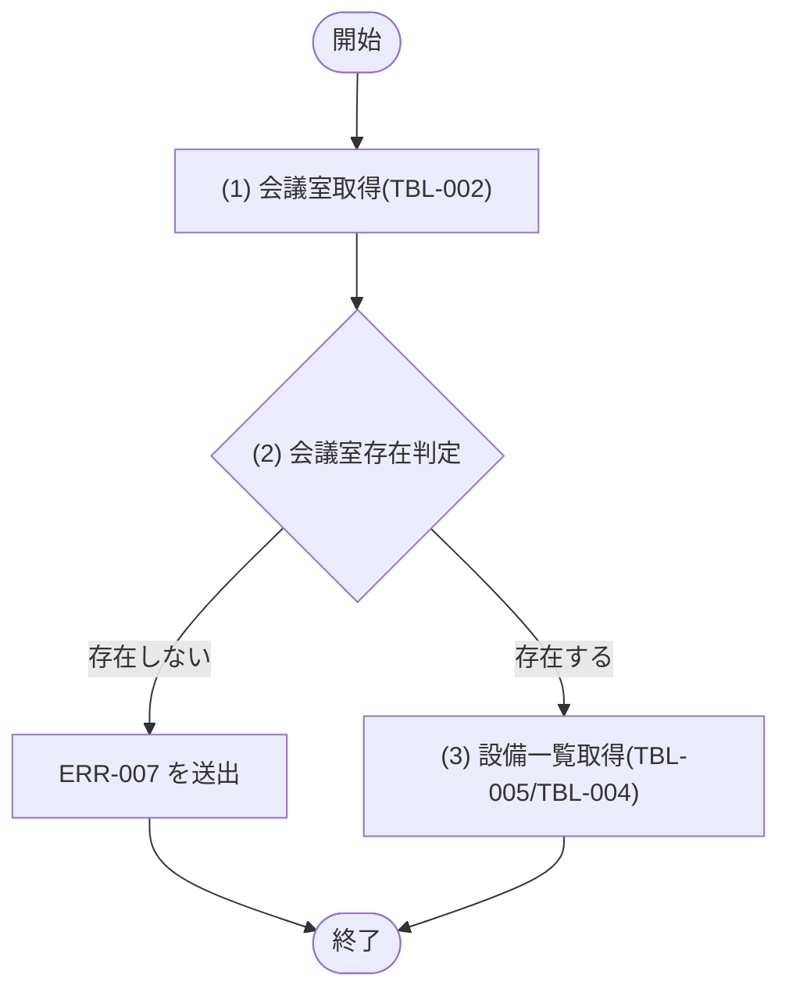

## 1. 基本情報

| 項目 | 内容 |
|---|---|
| モジュールID | MOD-002 |
| モジュール名 | 会議室検索サービス(RoomSearchService) |
| 種別 | Service |
| 概要 | 指定した日時・人数・設備の条件に合う空き会議室を抽出する(空き判定)。会議室1件の詳細取得も担う |

## 2. 責務

| No | 責務 |
|---|---|
| 1 | 条件(日時・人数・設備)に合う空き会議室の抽出(空き判定。SQL-001 を用いる) |
| 2 | 会議室1件の詳細(備える設備を含む)の取得 |

## 3. 公開インターフェース

| メソッド名 | 概要 | 入力 | 出力 | 例外・エラー |
|---|---|---|---|---|
| searchAvailableRooms | 条件に合う空き会議室を抽出する | 利用開始日時:startAt, 利用終了日時:endAt, 必要収容人数:capacity, 設備IDリスト:equipmentIds, ページ:page, 取得件数:limit | Room の一覧(ページネーション適用) | - |
| getRoomById | 会議室1件を設備一覧付きで取得する | 会議室ID:roomId | RoomDetail(会議室・設備一覧) | ERR-007 相当 |

## 4. 処理フロー

公開メソッドごとに、内部処理の基本フローをフローチャートで定義する。searchAvailableRooms は SQL-001 の実行とページネーション適用のみで分岐が無いため §5 で1件記載する。

### getRoomById

## 5. 処理詳細

公開メソッドごとに、各処理の内容を定義する。

### searchAvailableRooms

SQL-001(空き会議室検索クエリ)を実行し、指定時間帯に重複予約が無い会議室を収容人数・設備条件で抽出する。空き判定・利用停止(STATUS=2)会議室の除外・設備条件の判定ロジックの正本は SQL-001 とし、本モジュールはパラメータの引き渡しと結果へのページネーション(API-COM §5)適用を行う。分岐・エラーはない。

| MOD-ID | 処理名 |
|---|---|
| なし | - |

| 引数項目 | 値 |
|---|---|
| 利用開始日時(:start) | 引数.startAt |
| 利用終了日時(:end) | 引数.endAt |
| 必要収容人数(:capacity) | 引数.capacity |
| 設備IDリスト(:equipment_ids) | 引数.equipmentIds |
| 設備条件件数(:equipment_count) | 引数.equipmentIds の要素数 |
| ページ | 引数.page |
| 取得件数 | 引数.limit |

| 論理名 | 物理名 | 設定値 |
|---|---|---|
| 会議室一覧 | Room[] | SQL-001 の抽出結果にページネーションを適用した空き会議室の一覧 |

### getRoomById

#### (1) 会議室取得

M_ROOMS(TBL-002)から ID 一致かつ DELETED_AT IS NULL の会議室を1件取得する。該当が無い場合は NULL を返す。

| MOD-ID | 処理名 |
|---|---|
| なし | - |

| 引数項目 | 値 |
|---|---|
| 会議室ID | 引数.roomId |

#### (2) 会議室存在判定

条件定義:

| No | 判定対象 | 条件 |
|---|---|---|
| 条件(1) | (1) 会議室取得の結果 | != NULL |

条件分岐マトリクス:

| 条件・処理 | #1 存在する | #2 存在しない |
|---|---|---|
| 条件(1) | ◯ | × |
| 処理 |  |  |
| (3) 設備一覧取得へ進む | ◯ | - |
| ERR-007 を送出する | - | ◯ |

| 論理名 | 物理名 | 設定値 |
|---|---|---|
| なし | - | - |

#### (3) 設備一覧取得

(1) 会議室取得の結果の会議室が備える設備を、M_ROOM_EQUIPMENTS(TBL-005)を EQUIPMENT_ID で M_EQUIPMENTS(TBL-004)に結合し、設備名の一覧として取得する。該当が無い場合は空の一覧を返す。会議室と設備一覧をまとめて返す。

| MOD-ID | 処理名 |
|---|---|
| なし | - |

| 引数項目 | 値 |
|---|---|
| 会議室ID | (1) 会議室取得の結果.ID |

| 論理名 | 物理名 | 設定値 |
|---|---|---|
| 会議室詳細 | RoomDetail | (1) 会議室取得の結果 と (3) 設備一覧取得の結果(設備名の一覧) |

## 6. トランザクション・排他制御

| 項目 | 内容 |
|---|---|
| トランザクション境界 | なし(searchAvailableRooms・getRoomById ともに参照のみで DB 更新を伴わない) |
| 排他制御 | なし |

## 7. データアクセス

| テーブル | C | R | U | D | 用途 |
|---|---|---|---|---|---|
| TBL-002 |  | ✓ |  |  | 会議室の抽出(SQL-001)・詳細取得 |
| TBL-003 |  | ✓ |  |  | 空き判定(重複予約の除外。SQL-001) |
| TBL-004 |  | ✓ |  |  | 会議室が備える設備名の取得(getRoomById) |
| TBL-005 |  | ✓ |  |  | 設備条件の判定(SQL-001)・会議室と設備の紐付け取得 |

## 8. エラー・例外

| 条件 | エラー | 対応 |
|---|---|---|
| 指定 ID の会議室が存在しない(getRoomById) | ERR-007 | 例外を送出する |
