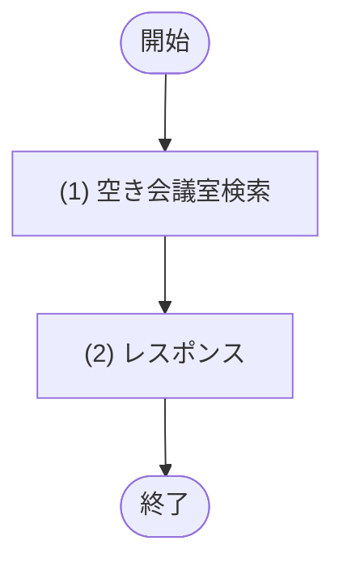
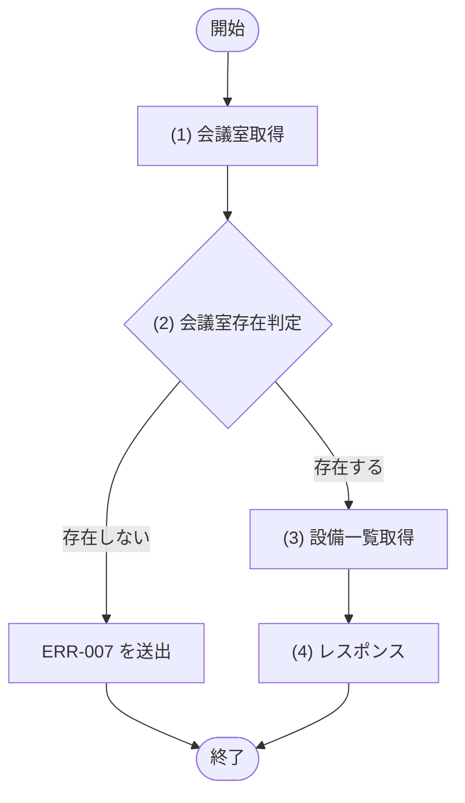

# 1. 基本情報

| 項目 | 内容 |
|---|---|
| モジュールID | MOD-002 |
| モジュール名 | 会議室検索サービス |
| 種別 | Service |
| 概要 | 指定した日時・人数・設備の条件に合う空き会議室を抽出する(空き判定)。会議室1件の詳細取得も担う |

# 2. 責務

| No | 責務 |
|---|---|
| 1 | 条件(日時・人数・設備)に合う空き会議室の抽出(空き判定。SQL-001 を用いる) |
| 2 | 会議室1件の詳細(備える設備を含む)の取得 |

# 3. インターフェース

## (1) 空き会議室検索処理

### 1. 概要

条件に合う空き会議室を抽出する処理。

### 2. 入力

| 入力項目 | データ型 | 説明 |
|---|---|---|
| 利用開始日時 | String | 利用開始日時(ISO8601/UTC。API 層で変換済み) |
| 利用終了日時 | String | 利用終了日時(ISO8601/UTC。API 層で変換済み) |
| 必要収容人数 | Integer | 必要収容人数(1 以上。未指定時は呼び出し元で 1 に既定化) |
| 設備IDリスト | Integer[] | 必要設備の ID リスト(0 件以上。空リストは設備条件なし) |
| ページ | Integer | 取得するページ番号 |
| 取得件数 | Integer | 1 ページあたりの取得件数 |

### 3. 出力

| 出力項目 | データ型 | 説明 |
|---|---|---|
| 会議室一覧 | Object[] | 条件に合う空き会議室の一覧(ページネーション適用) |
| - 会議室ID | Integer | 会議室の一意なID |
| - 会議室名 | String | 会議室の名称 |
| - 収容人数 | Integer | 最大収容人数 |
| - 設置場所 | String | 設置場所 |
| - 1時間あたり利用単価 | Integer | 1時間あたりの利用料金(円) |
| - 会議室ステータス | Integer | 会議室の状態(1:利用可/2:利用停止) |
| - 備考 | String | 会議室の備考 |
| - 設備一覧 | String[] | 会議室に備え付けられている設備の名称一覧 |

### 4. 例外

| エラーID | 説明 |
|---|---|
| なし | 送出する例外・エラーはない |

### 5. 処理フロー

### 6. 処理詳細

#### (1) 空き会議室検索処理

指定条件(日時・人数・設備)に合う空き会議室を抽出して返す。本モジュールはパラメータの引き渡しと結果へのページネーション(API-COM §5)適用を行う。分岐・エラーはない。

入力の前提: 利用開始日時・利用終了日時は呼び出し元(API 層)で ISO8601(UTC)へ変換済みの値を受け取る(利用日+時刻→UTC の変換責務は API 層)。収容人数は 1 以上(未指定時は呼び出し元で 1 に既定化済み)。設備ID一覧は 0 件以上のリスト(空リストのとき設備条件なし)。本モジュールでの日時変換・既定値補完は行わない。

| SQL-ID | クエリ名 |
|---|---|
| SQL-001 | 空き会議室検索クエリ |

| 引数項目 | 値 |
|---|---|
| 利用開始日時 | 引数.利用開始日時 |
| 利用終了日時 | 引数.利用終了日時 |
| 必要収容人数 | 引数.収容人数 |
| 設備IDリスト | 引数.設備ID一覧 |
| 設備条件件数 | 引数.設備ID一覧 の要素数 |
| ページ | 引数.ページ |
| 取得件数 | 引数.取得件数 |

#### (2) レスポンス処理

処理結果を返却する。

| 項目名 | データ型 | 設定値 |
|---|---|---|
| 会議室一覧 | Object[] | (1) 空き会議室検索処理の結果にページネーションを適用した空き会議室の一覧 |
| - 会議室ID | Integer | (1) 空き会議室検索処理の結果 |
| - 会議室名 | String | (1) 空き会議室検索処理の結果 |
| - 収容人数 | Integer | (1) 空き会議室検索処理の結果 |
| - 設置場所 | String | (1) 空き会議室検索処理の結果 |
| - 1時間あたり利用単価 | Integer | (1) 空き会議室検索処理の結果 |
| - 設備一覧 | String[] | (1) 空き会議室検索処理の結果(JSON配列から文字列配列へ変換) |
## (2) 会議室詳細取得処理

### 1. 概要

会議室1件を設備一覧付きで取得する処理。

### 2. 入力

| 入力項目 | データ型 | 説明 |
|---|---|---|
| 会議室ID | Integer | 取得対象の会議室ID |

### 3. 出力

| 出力項目 | データ型 | 説明 |
|---|---|---|
| 会議室詳細 | Object | 会議室1件と、備える設備名の一覧 |
| - 会議室ID | Integer | 会議室の一意なID |
| - 会議室名 | String | 会議室の名称 |
| - 収容人数 | Integer | 最大収容人数 |
| - 設置場所 | String | 設置場所 |
| - 1時間あたり利用単価 | Integer | 1時間あたりの利用料金(円) |
| - 会議室ステータス | Integer | 会議室の状態(1:利用可/2:利用停止) |
| - 備考 | String | 会議室の備考 |
| - 設備一覧 | String[] | 会議室に備え付けられている設備の名称一覧 |

### 4. 例外

| エラーID | 説明 |
|---|---|
| ERR-007 | 指定 ID の会議室が存在しない |

### 5. 処理フロー

### 6. 処理詳細

#### (1) 会議室取得処理

指定された ID の会議室を1件取得する。該当が無い場合は NULL を返す。

| SQL-ID | クエリ名 |
|---|---|
| SQL-008 | 会議室取得 |

| 引数項目 | 値 |
|---|---|
| 会議室ID | 引数.会議室ID |

| 項目名 | データ型 | 設定値 |
|---|---|---|
| 会議室 | Object | SQL-008 会議室取得の結果。該当が無い場合は NULL |
| - 会議室ID | Integer | 会議室取得の結果 |
| - 会議室名 | String | 会議室取得の結果 |
| - 収容人数 | Integer | 会議室取得の結果 |
| - 設置場所 | String | 会議室取得の結果 |
| - 1時間あたり利用単価 | Integer | 会議室取得の結果 |
| - 会議室ステータス | Integer | 会議室取得の結果 |
| - 備考 | String | 会議室取得の結果 |

#### (2) 会議室存在判定処理

指定された会議室が存在し、利用可能か（ステータスが「利用可」か）を判定する。

条件定義:

| No | 判定対象 | 条件 |
|---|---|---|
| 条件 | (1) 会議室取得の結果 | != NULL |

条件分岐マトリクス:

| 条件・処理 | #1 存在する | #2 存在しない |
|---|---|---|
| 条件 | ◯ | × |
| 処理 |  |  |
| (3) 設備一覧取得へ進む | ◯ | - |
| ERR-007 を送出する | - | ◯ |

| 項目名 | データ型 | 設定値 |
|---|---|---|
| なし | - | - |
#### (3) 設備一覧取得処理

対象の会議室が備える設備名の一覧を取得し、会議室とあわせて返す。設備が無い場合は空の一覧を返す。

| SQL-ID | クエリ名 |
|---|---|
| SQL-013 | 会議室設備名一覧取得 |

| 引数項目 | 値 |
|---|---|
| 会議室ID | (1) 会議室取得の結果.ID |

| 項目名 | データ型 | 設定値 |
|---|---|---|
| 設備一覧 | String[] | SQL-013 会議室設備名一覧取得の結果。設備が無い場合は空配列 |

#### (4) レスポンス処理

処理結果を返却する。

| 項目名 | データ型 | 設定値 |
|---|---|---|
| 会議室詳細 | Object | (1) 会議室詳細取得処理の結果 と (3) 設備一覧取得処理の結果を結合した情報 |
| - 会議室ID | Integer | (1) 会議室詳細取得処理の結果 |
| - 会議室名 | String | (1) 会議室詳細取得処理の結果 |
| - 収容人数 | Integer | (1) 会議室詳細取得処理の結果 |
| - 設置場所 | String | (1) 会議室詳細取得処理の結果 |
| - 1時間あたり利用単価 | Integer | (1) 会議室詳細取得処理の結果 |
| - 会議室ステータス | Integer | (1) 会議室詳細取得処理の結果 |
| - 備考 | String | (1) 会議室詳細取得処理の結果 |
| - 設備一覧 | String[] | (3) 設備一覧取得処理の結果(設備名の一覧) |
# 4. トランザクション・排他制御

| 項目 | 内容 |
|---|---|
| トランザクション境界 | なし(空き会議室検索処理・会議室詳細取得処理 ともに参照のみで DB 更新を伴わない) |
| 排他制御 | なし |

# 5. データアクセス

| テーブル | C | R | U | D | 用途 |
|---|---|---|---|---|---|
| TBL-002 |  | ✓ |  |  | 会議室の抽出(SQL-001)・詳細取得 |
| TBL-003 |  | ✓ |  |  | 空き判定(重複予約の除外。SQL-001) |
| TBL-004 |  | ✓ |  |  | 会議室が備える設備名の取得 |
| TBL-005 |  | ✓ |  |  | 設備条件の判定(SQL-001)・会議室と設備の紐付け取得 |

# 6. エラー・例外

| 条件 | エラー | 対応 |
|---|---|---|
| 指定 ID の会議室が存在しない | ERR-007 | 例外を送出する |
