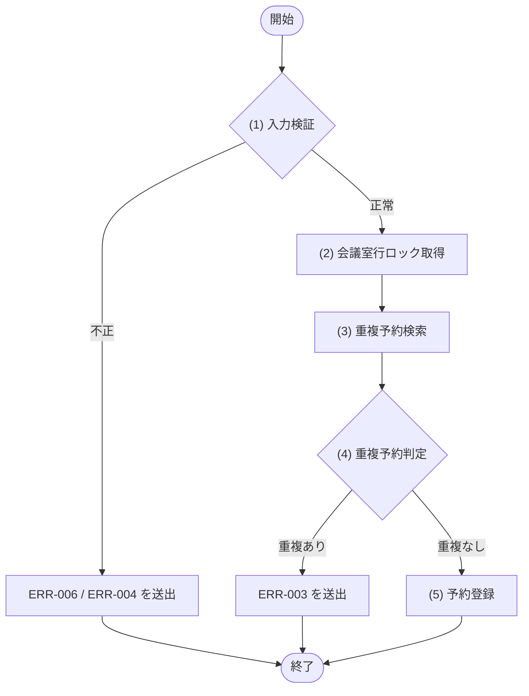
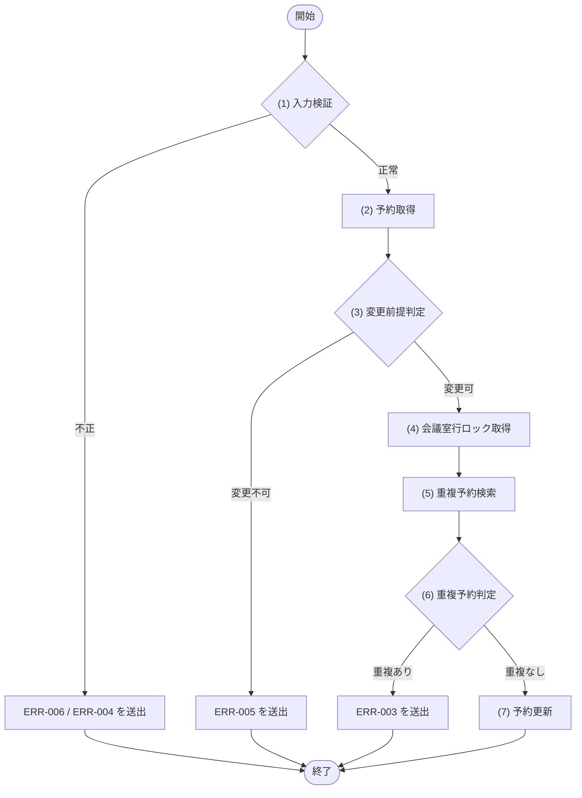
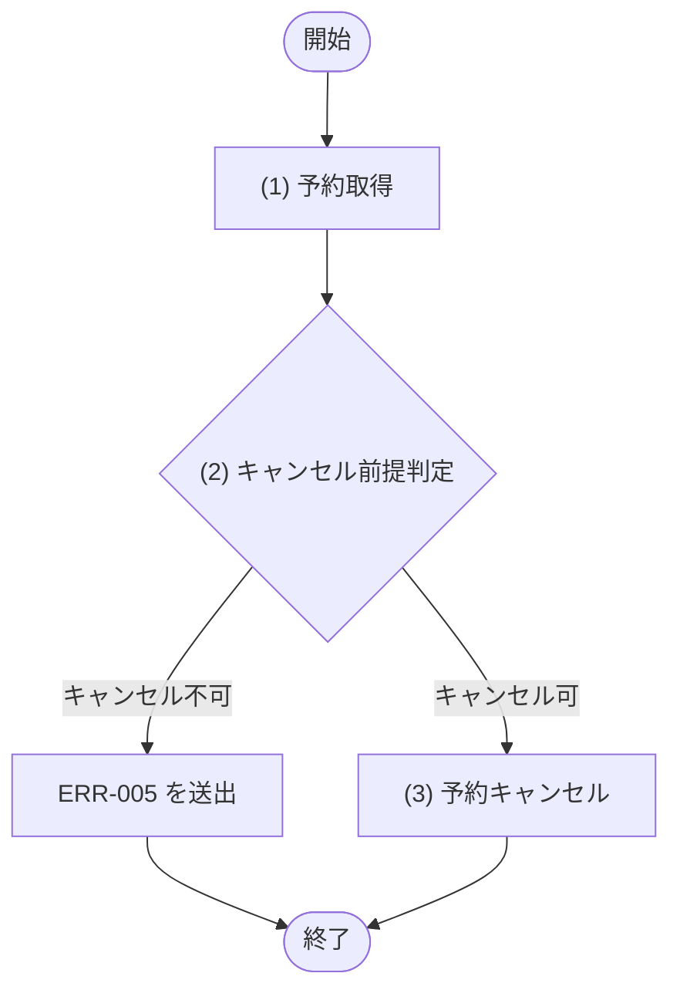

## 1. 基本情報

| 項目 | 内容 |
|---|---|
| モジュールID | MOD-003 |
| モジュール名 | 予約サービス(ReservationService) |
| 種別 | Service |
| 概要 | 予約の登録・変更・キャンセル。二重予約チェックを含む |

## 2. 責務

| No | 責務 |
|---|---|
| 1 | 予約の登録・変更・キャンセル |
| 2 | 二重予約チェック |
| 3 | 自予約の取得 |

## 3. 公開インターフェース

| メソッド名 | 概要 | 入力 | 出力 | 例外・エラー |
|---|---|---|---|---|
| getMyReservation | 自分の予約1件を取得する(会議室名を含む) | userId, reservationId | Reservation(会議室名含む)。存在しない・他者の予約は NULL | - |
| createReservation | 予約を登録する(二重予約チェック・利用停止会議室の拒否・有料会議室の課金契約確認を含む) | userId, roomId, title, startAt, endAt | Reservation | ERR-003, ERR-004, ERR-006, ERR-008, ERR-010 相当 |
| updateReservation | 自分の予約を変更する(予約済・未開始のみ変更可) | userId, reservationId, title, startAt, endAt | Reservation | ERR-003, ERR-004, ERR-005, ERR-006 相当 |
| cancelReservation | 自分の予約をキャンセルする(予約済・未開始のみキャンセル可) | userId, reservationId | Reservation(更新後) | ERR-005 相当 |
| listMyReservations | 自予約の一覧を取得する(会議室名を含む。ステータス・利用開始日の期間で絞り込み可) | userId, status, from, to, page, limit | Reservation の一覧(会議室名含む・ページネーション適用) | - |

## 4. 処理フロー

公開メソッドごとに、内部処理の基本フローをフローチャートで定義する。

### createReservation

### updateReservation

### cancelReservation

## 5. 処理詳細

公開メソッドごとに、各処理の内容を定義する。

### getMyReservation

reservationId・userId で自分の予約を1件取得する。T_RESERVATIONS(TBL-003)を ID 一致・USER_ID 一致・DELETED_AT IS NULL で取得し、ROOM_ID で M_ROOMS(TBL-002)を結合して会議室名(NAME)を付与する。予約が存在しない、または他者の予約の場合は NULL を返す。参照のみで分岐・エラー・トランザクションはない(API-004/API-005 の予約取得、および変更・キャンセルフォームの現在値表示に用いる)。

| MOD-ID | 処理名 |
|---|---|
| なし | - |

| 引数項目 | 値 |
|---|---|
| 予約ID | 引数.reservationId |
| ユーザーID | 引数.userId |

| 論理名 | 物理名 | 設定値 |
|---|---|---|
| 予約 | Reservation | TBL-003 と TBL-002(会議室名)を結合して取得した自予約1件。該当なしは NULL |

### createReservation

#### (1) 入力検証

必須欠落・型不正、または startAt ＜ endAt でない場合は ERR-006 相当、startAt が過去の場合は ERR-004 相当の例外を送出する。トランザクション開始前に実施し、呼び出し元(API層)の検証とは独立にモジュール側でも検証する。

条件定義:

| No | 判定対象 | 条件 |
|---|---|---|
| 条件(1) | 入力項目(userId, roomId, title, startAt, endAt) | 必須指定あり AND 型正当 AND startAt ＜ endAt |
| 条件(2) | startAt | 現在時刻 ＜＝ startAt |

条件分岐マトリクス:

| 条件・処理 | #1 正常 | #2 入力不正 | #3 過去日時 |
|---|---|---|---|
| 条件(1) | ◯ | × | ◯ |
| 条件(2) | ◯ | - | × |
| 処理 |  |  |  |
| (2) 会議室行ロック取得へ進む | ◯ | - | - |
| ERR-006 を送出する | - | ◯ | - |
| ERR-004 を送出する | - | - | ◯ |

#### (2) 会議室行ロック取得

M_ROOMS(TBL-002)の対象 ROOM_ID を行ロックする(SELECT ... FOR UPDATE)。排他制御は §6 参照。行ロック下で会議室ステータスを再判定し、利用停止(STATUS=2、TBL-002/ENM-1)の場合は ERR-010 を送出する(ロック取得〜COMMIT 間の状態変化に対する防御)。取得した会議室が有料(HOURLY_RATE ＞ 0)の場合は MOD-007(課金サービス)の課金契約状態確認を呼び出し、利用者の課金契約が有効(BILLING_STATUS=2)でない(未契約・停止)なら ERR-008 を送出する(TBL-001/ENM-2)。予約は即確定し、決済待ちの仮予約は作らない。

| MOD-ID | 処理名 |
|---|---|
| MOD-007 | 課金契約状態確認(有料会議室のときのみ) |

| 引数項目 | 値 |
|---|---|
| 会議室ID | 引数.roomId |
| ユーザーID | 引数.userId(MOD-007 課金契約状態確認へ渡す) |

#### (3) 重複予約検索

T_RESERVATIONS(TBL-003)で ROOM_ID 一致・STATUS=1(予約済)・時間帯重複(START_AT ＜ :endAt AND END_AT ＞ :startAt)の予約を検索する。該当が無い場合は 0件を返す。STATUS は TBL-003/ENM-1。

| MOD-ID | 処理名 |
|---|---|
| なし | - |

| 引数項目 | 値 |
|---|---|
| 会議室ID | 引数.roomId |
| 利用開始日時 | 引数.startAt |
| 利用終了日時 | 引数.endAt |

#### (4) 重複予約判定

条件定義:

| No | 判定対象 | 条件 |
|---|---|---|
| 条件(1) | (3) 重複予約検索の結果 | 件数 = 0 |

条件分岐マトリクス:

| 条件・処理 | #1 重複なし | #2 重複あり |
|---|---|---|
| 条件(1) | ◯ | × |
| 処理 |  |  |
| (5) 予約登録へ進む | ◯ | - |
| ERR-003 を送出する(ROLLBACK) | - | ◯ |

#### (5) 予約登録

T_RESERVATIONS(TBL-003)に INSERT する(STATUS=1(予約済), REMIND_STATUS=1(未送信))。STATUS は TBL-003/ENM-1、REMIND_STATUS は TBL-003/ENM-2。登録結果を返し COMMIT する。

| MOD-ID | 処理名 |
|---|---|
| なし | - |

| 引数項目 | 値 |
|---|---|
| ユーザーID | 引数.userId |
| 会議室ID | 引数.roomId |
| 予約タイトル | 引数.title |
| 利用開始日時 | 引数.startAt |
| 利用終了日時 | 引数.endAt |

| 論理名 | 物理名 | 設定値 |
|---|---|---|
| 予約 | Reservation | (5) 予約登録の結果(登録した予約データ) |

### updateReservation

#### (1) 入力検証

必須欠落・型不正、または startAt ＜ endAt でない場合は ERR-006 相当、startAt が過去の場合は ERR-004 相当の例外を送出する。

条件定義:

| No | 判定対象 | 条件 |
|---|---|---|
| 条件(1) | 入力項目(userId, reservationId, title, startAt, endAt) | 必須指定あり AND 型正当 AND startAt ＜ endAt |
| 条件(2) | startAt | 現在時刻 ＜＝ startAt |

条件分岐マトリクス:

| 条件・処理 | #1 正常 | #2 入力不正 | #3 過去日時 |
|---|---|---|---|
| 条件(1) | ◯ | × | ◯ |
| 条件(2) | ◯ | - | × |
| 処理 |  |  |  |
| (2) 予約取得へ進む | ◯ | - | - |
| ERR-006 を送出する | - | ◯ | - |
| ERR-004 を送出する | - | - | ◯ |

#### (2) 予約取得

reservationId の予約を取得する。予約が存在しない、または userId が予約者でない場合は NULL を返す。

| MOD-ID | 処理名 |
|---|---|
| なし | - |

| 引数項目 | 値 |
|---|---|
| 予約ID | 引数.reservationId |
| ユーザーID | 引数.userId |

#### (3) 変更前提判定

(2) 予約取得の結果が、予約変更の前提(存在・自予約・予約済・未開始)を満たすかを判定する。API 層(API-004 §5(2))と独立にモジュール側でも判定する。

条件定義:

| No | 判定対象 | 条件 |
|---|---|---|
| 条件(1) | (2) 予約取得の結果 | != NULL |
| 条件(2) | (2) 予約取得の結果.予約ステータス | 予約済(1) である(TBL-003/ENM-1) |
| 条件(3) | (2) 予約取得の結果.利用開始日時 | 現在日時 ＜ 利用開始日時(未開始) |

条件分岐マトリクス:

| 条件・処理 | #1 変更可 | #2 存在しない・他者 | #3 変更不可状態(キャンセル/完了) | #4 開始済み |
|---|---|---|---|---|
| 条件(1) | ◯ | × | ◯ | ◯ |
| 条件(2) | ◯ | - | × | ◯ |
| 条件(3) | ◯ | - | - | × |
| 処理 |  |  |  |  |
| (4) 会議室行ロック取得へ進む | ◯ | - | - | - |
| ERR-005 を送出する | - | ◯ | ◯ | ◯ |

#### (4) 会議室行ロック取得

(2) 予約取得の結果の会議室について、M_ROOMS(TBL-002)の対象 ROOM_ID を行ロックする(SELECT ... FOR UPDATE)。

| MOD-ID | 処理名 |
|---|---|
| なし | - |

| 引数項目 | 値 |
|---|---|
| 会議室ID | (2) 予約取得の結果.会議室ID |

#### (5) 重複予約検索

T_RESERVATIONS(TBL-003)で、(2) 予約取得の結果の会議室ID 一致・STATUS=1(予約済)・時間帯重複(START_AT ＜ :endAt AND END_AT ＞ :startAt)の予約を、変更対象の予約(reservationId)自身を除外して検索する。該当が無い場合は 0件を返す。

| MOD-ID | 処理名 |
|---|---|
| なし | - |

| 引数項目 | 値 |
|---|---|
| 会議室ID | (2) 予約取得の結果.会議室ID |
| 利用開始日時 | 引数.startAt |
| 利用終了日時 | 引数.endAt |
| 除外予約ID | 引数.reservationId |

#### (6) 重複予約判定

条件定義:

| No | 判定対象 | 条件 |
|---|---|---|
| 条件(1) | (5) 重複予約検索の結果 | 件数 = 0 |

条件分岐マトリクス:

| 条件・処理 | #1 重複なし | #2 重複あり |
|---|---|---|
| 条件(1) | ◯ | × |
| 処理 |  |  |
| (7) 予約更新へ進む | ◯ | - |
| ERR-003 を送出する(ROLLBACK) | - | ◯ |

#### (7) 予約更新

T_RESERVATIONS(TBL-003)の対象予約の TITLE・START_AT・END_AT を更新する。更新結果を返し COMMIT する。

| MOD-ID | 処理名 |
|---|---|
| なし | - |

| 引数項目 | 値 |
|---|---|
| 予約ID | 引数.reservationId |
| 予約タイトル | 引数.title |
| 利用開始日時 | 引数.startAt |
| 利用終了日時 | 引数.endAt |

| 論理名 | 物理名 | 設定値 |
|---|---|---|
| 予約 | Reservation | (7) 予約更新の結果(更新後の予約データ) |

### cancelReservation

#### (1) 予約取得

reservationId の予約を取得する。予約が存在しない、または userId が予約者でない場合は NULL を返す。

| MOD-ID | 処理名 |
|---|---|
| なし | - |

| 引数項目 | 値 |
|---|---|
| 予約ID | 引数.reservationId |
| ユーザーID | 引数.userId |

#### (2) キャンセル前提判定

(1) 予約取得の結果が、予約キャンセルの前提(存在・自予約・予約済・未開始)を満たすかを判定する。API 層(API-005 §5(2))と独立にモジュール側でも判定する。

条件定義:

| No | 判定対象 | 条件 |
|---|---|---|
| 条件(1) | (1) 予約取得の結果 | != NULL |
| 条件(2) | (1) 予約取得の結果.予約ステータス | 予約済(1) である(TBL-003/ENM-1) |
| 条件(3) | (1) 予約取得の結果.利用開始日時 | 現在日時 ＜ 利用開始日時(未開始) |

条件分岐マトリクス:

| 条件・処理 | #1 キャンセル可 | #2 存在しない・他者 | #3 キャンセル不可状態(キャンセル/完了) | #4 開始済み |
|---|---|---|---|---|
| 条件(1) | ◯ | × | ◯ | ◯ |
| 条件(2) | ◯ | - | × | ◯ |
| 条件(3) | ◯ | - | - | × |
| 処理 |  |  |  |  |
| (3) 予約キャンセルへ進む | ◯ | - | - | - |
| ERR-005 を送出する | - | ◯ | ◯ | ◯ |

#### (3) 予約キャンセル

T_RESERVATIONS(TBL-003)の対象予約の STATUS を 2(キャンセル) に更新する(STATUS は TBL-003/ENM-1)。更新後の予約を返し COMMIT する。

| MOD-ID | 処理名 |
|---|---|
| なし | - |

| 引数項目 | 値 |
|---|---|
| 予約ID | 引数.reservationId |

| 対象 | 更新内容 |
|---|---|
| TBL-003 | STATUS=2(キャンセル) |

| 論理名 | 物理名 | 設定値 |
|---|---|---|
| 予約 | Reservation | (3) 予約キャンセルの結果(更新後の予約データ。予約ID・予約ステータス=2 を含む) |

### listMyReservations

userId の予約を、指定された絞り込み条件(予約ステータス・利用開始日の期間)で抽出し、START_AT 昇順で取得して page / limit のページネーションを適用して返す。各予約は ROOM_ID で M_ROOMS(TBL-002)を結合して会議室名(NAME)を付与する。絞り込み条件はいずれも任意で、未指定の条件は適用しない。分岐・エラーはない。

| MOD-ID | 処理名 |
|---|---|
| なし | - |

| 引数項目 | 値 |
|---|---|
| ユーザーID | 引数.userId |
| 予約ステータス | 引数.status(任意。指定時は STATUS 一致で絞り込み。TBL-003/ENM-1) |
| 期間開始 | 引数.from(任意。指定時は 利用開始日 ＞＝ from) |
| 期間終了 | 引数.to(任意。指定時は 利用開始日 ＜＝ to) |
| ページ | 引数.page |
| 取得件数 | 引数.limit |

| 論理名 | 物理名 | 設定値 |
|---|---|---|
| 予約一覧 | Reservation[] | 絞り込み条件で抽出し TBL-002(会議室名)を結合、ページネーション適用して取得した自予約の一覧 |

## 6. トランザクション・排他制御

| 項目 | 内容 |
|---|---|
| トランザクション境界 | createReservation・updateReservation は会議室行ロック取得〜COMMIT、cancelReservation は予約取得〜COMMIT。listMyReservations は参照のみで更新トランザクションを持たない |
| 排他制御 | createReservation・updateReservation で M_ROOMS の対象行ロックにより同一会議室の同時予約を直列化 |

## 7. データアクセス

| テーブル | C | R | U | D | 用途 |
|---|---|---|---|---|---|
| TBL-002 |  | ✓ |  |  | 対象会議室の行ロック取得(SELECT ... FOR UPDATE)・会議室ステータス判定(利用停止拒否)・予約一覧/1件取得時の会議室名(NAME)結合 |
| TBL-003 | ✓ | ✓ | ✓ |  | 予約の登録・変更・キャンセル、重複判定、自予約の取得 |

## 8. エラー・例外

| 条件 | エラー | 対応 |
|---|---|---|
| 時間帯重複 | ERR-003 | 例外を送出し、トランザクションをロールバックする |
| 過去日時 | ERR-004 | 例外を送出し、トランザクションをロールバックする |
| 予約が存在しない(update/cancel時) | ERR-005 | 例外を送出し、トランザクションをロールバックする |
| 入力値不正(必須欠落・型不正・制約違反) | ERR-006 | 例外を送出し、トランザクションをロールバックする |
| 有料会議室(HOURLY_RATE ＞ 0)の予約で利用者の課金契約が有効でない(createReservation) | ERR-008 | MOD-007 の課金契約状態確認から送出され、トランザクションをロールバックする |
| 指定会議室が利用停止(STATUS=2)である(createReservation) | ERR-010 | 例外を送出し、トランザクションをロールバックする |
