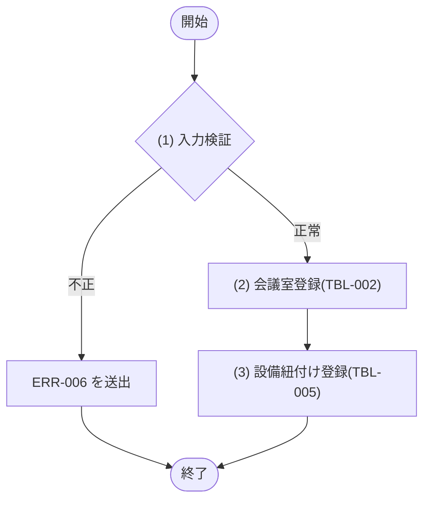
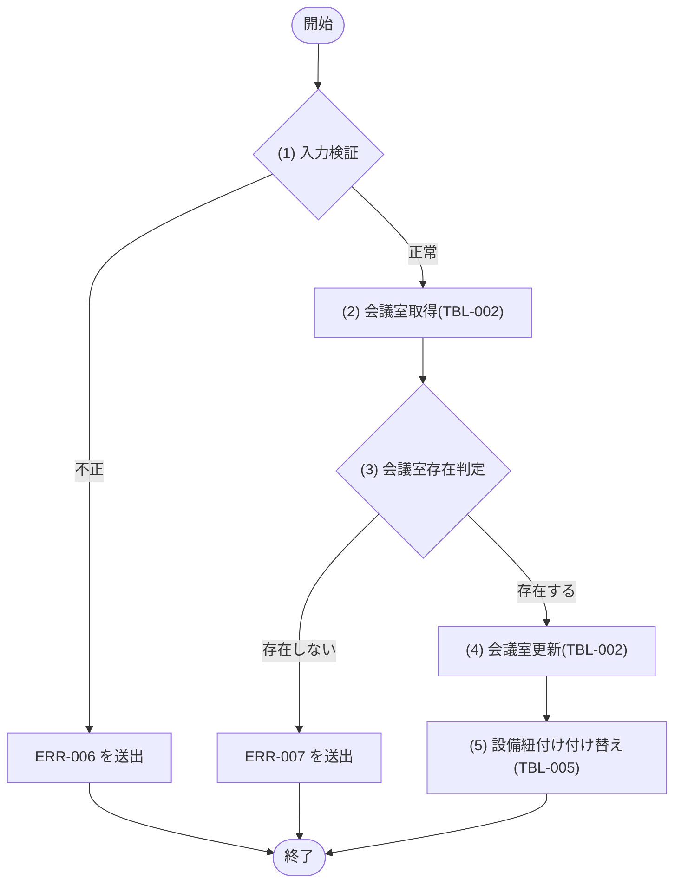

## 1. 基本情報

| 項目 | 内容 |
|---|---|
| モジュールID | MOD-004 |
| モジュール名 | 会議室管理サービス(RoomManagementService) |
| 種別 | Service |
| 概要 | 管理者による会議室(利用単価を含む)と設備紐付けの登録・編集、および設備マスタ一覧の取得を行う |

## 2. 責務

| No | 責務 |
|---|---|
| 1 | 会議室(利用単価 HOURLY_RATE を含む)の登録・編集 |
| 2 | 会議室と設備の紐付け(中間テーブル)の登録・付け替え |
| 3 | 設備マスタの一覧取得 |

## 3. 公開インターフェース

| メソッド名 | 概要 | 入力 | 出力 | 例外・エラー |
|---|---|---|---|---|
| createRoom | 会議室と設備紐付けを登録する | 会議室名:name, 収容人数:capacity, 設置場所:location, 利用単価:hourlyRate, 備考:note, 設備IDリスト:equipmentIds | Room | ERR-006 相当 |
| updateRoom | 会議室と設備紐付けを編集する | 会議室ID:roomId, 会議室名:name, 収容人数:capacity, 設置場所:location, 利用単価:hourlyRate, 会議室ステータス:status, 備考:note, 設備IDリスト:equipmentIds | Room | ERR-006, ERR-007 相当 |
| listEquipments | 設備マスタの一覧を取得する | なし | Equipment の一覧 | - |

## 4. 処理フロー

公開メソッドごとに、内部処理の基本フローをフローチャートで定義する。listEquipments は M_EQUIPMENTS の全件取得のみで分岐が無いため §5 で1件記載する。

### createRoom

### updateRoom

## 5. 処理詳細

公開メソッドごとに、各処理の内容を定義する。

### createRoom

#### (1) 入力検証

必須欠落・型不正、収容人数 ＜ 1、利用単価 ＜ 0、会議室ステータスの許可値外(TBL-002/ENM-1)、設備IDリストに M_EQUIPMENTS(TBL-004)に存在しない ID が含まれる、のいずれかの場合は ERR-006 相当の例外を送出する。API 層の共通バリデーションとは独立にモジュール側でも制約を検証する。

条件定義:

| No | 判定対象 | 条件 |
|---|---|---|
| 条件(1) | 入力項目(name, capacity, location, hourlyRate) | 必須指定あり AND 型正当 AND capacity ＞＝ 1 AND hourlyRate ＞＝ 0 |
| 条件(2) | 設備IDリスト(equipmentIds) | 全要素が M_EQUIPMENTS に存在する |

条件分岐マトリクス:

| 条件・処理 | #1 正常 | #2 入力不正 |
|---|---|---|
| 条件(1) | ◯ | × |
| 条件(2) | ◯ | × |
| 処理 |  |  |
| (2) 会議室登録へ進む | ◯ | - |
| ERR-006 を送出する | - | ◯ |

| 論理名 | 物理名 | 設定値 |
|---|---|---|
| なし | - | - |

#### (2) 会議室登録

M_ROOMS(TBL-002)に INSERT する(STATUS=1(利用可)。HOURLY_RATE は入力値、0=無料)。STATUS は TBL-002/ENM-1。

| MOD-ID | 処理名 |
|---|---|
| なし | - |

| 引数項目 | 値 |
|---|---|
| 会議室名 | 引数.name |
| 収容人数 | 引数.capacity |
| 設置場所 | 引数.location |
| 利用単価 | 引数.hourlyRate |
| 備考 | 引数.note |

#### (3) 設備紐付け登録

引数.equipmentIds の各設備について、M_ROOM_EQUIPMENTS(TBL-005)に (2) 会議室登録の結果の ROOM_ID との紐付けを INSERT する(UX_ROOM_EQUIPMENTS_ROOM_EQUIP により同一組み合わせは重複しない)。登録した会議室を返し COMMIT する。

| MOD-ID | 処理名 |
|---|---|
| なし | - |

| 引数項目 | 値 |
|---|---|
| 会議室ID | (2) 会議室登録の結果.ID |
| 設備IDリスト | 引数.equipmentIds |

| 論理名 | 物理名 | 設定値 |
|---|---|---|
| 会議室 | Room | (2) 会議室登録の結果(登録した会議室データ) |

### updateRoom

#### (1) 入力検証

createRoom (1) と同一の制約を検証し、違反時は ERR-006 相当の例外を送出する。会議室ステータス(status)は TBL-002/ENM-1 の許可値(1=利用可 / 2=利用停止)であること。

条件定義:

| No | 判定対象 | 条件 |
|---|---|---|
| 条件(1) | 入力項目(name, capacity, location, hourlyRate, status) | 必須指定あり AND 型正当 AND capacity ＞＝ 1 AND hourlyRate ＞＝ 0 AND status ∈ {1,2} |
| 条件(2) | 設備IDリスト(equipmentIds) | 全要素が M_EQUIPMENTS に存在する |

条件分岐マトリクス:

| 条件・処理 | #1 正常 | #2 入力不正 |
|---|---|---|
| 条件(1) | ◯ | × |
| 条件(2) | ◯ | × |
| 処理 |  |  |
| (2) 会議室取得へ進む | ◯ | - |
| ERR-006 を送出する | - | ◯ |

| 論理名 | 物理名 | 設定値 |
|---|---|---|
| なし | - | - |

#### (2) 会議室取得

M_ROOMS(TBL-002)から roomId 一致かつ DELETED_AT IS NULL の会議室を1件取得する。該当が無い場合は NULL を返す。

| MOD-ID | 処理名 |
|---|---|
| なし | - |

| 引数項目 | 値 |
|---|---|
| 会議室ID | 引数.roomId |

#### (3) 会議室存在判定

条件定義:

| No | 判定対象 | 条件 |
|---|---|---|
| 条件(1) | (2) 会議室取得の結果 | != NULL |

条件分岐マトリクス:

| 条件・処理 | #1 存在する | #2 存在しない |
|---|---|---|
| 条件(1) | ◯ | × |
| 処理 |  |  |
| (4) 会議室更新へ進む | ◯ | - |
| ERR-007 を送出する | - | ◯ |

| 論理名 | 物理名 | 設定値 |
|---|---|---|
| なし | - | - |

#### (4) 会議室更新

M_ROOMS(TBL-002)の対象会議室の NAME・CAPACITY・LOCATION・HOURLY_RATE・STATUS・NOTE を更新する。STATUS は TBL-002/ENM-1。

| MOD-ID | 処理名 |
|---|---|
| なし | - |

| 引数項目 | 値 |
|---|---|
| 会議室ID | 引数.roomId |
| 会議室名 | 引数.name |
| 収容人数 | 引数.capacity |
| 設置場所 | 引数.location |
| 利用単価 | 引数.hourlyRate |
| 会議室ステータス | 引数.status |
| 備考 | 引数.note |

#### (5) 設備紐付け付け替え

M_ROOM_EQUIPMENTS(TBL-005)の対象 ROOM_ID の既存紐付けを削除し、引数.equipmentIds の設備で INSERT し直す。更新後の会議室を返し COMMIT する。

| MOD-ID | 処理名 |
|---|---|
| なし | - |

| 引数項目 | 値 |
|---|---|
| 会議室ID | 引数.roomId |
| 設備IDリスト | 引数.equipmentIds |

| 論理名 | 物理名 | 設定値 |
|---|---|---|
| 会議室 | Room | (4) 会議室更新の結果(更新後の会議室データ) |

### listEquipments

M_EQUIPMENTS(TBL-004)の DELETED_AT IS NULL の設備を NAME 昇順で全件取得して返す。分岐・エラーはない。

| MOD-ID | 処理名 |
|---|---|
| なし | - |

| 引数項目 | 値 |
|---|---|
| なし | - |

| 論理名 | 物理名 | 設定値 |
|---|---|---|
| 設備一覧 | Equipment[] | 設備マスタの全件(NAME 昇順) |

## 6. トランザクション・排他制御

| 項目 | 内容 |
|---|---|
| トランザクション境界 | createRoom は会議室登録〜設備紐付け登録〜COMMIT、updateRoom は会議室更新〜設備紐付け付け替え〜COMMIT を1トランザクションで行う。listEquipments は参照のみで更新トランザクションを持たない |
| 排他制御 | なし(D1/SQLite は書き込みを直列化するため明示的な行ロックは行わない) |

## 7. データアクセス

| テーブル | C | R | U | D | 用途 |
|---|---|---|---|---|---|
| TBL-002 | ✓ | ✓ | ✓ |  | 会議室の登録・存在確認・編集 |
| TBL-004 |  | ✓ |  |  | 設備一覧取得・設備IDの妥当性確認 |
| TBL-005 | ✓ | ✓ |  | ✓ | 会議室と設備の紐付けの登録・付け替え(既存削除→再登録) |

## 8. エラー・例外

| 条件 | エラー | 対応 |
|---|---|---|
| 入力値不正(必須欠落・型不正・制約違反・設備ID不正) | ERR-006 | 例外を送出し、トランザクションをロールバックする |
| 指定 ID の会議室が存在しない(updateRoom) | ERR-007 | 例外を送出し、トランザクションをロールバックする |
