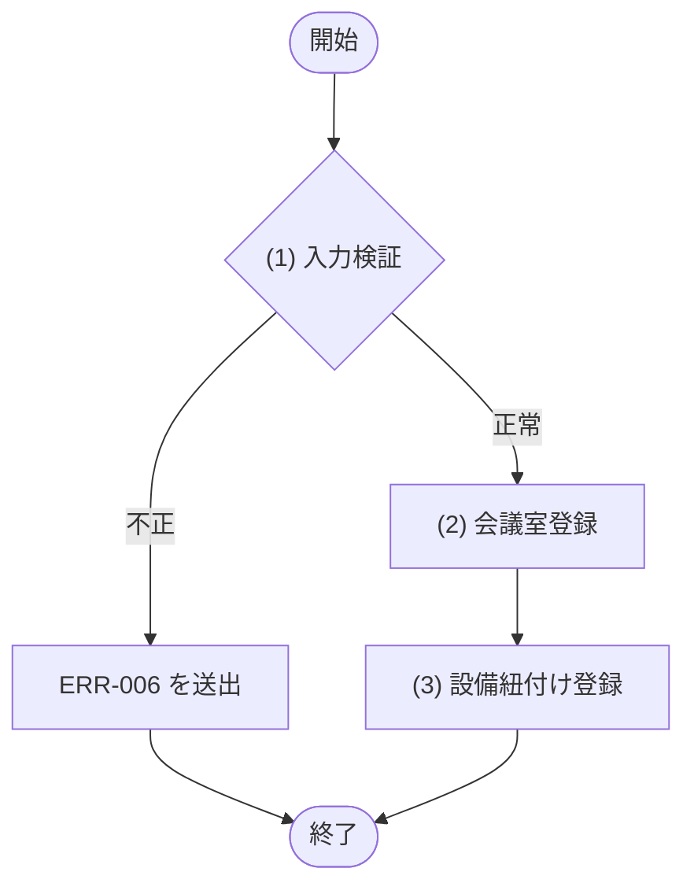
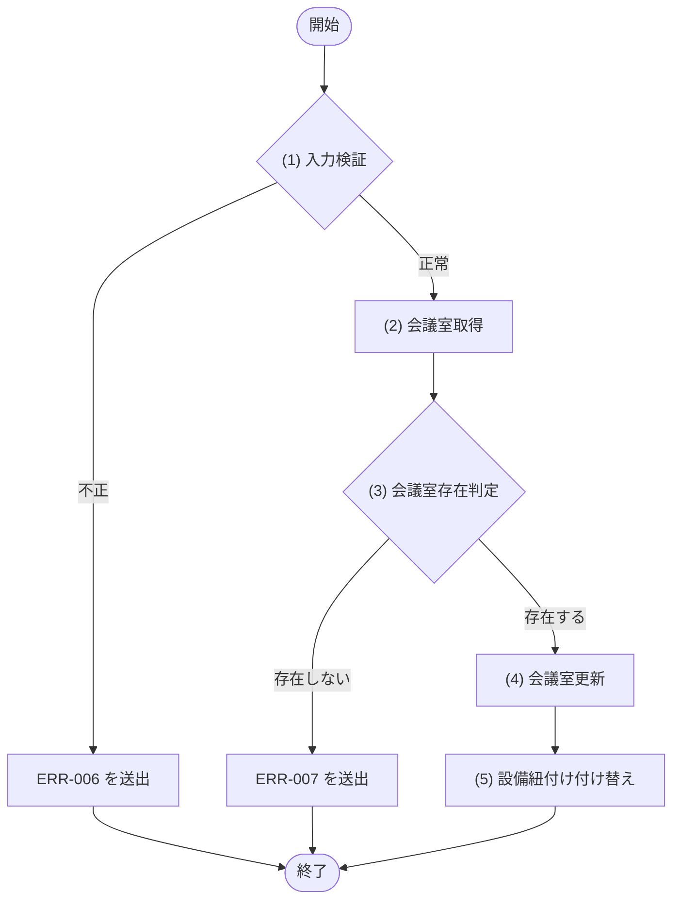
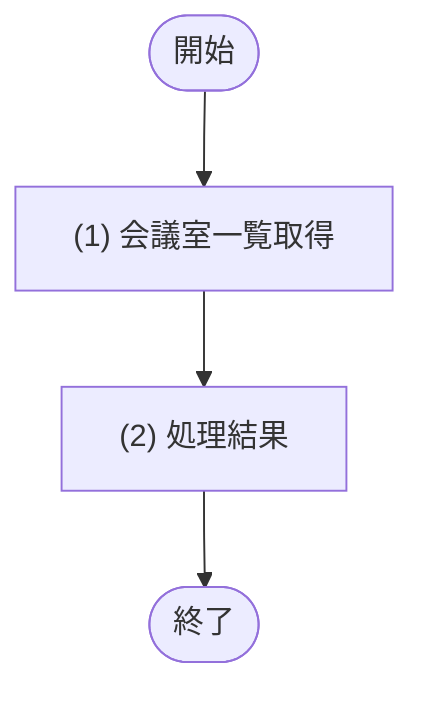
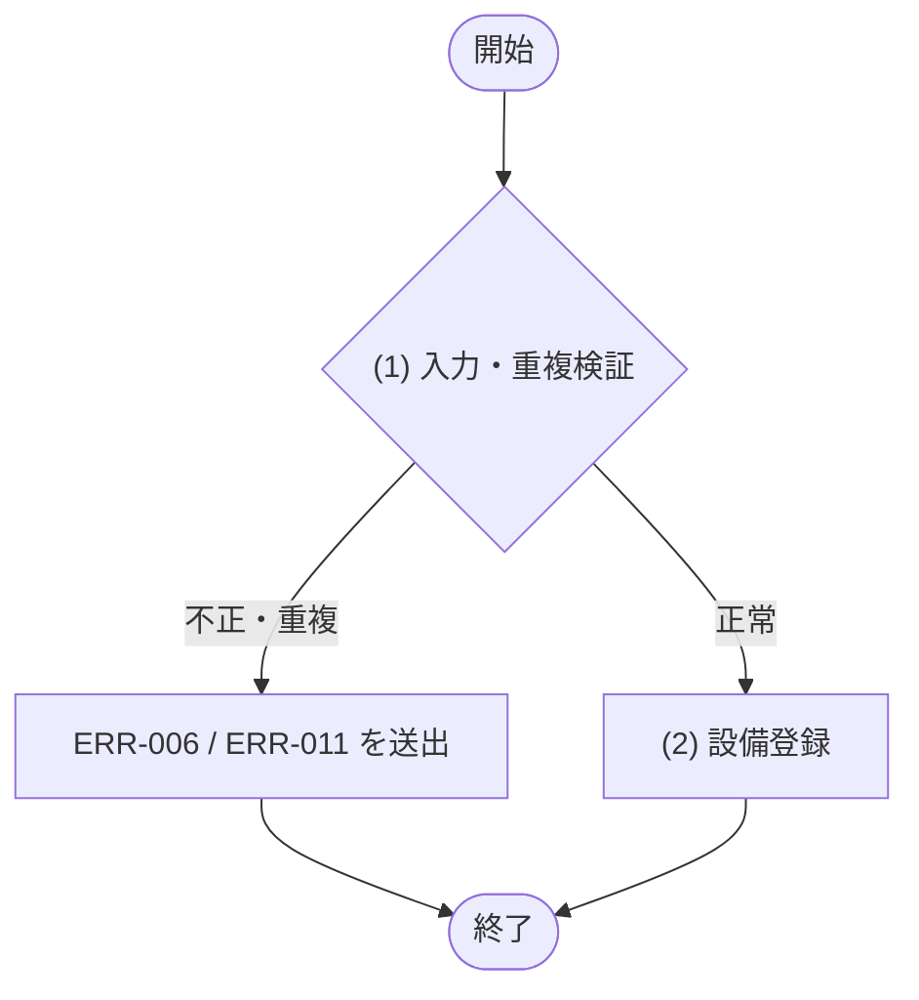
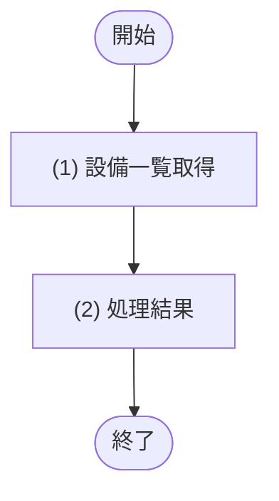

# 1. 基本情報

| 項目 | 内容 |
|---|---|
| モジュールID | MOD-004 |
| モジュール名 | 会議室管理サービス |
| 種別 | Service |
| 概要 | 管理者による会議室(利用単価を含む)と設備紐付けの登録・編集、および設備マスタ一覧の取得を行う |

# 2. 責務

| No | 責務 |
|---|---|
| 1 | 会議室(利用単価 利用単価 を含む)の登録・編集 |
| 2 | 会議室と設備の紐付け(中間テーブル)の登録・付け替え |
| 3 | 設備マスタの一覧取得・登録 |
| 4 | 管理者向け会議室一覧(利用停止を含む全件)の取得 |

# 3. インターフェース

## (1) 会議室登録処理

### 1. 概要

会議室と設備紐付けを登録する処理。

### 2. 入力

| 入力項目 | データ型 | 説明 |
|---|---|---|
| 会議室名 | String | 会議室名 |
| 収容人数 | Integer | 収容人数(1 以上) |
| 設置場所 | String | 設置場所 |
| 利用単価 | Integer | 1 時間あたりの利用単価(0 以上。0=無料) |
| 会議室ステータス | Integer | 会議室ステータス(DEF-001/CODE-003) |
| 備考 | String | 備考 |
| 設備IDリスト | Integer[] | 紐付ける設備の ID リスト |

### 3. 出力

| 出力項目 | データ型 | 説明 |
|---|---|---|
| 会議室 | Object | 登録した会議室 |
| - 会議室ID | Integer | 登録された会議室のID |
| - 会議室名 | String | 会議室の名称 |
| - 収容人数 | Integer | 最大収容人数 |
| - 設置場所 | String | 設置場所 |
| - 1時間あたり利用単価 | Integer | 1時間あたりの利用料金(円) |
| - 会議室ステータス | Integer | 会議室の状態(DEF-001/CODE-003) |
| - 備考 | String | 会議室の備考 |
| - 設備一覧 | String[] | 備え付けられている設備の名称一覧 |

### 4. 例外

| エラーID | 説明 |
|---|---|
| ERR-006 | 入力値不正(必須欠落・型不正・制約違反・設備ID不正) |

### 5. 処理フロー

### 6. 処理詳細

#### (1) 入力判定処理

登録前に、入力値がモジュール側の制約を満たすかを検証する(API 層の共通バリデーションとは独立に検証する)。違反時は ERR-006 相当の例外を送出する。

条件定義:

| No | 判定対象 | 条件 |
|---|---|---|
| 条件 | 入力項目(会議室名、収容人数、設置場所、利用単価、会議室ステータス) | 必須指定あり AND 型正当 AND 収容人数 ＞＝ 1 AND 利用単価 ＞＝ 0 AND 会議室ステータスが DEF-001/CODE-003 の有効値 |
| 条件 | 設備IDリスト | 全要素が 設備マスタ(TBL-004) に存在する(SQL-014 で確認) |

条件分岐マトリクス:

| 条件・処理 | #1 正常 | #2 入力不正 |
|---|---|---|
| 条件 | ◯ | × |
| 条件 | ◯ | × |
| 処理 |  |  |
| (2) 会議室登録へ進む | ◯ | - |
| ERR-006 を送出する | - | ◯ |

| 項目名 | データ型 | 値 | 説明 |
|---|---|---|---|
| なし | - | - | - |

#### (2) 会議室登録処理

入力内容で会議室を新規登録する。

| SQL-ID | クエリ名 |
|---|---|
| SQL-011 | 会議室登録 |

| 引数項目 | 値 |
|---|---|
| 会議室名 | 引数.名称 |
| 収容人数 | 引数.収容人数 |
| 設置場所 | 引数.設置場所 |
| 利用単価 | 引数.利用単価 |
| 会議室ステータス | 引数.ステータス(未指定時は DEF-001/SET-003) |
| 備考 | 引数.備考 |

#### (3) 設備紐付け登録処理

登録した会議室に、指定された設備を紐付けて登録する。登録した会議室を返し COMMIT する。

| SQL-ID | クエリ名 |
|---|---|
| SQL-018 | 会議室設備紐付け登録 |

| 引数項目 | 値 |
|---|---|
| 会議室ID | (2) 会議室登録の結果.ID |
| 設備ID | 引数.設備ID一覧 の各要素(設備ごとに実行) |

| 項目名 | データ型 | 値 | 説明 |
|---|---|---|---|
| 会議室 | Object | (2) 会議室登録処理の結果(登録した会議室データ) | 返却する会議室 |
| - 会議室ID | Integer | (2) 会議室登録処理の結果 | 返却する会議室ID |
| - 会議室名 | String | (2) 会議室登録処理の結果 | 返却する会議室名 |
| - 収容人数 | Integer | (2) 会議室登録処理の結果 | 返却する収容人数 |
| - 設置場所 | String | (2) 会議室登録処理の結果 | 返却する設置場所 |
| - 1時間あたり利用単価 | Integer | (2) 会議室登録処理の結果 | 返却する1時間あたり利用単価 |
| - 会議室ステータス | Integer | (2) 会議室登録処理の結果 | 返却する会議室ステータス |
| - 備考 | String | (2) 会議室登録処理の結果 | 返却する備考 |
| - 設備一覧 | String[] | 引数.設備IDリスト に対応する設備名一覧 | 返却する設備一覧 |

## (2) 会議室編集処理

### 1. 概要

会議室と設備紐付けを編集する処理。

### 2. 入力

| 入力項目 | データ型 | 説明 |
|---|---|---|
| 会議室ID | Integer | 編集対象の会議室ID |
| 会議室名 | String | 会議室名 |
| 収容人数 | Integer | 収容人数(1 以上) |
| 設置場所 | String | 設置場所 |
| 利用単価 | Integer | 1 時間あたりの利用単価(0 以上。0=無料) |
| 会議室ステータス | Integer | 会議室ステータス(DEF-001/CODE-003) |
| 備考 | String | 備考 |
| 設備IDリスト | Integer[] | 紐付ける設備の ID リスト(付け替え) |

### 3. 出力

| 出力項目 | データ型 | 説明 |
|---|---|---|
| 会議室 | Object | 更新後の会議室 |
| - 会議室ID | Integer | 会議室のID |
| - 会議室名 | String | 会議室の名称 |
| - 収容人数 | Integer | 最大収容人数 |
| - 設置場所 | String | 設置場所 |
| - 1時間あたり利用単価 | Integer | 1時間あたりの利用料金(円) |
| - 会議室ステータス | Integer | 会議室の状態(DEF-001/CODE-003) |
| - 備考 | String | 会議室の備考 |
| - 設備一覧 | String[] | 備え付けられている設備の名称一覧 |

### 4. 例外

| エラーID | 説明 |
|---|---|
| ERR-006 | 入力値不正(必須欠落・型不正・制約違反・設備ID不正) |
| ERR-007 | 指定 ID の会議室が存在しない |

### 5. 処理フロー

### 6. 処理詳細

#### (1) 入力判定処理

会議室登録処理 (1) と同一の制約を検証し、違反時は ERR-006 相当の例外を送出する。

条件定義:

| No | 判定対象 | 条件 |
|---|---|---|
| 条件 | 入力項目(会議室名、収容人数、設置場所、利用単価、会議室ステータス) | 必須指定あり AND 型正当 AND 収容人数 ＞＝ 1 AND 利用単価 ＞＝ 0 AND 会議室ステータスが DEF-001/CODE-003 の有効値 |
| 条件 | 設備IDリスト | 全要素が 設備マスタ(TBL-004) に存在する(SQL-014 で確認) |

条件分岐マトリクス:

| 条件・処理 | #1 正常 | #2 入力不正 |
|---|---|---|
| 条件 | ◯ | × |
| 条件 | ◯ | × |
| 処理 |  |  |
| (2) 会議室取得へ進む | ◯ | - |
| ERR-006 を送出する | - | ◯ |

| 項目名 | データ型 | 値 | 説明 |
|---|---|---|---|
| なし | - | - | - |

#### (2) 会議室取得処理

編集対象の会議室が存在するかを確認するため、指定 ID の会議室を取得する。該当が無い場合は NULL を返す。

| SQL-ID | クエリ名 |
|---|---|
| SQL-008 | 会議室取得 |

| 引数項目 | 値 |
|---|---|
| 会議室ID | 引数.会議室ID |

| 項目名 | データ型 | 値 | 説明 |
|---|---|---|---|
| 会議室 | Object | SQL-008 会議室取得の結果。該当が無い場合は NULL | 返却する会議室 |
| - 会議室ID | Integer | 会議室取得の結果 | 返却する会議室ID |
| - 会議室名 | String | 会議室取得の結果 | 返却する会議室名 |
| - 収容人数 | Integer | 会議室取得の結果 | 返却する収容人数 |
| - 設置場所 | String | 会議室取得の結果 | 返却する設置場所 |
| - 1時間あたり利用単価 | Integer | 会議室取得の結果 | 返却する1時間あたり利用単価 |
| - 会議室ステータス | Integer | 会議室取得の結果 | 返却する会議室ステータス |
| - 備考 | String | 会議室取得の結果 | 返却する備考 |

#### (3) 会議室存在判定処理

対象の会議室が存在するかを判定する。

条件定義:

| No | 判定対象 | 条件 |
|---|---|---|
| 条件 | (2) 会議室取得の結果 | != NULL |

条件分岐マトリクス:

| 条件・処理 | #1 存在する | #2 存在しない |
|---|---|---|
| 条件 | ◯ | × |
| 処理 |  |  |
| (4) 会議室更新へ進む | ◯ | - |
| ERR-007 を送出する | - | ◯ |

| 項目名 | データ型 | 値 | 説明 |
|---|---|---|---|
| なし | - | - | - |

#### (4) 会議室更新処理

編集対象の会議室情報を更新する。

| SQL-ID | クエリ名 |
|---|---|
| SQL-012 | 会議室更新 |

| 引数項目 | 値 |
|---|---|
| 会議室ID | 引数.会議室ID |
| 会議室名 | 引数.名称 |
| 収容人数 | 引数.収容人数 |
| 設置場所 | 引数.設置場所 |
| 利用単価 | 引数.利用単価 |
| 会議室ステータス | 引数.ステータス |
| 備考 | 引数.備考 |

#### (5) 設備紐付け更新処理

対象会議室の設備紐付けを、指定された設備一覧で置き換える(既存の紐付けを削除して登録し直す)。更新後の会議室を返し COMMIT する。

| SQL-ID | クエリ名 |
|---|---|
| SQL-019 | 会議室設備紐付け削除 |
| SQL-018 | 会議室設備紐付け登録 |

| 引数項目 | 値 |
|---|---|
| 会議室ID | 引数.会議室ID |
| 設備ID | 引数.設備ID一覧 の各要素(SQL-018 を設備ごとに実行) |

| 項目名 | データ型 | 値 | 説明 |
|---|---|---|---|
| 会議室 | Object | (4) 会議室更新処理の結果(更新後の会議室データ) | 返却する会議室 |
| - 会議室ID | Integer | (4) 会議室更新処理の結果 | 返却する会議室ID |
| - 会議室名 | String | (4) 会議室更新処理の結果 | 返却する会議室名 |
| - 収容人数 | Integer | (4) 会議室更新処理の結果 | 返却する収容人数 |
| - 設置場所 | String | (4) 会議室更新処理の結果 | 返却する設置場所 |
| - 1時間あたり利用単価 | Integer | (4) 会議室更新処理の結果 | 返却する1時間あたり利用単価 |
| - 会議室ステータス | Integer | (4) 会議室更新処理の結果 | 返却する会議室ステータス |
| - 備考 | String | (4) 会議室更新処理の結果 | 返却する備考 |
| - 設備一覧 | String[] | 引数.設備IDリスト に対応する設備名一覧 | 返却する設備一覧 |

## (3) 会議室一覧取得処理

### 1. 概要

管理者向けに全会議室(利用停止を含む)を設備一覧付きで取得する処理。

### 2. 入力

| 入力項目 | データ型 | 説明 |
|---|---|---|
| なし | - | 引数なし |

### 3. 出力

| 出力項目 | データ型 | 説明 |
|---|---|---|
| 会議室一覧 | Object[] | 全会議室(利用停止含む)を設備一覧付き・会議室名昇順で取得した一覧 |
| - 会議室ID | Integer | 会議室のID |
| - 会議室名 | String | 会議室の名称 |
| - 収容人数 | Integer | 最大収容人数 |
| - 設置場所 | String | 設置場所 |
| - 1時間あたり利用単価 | Integer | 1時間あたりの利用料金(円) |
| - 会議室ステータス | Integer | 会議室の状態(DEF-001/CODE-003) |
| - 備考 | String | 会議室の備考 |
| - 設備一覧 | String[] | 備え付けられている設備の名称一覧 |

### 4. 例外

| エラーID | 説明 |
|---|---|
| なし | - |

### 5. 処理フロー

### 6. 処理詳細

管理者向けに、利用停止を含む全会議室を設備一覧付きで取得する。管理者の会議室編集対象選択(SCR-005)に用いる。分岐・エラーはない(認可は API 層で担保)。

| SQL-ID | クエリ名 |
|---|---|
| SQL-010 | 会議室一覧取得(管理者向け・設備名付き) |

| 引数項目 | 値 |
|---|---|
| なし | - |

#### (2) 処理結果

処理結果を返却する。

| 項目名 | データ型 | 値 | 説明 |
|---|---|---|---|
| 会議室一覧 | Object[] | (1) 会議室一覧取得処理の結果で取得した全会議室(利用停止含む)の設備一覧付き・NAME 昇順の一覧 | 返却する会議室一覧 |
| - 会議室ID | Integer | (1) 会議室一覧取得処理の結果 | 返却する会議室ID |
| - 会議室名 | String | (1) 会議室一覧取得処理の結果 | 返却する会議室名 |
| - 収容人数 | Integer | (1) 会議室一覧取得処理の結果 | 返却する収容人数 |
| - 設置場所 | String | (1) 会議室一覧取得処理の結果 | 返却する設置場所 |
| - 1時間あたり利用単価 | Integer | (1) 会議室一覧取得処理の結果 | 返却する1時間あたり利用単価 |
| - 会議室ステータス | Integer | (1) 会議室一覧取得処理の結果 | 返却する会議室ステータス |
| - 備考 | String | (1) 会議室一覧取得処理の結果 | 返却する備考 |
| - 設備一覧 | String[] | (1) 会議室一覧取得処理の結果(JSON配列から文字列配列へ変換) | 返却する設備一覧 |

## (4) 設備登録処理

### 1. 概要

設備を新規登録する処理。

### 2. 入力

| 入力項目 | データ型 | 説明 |
|---|---|---|
| 設備名 | String | 設備名(100 文字以内) |

### 3. 出力

| 出力項目 | データ型 | 説明 |
|---|---|---|
| 設備 | Object | 登録した設備(設備ID・設備名) |
| - 設備ID | Integer | 登録された設備のID |
| - 設備名 | String | 登録された設備の名称 |

### 4. 例外

| エラーID | 説明 |
|---|---|
| ERR-006 | 入力値不正(必須欠落・型不正・文字数超過) |
| ERR-011 | 同名の設備が既に存在する |

### 5. 処理フロー

### 6. 処理詳細

#### (1) 入力・重複判定処理

登録前に、入力された設備名が制約を満たすか、および同名設備の重複が無いかを検証する。

・設備名が不正な場合は ERR-006 を送出する
・同名の設備が既に存在する場合は ERR-011 を送出する

条件定義:

| No | 判定対象 | 条件 |
|---|---|---|
| 条件 | 入力項目 | 必須指定あり AND 型正当 AND 文字数 ＜＝ 100 |
| 条件 | 同名設備(TBL-004 の NAME 一致) | 存在しない |

条件分岐マトリクス:

| 条件・処理 | #1 正常 | #2 入力不正 | #3 重複 |
|---|---|---|---|
| 条件 | ◯ | × | ◯ |
| 条件 | ◯ | - | × |
| 処理 |  |  |  |
| (2) 設備登録へ進む | ◯ | - | - |
| ERR-006 を送出する | - | ◯ | - |
| ERR-011 を送出する | - | - | ◯ |

| 項目名 | データ型 | 値 | 説明 |
|---|---|---|---|
| なし | - | - | - |

#### (2) 設備登録処理

入力された設備名で設備を新規登録する。登録した設備を返し COMMIT する。

| SQL-ID | クエリ名 |
|---|---|
| SQL-017 | 設備登録 |

| 引数項目 | 値 |
|---|---|
| 設備名 | 引数.名称 |

| 項目名 | データ型 | 値 | 説明 |
|---|---|---|---|
| 設備 | Object | (2) 設備登録の結果(登録した設備データ) | 返却する設備 |
| - 設備ID | Integer | (2) 設備登録の結果 | 返却する設備ID |
| - 設備名 | String | (2) 設備登録の結果 | 返却する設備名 |

## (5) 設備一覧取得処理

### 1. 概要

設備マスタの一覧を取得する処理。

### 2. 入力

| 入力項目 | データ型 | 説明 |
|---|---|---|
| なし | - | 引数なし |

### 3. 出力

| 出力項目 | データ型 | 説明 |
|---|---|---|
| 設備一覧 | Object[] | 設備マスタの全件(設備名昇順) |
| - 設備ID | Integer | 設備のID |
| - 設備名 | String | 設備の名称 |

### 4. 例外

| エラーID | 説明 |
|---|---|
| なし | - |

### 5. 処理フロー

### 6. 処理詳細

設備マスタの全件を設備名昇順で取得して返す。分岐・エラーはない。

| SQL-ID | クエリ名 |
|---|---|
| SQL-016 | 設備一覧取得 |

| 引数項目 | 値 |
|---|---|
| なし | - |

#### (2) 処理結果

処理結果を返却する。

| 項目名 | データ型 | 値 | 説明 |
|---|---|---|---|
| 設備一覧 | Object[] | (1) 設備一覧取得処理の結果で取得した設備マスタの全件(NAME 昇順) | 返却する設備一覧 |
| - 設備ID | Integer | (1) 設備一覧取得処理の結果 | 返却する設備ID |
| - 設備名 | String | (1) 設備一覧取得処理の結果 | 返却する設備名 |

# 4. トランザクション・排他制御

| 項目 | 内容 |
|---|---|
| トランザクション境界 | 会議室登録処理 は会議室登録〜設備紐付け登録〜COMMIT、会議室更新処理 は会議室更新〜設備紐付け付け替え〜COMMIT、設備登録処理 は設備登録の INSERT〜COMMIT を1トランザクションで行う。会議室一覧取得処理・設備一覧取得処理 は参照のみで更新トランザクションを持たない |
| 排他制御 | なし(D1/SQLite は書き込みを直列化するため明示的な行ロックは行わない) |

# 5. データアクセス

| テーブル | C | R | U | D | 用途 |
|---|---|---|---|---|---|
| TBL-002 | ✓ | ✓ | ✓ |  | 会議室の登録・存在確認・編集・管理者向け全件一覧取得(会議室一覧取得処理、利用停止含む) |
| TBL-004 | ✓ | ✓ |  |  | 設備一覧取得・設備IDの妥当性確認・設備の新規登録 |
| TBL-005 | ✓ | ✓ |  | ✓ | 会議室と設備の紐付けの登録・付け替え(既存削除→再登録)・会議室一覧の設備結合 |

# 6. エラー・例外

| 条件 | エラー | 対応 |
|---|---|---|
| 入力値不正(必須欠落・型不正・制約違反・設備ID不正) | ERR-006 | 例外を送出し、トランザクションをロールバックする |
| 指定 ID の会議室が存在しない | ERR-007 | 例外を送出し、トランザクションをロールバックする |
| 同名の設備が既に存在する(設備登録処理、設備名の一意制約 違反) | ERR-011 | 例外を送出し、トランザクションをロールバックする |
