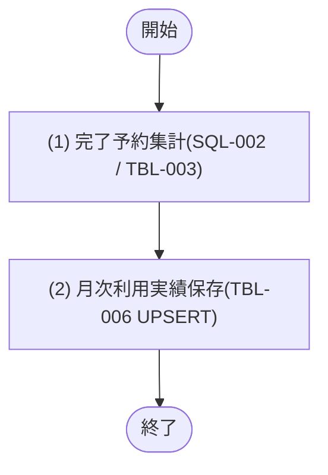

## 1. 基本情報

| 項目 | 内容 |
|---|---|
| モジュールID | MOD-005 |
| モジュール名 | 利用実績サービス(UsageReportService) |
| 種別 | Service |
| 概要 | 完了した予約を会議室×対象月で集計して月次利用実績を保存し、指定月の会議室別利用実績を取得する |

## 2. 責務

| No | 責務 |
|---|---|
| 1 | 対象月の完了予約(STATUS=3)を会議室別に集計し、月次利用実績を保存する(SQL-002 を用いる) |
| 2 | 指定月の会議室別利用実績(件数・利用時間)の取得 |
| 3 | 予約1件の利用時間(分)の算出(従量課金計上 JOB-002 が利用) |

## 3. 公開インターフェース

| メソッド名 | 概要 | 入力 | 出力 | 例外・エラー |
|---|---|---|---|---|
| aggregateMonthlyUsage | 対象月の完了予約を集計し月次利用実績を保存する | 対象月:targetMonth('YYYY-MM') | 集計件数:aggregatedCount | - |
| getUsageReport | 指定月の会議室別利用実績を会議室名昇順で取得する | 対象月:targetMonth('YYYY-MM'), ページ:page, 取得件数:limit | UsageReport の一覧(会議室名含む・ページネーション適用) | - |
| computeUsageMinutes | 予約1件の利用時間(分)を算出する | 利用開始日時:startAt, 利用終了日時:endAt | 利用時間(分):minutes | - |

## 4. 処理フロー

公開メソッドごとに、内部処理の基本フローをフローチャートで定義する。getUsageReport(保存済み実績の取得とページネーション適用)・computeUsageMinutes(利用時間の算出)は分岐が無いため §5 で1件記載する。

### aggregateMonthlyUsage

## 5. 処理詳細

公開メソッドごとに、各処理の内容を定義する。

### aggregateMonthlyUsage

#### (1) 完了予約集計

SQL-002(月次利用実績集計クエリ)を実行し、対象月(targetMonth)に開始した完了予約(T_RESERVATIONS の STATUS=3)を会議室(ROOM_ID)ごとに集計する。集計項目は予約件数(RESERVATION_COUNT)と利用時間(分, TOTAL_MINUTES)。対象月の判定・集計ロジックの正本は SQL-002 とする。該当会議室が無い場合は 0件を返す。

| MOD-ID | 処理名 |
|---|---|
| なし | - |

| 引数項目 | 値 |
|---|---|
| 対象月(:target_month) | 引数.targetMonth |

#### (2) 月次利用実績保存

(1) 完了予約集計の結果を、T_USAGE_REPORTS(TBL-006)に ROOM_ID×TARGET_MONTH 単位で UPSERT する(UX_USAGE_REPORTS_ROOM_MONTH により1組み合わせ1行。既存があれば RESERVATION_COUNT・TOTAL_MINUTES を更新、無ければ INSERT)。保存した件数を返し COMMIT する。

| MOD-ID | 処理名 |
|---|---|
| なし | - |

| 引数項目 | 値 |
|---|---|
| 対象月 | 引数.targetMonth |
| 集計結果 | (1) 完了予約集計の結果(会議室別の件数・利用時間) |

| 論理名 | 物理名 | 設定値 |
|---|---|---|
| 集計件数 | aggregatedCount | (2) 月次利用実績保存で UPSERT した会議室の件数 |

### getUsageReport

T_USAGE_REPORTS(TBL-006)から TARGET_MONTH 一致かつ DELETED_AT IS NULL の会議室別利用実績を取得し、ROOM_ID で M_ROOMS(TBL-002)を結合して会議室名(NAME)を付与する。会議室名(NAME)昇順で並べ、page / limit でページネーション(API-COM §5)を適用して返す。指定月の実績が未集計の場合は空の一覧を返す。分岐・エラーはない。

| MOD-ID | 処理名 |
|---|---|
| なし | - |

| 引数項目 | 値 |
|---|---|
| 対象月 | 引数.targetMonth |
| ページ | 引数.page |
| 取得件数 | 引数.limit |

| 論理名 | 物理名 | 設定値 |
|---|---|---|
| 利用実績一覧 | UsageReport[] | 指定月の会議室別利用実績を会議室名結合・会議室名昇順でページネーション適用して取得した一覧 |

### computeUsageMinutes

予約1件の利用時間(分)を算出する。利用時間 = CAST((julianday(endAt) - julianday(startAt)) * 24 * 60 AS INTEGER)(SQL-002 の利用時間算出と同一定義。秒未満は切り捨て)。分岐・エラー・DB アクセスはない。

| MOD-ID | 処理名 |
|---|---|
| なし | - |

| 引数項目 | 値 |
|---|---|
| 利用開始日時 | 引数.startAt |
| 利用終了日時 | 引数.endAt |

| 論理名 | 物理名 | 設定値 |
|---|---|---|
| 利用時間(分) | minutes | 開始〜終了の差分を分単位に切り捨てた整数 |

## 6. トランザクション・排他制御

| 項目 | 内容 |
|---|---|
| トランザクション境界 | aggregateMonthlyUsage は完了予約集計〜月次利用実績保存(UPSERT)〜COMMIT を1トランザクションで行う。getUsageReport は参照のみで更新トランザクションを持たない |
| 排他制御 | なし(UX_USAGE_REPORTS_ROOM_MONTH の一意制約で ROOM_ID×TARGET_MONTH の重複行を防止) |

## 7. データアクセス

| テーブル | C | R | U | D | 用途 |
|---|---|---|---|---|---|
| TBL-002 |  | ✓ |  |  | 会議室名の取得(集計 SQL-002・getUsageReport の結合) |
| TBL-003 |  | ✓ |  |  | 完了予約の集計(SQL-002) |
| TBL-006 | ✓ | ✓ | ✓ |  | 月次利用実績の保存(UPSERT)・取得 |

## 8. エラー・例外

| 条件 | エラー | 対応 |
|---|---|---|
| なし | - | 本モジュールは業務エラー・例外を送出しない |
