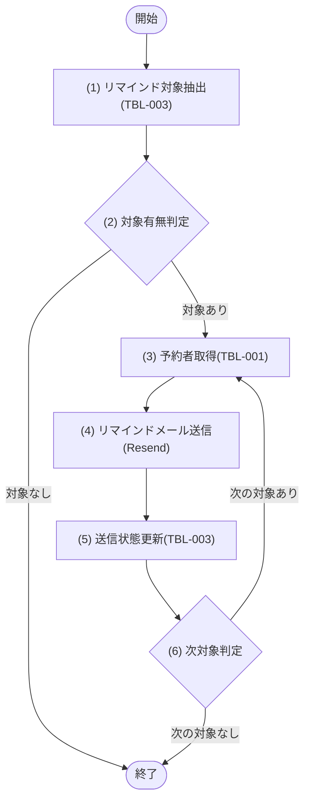

## 1. 基本情報

| 項目 | 内容 |
|---|---|
| モジュールID | MOD-006 |
| モジュール名 | 通知サービス(NotificationService) |
| 種別 | Service |
| 概要 | 予約開始前のリマインド対象を抽出し、予約者へ Resend でメール送信して送信状態を更新する |

## 2. 責務

| No | 責務 |
|---|---|
| 1 | リマインド対象予約(開始前・未送信)の抽出 |
| 2 | 予約者へのリマインドメール送信(外部サービス Resend を利用) |
| 3 | 送信結果に応じた予約のリマインド送信状態(REMIND_STATUS)の更新 |

## 3. 公開インターフェース

| メソッド名 | 概要 | 入力 | 出力 | 例外・エラー |
|---|---|---|---|---|
| sendReminders | リマインド対象を抽出しメール送信、送信状態を更新する | リマインド閾値分:leadMinutes | 送信結果(送信件数:sentCount, 失敗件数:failedCount) | - |

## 4. 処理フロー

sendReminders の内部処理フローを定義する。抽出した対象予約を1件ずつ処理する(予約者取得→メール送信→送信状態更新)。

### sendReminders

## 5. 処理詳細

### sendReminders

#### (1) リマインド対象抽出

T_RESERVATIONS(TBL-003)から、STATUS=1(予約済) AND REMIND_STATUS=1(未送信) AND 開始時刻が「現在時刻 ＜＝ START_AT ＜＝ 現在時刻＋leadMinutes」の範囲にある予約を抽出する(IDX_RESERVATIONS_REMIND を利用)。STATUS は TBL-003/ENM-1、REMIND_STATUS は TBL-003/ENM-2。該当が無い場合は 0件を返す。

| MOD-ID | 処理名 |
|---|---|
| なし | - |

| 引数項目 | 値 |
|---|---|
| リマインド閾値分 | 引数.leadMinutes |
| 基準時刻 | 現在時刻(UTC) |

#### (2) 対象有無判定

条件定義:

| No | 判定対象 | 条件 |
|---|---|---|
| 条件(1) | (1) リマインド対象抽出の結果 | 件数 ＞ 0 |

条件分岐マトリクス:

| 条件・処理 | #1 対象あり | #2 対象なし |
|---|---|---|
| 条件(1) | ◯ | × |
| 処理 |  |  |
| (3) 予約者取得へ進む | ◯ | - |
| 終了する | - | ◯ |

| 論理名 | 物理名 | 設定値 |
|---|---|---|
| なし | - | - |

#### (3) 予約者取得

処理中の対象予約の USER_ID から、M_USERS(TBL-001)の予約者を取得し、ユーザー名(NAME)・メールアドレス(EMAIL)を得る。該当が無い場合は NULL を返し、当該予約はメール送信をスキップして (5) で失敗として更新する。

| MOD-ID | 処理名 |
|---|---|
| なし | - |

| 引数項目 | 値 |
|---|---|
| ユーザーID | (1) リマインド対象抽出の結果.対象予約.USER_ID |

#### (4) リマインドメール送信

(3) 予約者取得の結果の EMAIL 宛に、外部サービス Resend の送信API を用いてリマインドメール(予約タイトル・会議室・開始日時を含む)を送信する。送信の成否(成功/失敗)を得る。

| MOD-ID | 処理名 |
|---|---|
| なし | - |

| 引数項目 | 値 |
|---|---|
| 宛先メールアドレス | (3) 予約者取得の結果.EMAIL |
| 宛先ユーザー名 | (3) 予約者取得の結果.NAME |
| 対象予約 | (1) リマインド対象抽出の結果.対象予約(タイトル・会議室ID・開始日時) |

#### (5) 送信状態更新

(4) リマインドメール送信の結果に応じ、T_RESERVATIONS(TBL-003)の対象予約の REMIND_STATUS を更新する(TBL-003/ENM-2)。1件ごとに更新をコミットし、1件の失敗が他の対象に波及しないようにする。

条件定義:

| No | 判定対象 | 条件 |
|---|---|---|
| 条件(1) | (4) リマインドメール送信の結果 | 送信成功 |

条件分岐マトリクス:

| 条件・処理 | #1 送信成功 | #2 送信失敗 |
|---|---|---|
| 条件(1) | ◯ | × |
| 処理 |  |  |
| REMIND_STATUS=2(送信済) に更新する | ◯ | - |
| REMIND_STATUS=3(失敗) に更新する | - | ◯ |

| 論理名 | 物理名 | 設定値 |
|---|---|---|
| 対象予約(TBL-003) | REMIND_STATUS | 送信成功=2(送信済) / 送信失敗=3(失敗) |

#### (6) 次対象判定

条件定義:

| No | 判定対象 | 条件 |
|---|---|---|
| 条件(1) | (1) リマインド対象抽出の結果 | 未処理の対象予約が残っている |

条件分岐マトリクス:

| 条件・処理 | #1 次あり | #2 次なし |
|---|---|---|
| 条件(1) | ◯ | × |
| 処理 |  |  |
| (3) 予約者取得へ戻る | ◯ | - |
| 終了する | - | ◯ |

| 論理名 | 物理名 | 設定値 |
|---|---|---|
| 送信結果 | sentCount / failedCount | 送信済に更新した件数 / 失敗に更新した件数 |

## 6. トランザクション・排他制御

| 項目 | 内容 |
|---|---|
| トランザクション境界 | 対象予約1件ごとに (5) 送信状態更新のみを短いトランザクションでコミットする(全体を1トランザクションにしない) |
| 排他制御 | なし |

## 7. データアクセス

| テーブル | C | R | U | D | 用途 |
|---|---|---|---|---|---|
| TBL-003 |  | ✓ | ✓ |  | リマインド対象の抽出・送信状態(REMIND_STATUS)の更新 |
| TBL-001 |  | ✓ |  |  | 予約者の氏名・メールアドレスの取得 |

## 8. エラー・例外

| 条件 | エラー | 対応 |
|---|---|---|
| メール送信失敗・予約者取得不可 | - | 例外を送出せず、当該予約の REMIND_STATUS を 3(失敗) に更新して次の対象を処理する |
