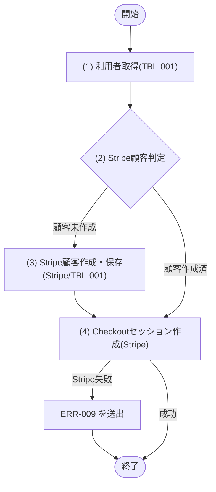
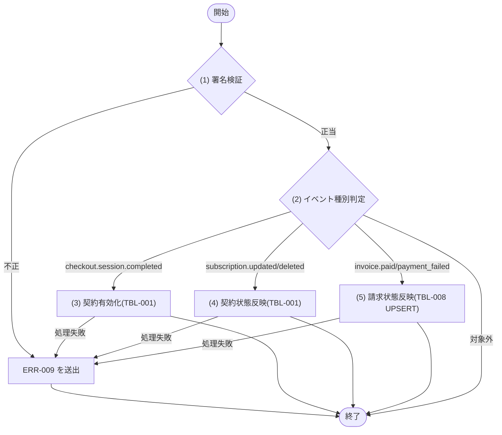
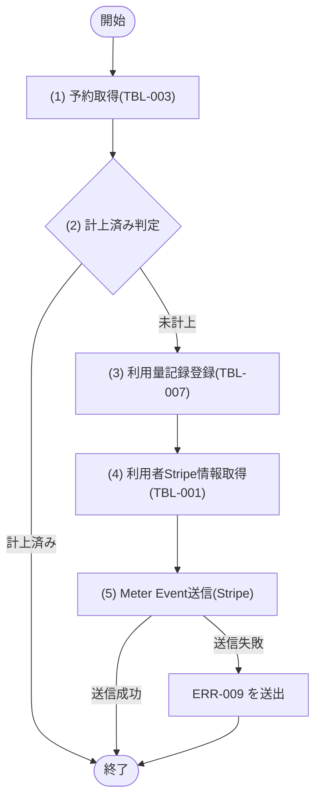

## 1. 基本情報

| 項目 | 内容 |
|---|---|
| モジュールID | MOD-007 |
| モジュール名 | 課金サービス(BillingService) |
| 種別 | Service |
| 概要 | Stripe 従量課金の支払い方法登録(Checkout)、Webhook 処理による契約・請求状態の反映、完了予約の利用量計上(Meter Event 送信)、当月利用量・請求の取得を行う |

## 2. 責務

| No | 責務 |
|---|---|
| 1 | 利用者の課金契約状態(BILLING_STATUS)が有効かの確認 |
| 2 | 支払い方法登録用の Stripe Checkout(subscription)セッションの作成 |
| 3 | Stripe Webhook(署名検証・冪等)の処理と契約状態・請求状態の反映 |
| 4 | 完了した有料予約の利用量記録と Stripe Meter Event(usage)の送信 |
| 5 | 当月の利用量・請求見込みと請求履歴の取得 |

## 3. 公開インターフェース

| メソッド名 | 概要 | 入力 | 出力 | 例外・エラー |
|---|---|---|---|---|
| ensureBillingActive | 利用者の課金契約が有効かを確認する | ユーザーID:userId | なし(有効時のみ正常復帰) | ERR-008 相当 |
| createCheckoutSession | 支払い方法登録用の Checkout セッションを作成する | ユーザーID:userId | CheckoutSession(セッションURL:url) | ERR-009 相当 |
| handleWebhook | Stripe Webhook を検証し契約・請求状態を反映する | 署名:signature, ペイロード:payload | なし | ERR-009 相当 |
| reportUsage | 完了した有料予約の利用量を計上し Meter Event を送信する | 予約ID:reservationId, 適用単価:unitPrice | UsageRecord | ERR-009 相当 |
| getBillingUsage | 対象月(未指定時は当月)の利用量・請求見込みと請求履歴を取得する | ユーザーID:userId, 対象月:targetMonth('YYYY-MM'), ページ:page, 取得件数:limit | BillingUsage(対象月利用量, 請求見込み, 請求履歴一覧, 請求履歴総件数) | - |

## 4. 処理フロー

公開メソッドごとに、内部処理の基本フローをフローチャートで定義する。ensureBillingActive は契約状態の判定のみ、getBillingUsage は当月利用量集計と請求履歴取得のみで、いずれも §5 に記載する。

### createCheckoutSession

### handleWebhook

### reportUsage

## 5. 処理詳細

### ensureBillingActive

#### (1) 利用者取得

M_USERS(TBL-001)から userId 一致かつ DELETED_AT IS NULL の利用者を取得し、BILLING_STATUS を得る。該当が無い場合は NULL を返す。

| MOD-ID | 処理名 |
|---|---|
| なし | - |

| 引数項目 | 値 |
|---|---|
| ユーザーID | 引数.userId |

#### (2) 契約状態判定

利用者の課金契約状態が有効(BILLING_STATUS=2)かを判定する(TBL-001/ENM-2)。未契約(1)・停止(3)・利用者不存在は ERR-008 を送出する。有効時は何も返さず正常復帰する。

条件定義:

| No | 判定対象 | 条件 |
|---|---|---|
| 条件(1) | (1) 利用者取得の結果 | != NULL |
| 条件(2) | (1) 利用者取得の結果.BILLING_STATUS | = 2(有効) |

条件分岐マトリクス:

| 条件・処理 | #1 有効 | #2 無効・不存在 |
|---|---|---|
| 条件(1) | ◯ | × |
| 条件(2) | ◯ | × |
| 処理 |  |  |
| 正常復帰する | ◯ | - |
| ERR-008 を送出する | - | ◯ |

| 論理名 | 物理名 | 設定値 |
|---|---|---|
| なし | - | - |

### createCheckoutSession

#### (1) 利用者取得

M_USERS(TBL-001)から userId の利用者を取得し、EMAIL・STRIPE_CUSTOMER_ID を得る。該当が無い場合は NULL を返す。

| MOD-ID | 処理名 |
|---|---|
| なし | - |

| 引数項目 | 値 |
|---|---|
| ユーザーID | 引数.userId |

#### (2) Stripe顧客判定

(1) 利用者取得の結果の STRIPE_CUSTOMER_ID の有無で、Stripe 顧客の新規作成要否を判定する。

条件定義:

| No | 判定対象 | 条件 |
|---|---|---|
| 条件(1) | (1) 利用者取得の結果.STRIPE_CUSTOMER_ID | != NULL |

条件分岐マトリクス:

| 条件・処理 | #1 顧客作成済 | #2 顧客未作成 |
|---|---|---|
| 条件(1) | ◯ | × |
| 処理 |  |  |
| (3) Stripe顧客作成・保存を実行する | - | ◯ |
| (4) Checkoutセッション作成へ進む | ◯ | ◯ |

| 論理名 | 物理名 | 設定値 |
|---|---|---|
| なし | - | - |

#### (3) Stripe顧客作成・保存

Stripe に Customer を新規作成し(EMAIL を紐付け)、生成された顧客IDを M_USERS(TBL-001)の STRIPE_CUSTOMER_ID に保存する。Stripe 連携に失敗した場合は ERR-009 を送出する。

| MOD-ID | 処理名 |
|---|---|
| なし | - |

| 引数項目 | 値 |
|---|---|
| メールアドレス | (1) 利用者取得の結果.EMAIL |

#### (4) Checkoutセッション作成

Stripe Checkout セッションを mode=subscription(従量課金サブスクリプション価格)で作成し、対象顧客(STRIPE_CUSTOMER_ID)に紐付ける。生成されたセッションURLを返す。Stripe 連携に失敗した場合は ERR-009 を送出する。

| MOD-ID | 処理名 |
|---|---|
| なし | - |

| 引数項目 | 値 |
|---|---|
| Stripe顧客ID | (1) 利用者取得の結果.STRIPE_CUSTOMER_ID または (3) の保存値 |

| 論理名 | 物理名 | 設定値 |
|---|---|---|
| Checkoutセッション | CheckoutSession | (4) で生成した Checkout セッションのURL |

### handleWebhook

#### (1) 署名検証

Stripe-Signature 署名(引数.signature)と生ペイロード(引数.payload)を Stripe の署名検証で検証する。検証に失敗した場合は ERR-009 を送出する。成功時はイベント(種別・データ)を取り出す。

| MOD-ID | 処理名 |
|---|---|
| なし | - |

| 引数項目 | 値 |
|---|---|
| 署名 | 引数.signature |
| ペイロード | 引数.payload |

#### (2) イベント種別判定

(1) 署名検証の結果のイベント種別で処理を振り分ける。対象外の種別は何もせず正常復帰する(冪等)。

条件分岐マトリクス:

| 条件・処理 | #1 契約有効化 | #2 契約状態変更 | #3 請求状態変更 | #4 対象外 |
|---|---|---|---|---|
| event.type = checkout.session.completed | ◯ | - | - | - |
| event.type = customer.subscription.updated / deleted | - | ◯ | - | - |
| event.type = invoice.paid / invoice.payment_failed | - | - | ◯ | - |
| 上記以外 | - | - | - | ◯ |
| 処理 |  |  |  |  |
| (3) 契約有効化を実行する | ◯ | - | - | - |
| (4) 契約状態反映を実行する | - | ◯ | - | - |
| (5) 請求状態反映を実行する | - | - | ◯ | - |
| 何もせず正常復帰する | - | - | - | ◯ |

| 論理名 | 物理名 | 設定値 |
|---|---|---|
| なし | - | - |

#### (3) 契約有効化

checkout.session.completed イベントの顧客(STRIPE_CUSTOMER_ID)に対応する M_USERS(TBL-001)の利用者を特定し、BILLING_STATUS=2(有効)に更新し、STRIPE_SUBSCRIPTION_ID を保存する(TBL-001/ENM-2)。処理失敗時は ERR-009 を送出する。

| MOD-ID | 処理名 |
|---|---|
| なし | - |

| 引数項目 | 値 |
|---|---|
| Stripe顧客ID | (1) 署名検証の結果.顧客ID |
| StripeサブスクリプションID | (1) 署名検証の結果.サブスクリプションID |

| 論理名 | 物理名 | 設定値 |
|---|---|---|
| 利用者(TBL-001) | BILLING_STATUS / STRIPE_SUBSCRIPTION_ID | BILLING_STATUS=2(有効) / サブスクリプションID |

#### (4) 契約状態反映

customer.subscription.updated / deleted イベントに応じ、対応する M_USERS(TBL-001)の BILLING_STATUS を反映する(TBL-001/ENM-2)。処理失敗時は ERR-009 を送出する。

条件分岐マトリクス:

| 条件・処理 | #1 有効 | #2 停止 |
|---|---|---|
| サブスクリプション状態 = active(updated) | ◯ | - |
| サブスクリプション状態 = deleted / 支払い不能・解約 | - | ◯ |
| 処理 |  |  |
| BILLING_STATUS=2(有効) に更新する | ◯ | - |
| BILLING_STATUS=3(停止) に更新する | - | ◯ |

| 論理名 | 物理名 | 設定値 |
|---|---|---|
| 利用者(TBL-001) | BILLING_STATUS | active=2(有効) / deleted等=3(停止) |

#### (5) 請求状態反映

invoice.paid / invoice.payment_failed イベントの Stripe請求ID(STRIPE_INVOICE_ID)で T_INVOICES(TBL-008)を UPSERT する(UX_INVOICES_STRIPE により1請求1行。既存があれば STATUS を更新、無ければ USER_ID・BILLING_PERIOD・AMOUNT とともに INSERT)。冪等に処理する。処理失敗時は ERR-009 を送出する。STATUS は TBL-008/ENM-1。

条件分岐マトリクス:

| 条件・処理 | #1 支払済 | #2 支払失敗 |
|---|---|---|
| event.type = invoice.paid | ◯ | - |
| event.type = invoice.payment_failed | - | ◯ |
| 処理 |  |  |
| STATUS=3(支払済) で UPSERT する | ◯ | - |
| STATUS=4(失敗) で UPSERT する | - | ◯ |

| 論理名 | 物理名 | 設定値 |
|---|---|---|
| 請求(TBL-008) | STATUS | invoice.paid=3(支払済) / invoice.payment_failed=4(失敗) |

### reportUsage

#### (1) 予約取得

T_RESERVATIONS(TBL-003)から reservationId の予約を取得し、USER_ID・ROOM_ID・START_AT・END_AT を得る。該当が無い場合は NULL を返す。

| MOD-ID | 処理名 |
|---|---|
| なし | - |

| 引数項目 | 値 |
|---|---|
| 予約ID | 引数.reservationId |

#### (2) 計上済み判定

T_USAGE_RECORDS(TBL-007)に同一 RESERVATION_ID の記録が既に存在するかを判定し、二重計上を防止する(UX_USAGE_RECORDS_RESERVATION)。既存があれば何もせず正常復帰する(冪等)。

条件定義:

| No | 判定対象 | 条件 |
|---|---|---|
| 条件(1) | T_USAGE_RECORDS の RESERVATION_ID 一致件数 | 件数 = 0 |

条件分岐マトリクス:

| 条件・処理 | #1 未計上 | #2 計上済み |
|---|---|---|
| 条件(1) | ◯ | × |
| 処理 |  |  |
| (3) 利用量記録登録へ進む | ◯ | - |
| 正常復帰する | - | ◯ |

| 論理名 | 物理名 | 設定値 |
|---|---|---|
| なし | - | - |

#### (3) 利用量記録登録

(1) 予約取得の結果の START_AT・END_AT から利用時間(分)= `CAST((julianday(END_AT)-julianday(START_AT))*24*60 AS INTEGER)` を算出し、金額(参考)= 利用時間 ÷ 60 × unitPrice を計算する。T_USAGE_RECORDS(TBL-007)に INSERT する(UNIT_PRICE=引数.unitPrice=利用時点の会議室単価、STATUS=1(未送信))。STATUS は TBL-007/ENM-1。

| MOD-ID | 処理名 |
|---|---|
| なし | - |

| 引数項目 | 値 |
|---|---|
| 予約ID | 引数.reservationId |
| ユーザーID | (1) 予約取得の結果.USER_ID |
| 会議室ID | (1) 予約取得の結果.ROOM_ID |
| 利用時間分 | (1) 予約取得の結果から算出した利用時間(分) |
| 適用単価 | 引数.unitPrice |
| 金額 | 利用時間 ÷ 60 × 引数.unitPrice |

#### (4) 利用者Stripe情報取得

(1) 予約取得の結果の USER_ID から M_USERS(TBL-001)の STRIPE_CUSTOMER_ID・STRIPE_SUBSCRIPTION_ID を取得する。

| MOD-ID | 処理名 |
|---|---|
| なし | - |

| 引数項目 | 値 |
|---|---|
| ユーザーID | (1) 予約取得の結果.USER_ID |

#### (5) Meter Event送信

Stripe に Meter Event(usage)を送信する。対象顧客((4) の STRIPE_CUSTOMER_ID)に、利用量(値=利用時間(分))を計上する。送信成功時は T_USAGE_RECORDS(TBL-007)の STRIPE_METER_EVENT_ID を保存し STATUS=2(送信済)に更新する。送信失敗時は STATUS=3(失敗)に更新し、ERR-009 を送出する(記録は残し JOB での再送対象とする)。STATUS は TBL-007/ENM-1。

| MOD-ID | 処理名 |
|---|---|
| なし | - |

| 引数項目 | 値 |
|---|---|
| Stripe顧客ID | (4) 利用者Stripe情報取得の結果.STRIPE_CUSTOMER_ID |
| 利用量 | (3) 利用量記録登録の利用時間(分) |

条件分岐マトリクス:

| 条件・処理 | #1 送信成功 | #2 送信失敗 |
|---|---|---|
| Meter Event 送信結果 = 成功 | ◯ | × |
| 処理 |  |  |
| STRIPE_METER_EVENT_ID 保存・STATUS=2(送信済) に更新する | ◯ | - |
| STATUS=3(失敗) に更新し ERR-009 を送出する | - | ◯ |

| 論理名 | 物理名 | 設定値 |
|---|---|---|
| 利用量記録 | UsageRecord | (3)(5) で登録・更新した利用量記録 |

### getBillingUsage

#### (1) 対象月利用量集計

T_USAGE_RECORDS(TBL-007)を RESERVATION_ID で T_RESERVATIONS(TBL-003)に結合し、USER_ID 一致かつ対象月(引数.targetMonth。未指定時は当月)の記録の USAGE_MINUTES・AMOUNT を集計し、対象月の利用量(合計利用時間)と請求見込み(合計金額。AMOUNT の合計)を求める。対象月の判定は、利用実績集計(SQL-002)と同様に予約の START_AT を Asia/Tokyo(+9時間)に変換した年月で行う(利用は予約の利用月に帰属)。

| MOD-ID | 処理名 |
|---|---|
| なし | - |

| 引数項目 | 値 |
|---|---|
| ユーザーID | 引数.userId |
| 対象月 | 引数.targetMonth(未指定時は当月。Asia/Tokyo 基準) |

#### (2) 請求履歴取得

T_INVOICES(TBL-008)から USER_ID 一致の請求を BILLING_PERIOD 降順で取得し、page / limit でページネーション(API-COM §5)を適用する。総件数も併せて求める。対象月利用量・請求見込みと請求履歴・総件数をまとめて返す。分岐・エラーはない。

| MOD-ID | 処理名 |
|---|---|
| なし | - |

| 引数項目 | 値 |
|---|---|
| ユーザーID | 引数.userId |
| ページ | 引数.page |
| 取得件数 | 引数.limit |

| 論理名 | 物理名 | 設定値 |
|---|---|---|
| 課金利用状況 | BillingUsage | 対象月利用量・請求見込み((1) の結果)と請求履歴一覧・総件数((2) の結果) |

## 6. トランザクション・排他制御

| 項目 | 内容 |
|---|---|
| トランザクション境界 | createCheckoutSession の Stripe顧客IDの保存、handleWebhook の各イベント反映、reportUsage の利用量記録登録〜Meter Event送信状態更新を、それぞれ短いトランザクションでコミットする。ensureBillingActive・getBillingUsage は参照のみで更新トランザクションを持たない |
| 排他制御 | なし(reportUsage は UX_USAGE_RECORDS_RESERVATION、handleWebhook の請求は UX_INVOICES_STRIPE の一意制約で二重計上・二重処理を冪等に防止する) |

## 7. データアクセス

| テーブル | C | R | U | D | 用途 |
|---|---|---|---|---|---|
| TBL-001 |  | ✓ | ✓ |  | 課金契約状態・Stripe顧客/サブスクリプションIDの確認・更新 |
| TBL-003 |  | ✓ |  |  | 完了予約(利用時間算出)の取得 |
| TBL-007 | ✓ | ✓ | ✓ |  | 利用量記録の登録・Meter Event 送信状態の更新・当月利用量の集計 |
| TBL-008 | ✓ | ✓ | ✓ |  | 請求の登録(UPSERT)・請求状態の反映・請求履歴の取得 |

## 8. エラー・例外

| 条件 | エラー | 対応 |
|---|---|---|
| 有料会議室の利用で課金契約が有効でない(ensureBillingActive) | ERR-008 | 例外を送出する(呼び出し元 MOD-003 で予約をロールバック) |
| Stripe 連携の失敗(Checkout 作成・Webhook 署名検証/反映・Meter Event 送信) | ERR-009 | 例外を送出しトランザクションをロールバックする。Meter Event 送信失敗時は TBL-007 の STATUS=3(失敗)を記録して再送対象とする |
