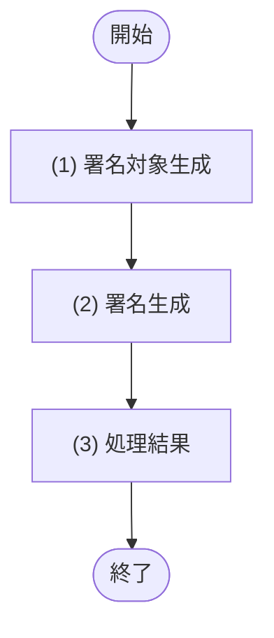
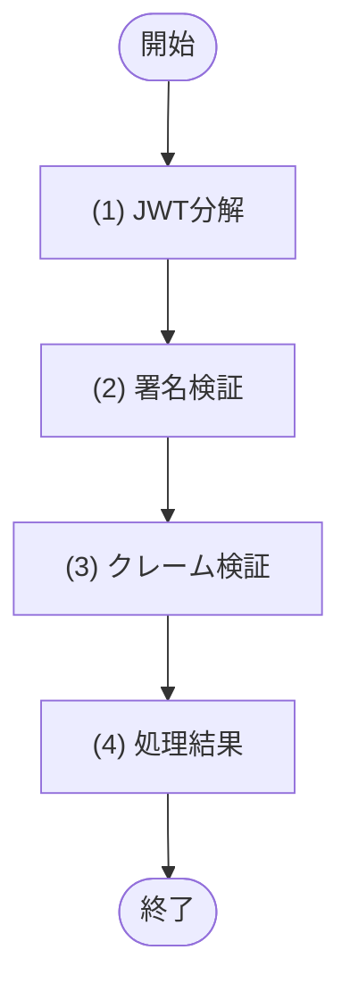
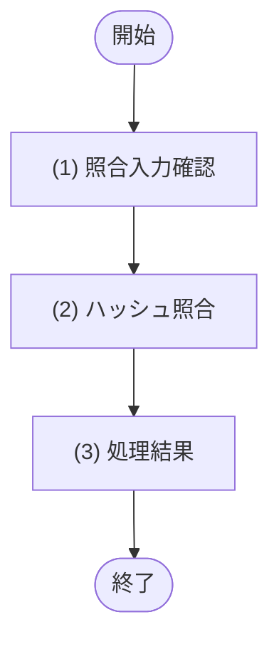

# 1. 基本情報

| 項目 | 内容 |
|---|---|
| モジュールID | MOD-008 |
| モジュール名 | 認証暗号サービス |
| 種別 | Utility |
| 概要 | JWT の発行・検証とパスワードハッシュ照合を行う。外部ライブラリ・標準実行基盤APIの利用は本モジュールに集約する |

# 2. 責務

| No | 責務 |
|---|---|
| 1 | JWT の署名生成と認証トークンの発行 |
| 2 | JWT の署名・有効期限・必須クレームの検証 |
| 3 | bcrypt ハッシュと平文パスワードの照合 |
| 4 | 外部ライブラリ・標準実行基盤API由来の例外を認証処理で扱える結果へ変換 |

# 3. インターフェース

## (1) JWT発行処理

### 1. 概要

認証済み利用者を主体として JWT を発行する処理。

### 2. 入力

| 入力項目 | データ型 | 説明 |
|---|---|---|
| ユーザーID | Integer | 認証主体となるユーザーID |
| ロール | Integer | 認証主体のロール(TBL-001/ENM-1。1=一般、2=管理者) |

### 3. 出力

| 出力項目 | データ型 | 説明 |
|---|---|---|
| 認証トークン | Object | 発行した JWT・有効期限・ユーザーID・ロール |
| - トークン | String | 発行した JWT 文字列 |
| - 有効期限 | String | トークン有効期限(ISO8601形式) |
| - ユーザーID | Integer | ユーザーID |
| - ロール | Integer | ロール(TBL-001/ENM-1。1=一般、2=管理者) |

### 4. 例外

| エラーID | 説明 |
|---|---|
| ERR-001 | JWT の発行に失敗した |

### 5. 処理フロー

### 6. 処理詳細

#### (1) 署名対象生成処理

JWT のヘッダ・ペイロードを生成し、署名対象を作成する。

| 参照項目 | 値 |
|---|---|
| ユーザーID | 引数.ユーザーID |
| ロール | 引数.ロール(TBL-001/ENM-1。1=一般、2=管理者) |
| 有効期限 | 発行時刻+24時間 |

| 項目名 | データ型 | 値 | 説明 |
|---|---|---|---|
| 署名対象 | Object | HS256 のヘッダと、ユーザーID・ロール・発行日時・有効期限を含むペイロード | 署名生成に渡す中間生成物 |

#### (2) 署名生成処理

Workers Secrets の JWT 署名秘密鍵を用いて署名を生成する。

| 利用ライブラリ/基盤 | 用途 |
|---|---|
| Cloudflare Workers Web Crypto API(`crypto.subtle`) | HS256(HMAC-SHA-256) による署名生成 |

| 引数項目 | 値 |
|---|---|
| 署名対象 | (1) 署名対象生成の結果 |
| 署名秘密鍵 | Workers Secrets に登録した JWT 署名秘密鍵 |

#### (3) 処理結果

署名結果を JWT 形式に整形し、呼び出し元へ返す項目を定義する。

| 項目名 | データ型 | 値 | 説明 |
|---|---|---|---|
| 認証トークン | Object | 発行した JWT・有効期限・ユーザーID・ロール | 呼び出し元へ返す認証情報 |
| - トークン | String | (2) 署名生成の結果 | 発行した JWT 文字列 |
| - 有効期限 | String | (1) 署名対象生成の結果 | トークン有効期限 |
| - ユーザーID | Integer | 引数.ユーザーID | 認証主体のユーザーID |
| - ロール | Integer | 引数.ロール | 認証主体のロール(TBL-001/ENM-1) |

## (2) JWT検証処理

### 1. 概要

検証対象の JWT の署名・有効期限・必須クレームを検証し、認証主体に利用できる検証結果を返す処理。

### 2. 入力

| 入力項目 | データ型 | 説明 |
|---|---|---|
| トークン | String | 検証対象の JWT |

### 3. 出力

| 出力項目 | データ型 | 説明 |
|---|---|---|
| JWT検証結果 | Object | JWT の検証結果 |
| - 有効 | Boolean | 署名・有効期限・必須クレームが正当か |
| - ユーザーID | Integer | ペイロードから取得したユーザーID |
| - ロール | Integer | ペイロードから取得したロール(TBL-001/ENM-1。1=一般、2=管理者) |

### 4. 例外

| エラーID | 説明 |
|---|---|
| なし | - |

### 5. 処理フロー

### 6. 処理詳細

#### (1) JWT分解処理

JWT をヘッダ・ペイロード・署名に分解する。

| 参照項目 | 値 |
|---|---|
| トークン | 引数.トークン |

| 検証項目 | 検証内容 |
|---|---|
| JWT形式 | ヘッダ・ペイロード・署名の3要素に分割できる |
| 署名方式 | ヘッダの `alg` が HS256 である |

#### (2) 署名検証処理

Workers Secrets の JWT 署名秘密鍵を用いて署名を検証する。

| 利用ライブラリ/基盤 | 用途 |
|---|---|
| Cloudflare Workers Web Crypto API(`crypto.subtle`) | HS256(HMAC-SHA-256) による署名検証 |

| 引数項目 | 値 |
|---|---|
| 署名対象 | (1) JWT分解の結果 |
| 署名 | (1) JWT分解の結果 |
| 署名秘密鍵 | Workers Secrets に登録した JWT 署名秘密鍵 |

#### (3) クレーム検証処理

JWT の必須クレームと有効期限を検証する。

| 検証項目 | 検証内容 |
|---|---|
| 有効期限 | ペイロードの `exp` が現在時刻以上である |
| 必須クレーム | `sub`(ユーザーID) と `role`(ロール) が存在する |
| ロール値 | `role` が TBL-001/ENM-1 のユーザーロール(1=一般、2=管理者)に含まれる |

#### (4) 処理結果

署名検証とクレーム検証の結果を呼び出し元へ返す項目として定義する。

| 項目名 | データ型 | 値 | 説明 |
|---|---|---|---|
| JWT検証結果 | Object | JWT の検証結果 | 例外を送出せず、有効/無効と認証主体情報を返す |
| - 有効 | Boolean | (2) 署名検証の結果 AND (3) クレーム検証の結果 | 無効な JWT の場合は false |
| - ユーザーID | Integer | (1) JWT分解の結果 | 有効な場合のみ設定する認証主体のユーザーID |
| - ロール | Integer | (1) JWT分解の結果 | 有効な場合のみ設定する認証主体のロール(TBL-001/ENM-1) |

## (3) パスワード照合処理

### 1. 概要

入力された平文パスワードと保存済みの bcrypt ハッシュを照合する処理。

### 2. 入力

| 入力項目 | データ型 | 説明 |
|---|---|---|
| パスワード | String | 入力された平文パスワード |
| パスワードハッシュ | String | 保存済みの bcrypt ハッシュ |

### 3. 出力

| 出力項目 | データ型 | 説明 |
|---|---|---|
| 照合結果 | Boolean | パスワードが一致する場合 true |

### 4. 例外

| エラーID | 説明 |
|---|---|
| なし | - |

### 5. 処理フロー

### 6. 処理詳細

#### (1) 照合入力確認処理

パスワード照合に必要な入力が揃っているかを確認する。

| 参照項目 | 値 |
|---|---|
| パスワード | 引数.パスワード |
| パスワードハッシュ | 引数.パスワードハッシュ |

#### (2) ハッシュ照合処理

bcrypt 互換の照合処理で、平文パスワードと保存済みハッシュを比較する。

| 利用ライブラリ/基盤 | 用途 |
|---|---|
| bcryptjs | bcrypt ハッシュ照合 |

| 引数項目 | 値 |
|---|---|
| パスワード | 引数.パスワード |
| パスワードハッシュ | 引数.パスワードハッシュ |

#### (3) 処理結果

ハッシュ照合の結果を呼び出し元へ返す項目として定義する。

| 項目名 | データ型 | 値 | 説明 |
|---|---|---|---|
| 照合結果 | Boolean | (2) ハッシュ照合の結果 | 照合不可または不一致の場合は false |

# 4. トランザクション・排他制御

| 項目 | 内容 |
|---|---|
| トランザクション境界 | なし(DB 更新を伴わない) |
| 排他制御 | なし |

# 5. データアクセス

| テーブル | C | R | U | D | 用途 |
|---|---|---|---|---|---|
| なし | - | - | - | - | - |

# 6. エラー・例外

| 条件 | エラー | 対応 |
|---|---|---|
| JWT 発行に失敗した | ERR-001 | 例外を送出する |
| JWT が無効・改ざん・期限切れ | なし | JWT検証結果.有効=false を返す |
| パスワード照合不可または不一致 | なし | 照合結果=false を返す |

# 7. 利用ライブラリ/基盤

| 利用ライブラリ/基盤 | 用途 | 管理方針 |
|---|---|---|
| Cloudflare Workers Web Crypto API(`crypto.subtle`) | HS256(HMAC-SHA-256) による JWT 署名生成・署名検証 | Cloudflare Workers 標準基盤として利用する。秘密鍵は Workers Secrets で管理する |
| bcryptjs | bcrypt ハッシュ照合 | 実装時に依存バージョンを固定し、API・JOB・他モジュールから直接 import しない |
