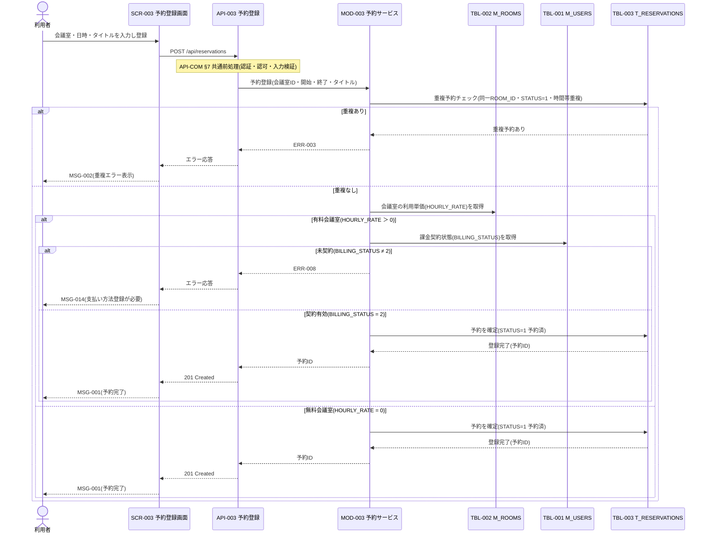

## 1. 基本情報

| 項目 | 内容 |
|---|---|
| シーケンスID | SEQ-001 |
| シーケンス名 | 会議室予約登録シーケンス |
| 概要 | 利用者が予約登録画面から会議室を予約する際の連携。重複予約チェックと、有料会議室の場合の支払い方法(従量契約)確認を経て予約を確定する。 |
| 契機 | 利用者操作(予約登録画面での登録) |
| 関連要素 | SCR-003, API-003, MOD-003, TBL-001, TBL-002, TBL-003 |

## 2. 登場要素

| 要素 | 種別 | ID/参照 | 役割 |
|---|---|---|---|
| 利用者 | アクター | - | 予約を登録する一般ユーザー／管理者 |
| 予約登録画面 | 画面 | SCR-003 | 予約内容の入力・登録操作・結果表示 |
| 予約登録API | API | API-003 | 予約登録リクエストの受付・応答 |
| 予約サービス | モジュール | MOD-003 | 重複判定・有料契約確認・予約確定 |
| ユーザーマスタ | テーブル | TBL-001 | 会議室が有料の場合の課金契約状態(BILLING_STATUS)参照 |
| 会議室マスタ | テーブル | TBL-002 | 会議室の利用単価(HOURLY_RATE)参照(有料判定) |
| 予約トランザクション | テーブル | TBL-003 | 重複予約の判定・予約レコードの確定 |

## 3. シーケンス図

## 4. ステップ説明

| No | 送信元 → 送信先 | 内容 |
|---|---|---|
| 1 | 利用者 → SCR-003 | 会議室・利用日時・タイトルを入力し登録操作を行う |
| 2 | SCR-003 → API-003 | 予約登録リクエストを送信する |
| 3 | API-003 | API-COM §7 の共通前処理(認証・認可・入力検証)を実行する |
| 4 | API-003 → MOD-003 | 予約登録処理を呼び出す |
| 5 | MOD-003 → TBL-003 | 同一会議室・予約済(STATUS=1)・時間帯重複の予約有無を判定する |
| 6 | MOD-003 → TBL-002 | 会議室の利用単価を取得し有料/無料を判定する |
| 7 | MOD-003 → TBL-001 | 有料の場合、利用者の課金契約状態(BILLING_STATUS)を確認する |
| 8 | MOD-003 → TBL-003 | 判定を通過した予約を STATUS=1(予約済)で確定する |
| 9 | API-003 → SCR-003 → 利用者 | 予約完了(MSG-001)を表示する。予約は即確定し決済でブロックしない |

## 5. 例外・代替

| 分岐 | 分岐後の流れ |
|---|---|
| 時間帯が重複する予約が存在 | MOD-003 が ERR-003 を返し、SCR-003 は MSG-002 を表示する |
| 開始日時が過去 | MOD-003 が ERR-004 を返し、SCR-003 はエラーを表示する |
| 有料会議室かつ支払い方法未登録(BILLING_STATUS ≠ 2) | MOD-003 が ERR-008 を返し、SCR-003 は MSG-014 を表示し支払い方法登録(SCR-007)へ導線を示す |
