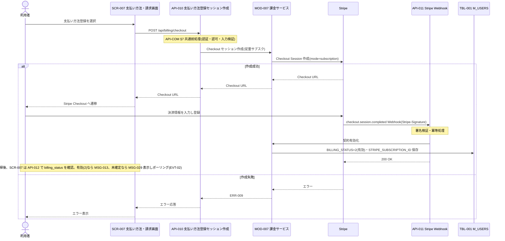

# 1. 基本情報

| 項目 | 内容 |
|---|---|
| シーケンスID | SEQ-004 |
| シーケンス名 | 支払い方法登録シーケンス |
| 概要 | 利用者が Stripe Checkout(従量サブスク)で支払い方法を登録する連携。Checkout 完了の Webhook を受けて課金契約状態を有効化し、サブスクリプションIDを保存する。 |
| 契機 | 利用者操作(支払い方法登録)／ Stripe Checkout 完了・Webhook 受信 |
| 関連要素 | SCR-007, API-010, API-011, MOD-007, TBL-001, Stripe |

# 2. 登場要素

| 要素 | 種別 | ID/参照 | 役割 |
|---|---|---|---|
| 利用者 | アクター | - | 支払い方法を登録する一般ユーザー／管理者 |
| 支払い方法・請求画面 | 画面 | SCR-007 | 支払い方法登録の操作・Checkout 遷移・結果表示 |
| 支払い方法登録API | API | API-010 | Checkout セッション作成の受付・応答 |
| Stripe Webhook | API | API-011 | Checkout 完了通知の受信(署名検証・冪等) |
| 課金サービス | モジュール | MOD-007 | Checkout セッション作成・契約有効化 |
| ユーザーマスタ | テーブル | TBL-001 | 課金契約状態(BILLING_STATUS)・サブスクリプションID の保存 |
| Stripe | 外部サービス | Stripe | Checkout(subscription)・決済情報の収集・Webhook 通知 |

# 3. シーケンス図

# 4. ステップ説明

| No | 送信元 → 送信先 | 内容 |
|---|---|---|
| 1 | 利用者 → SCR-007 | 支払い方法登録を選択する |
| 2 | SCR-007 → API-010 | Checkout セッション作成をリクエストする |
| 3 | API-010 → MOD-007 | Checkout セッション作成処理を呼び出す |
| 4 | MOD-007 → Stripe | 従量サブスク(mode=subscription)の Checkout Session を作成する |
| 5 | API-010 → SCR-007 → 利用者 | 返却された Checkout URL へ遷移する |
| 6 | 利用者 → Stripe | Stripe Checkout 上で決済情報を入力し登録する |
| 7 | Stripe → API-011 | checkout.session.completed の Webhook を送信する(Stripe-Signature) |
| 8 | API-011 → MOD-007 → TBL-001 | 署名検証・冪等処理のうえ BILLING_STATUS=2(有効)とサブスクリプションIDを保存する |
| 9 | SCR-007 → 利用者 | 登録完了(MSG-013)を表示する |

# 5. 例外・代替

| 分岐 | 分岐後の流れ |
|---|---|
| Checkout セッション作成失敗 | MOD-007 が ERR-009 を返し、SCR-007 はエラーを表示する |
| 利用者が Checkout を中断(cancel_url 復帰) | SCR-007 は完了メッセージを表示せず初期表示状態(未契約・登録ボタン活性)を維持する(EVT-04)。BILLING_STATUS は未契約(1)のまま変わらない(有料会議室予約時は ERR-008) |
| success_url 復帰時に Webhook 未達(契約未確定) | SCR-007 が API-012 で billing_status を確認し、未契約(1)のままなら MSG-029(処理中)を表示して一定間隔で API-012 を再取得(ポーリング。EVT-02)。有効(2)確認で MSG-013 表示 |
| ポーリング上限まで有効化されない(登録失敗) | SCR-007 は MSG-030(登録できなかった旨)を表示し、初期表示状態(未契約・登録ボタン活性)へ戻す(UC-008/EXC-1) |
| customer.subscription.updated/deleted Webhook 受信 | API-011 が署名検証のうえ BILLING_STATUS を有効(2)/停止(3)に更新する |
| 同一 Webhook の再送 | Stripe イベントを冪等に処理し、契約状態を二重更新しない |
