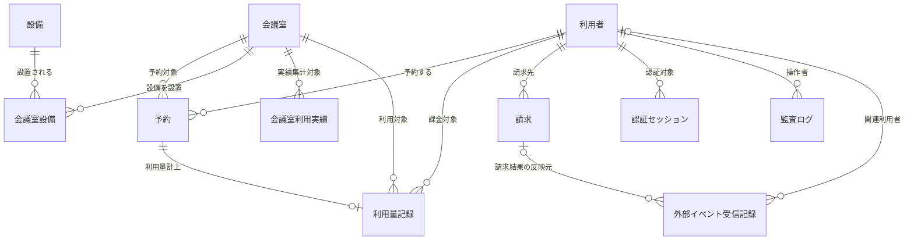

# 1. 概要

MeetRoom が取り扱う全エンティティと関連を概念レベル(論理名)で俯瞰する。

- 各エンティティ・属性・状態の正本は各 MDL 文書である。
- 本図は主要エンティティと関連のみを示す。
- 会議室と設備の多対多関係は 会議室設備(MDL-008) を介して表す。

# 2. 概念ER図



# 3. 関連一覧

親エンティティごとに、従属する子エンティティをツリーで示す。各子の末尾に多重度と関連の意味を添える。

```text
利用者(MDL-001)
├─ 予約(MDL-003) … 1:N（利用者は複数の予約を持つ）
├─ 利用量記録(MDL-006) … 1:N（利用者は複数の利用量記録を持つ）
├─ 請求(MDL-007) … 1:N（利用者は複数の請求を持つ）
├─ 認証セッション(MDL-009) … 1:N（利用者は複数の認証セッションを持つ）
├─ 監査ログ(MDL-010) … 1:N（利用者は複数の監査ログ(操作記録)を持つ）
└─ 外部イベント受信記録(MDL-011) … 0..1:N（識別できるイベントは関連利用者を持つ）

会議室(MDL-002)
├─ 予約(MDL-003) … 1:N（会議室は複数の予約を持つ）
├─ 会議室設備(MDL-008) … 1:N（会議室に複数の設備が設置される）
├─ 会議室利用実績(MDL-005) … 1:N（会議室×月の利用実績を集計する）
└─ 利用量記録(MDL-006) … 1:N（会議室は複数の利用量記録を持つ）

設備(MDL-004)
└─ 会議室設備(MDL-008) … 1:N（設備は複数の会議室に設置される）

予約(MDL-003)
└─ 利用量記録(MDL-006) … 1:0..1（完了予約ごとに利用量を1件計上する）

請求(MDL-007)
└─ 外部イベント受信記録(MDL-011) … 0..1:N（請求に関するイベントは対応する請求を持つ）
```
