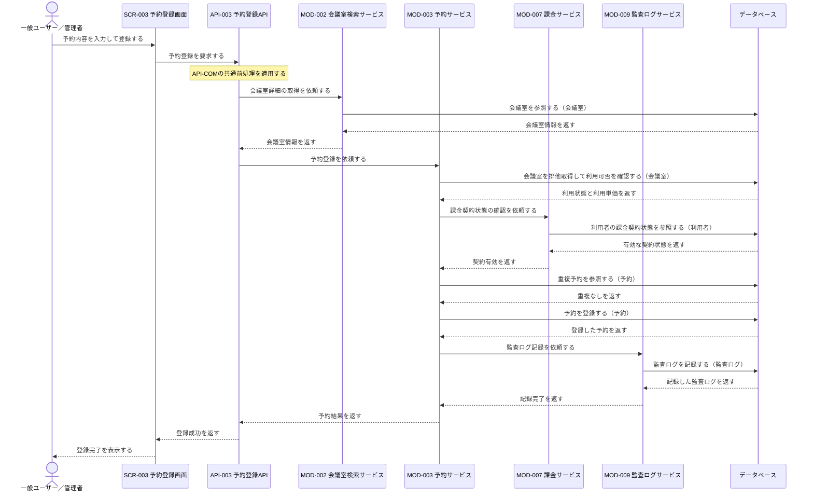
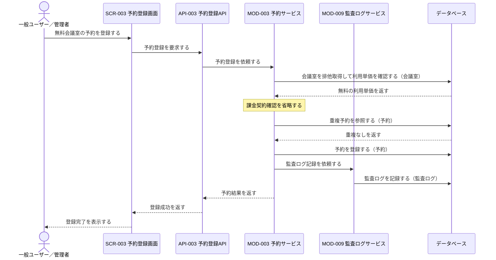
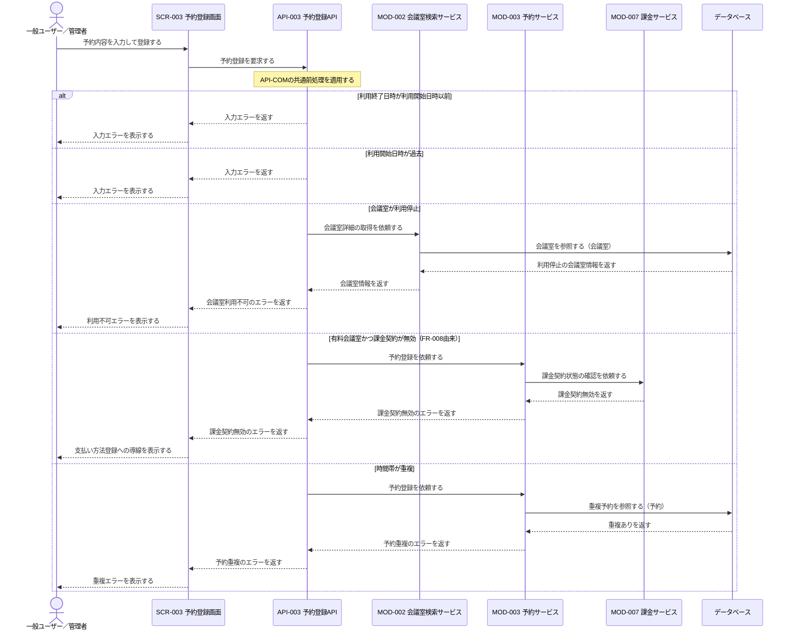

# 1. 基本情報

| 項目 | 内容 |
|---|---|
| シーケンスID | SEQ-001 |
| シーケンス名 | 会議室予約登録シーケンス |
| 目的 | 会議室の利用可否、入力の妥当性(利用日時・時刻関係)、課金契約、時間帯重複を確認し、登録可能な予約だけを確定する連携を、状態パターン(FR-002/UC-01)を網羅して明確にする。 |
| 対象範囲 | 開始: 利用者がSCR-003で予約登録を実行する / 終了: 予約確定またはエラー結果が利用者へ表示される |
| 作成単位 | UC単位／画面主要操作単位 |
| 契機 | 利用者操作（予約登録） |
| 関連機能要件ID | FR-002, FR-008 |
| 関連ユースケースID | FR-002/UC-01 |
| 事前条件 | 利用者がログイン済みで、登録済みの会議室、利用開始・終了日時、予約タイトルが指定されている。 |
| 事後条件 | 正常時は予約が予約済状態で登録され、利用者へ完了が表示される。例外時は予約を登録せず、再入力または支払い方法登録に必要な結果が表示される。 |
| 状態 | 確定 |

# 2. 構成要素

| 要素 | 種別 | ID/参照 | このシーケンスでの役割 |
|---|---|---|---|
| 一般ユーザー／管理者 | アクター | - | 予約内容を入力して登録し、結果を確認する |
| 予約登録画面 | UI | SCR-003 | 入力受付、API呼び出し、完了・エラー表示を行う |
| 予約登録API | API | API-003 | 共通前処理を行い、会議室確認と予約登録をモジュールへ委譲する |
| 会議室検索サービス | モジュール | MOD-002 | 会議室の存在・利用状態・利用単価を取得する |
| 予約サービス | モジュール | MOD-003 | 排他制御、利用可否・重複判定、予約登録を担う |
| 課金サービス | モジュール | MOD-007 | 有料会議室の場合に利用者の課金契約状態を確認する |
| 監査ログサービス | モジュール | MOD-009 | 予約登録の完了を監査ログに記録する（予約登録と同一トランザクション） |
| データベース | DB | MDL-001, MDL-002, MDL-003, MDL-010 | 利用者の課金契約状態、会議室の存在・利用状態・利用単価、予約の重複確認対象と確定予約、および重要操作の監査ログを保持する |

# 3. シーケンス

本シーケンスは予約登録の連携を扱い、会議室の利用可否・入力の妥当性(利用日時・時刻関係)・課金契約・時間帯重複を確認して、登録可能な予約だけを確定する。網羅する状態パターン(FR-002/UC-01)を示す。なお FR-002/UC-01/SP-2(空き会議室0件)は会議室検索シーケンス(SEQ-006)の対象範囲のため、本シーケンスの対象外とする。

| パターンID | 状態パターン(条件) | 本シーケンスでの表現 |
|---|---|---|
| FR-002/UC-01/SP-1 | 会議室=利用可・時間帯=空き・利用日時=現在以降・開始<終了 | 3.1 正常系(有料)／3.2 代替系(無料会議室) |
| FR-002/UC-01/SP-3 | 開始・終了時刻=開始≥終了 | 3.3 例外系「利用終了日時が利用開始日時以前」 |
| FR-002/UC-01/SP-4 | 利用日時=過去 | 3.3 例外系「利用開始日時が過去」 |
| FR-002/UC-01/SP-5 | 会議室=利用停止 | 3.3 例外系「会議室が利用停止」 |
| FR-002/UC-01/SP-6 | 時間帯=重複 | 3.3 例外系「時間帯が重複」 |
| FR-008(課金) | 有料会議室かつ課金契約が無効 | 3.3 例外系「有料会議室かつ課金契約が無効(FR-008由来)」 |

## 3.1 正常系シーケンス

有料会議室を、課金契約が有効な利用者が予約する基本の流れを示す。

## 3.2 代替系シーケンス

無料会議室では課金契約確認を省略し、その他は正常系と同じ条件で予約を確定する。

## 3.3 例外系シーケンス

# 4. 連携定義

## 4.1 条件分岐

| 条件ID | 判定箇所 | 条件 | 成立時 | 不成立時 | 根拠 |
|---|---|---|---|---|---|
| COND-01 | API-003 / MOD-003 | 利用終了日時が利用開始日時より後 | 予約登録を継続 | 入力エラー | FR-002 業務ルール3 / FR-002/UC-01/SP-3 |
| COND-02 | API-003 / MOD-003 | 利用開始日時が現在以降(過去でない) | 予約登録を継続 | 入力エラー | FR-002 業務ルール2 / FR-002/UC-01/SP-4 |
| COND-03 | MOD-002 / MOD-003 | 会議室が利用可能(利用停止でない) | 予約登録を継続 | 会議室利用不可のエラー | FR-002 業務ルール6 / FR-002/UC-01/SP-5 |
| COND-04 | MOD-003 | 会議室の利用単価が0より大きい | MOD-007へ課金契約確認を依頼 | 課金契約確認を省略 | FR-008 業務ルール1, 2 |
| COND-05 | MOD-007 | 利用者の課金契約が有効 | 予約登録を継続 | 課金契約無効のエラー | FR-008 業務ルール5 |
| COND-06 | MOD-003 | 同一会議室・時間帯に重複する予約がない | 予約を登録(予約済) | 予約重複のエラー | FR-002 業務ルール1 / FR-002/UC-01/SP-6 |

## 4.2 データ参照・更新

| データモデル | CRUD | 目的 | 実行主体 |
|---|---|---|---|
| MDL-002 会議室 | R | 存在、利用状態、利用単価の確認と排他取得 | MOD-002, MOD-003 |
| MDL-001 利用者 | R | 有料会議室予約時の課金契約状態確認 | MOD-007 |
| MDL-003 予約 | R / C | 時間帯重複の確認と予約登録 | MOD-003 |
| MDL-010 監査ログ | C | 予約登録(重要操作)の監査証跡の記録 | MOD-009 |

## 4.3 トランザクション境界

| 境界ID | 開始 | 終了 | 対象更新 | ロールバック条件 | 管理主体 |
|---|---|---|---|---|---|
| TX-01 | 会議室の排他取得 | 予約登録後のCOMMIT | MDL-003への予約登録 | 利用可否・課金契約・重複の検証エラーまたは登録失敗 | MOD-003 |

## 4.4 補足事項

| 観点 | 内容 |
|---|---|
| 同期/非同期 | 予約登録は同期処理。正常・エラー結果を同一操作内で返す。 |
| 冪等性・再試行 | API-003は冪等ではない。再送時も排他制御と重複確認を行う。 |
| 排他制御 | MOD-003が会議室単位で排他取得し、重複確認から登録までを直列化する。 |
| 外部連携 | なし。課金契約状態はMOD-007を介してMDL-001を参照する。 |
