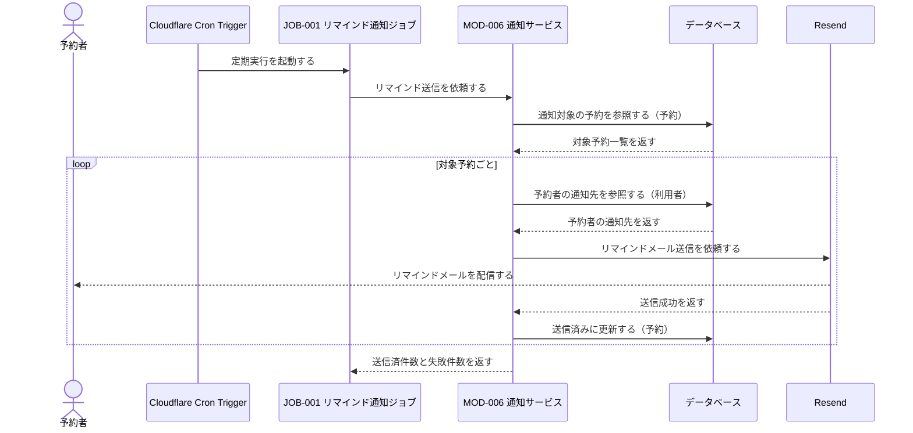
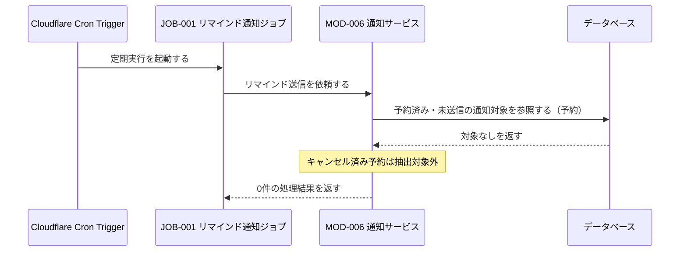
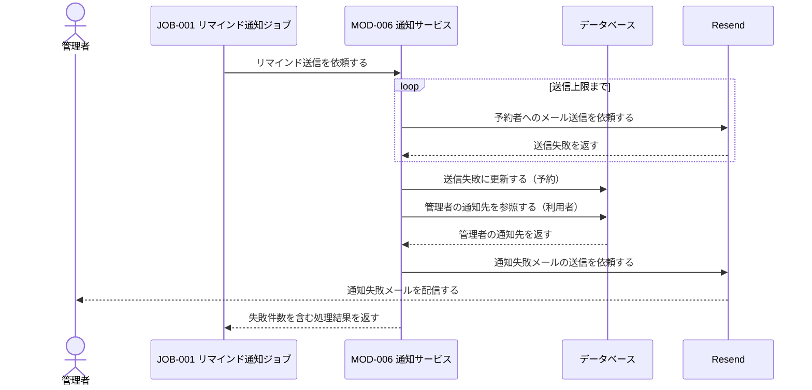

# 1. 基本情報

| 項目 | 内容 |
|---|---|
| シーケンスID | SEQ-002 |
| シーケンス名 | 予約リマインド通知シーケンス |
| 目的 | 予約開始前の対象抽出、予約者へのメール通知、送信状態更新、継続失敗時の管理者通知を一貫した連携として明確にする。 |
| 対象範囲 | 開始: Cloudflare Cron TriggerがJOB-001を定期起動する / 終了: 対象予約の送信状態を更新し、JOB-001へ件数を返す |
| 作成単位 | JOB単位／UC単位 |
| 契機 | 定期実行（Cloudflare Cron Trigger） |
| 関連機能要件ID | FR-004 |
| 関連ユースケースID | FR-004/UC-01, FR-004/UC-02 |
| 事前条件 | 予約が登録され予約者が確定し、予約者と管理者に通知可能なメールアドレスが登録されている。 |
| 事後条件 | 送信成功時は予約者へ1回通知され送信済みになる。継続失敗時は送信失敗として記録され、管理者へ通知される。対象外・対象なしの場合は通知せず正常終了する。 |
| 状態 | 確定 |

# 2. 構成要素

| 要素 | 種別 | ID/参照 | このシーケンスでの役割 |
|---|---|---|---|
| 予約者 | アクター | - | 自分の予約に関するリマインドメールを受け取る |
| 管理者 | アクター | - | 予約者への通知が継続失敗した事実をメールで受け取る |
| Cron Trigger | 外部サービス | Cloudflare Cron Trigger | JOB-001を定期起動する |
| リマインド通知ジョブ | JOB | JOB-001 | MOD-006へ一連の通知処理を委譲し、処理件数を受け取る |
| 通知サービス | モジュール | MOD-006 | 対象・宛先取得、メール送信、再試行、送信状態更新を担う |
| データベース | DB | MDL-001, MDL-003 | 予約者・管理者の通知先、通知対象の予約とリマインド送信状態を保持する |
| メール送信サービス | 外部サービス | Resend | 予約者・管理者へメールを送信する |

# 3. シーケンス

## 3.1 正常系シーケンス

## 3.2 代替系シーケンス

対象がない場合、またはキャンセル済み予約しかない場合はメールを送信せず正常終了する。

## 3.3 例外系シーケンス

予約者への送信が再試行後も失敗した場合は失敗状態を記録し、管理者へ通知して次の予約を継続する。

# 4. 連携定義

## 4.1 条件分岐

| 条件ID | 判定箇所 | 条件 | 成立時 | 不成立時 | 根拠 |
|---|---|---|---|---|---|
| COND-01 | MOD-006 | 予約済み・未送信で、開始時刻が通知対象範囲にある | 予約者への通知を実行 | 対象外として通知しない | FR-004/UC-01 |
| COND-02 | MOD-006 | 通知対象が1件以上ある | 予約ごとの処理を開始 | 0件で正常終了 | FR-004/UC-01 |
| COND-03 | MOD-006 | 予約者へのメール送信に成功 | 送信済みに更新 | 再試行し、上限到達時は送信失敗に更新 | FR-004/UC-01, FR-004/UC-02 |
| COND-04 | MOD-006 | 予約がキャンセル済み | 通知対象から除外 | 他の抽出条件を確認 | FR-004/UC-01/ALT-1 |

## 4.2 データ参照・更新

| データモデル | CRUD | 目的 | 実行主体 |
|---|---|---|---|
| MDL-003 予約 | R / U | 通知対象抽出と送信済み・送信失敗状態の記録 | MOD-006 |
| MDL-001 利用者 | R | 予約者と管理者のメールアドレス取得 | MOD-006 |

## 4.3 トランザクション境界

| 境界ID | 開始 | 終了 | 対象更新 | ロールバック条件 | 管理主体 |
|---|---|---|---|---|---|
| TX-01 | 対象予約1件の送信結果確定後 | 送信状態更新後のCOMMIT | MDL-003のリマインド送信状態 | 送信状態更新失敗 | MOD-006 |

- メール送信を含む全対象を1トランザクションにせず、予約1件ごとの状態更新だけを短いトランザクションで確定する。

## 4.4 補足事項

| 観点 | 内容 |
|---|---|
| 同期/非同期 | Cron起動の非対話処理。JOB-001からMOD-006への委譲と状態更新は同期、メール配信結果は外部サービスから受け取る。 |
| 冪等性・再試行 | 未送信状態だけを抽出して二重通知を防ぐ。メール送信失敗はMOD-006が上限まで再試行する。 |
| 排他制御 | 全体ロックは持たず、対象予約1件ごとに送信状態を確定する。 |
| 外部連携 | Cloudflare Cron Triggerで起動し、Resendでメールを送信する。 |
