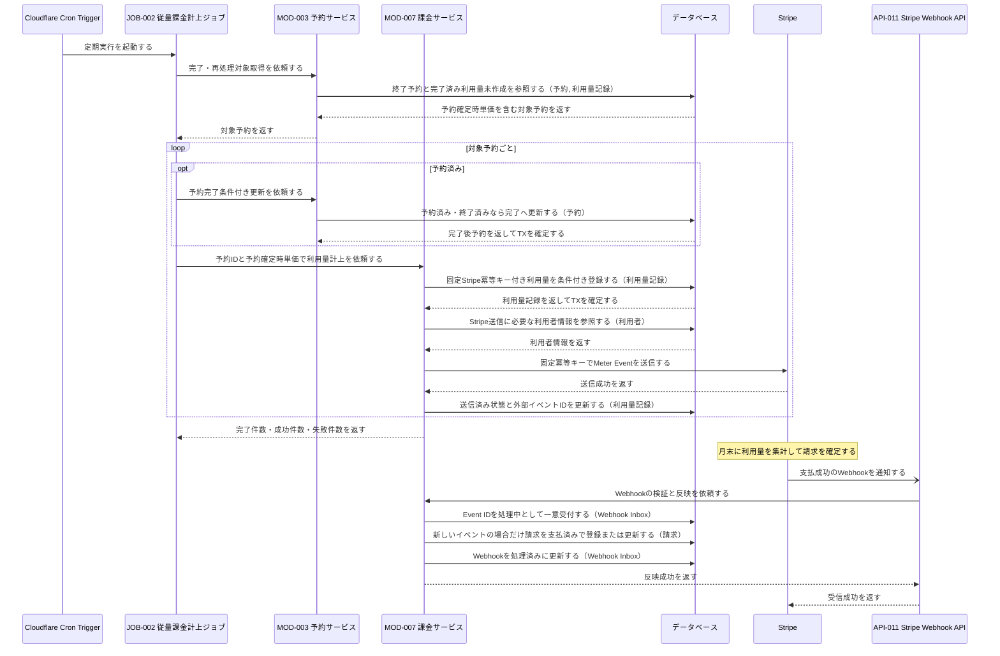
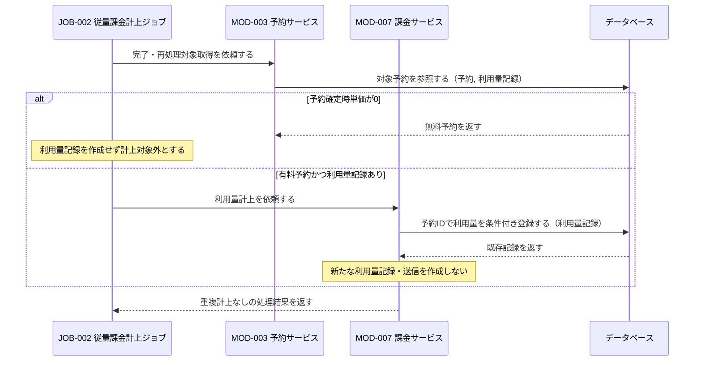
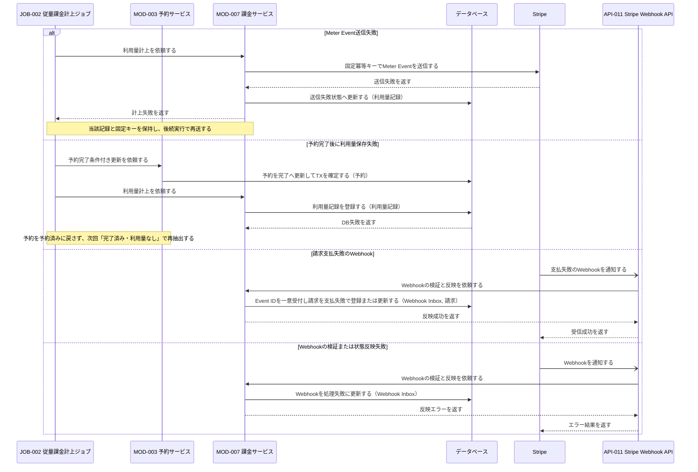

# 1. 基本情報

| 項目 | 内容 |
|---|---|
| シーケンスID | SEQ-003 |
| シーケンス名 | 利用量の従量課金計上シーケンス |
| 目的 | 完了した有料会議室予約の利用量を重複なく記録・送信し、月次請求の支払結果を請求状態へ反映する連携を明確にする。 |
| 対象範囲 | 開始: Cloudflare Cron TriggerがJOB-002を定期起動する / 終了: 利用量送信結果を記録し、月次請求後はStripe Webhookの請求状態を反映する |
| 作成単位 | JOB単位／外部連携単位 |
| 契機 | 定期実行（Cloudflare Cron Trigger）／Stripe請求結果のWebhook受信 |
| 関連機能要件ID | FR-008 |
| 関連ユースケースID | -（FR-008の業務ルール3, 4, 6, 8を対象） |
| 事前条件 | 予約に予約確定時単価が保存されている。有料予約の利用者にはStripe連携に必要な情報が登録されている。 |
| 事後条件 | 終了予約は完了状態になる。有料会議室は予約単位の利用量が重複なく記録され送信結果を保持し、無料会議室は利用量を作成しない。請求Webhook受信時は請求状態が冪等に反映される。 |
| 状態 | 確定 |

# 2. 構成要素

| 要素 | 種別 | ID/参照 | このシーケンスでの役割 |
|---|---|---|---|
| Cron Trigger | 外部サービス | Cloudflare Cron Trigger | JOB-002を定期起動する |
| 従量課金計上ジョブ | JOB | JOB-002 | MOD-003で完了対象・中間失敗を取得し、MOD-007へ利用量計上を委譲する |
| Stripe Webhook API | API | API-011 | Stripeの請求結果を受信し、MOD-007へ反映を委譲する |
| 予約サービス | モジュール | MOD-003 | 完了・再処理対象取得と予約済みから完了への条件付き更新を担う |
| 課金サービス | モジュール | MOD-007 | 利用量記録・送信、Webhook Inbox、請求状態反映を担う。予約状態は更新しない |
| データベース | DB | MDL-001, MDL-003, MDL-006, MDL-007, MDL-011 | 予約時単価を含む予約、利用量、請求、Webhook Event IDと処理状態を保持する |
| 決済サービス | 外部サービス | Stripe | Meter Eventの受信・集計、月次請求、Webhook通知を行う |

# 3. シーケンス

本シーケンスは、利用終了した有料会議室予約を完了とし、予約単位の利用量を重複なく記録・送信したうえで、月次請求の支払結果を請求状態へ冪等に反映する連携を扱う。対応するユースケースを持たないFR単位の処理のため、根拠にはFR-008の業務ルールを示す(状態パターンSP-xは持たない)。なお FR-008/UC-01(支払い方法登録)の状態パターンは支払い方法登録シーケンス(SEQ-004)、FR-008/UC-02(利用量・請求確認)の状態パターンは利用量・請求確認シーケンス(SEQ-011)の対象範囲のため、本シーケンスの対象外とする。

| パターンID | 状態パターン(条件) | 本シーケンスでの表現 |
|---|---|---|
| FR-008 業務ルール3, 8 | 利用終了日時を過ぎた予約済み予約を完了とし、利用量計上の対象とする | 3.1 正常系(予約完了・計上対象の判定) |
| FR-008 業務ルール1, 4 | 有料会議室について利用時点の利用単価を適用し、利用量を記録・送信する | 3.1 正常系(利用単価参照・利用量記録・Meter Event送信) |
| FR-008 業務ルール2 | 無料会議室は課金対象外とし、利用量を作成しない | 3.2 代替系(無料会議室) |
| FR-008 業務ルール3 | 同一予約に利用量記録が既に存在する場合は重複計上しない | 3.2 代替系(有料会議室かつ利用量記録あり) |
| FR-008 業務ルール6 | 計上した利用量を月次でまとめて請求し、支払結果を請求状態へ冪等に反映する | 3.1 正常系(支払成功Webhookの反映)／3.3 例外系(支払失敗Webhook・Webhook検証/反映失敗) |
| FR-008 業務ルール3, 6 | Meter Event送信に失敗した記録は保持し、後続実行で再送する | 3.3 例外系(Meter Event送信失敗) |

## 3.1 正常系シーケンス

有料会議室の利用量送信と、後続の月次請求成功通知を示す。

## 3.2 代替系シーケンス

無料会議室、またはすでに利用量記録が存在する予約は重複計上しない。

## 3.3 例外系シーケンス

# 4. 連携定義

## 4.1 条件分岐

| 条件ID | 判定箇所 | 条件 | 成立時 | 不成立時 | 根拠 |
|---|---|---|---|---|---|
| COND-01 | MOD-003 | 予約済みで終了日時経過、または完了済み・利用量記録なしである | 完了更新または利用量再作成を行う | 対象外 | FR-008 業務ルール3, 8 |
| COND-02 | JOB-002 | 予約確定時単価が0より大きい | 利用量を計上 | 無料として計上しない | FR-008 業務ルール1, 2 |
| COND-03 | MOD-007 | 同一予約の利用量記録が存在しない | 利用量記録を作成 | 重複計上せず既存状態に従う | FR-008 業務ルール3 |
| COND-04 | MOD-007 | Meter Event送信に成功 | 送信済みに更新 | 送信失敗に更新し計上失敗 | FR-008 業務ルール6 |
| COND-05 | MOD-007 | Webhookが正当で対象イベントである | イベント種別に応じ状態反映 | 不正時は反映エラー、対象外は正常終了 | FR-008 業務ルール6 |

## 4.2 データ参照・更新

| データモデル | CRUD | 目的 | 実行主体 |
|---|---|---|---|
| MDL-003 予約 | R / U | 終了・中間失敗予約の抽出、予約確定時単価参照、完了更新 | MOD-003 |
| MDL-001 利用者 | R | Stripe送信に必要な利用者情報取得 | MOD-007 |
| MDL-006 利用量記録 | R / C / U | 二重計上確認、利用量登録、送信状態更新 | MOD-007 |
| MDL-007 請求 | C / U | Stripe請求結果の冪等な反映 | MOD-007 |
| MDL-011 Webhook受信イベント | R / C / U | Event ID一意受付、重複・失敗再処理・処理結果記録 | MOD-007 |

## 4.3 トランザクション境界

| 境界ID | 開始 | 終了 | 対象更新 | ロールバック条件 | 管理主体 |
|---|---|---|---|---|---|
| TX-01 | 予約完了条件付き更新 | 完了状態確定 | MDL-003 | DB更新失敗。完了済みは正常継続 | MOD-003 |
| TX-02 | 利用量記録条件付き登録 | 固定冪等キーを含む記録確定 | MDL-006 | DB更新失敗。TX-01は戻さず次回再抽出 | MOD-007 |
| TX-03 | Meter Eventの送信結果受領 | 送信済みまたは送信失敗状態の確定 | MDL-006 | 送信状態更新失敗。同じ固定キーで再送 | MOD-007 |
| TX-04 | Webhook Event ID受付 | 状態反映・Inbox処理済みの確定 | MDL-007, MDL-011 | 状態反映失敗時はInboxを失敗として再処理可能にする | MOD-007 |

- 外部サービスの応答待ちをDBトランザクションに含めず、利用量記録と送信結果を分けて短く確定する。

## 4.4 補足事項

| 観点 | 内容 |
|---|---|
| 同期/非同期 | Cron起動の非対話処理。StripeからAPI-011へのWebhookは非同期。 |
| 冪等性・再試行 | 予約完了の期待状態、予約ID一意の利用量記録、送信前固定Stripeキー、Webhook Event ID一意制約を併用する。 |
| 排他制御 | 予約完了、利用量記録、外部送信結果を別TXにし、完了済み・利用量なしを再抽出して中間失敗を回復する。 |
| 外部連携 | Cloudflare Cron Triggerで起動し、StripeへMeter Eventを送信する。Stripeは月次請求後にAPI-011へ結果を通知する。 |
