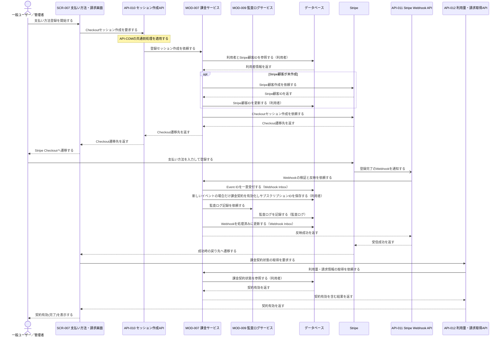
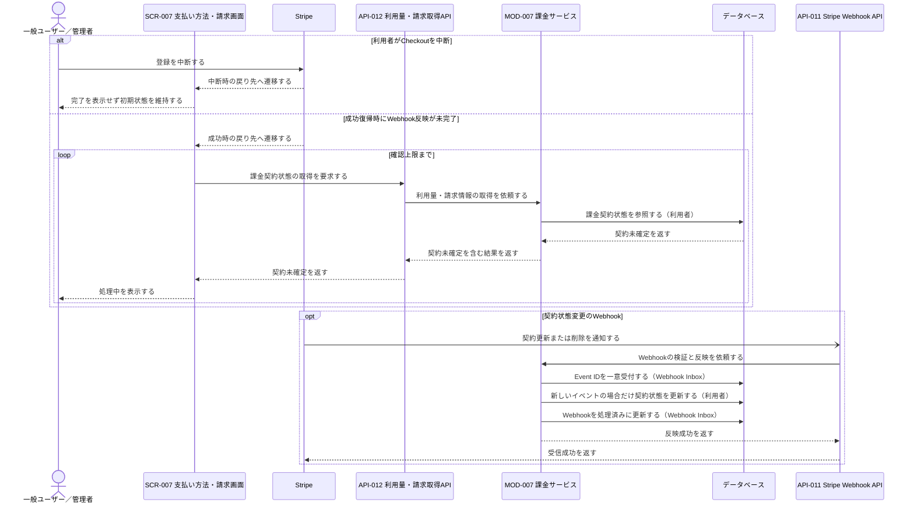
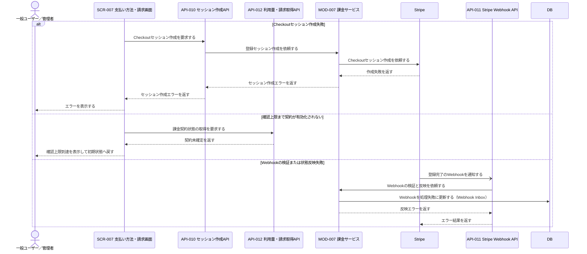

# 1. 基本情報

| 項目 | 内容 |
|---|---|
| シーケンスID | SEQ-004 |
| シーケンス名 | 支払い方法登録シーケンス |
| 目的 | Stripe Checkoutで受け付けた支払い方法をWebhookで課金契約へ反映し、画面が契約有効を確認して利用者へ結果を表示する連携を明確にする。 |
| 対象範囲 | 開始: 利用者がSCR-007で支払い方法登録を開始する / 終了: 契約有効を確認して完了を表示する、または中断・失敗結果を表示する |
| 作成単位 | UC単位／画面主要操作単位／外部連携単位 |
| 契機 | 利用者操作（支払い方法登録）／Stripe Checkout完了とWebhook受信 |
| 関連機能要件ID | FR-008 |
| 関連ユースケースID | FR-008/UC-01 |
| 事前条件 | 利用者がログイン済みで、支払い方法が未登録である。Stripe連携が利用可能である。 |
| 事後条件 | 正常時は支払い方法に対応する課金契約が有効となり、有料会議室を予約可能になる。中断・失敗時は契約を有効化せず、画面が初期状態または再試行可能な状態になる。 |
| 状態 | レビュー中 |

# 2. 構成要素

| 要素 | 種別 | ID/参照 | このシーケンスでの役割 |
|---|---|---|---|
| 一般ユーザー／管理者 | アクター | - | 支払い方法登録を開始し、Stripeで入力して結果を確認する |
| 支払い方法・請求画面 | UI | SCR-007 | Checkoutへの遷移、復帰後の状態確認、処理中・完了・失敗表示を行う |
| 支払い方法登録セッション作成API | API | API-010 | Checkoutセッション作成をMOD-007へ委譲し、遷移先を返す |
| Stripe Webhook API | API | API-011 | Stripeから登録・契約状態変更を受信し、MOD-007へ反映を委譲する |
| 利用量・請求取得API | API | API-012 | Checkout復帰後に課金契約状態を取得し、画面へ返す |
| 課金サービス | モジュール | MOD-007 | Stripe顧客・Checkoutセッション作成、Event ID一意のInbox受付・Webhook検証・契約反映、契約状態取得を担う |
| 監査ログサービス | モジュール | MOD-009 | 支払い方法登録完了(契約有効化＝課金操作)を監査ログに記録する（契約有効化と同一トランザクション） |
| データベース | DB | MDL-001, MDL-010, MDL-011 | Stripe顧客ID、課金契約状態、サブスクリプションID、重要操作の監査ログ、Webhook Event IDと処理状態を保持する |
| 決済サービス | 外部サービス | Stripe | 支払い方法の入力、Checkout処理、Webhook通知を行う |

# 3. シーケンス

本シーケンスは支払い方法登録の連携を扱い、Stripe Checkoutで受け付けた支払い方法をWebhookで課金契約へ反映し、画面が契約有効を確認して結果を表示する。網羅する状態パターン(FR-008/UC-01)を示す。なおWebhook反映待ちのポーリング(3.2 代替系の再確認・3.3 例外系の確認上限到達)は、契約有効化(SP-1)の確定を待つ設計上の連携であり、UCの状態パターンには対応しない。

| パターンID | 状態パターン(条件) | 本シーケンスでの表現 |
|---|---|---|
| FR-008/UC-01/SP-1 | 登録を実行・登録成功(課金契約が有効化) | 3.1 正常系(Checkout登録→Webhook反映→契約有効を確認) |
| FR-008/UC-01/SP-2 | 登録を取りやめ | 3.2 代替系「利用者がCheckoutを中断」 |
| FR-008/UC-01/SP-3 | 登録を実行・登録失敗 | 3.3 例外系「Checkoutセッション作成失敗」／「Webhookの検証または状態反映失敗」 |

## 3.1 正常系シーケンス

## 3.2 代替系シーケンス

利用者による中断、または画面復帰時点でWebhook反映が完了していない場合を示す。

## 3.3 例外系シーケンス

# 4. 連携定義

## 4.1 条件分岐

| 条件ID | 判定箇所 | 条件 | 成立時 | 不成立時 | 根拠 |
|---|---|---|---|---|---|
| COND-01 | MOD-007 | 利用者にStripe顧客IDが登録済み | 既存顧客でCheckoutを作成 | 顧客を作成してIDを保存 | FR-008/UC-01 |
| COND-02 | MOD-007 | Checkoutセッション作成に成功 | 遷移先を返す | セッション作成エラー | FR-008/UC-01/EXC-1 / FR-008/UC-01/SP-3 |
| COND-03 | SCR-007 | 利用者がCheckout登録を中断 | 初期状態を維持 | 登録完了後の状態確認へ進む | FR-008/UC-01/ALT-1 / FR-008/UC-01/SP-2 |
| COND-04 | MOD-007 / SCR-007 | API-012で課金契約の有効化を確認 | 契約有効(完了)を表示 | 処理中を表示して上限まで再確認 | FR-008/UC-01 / FR-008/UC-01/SP-1 |
| COND-05 | SCR-007 | 確認上限まで契約が有効化されない | 確認上限到達を表示して初期状態へ戻す | 再確認を継続 | FR-008/UC-01 |
| COND-06 | MOD-007 | Webhookが正当で登録完了・契約状態変更の対象イベント | 利用者の契約状態を反映 | 不正時は反映エラー、対象外は正常終了 | FR-008/UC-01 / FR-008/UC-01/SP-1 |

## 4.2 データ参照・更新

| データモデル | CRUD | 目的 | 実行主体 |
|---|---|---|---|
| MDL-001 利用者 | R / U | Stripe顧客作成要否、顧客ID保存、課金契約有効化・状態変更、完了確認 | MOD-007 |
| MDL-010 監査ログ | C | 支払い方法登録完了(重要操作＝課金操作)の監査証跡の記録 | MOD-009 |
| MDL-011 Webhook受信イベント | R / C / U | Event ID一意受付、重複排除、処理済み・失敗の記録 | MOD-007 |

## 4.3 トランザクション境界

| 境界ID | 開始 | 終了 | 対象更新 | ロールバック条件 | 管理主体 |
|---|---|---|---|---|---|
| TX-01 | Stripe顧客作成成功後 | Stripe顧客ID保存後のCOMMIT | MDL-001のStripe顧客ID | 顧客ID保存失敗 | MOD-007 |
| TX-02 | 検証済みWebhookの反映開始 | 契約状態・サブスクリプションID保存後のCOMMIT | MDL-001の課金契約情報 | 状態反映失敗 | MOD-007 |

- API-012による契約状態確認は参照のみで、更新トランザクションを持たない。

## 4.4 補足事項

| 観点 | 内容 |
|---|---|
| 同期/非同期 | セッション作成と画面からの状態確認は同期。StripeからAPI-011へのWebhookは非同期。 |
| 冪等性・再試行 | WebhookはEvent ID一意のInbox受付により同一イベントを冪等に反映する(重複受信・順序逆転・一時失敗を安全に再処理)。画面は契約未確定時にAPI-012を上限まで再取得する。 |
| 排他制御 | 利用者単位の短い更新とし、Checkout中の利用者操作やWebhook待ちをDBトランザクションに含めない。 |
| 外部連携 | Stripe Checkoutで支払い方法を受け付け、登録・契約状態変更をWebhookで反映する。 |
