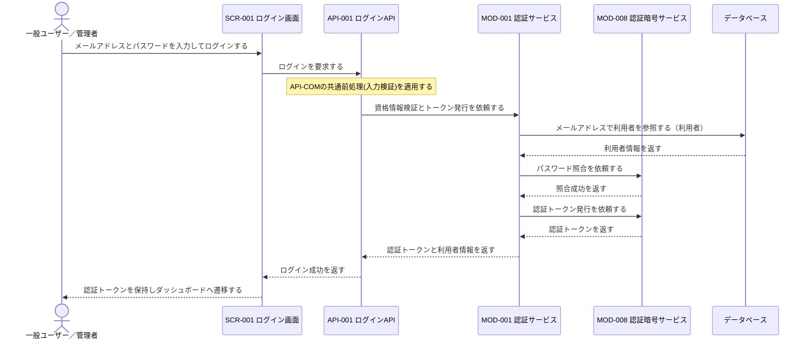
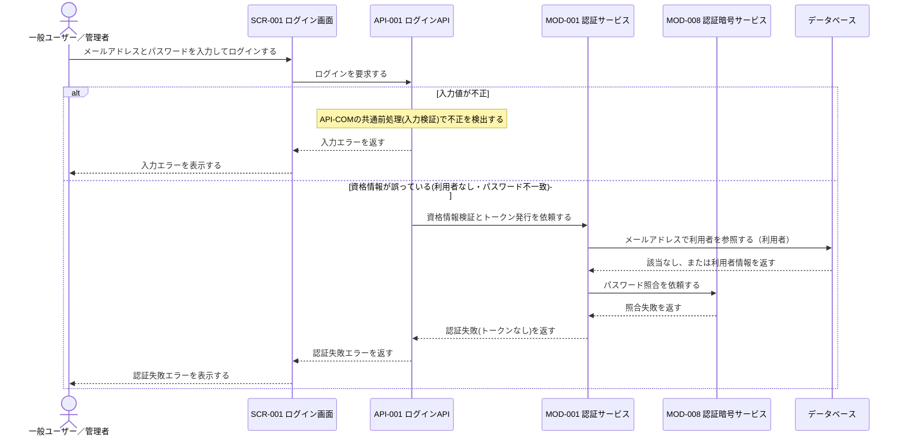

# 1. 基本情報

| 項目 | 内容 |
|---|---|
| シーケンスID | SEQ-005 |
| シーケンス名 | ログインシーケンス |
| 目的 | 利用者が入力した資格情報を検証し、本人確認に成功した場合にのみ認証トークンを発行してシステム利用可能な状態にする、UI・API・認証モジュール間の連携を明確にする。 |
| 対象範囲 | 開始: 利用者がSCR-001で資格情報を入力してログインを実行する / 終了: 認証トークン発行後にダッシュボードへ遷移する、またはエラー結果が利用者へ表示される |
| 作成単位 | UC単位／画面主要操作単位 |
| 契機 | 利用者操作（ログイン） |
| 関連機能要件ID | CFR-001 |
| 関連ユースケースID | CFR-001/UC-01 |
| 事前条件 | 利用者があらかじめ登録されている（利用者情報が存在する）。 |
| 事後条件 | 正常時は本人確認済みで認証トークンを保持し、以降の機能を利用できる状態になる。例外時は認証されず、エラー結果が表示され再入力を促す。 |
| 状態 | 確定 |

# 2. 構成要素

| 要素 | 種別 | ID/参照 | このシーケンスでの役割 |
|---|---|---|---|
| 一般ユーザー／管理者 | アクター | - | 資格情報を入力してログインし、認証結果を確認する |
| ログイン画面 | UI | SCR-001 | 資格情報の入力受付、API呼び出し、認証トークン保持と遷移、エラー表示を行う |
| ログインAPI | API | API-001 | 共通前処理（入力検証）を行い、資格情報検証とトークン発行を認証サービスへ委譲し、認証成否を判定して結果を返す |
| 認証サービス | モジュール | MOD-001 | 利用者取得、パスワード照合、認証トークン発行を担う |
| 認証暗号サービス | モジュール | MOD-008 | パスワードハッシュ照合とJWTの発行を担う |
| データベース | DB | MDL-001 | メールアドレスによる利用者の取得とパスワード照合対象を保持する |

# 3. シーケンス

本シーケンスは資格情報の検証と認証トークン発行の連携を扱い、資格情報の正誤で本人確認の成否を判定して、正しい場合にのみ利用可能な状態にする。網羅する状態パターン(CFR-001/UC-01)を示す。なお入力値の形式不正はAPI-COMの共通前処理(入力検証)で扱い、UCの状態パターンには含めない。

| パターンID | 状態パターン(条件) | 本シーケンスでの表現 |
|---|---|---|
| CFR-001/UC-01/SP-1 | 資格情報=正しい(登録利用者と一致) | 3.1 正常系 |
| CFR-001/UC-01/SP-2 | 資格情報=誤り(利用者なし・パスワード不一致) | 3.3 例外系「資格情報が誤っている」 |
| API-COM共通前処理(入力検証) | 入力値=形式不正 | 3.3 例外系「入力値が不正」 |

## 3.1 正常系シーケンス

正しい資格情報でログインし、認証トークンを発行してダッシュボードへ遷移する基本の流れを示す。

## 3.2 代替系シーケンス

該当なし。CFR-001/UC-01 に代替フローは定義されていない（代替フロー=なし）ため、代替系シーケンスは作成しない。

## 3.3 例外系シーケンス

入力値の不正、および資格情報の誤り（本人確認失敗）の分岐を示す。

# 4. 連携定義

## 4.1 条件分岐

| 条件ID | 判定箇所 | 条件 | 成立時 | 不成立時 | 根拠 |
|---|---|---|---|---|---|
| COND-01 | API-COM共通前処理 / API-001 | リクエストが入力バリデーション（必須・型・形式）を満たす | 資格情報検証を継続 | 入力エラーを返す | CFR-001/UC-01 |
| COND-02 | MOD-001 | メールアドレスに該当する利用者が存在し、パスワードが一致する | 認証トークンを発行して返す | 認証失敗（トークンなし）を返す | CFR-001/UC-01/EXC-1 / CFR-001/UC-01/SP-2 |
| COND-03 | API-001 | 認証サービスが認証トークンを返した（認証成立） | ログイン成功を返す | 認証失敗エラーを返す | CFR-001/UC-01/EXC-1 |

## 4.2 データ参照・更新

| データモデル | CRUD | 目的 | 実行主体 |
|---|---|---|---|
| MDL-001 利用者 | R | メールアドレスによる利用者取得と、パスワード照合対象（パスワード・ロール・氏名）の取得 | MOD-001 |

## 4.3 トランザクション境界

| 境界ID | 開始 | 終了 | 対象更新 | ロールバック条件 | 管理主体 |
|---|---|---|---|---|---|
| - | - | - | なし | - | - |

ログインは利用者情報の参照と認証トークン発行のみで DB 更新を伴わないため、トランザクション境界は設けない。

## 4.4 補足事項

| 観点 | 内容 |
|---|---|
| 同期/非同期 | ログインは同期処理。認証の成否・エラー結果を同一操作内で返す。 |
| 冪等性・再試行 | API-001 は冪等。資格情報の検証のみで永続的な副作用がなく、同一資格情報の再送でも結果は同じ。 |
| 排他制御 | なし（利用者情報の参照のみで更新・排他取得を行わない）。 |
| 外部連携 | 外部サービス連携はなし。JWT の署名生成・パスワードハッシュ照合は MOD-008 認証暗号サービスに集約し、MOD-001・API-001 は外部ライブラリを直接利用しない。 |
| 認証セッション | 認証状態（概念モデル: 認証セッション）は発行した認証トークン（JWT）としてクライアントが保持するステートレス方式で実現し、サーバ側にセッションを永続化しない。したがって本シーケンスに認証セッションの登録・更新は発生しない。 |
