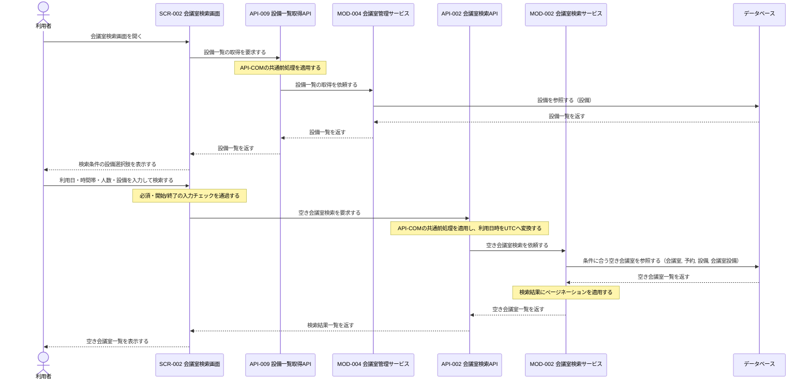
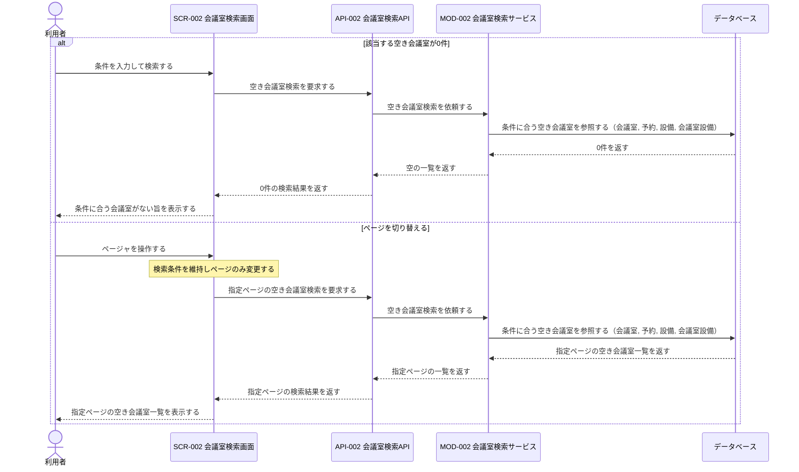
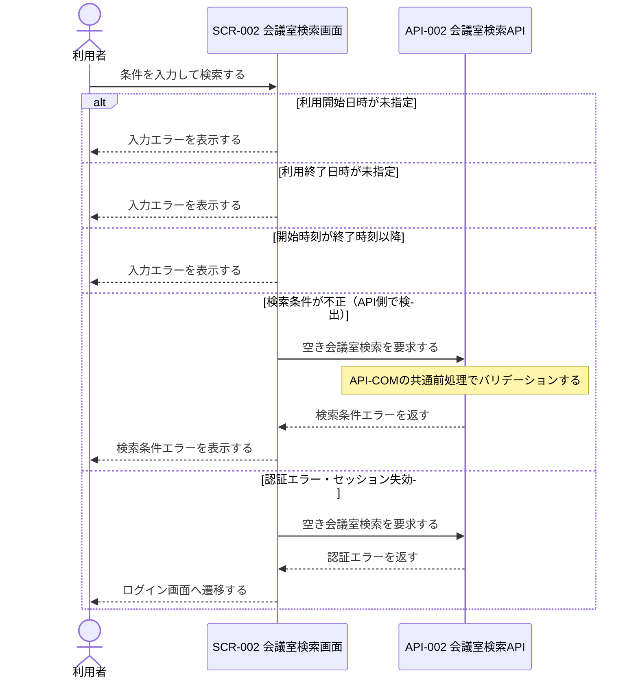

# 1. 基本情報

| 項目 | 内容 |
|---|---|
| シーケンスID | SEQ-006 |
| シーケンス名 | 会議室検索シーケンス |
| 目的 | 利用者が日時・人数・設備の条件で空き会議室を検索し、指定時間帯に利用できる会議室の一覧を提示する連携を明確にする。 |
| 対象範囲 | 開始: 利用者がSCR-002を開き、検索条件を入力して検索する / 終了: 空き会議室一覧または該当なしが利用者へ表示される |
| 作成単位 | UC単位／画面主要操作単位 |
| 契機 | 利用者操作（会議室検索） |
| 関連機能要件ID | FR-001, CFR-005 |
| 関連ユースケースID | FR-001/UC-01 |
| 事前条件 | 利用者がログイン済みで、会議室・設備・既存予約の情報が登録されている。 |
| 事後条件 | 条件に合致する空き会議室の一覧が利用者へ提示される。会議室・予約の状態は変更されない。 |
| 状態 | 確定 |

# 2. 構成要素

| 要素 | 種別 | ID/参照 | このシーケンスでの役割 |
|---|---|---|---|
| 利用者 | アクター | - | 検索条件を入力し、空き会議室一覧を確認する |
| 会議室検索画面 | UI | SCR-002 | 検索条件の入力受付、入力チェック、API呼び出し、結果一覧・0件・ページャの表示を行う |
| 設備一覧取得API | API | API-009 | 共通前処理を行い、設備選択肢の取得をモジュールへ委譲する |
| 会議室検索API | API | API-002 | 共通前処理と日時変換を行い、空き会議室検索をモジュールへ委譲する |
| 会議室管理サービス | モジュール | MOD-004 | 設備一覧を取得する |
| 会議室検索サービス | モジュール | MOD-002 | 条件に合う空き会議室を抽出し、ページネーションを適用する |
| データベース | DB | MDL-002, MDL-003, MDL-004, MDL-008 | 会議室・予約・設備・会議室設備を保持し、空き判定・設備条件判定・設備一覧の参照に用いる |

# 3. シーケンス

本シーケンスは会議室検索の連携を扱い、入力チェック(必須項目・時刻関係)を通過した条件で空き会議室を抽出し、結果一覧または該当なしを提示する。網羅する状態パターン(FR-001/UC-01)を示す。なお CFR-005 のページング(該当UCなし)は状態パターンの対象外とし、3.2 代替系「ページを切り替える」で表現する。

| パターンID | 状態パターン(条件) | 本シーケンスでの表現 |
|---|---|---|
| FR-001/UC-01/SP-1 | 必須入力あり・開始<終了・検索結果=1件以上 | 3.1 正常系 |
| FR-001/UC-01/SP-2 | 必須入力あり・開始<終了・検索結果=0件 | 3.2 代替系「該当する空き会議室が0件」 |
| FR-001/UC-01/SP-3 | 利用開始日時=未指定 | 3.3 例外系「利用開始日時が未指定」 |
| FR-001/UC-01/SP-4 | 利用終了日時=未指定 | 3.3 例外系「利用終了日時が未指定」 |
| FR-001/UC-01/SP-5 | 開始・終了時刻=開始≥終了 | 3.3 例外系「開始時刻が終了時刻以降」 |

## 3.1 正常系シーケンス

初期表示で設備選択肢を取得し、利用者が条件を入力して検索した結果、空き会議室一覧を提示する基本の流れを示す。

## 3.2 代替系シーケンス

該当会議室が0件の場合と、検索条件を維持したままページを切り替える場合を示す。

## 3.3 例外系シーケンス

入力不備・検索条件不正・認証エラーの分岐を示す。会議室検索処理（MOD-002）は参照のみで固有の例外を持たないため、例外は画面入力チェック・API側検証・認証に限られる。

# 4. 連携定義

## 4.1 条件分岐

| 条件ID | 判定箇所 | 条件 | 成立時 | 不成立時 | 根拠 |
|---|---|---|---|---|---|
| COND-01 | SCR-002 | 利用日・開始時刻・終了時刻が入力済みで、開始時刻 ＜ 終了時刻 | 会議室検索を要求 | 入力エラーを表示 | FR-001/UC-01/EXC-1, EXC-2, EXC-3 / FR-001/UC-01/SP-3, SP-4, SP-5 |
| COND-02 | API-002 | 検索条件が構文的に妥当 | 空き会議室検索を継続 | 検索条件エラーを返す | FR-001/UC-01 |
| COND-03 | MOD-002 | 指定時間帯に重複予約がなく、収容人数・設備条件を満たし、利用可状態である会議室 | 空き会議室として抽出 | 検索結果から除外 | FR-001 業務ルール1, 2, 3, 5 |
| COND-04 | SCR-002 | 検索結果が1件以上 | 空き会議室一覧を表示 | 該当なしを表示 | FR-001/UC-01/ALT-1, CFR-005 業務ルール1 / FR-001/UC-01/SP-2 |
| COND-05 | SCR-002 | 総件数が1ページ表示件数を超える | ページャを表示 | ページャを非表示 | CFR-005 |

## 4.2 データ参照・更新

| データモデル | CRUD | 目的 | 実行主体 |
|---|---|---|---|
| MDL-002 会議室 | R | 収容人数・利用状態の条件判定と会議室情報の取得 | MOD-002 |
| MDL-003 予約 | R | 指定時間帯の重複予約を除外する空き判定 | MOD-002 |
| MDL-004 設備 | R | 設備選択肢の取得、および設備条件・設備名の取得 | MOD-002, MOD-004 |
| MDL-008 会議室設備 | R | 会議室と設備の紐付けによる設備条件の判定 | MOD-002 |

## 4.3 トランザクション境界

| 境界ID | 開始 | 終了 | 対象更新 | ロールバック条件 | 管理主体 |
|---|---|---|---|---|---|
| なし | - | - | なし（会議室検索・設備一覧取得ともに参照のみでDB更新を伴わない） | - | - |

## 4.4 補足事項

| 観点 | 内容 |
|---|---|
| 同期/非同期 | 設備一覧取得・会議室検索・ページ切替はいずれも同期処理。結果を同一操作内で返す。 |
| 冪等性・再試行 | API-002・API-009はともに参照系で冪等。再検索・再送しても副作用はない。 |
| 排他制御 | なし（参照のみで予約・会議室の状態を変更しない）。 |
| ページング | CFR-005に基づき、MOD-002が検索結果にページネーション（API-COM §5）を適用する。ページ切替時は検索条件を維持しページのみ変更する。 |
| 日時変換 | 利用日＋時刻（Asia/Tokyo）からISO8601（UTC）への変換はAPI-002が行い、MOD-002へUTC値を渡す。 |
| 論理削除 | 削除済み・利用停止の会議室および設備は空き会議室検索の対象外とする（CFR-005 業務ルール2, FR-001 業務ルール5）。 |
| 外部連携 | なし。 |
