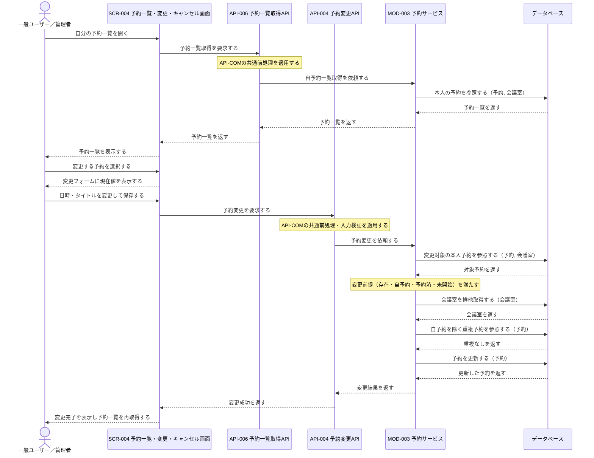
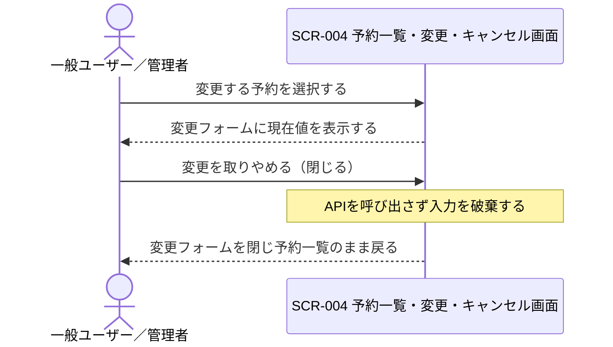
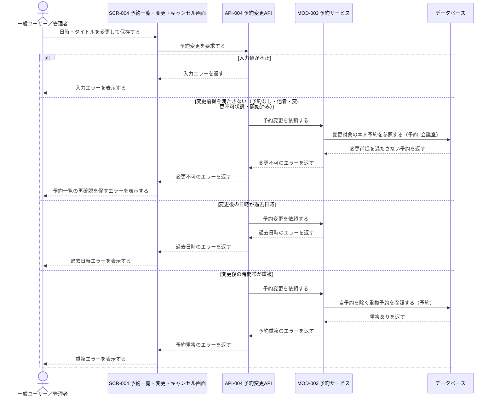

# 1. 基本情報

| 項目 | 内容 |
|---|---|
| シーケンスID | SEQ-007 |
| シーケンス名 | 予約変更シーケンス |
| 目的 | 自分の予約一覧から変更対象を選び、変更前提（存在・自予約・予約済・未開始）、過去日時、時間帯重複を確認し、登録可能な変更だけを確定する連携を明確にする。 |
| 対象範囲 | 開始: 利用者がSCR-004で自分の予約一覧を開く / 終了: 予約変更の完了またはエラー結果が利用者へ表示される |
| 作成単位 | UC単位／画面主要操作単位 |
| 契機 | 利用者操作（予約変更） |
| 関連機能要件ID | FR-003 |
| 関連ユースケースID | FR-003/UC-01 |
| 事前条件 | 利用者がログイン済みで、変更対象の自分の予約が存在する。 |
| 事後条件 | 正常時は予約の日時・タイトルが変更後の内容で登録され、利用者へ完了が表示される。例外時は予約を変更せず、再入力または一覧再確認に必要な結果が表示される。 |
| 状態 | 確定 |

# 2. 構成要素

| 要素 | 種別 | ID/参照 | このシーケンスでの役割 |
|---|---|---|---|
| 一般ユーザー／管理者 | アクター | - | 自分の予約一覧を確認し、対象予約の日時・タイトルを変更して結果を確認する |
| 予約一覧・変更・キャンセル画面 | UI | SCR-004 | 一覧表示、変更フォーム表示・入力受付、API呼び出し、完了・エラー表示を行う |
| 予約一覧取得API | API | API-006 | 共通前処理を行い、本人の予約一覧取得をモジュールへ委譲する |
| 予約変更API | API | API-004 | 共通前処理・入力検証を行い、予約変更をモジュールへ委譲する |
| 予約サービス | モジュール | MOD-003 | 自予約取得、変更前提判定、会議室の排他制御、時間帯重複判定、予約更新を担う |
| データベース | DB | MDL-002, MDL-003 | 会議室の存在・会議室名・排他取得対象、予約の一覧・変更対象予約・重複確認対象と変更後予約を保持する |

# 3. シーケンス

## 3.1 正常系シーケンス

自分の予約一覧を表示し、変更対象を選んで日時・タイトルを変更し、変更前提・過去日時・時間帯重複の確認を通過して変更を確定する基本の流れを示す。

## 3.2 代替系シーケンス

変更フォームを開いた後に変更を取りやめる（閉じる）場合。APIを呼び出さず、予約を変更しないまま一覧へ戻る（FR-003/UC-01/ALT-1）。

## 3.3 例外系シーケンス

入力不正、変更前提の不成立、過去日時、時間帯重複のいずれかで変更を確定せずエラー結果を返す流れを示す。予約一覧の表示までは正常系と同じであり、変更保存以降を示す。

# 4. 連携定義

## 4.1 条件分岐

| 条件ID | 判定箇所 | 条件 | 成立時 | 不成立時 | 根拠 |
|---|---|---|---|---|---|
| COND-01 | SCR-004 / API-004 | 入力が必須・形式・文字数を満たし、利用開始日時＜利用終了日時である | 予約変更を継続 | 入力エラー | FR-003 業務ルール5 |
| COND-02 | API-004 / MOD-003 | 変更対象が本人の予約として存在し、予約済かつ未開始である | 予約変更を継続 | 変更不可エラー | FR-003/UC-01/EXC-3, FR-003/UC-01/EXC-4, FR-003 業務ルール1, 3, 4 |
| COND-03 | API-004 / MOD-003 | 変更後の利用開始日時が現在日時以降である | 予約変更を継続 | 過去日時エラー | FR-003/UC-01/EXC-2, FR-003 業務ルール6 |
| COND-04 | MOD-003 | 変更後の同一会議室・時間帯に、自予約を除く重複予約がない | 予約を更新 | 予約重複のエラー | FR-003/UC-01/EXC-1, FR-003 業務ルール2 |

## 4.2 データ参照・更新

| データモデル | CRUD | 目的 | 実行主体 |
|---|---|---|---|
| MDL-003 予約 | R / U | 本人予約一覧・変更対象予約の取得、時間帯重複の確認、変更後内容での更新 | MOD-003 |
| MDL-002 会議室 | R | 一覧・対象予約表示のための会議室名取得、重複判定のための会議室行の排他取得 | MOD-003 |

## 4.3 トランザクション境界

| 境界ID | 開始 | 終了 | 対象更新 | ロールバック条件 | 管理主体 |
|---|---|---|---|---|---|
| TX-01 | 会議室の排他取得 | 予約更新後のCOMMIT | MDL-003への予約更新 | 変更前提・過去日時・重複の検証エラーまたは更新失敗 | MOD-003 |

## 4.4 補足事項

| 観点 | 内容 |
|---|---|
| 同期/非同期 | 予約一覧取得・予約変更とも同期処理。正常・エラー結果を同一操作内で返す。予約一覧の表示は変更保存とは別の同期要求として先行する。 |
| 冪等性・再試行 | API-004は冪等（同一内容の再送でも対象予約を同じ内容へ更新する）。再送時も排他制御と重複確認を行う。API-006は参照系で冪等。 |
| 排他制御 | MOD-003が会議室単位で行ロックを取得し、重複確認から更新までを直列化する。 |
| 外部連携 | なし。予約変更では会議室そのものの変更を扱わないため課金契約確認（MOD-007）は行わない。 |
