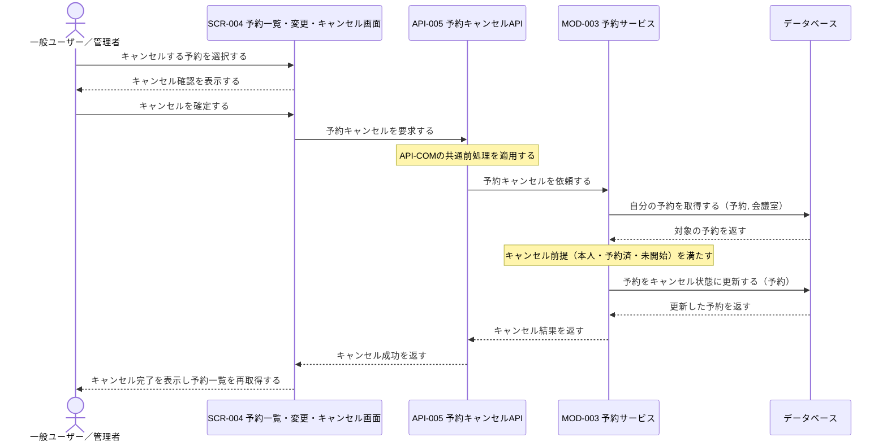
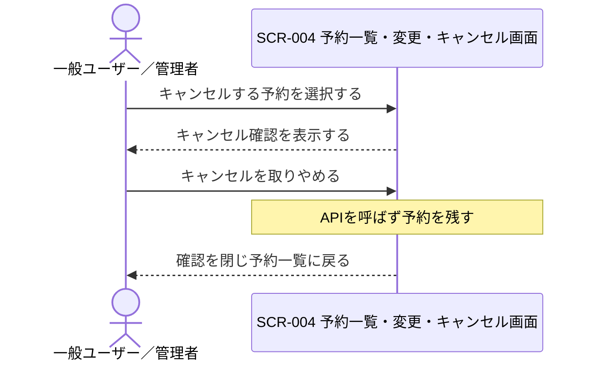
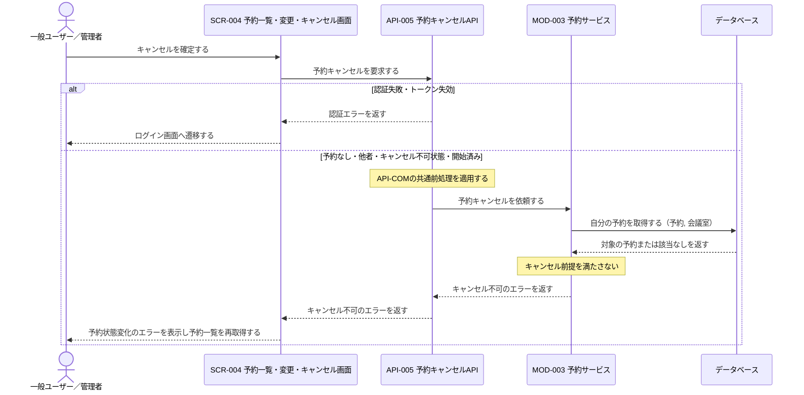

# 1. 基本情報

| 項目 | 内容 |
|---|---|
| シーケンスID | SEQ-008 |
| シーケンス名 | 予約キャンセルシーケンス |
| 目的 | 対象が予約者本人の予約であること、予約済であること、未開始であることを確認し、キャンセル可能な予約だけをキャンセル状態に更新する連携を明確にする。 |
| 対象範囲 | 開始: 利用者がSCR-004でキャンセル対象を選び、確認のうえキャンセルを確定する / 終了: キャンセル完了またはエラー結果が利用者へ表示される |
| 作成単位 | UC単位／画面主要操作単位 |
| 契機 | 利用者操作（予約キャンセル） |
| 関連機能要件ID | FR-003 |
| 関連ユースケースID | FR-003/UC-02 |
| 事前条件 | 利用者がログイン済みで、キャンセル対象の自分の予約が予約一覧に表示されている。 |
| 事後条件 | 正常時は予約がキャンセル状態になり、該当会議室・時間帯が他の利用者へ開放され、利用者へ完了が表示される。例外時は予約を更新せず、状態変化などのエラーを表示して予約一覧を再取得する。 |
| 状態 | 確定 |

# 2. 構成要素

| 要素 | 種別 | ID/参照 | このシーケンスでの役割 |
|---|---|---|---|
| 一般ユーザー／管理者 | アクター | - | 一覧からキャンセル対象を選び、確認のうえキャンセルを実行し結果を確認する |
| 予約一覧・変更・キャンセル画面 | UI | SCR-004 | キャンセル確認、API呼び出し、完了・エラー表示、一覧再取得を行う |
| 予約キャンセルAPI | API | API-005 | 共通前処理を行い、自予約取得と予約キャンセルをモジュールへ委譲する |
| 予約サービス | モジュール | MOD-003 | 自予約取得、キャンセル前提判定、予約キャンセル更新を担う |
| データベース | DB | MDL-002, MDL-003 | 予約者本人の予約と会議室名を保持し、キャンセル状態への更新対象を保持する |

# 3. シーケンス

## 3.1 正常系シーケンス

予約者本人が、予約済かつ未開始の自分の予約をキャンセルする基本の流れを示す。

## 3.2 代替系シーケンス

確認ダイアログでキャンセルを取りやめた場合（FR-003/UC-02/ALT-1）は、APIを呼ばず予約を残したまま一覧に戻る。

## 3.3 例外系シーケンス

認証エラー、および対象が予約者本人でない・存在しない・キャンセル不可状態（キャンセル済み・完了・開始済み）の前提エラーを示す。

# 4. 連携定義

## 4.1 条件分岐

| 条件ID | 判定箇所 | 条件 | 成立時 | 不成立時 | 根拠 |
|---|---|---|---|---|---|
| COND-01 | SCR-004 | キャンセル確認で確定する | 予約キャンセルを要求 | 予約を残し一覧へ戻る | FR-003/UC-02/ALT-1 |
| COND-02 | API-005 / MOD-003 | 対象予約が存在し、予約者本人の予約である | キャンセルを継続 | キャンセル不可のエラー | FR-003 業務ルール1, FR-003/UC-02 |
| COND-03 | API-005 / MOD-003 | 対象予約の予約ステータスが予約済である | キャンセルを継続 | キャンセル不可のエラー | FR-003 業務ルール4, FR-003/UC-02/EXC-2 |
| COND-04 | API-005 / MOD-003 | 対象予約が未開始（現在日時 ＜ 利用開始日時）である | 予約をキャンセル状態に更新 | キャンセル不可のエラー | FR-003 業務ルール3, FR-003/UC-02/EXC-1 |

## 4.2 データ参照・更新

| データモデル | CRUD | 目的 | 実行主体 |
|---|---|---|---|
| MDL-003 予約 | R / U | 予約者本人の対象予約の取得と、キャンセル状態への更新 | MOD-003 |
| MDL-002 会議室 | R | 対象予約に紐づく会議室名の取得（表示用） | MOD-003 |

## 4.3 トランザクション境界

| 境界ID | 開始 | 終了 | 対象更新 | ロールバック条件 | 管理主体 |
|---|---|---|---|---|---|
| TX-01 | 自予約取得 | キャンセル更新後のCOMMIT | MDL-003の予約ステータスをキャンセルに更新 | 本人・予約済・未開始の前提判定エラーまたは更新失敗 | MOD-003 |

## 4.4 補足事項

| 観点 | 内容 |
|---|---|
| 同期/非同期 | 予約キャンセルは同期処理。正常・エラー結果を同一操作内で返す。 |
| 冪等性・再試行 | API-005は冪等ではない。ただしキャンセル済みの予約の再送は前提判定でキャンセル不可のエラーとなり、二重取消は発生しない。 |
| 排他制御 | MOD-003が対象予約の取得から更新までを単一トランザクションで直列化する。会議室の時間帯開放は予約ステータスをキャンセルに更新することで実現し、時間帯を占有する状態を解くだけのため会議室行ロックは伴わない（FR-003 業務ルール7）。 |
| 外部連携 | なし。キャンセル対象は未開始の予約に限られ、利用量計上（完了予約を対象とする課金処理）の対象外のため、課金サービス（MOD-007）・利用量記録（MDL-006）は本シーケンスに関与しない。 |
