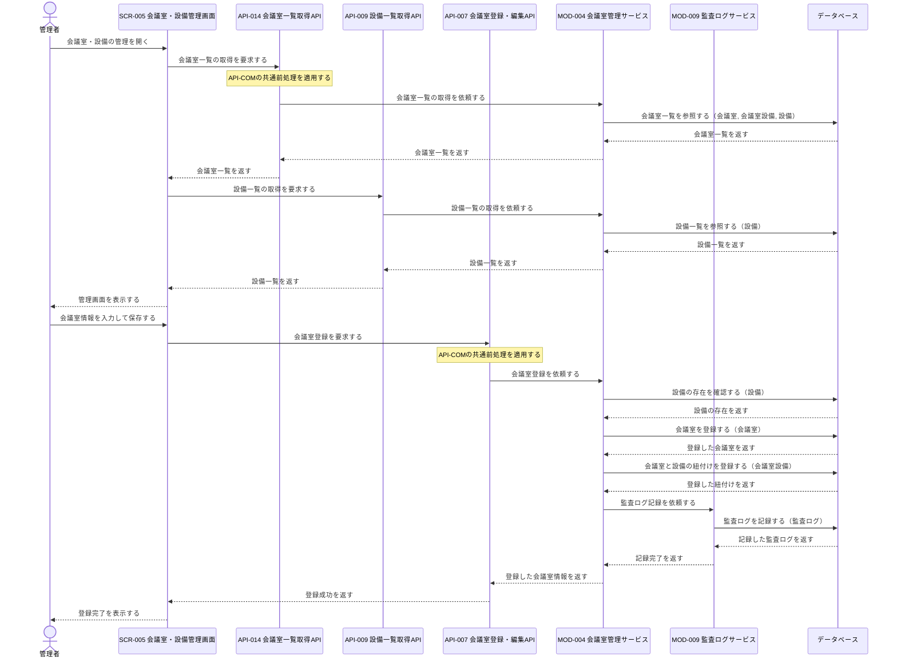
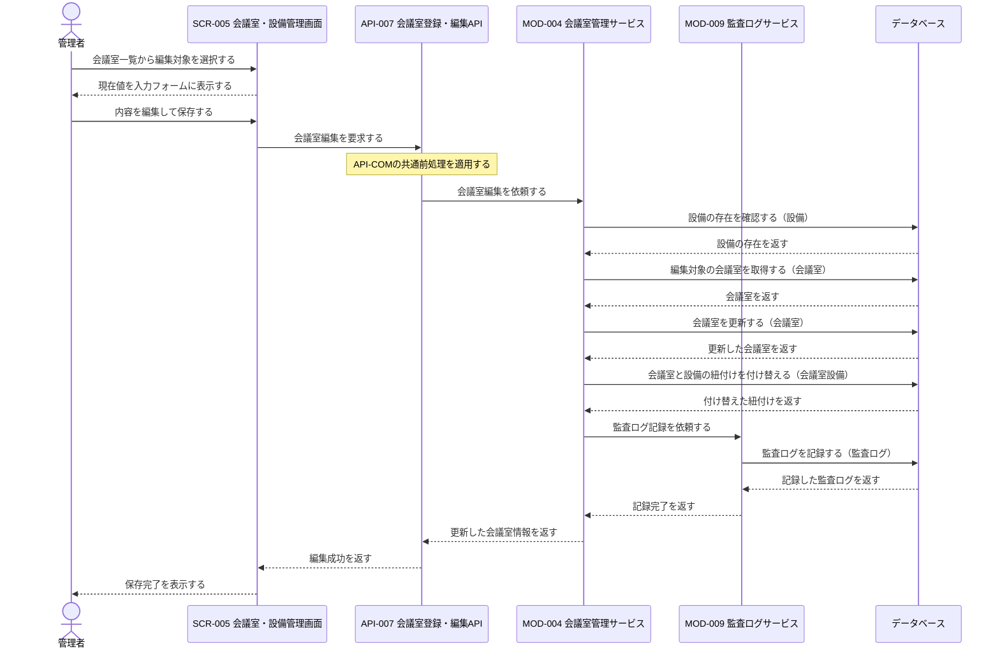
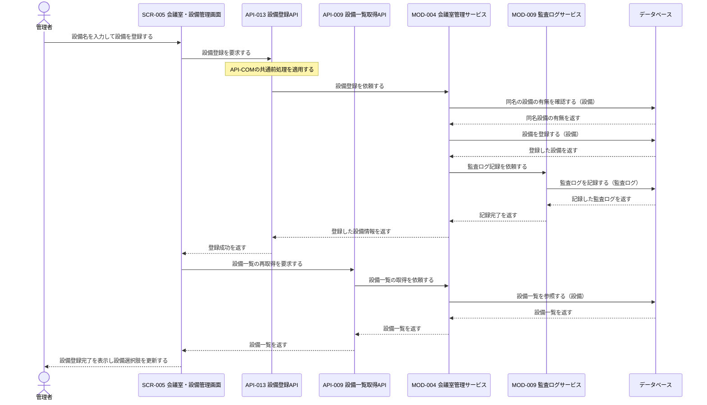
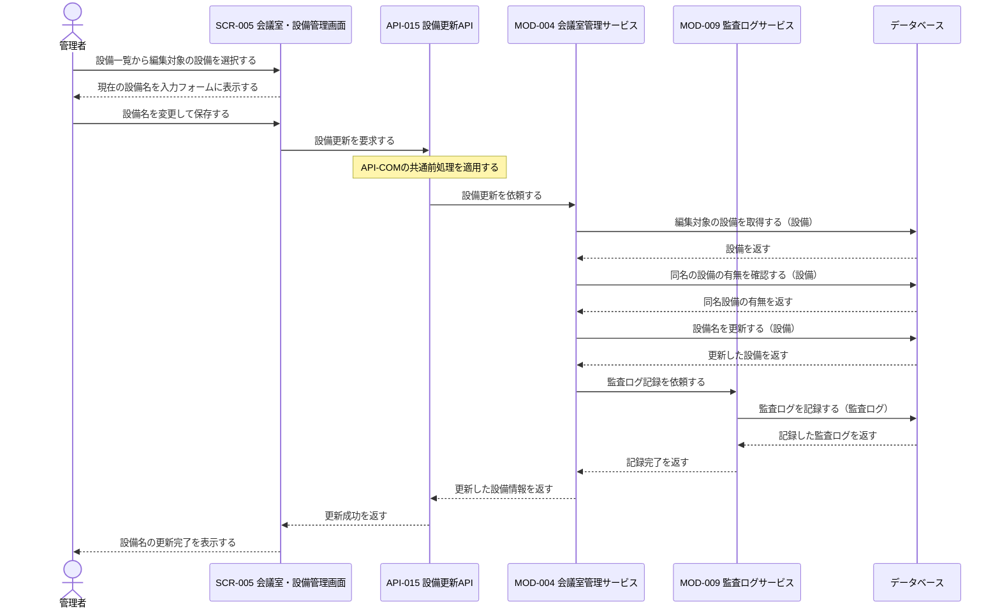
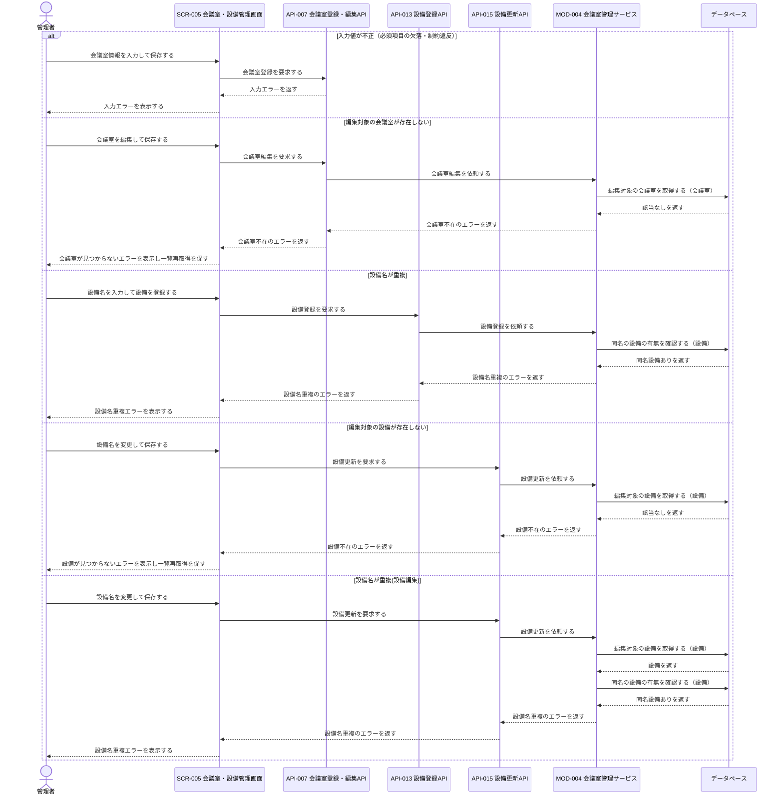

# 1. 基本情報

| 項目 | 内容 |
|---|---|
| シーケンスID | SEQ-009 |
| シーケンス名 | 会議室・設備管理シーケンス |
| 目的 | 管理者による会議室(利用単価・利用状態・設備紐付けを含む)と設備の登録・編集を、入力検証・存在確認・トランザクション境界とともにブロック間連携として明確にする。 |
| 対象範囲 | 開始: 管理者がSCR-005で会議室・設備管理を開く / 終了: 会議室・設備の保存完了、またはエラー結果が管理者へ表示される |
| 作成単位 | UC単位／画面主要操作単位 |
| 契機 | 管理者操作（会議室・設備の登録・編集） |
| 関連機能要件ID | FR-005 |
| 関連ユースケースID | FR-005/UC-01 |
| 事前条件 | 管理者としてログイン済みで、SCR-005から会議室・設備の登録・編集を行える。 |
| 事後条件 | 正常時は会議室・設備情報が登録・更新された内容で保存され、利用停止にした会議室は新規予約の対象から外れ、管理者へ完了が表示される。例外時は保存せず、再入力または一覧再取得に必要な結果が表示される。 |
| 状態 | 確定 |

# 2. 構成要素

| 要素 | 種別 | ID/参照 | このシーケンスでの役割 |
|---|---|---|---|
| 管理者 | アクター | - | 会議室・設備情報を入力して登録・編集し、結果を確認する |
| 会議室・設備管理画面 | UI | SCR-005 | 初期表示・入力受付・API呼び出し・完了/エラー表示を行う |
| 会議室一覧取得API | API | API-014 | 初期表示で管理者向け会議室一覧(利用停止含む)を取得する |
| 設備一覧取得API | API | API-009 | 設備選択肢(設備一覧)を取得する |
| 会議室登録・編集API | API | API-007 | 共通前処理を行い、会議室の登録・編集をモジュールへ委譲する |
| 設備登録API | API | API-013 | 共通前処理を行い、設備の新規登録をモジュールへ委譲する |
| 設備更新API | API | API-015 | 共通前処理を行い、設備名の更新をモジュールへ委譲する |
| 会議室管理サービス | モジュール | MOD-004 | 入力検証、設備存在確認、会議室・紐付けの登録/編集、設備の重複確認・登録・更新、一覧取得を担う |
| 監査ログサービス | モジュール | MOD-009 | 会議室・設備の登録/編集(会議室管理操作)の完了を監査ログに記録する（各更新と同一トランザクション） |
| データベース | DB | MDL-002, MDL-004, MDL-008, MDL-010 | 会議室、設備、会議室と設備の紐付け、および重要操作の監査ログを保持する |

# 3. シーケンス

本シーケンスは管理者による会議室・設備の登録・編集の連携を扱い、操作種別(新規登録・編集・設備登録・設備編集)・入力の妥当性・編集対象の会議室／設備の存在・設備名の重複を確認して、保存可能なものだけを確定する。網羅する状態パターン(FR-005/UC-01)を示す。

| パターンID | 状態パターン(条件) | 本シーケンスでの表現 |
|---|---|---|
| FR-005/UC-01/SP-1 | 新規登録・入力妥当(必須充足・制約内) | 3.1 正常系(新規登録・設備紐付け) |
| FR-005/UC-01/SP-2 | 編集・入力妥当・編集対象の会議室が存在 | 3.2 代替系 3.2.1(既存会議室の編集) |
| FR-005/UC-01/SP-3 | 設備登録・設備名が重複なし | 3.2 代替系 3.2.2(設備の新規登録) |
| FR-005/UC-01/SP-4 | 会議室名が未入力 | 3.3 例外系「入力値が不正(必須項目の欠落)」 |
| FR-005/UC-01/SP-5 | 収容人数が未入力 | 3.3 例外系「入力値が不正(必須項目の欠落)」 |
| FR-005/UC-01/SP-6 | 利用単価が未入力 | 3.3 例外系「入力値が不正(必須項目の欠落)」 |
| FR-005/UC-01/SP-7 | 収容人数が1人未満または利用単価が0未満(制約違反) | 3.3 例外系「入力値が不正(制約違反)」 |
| FR-005/UC-01/SP-8 | 編集・編集対象の会議室が不在 | 3.3 例外系「編集対象の会議室が存在しない」 |
| FR-005/UC-01/SP-9 | 設備登録・設備名が重複 | 3.3 例外系「設備名が重複」 |
| FR-005/UC-01/SP-10 | 場所が未入力 | 3.3 例外系「入力値が不正(必須項目の欠落)」 |
| FR-005/UC-01/SP-11 | 会議室名が桁数上限を超過 | 3.3 例外系「入力値が不正(制約違反)」 |
| FR-005/UC-01/SP-12 | 指定した紐付け設備が存在しない(無効な設備ID) | 3.3 例外系「入力値が不正」／4.1 COND-01(指定設備の実在確認) |
| FR-005/UC-01/SP-13 | 設備登録・設備名が未入力 | 4.1 COND-04(設備名の必須検証で入力エラー) |
| FR-005/UC-01/SP-14 | 設備登録・設備名が桁数上限を超過 | 4.1 COND-04(設備名の桁数検証で入力エラー) |
| FR-005/UC-01/SP-15 | 設備編集・入力妥当・対象設備が存在・設備名が重複なし | 3.2 代替系 3.2.3(設備名の編集) |
| FR-005/UC-01/SP-16 | 設備編集・設備名が未入力 | 4.1 COND-06(設備名の必須検証で入力エラー) |
| FR-005/UC-01/SP-17 | 設備編集・設備名が桁数上限を超過 | 4.1 COND-06(設備名の桁数検証で入力エラー) |
| FR-005/UC-01/SP-18 | 設備編集・設備名が重複 | 3.3 例外系「設備名が重複(設備編集)」 |
| FR-005/UC-01/SP-19 | 設備編集・対象設備が不在 | 3.3 例外系「編集対象の設備が存在しない」 |

## 3.1 正常系シーケンス

管理者が管理画面を開いて会議室一覧・設備選択肢を取得し、会議室を新規登録して設備を紐付ける基本の流れを示す。

## 3.2 代替系シーケンス

### 3.2.1 既存会議室の編集

管理者が会議室一覧から編集対象を選び、内容を更新して設備紐付けを付け替える流れを示す。編集対象の選択と現在値表示は画面内で完結し、保存時に会議室編集を要求する。

### 3.2.2 設備の新規登録（FR-005/UC-01/ALT-1）

会議室に紐付ける設備が未登録の場合に、管理者が設備を新規登録し、設備選択肢を再取得して更新する流れを示す。

### 3.2.3 設備名の編集（FR-005/UC-01/ALT-2）

管理者が設備一覧から編集対象の設備を選び、設備名を変更して保存する流れを示す。編集対象の選択と現在値表示は画面内で完結し、保存時に設備更新を要求する。

## 3.3 例外系シーケンス

入力値不正(必須欠落・制約違反)、編集対象の会議室が存在しない、設備名が重複する(設備登録・設備編集)、編集対象の設備が存在しない各分岐を示す。

# 4. 連携定義

## 4.1 条件分岐

| 条件ID | 判定箇所 | 条件 | 成立時 | 不成立時 | 根拠 |
|---|---|---|---|---|---|
| COND-01 | API-007 / MOD-004 | 会議室名・収容人数・場所・利用単価が必須を満たし、会議室名が50文字以内、収容人数が1以上、利用単価が0以上、会議室ステータスが有効で、指定した紐付け設備が実在する | 会議室の登録・編集を継続 | 入力エラー | FR-005 業務ルール2, 3, 4, 9, 10 / FR-005/UC-01/SP-4 / FR-005/UC-01/SP-5 / FR-005/UC-01/SP-6 / FR-005/UC-01/SP-7 / FR-005/UC-01/SP-10 / FR-005/UC-01/SP-11 / FR-005/UC-01/SP-12 |
| COND-02 | API-007 / MOD-004 | 会議室IDの指定がない | 会議室を新規登録 | 既存会議室を編集 | FR-005/UC-01 基本フロー / FR-005/UC-01/SP-1 / FR-005/UC-01/SP-2 |
| COND-03 | MOD-004 | 編集対象の会議室が存在する | 会議室を更新 | 会議室不在のエラー | FR-005/UC-01 / FR-005/UC-01/SP-2 / FR-005/UC-01/SP-8 |
| COND-04 | API-013 / MOD-004 | 設備名が必須かつ50文字以内 | 設備登録を継続 | 入力エラー | FR-005/UC-01/ALT-1 / FR-005/UC-01/SP-13 / FR-005/UC-01/SP-14 |
| COND-05 | MOD-004 | 同名の設備が存在しない | 設備を登録 | 設備名重複のエラー | FR-005/UC-01/ALT-1, MDL-004 / FR-005/UC-01/SP-3 / FR-005/UC-01/SP-9 |
| COND-06 | API-015 / MOD-004 | 設備名が必須かつ50文字以内 | 設備更新を継続 | 入力エラー | FR-005 業務ルール9, 11 / FR-005/UC-01/ALT-2 / FR-005/UC-01/SP-16 / FR-005/UC-01/SP-17 |
| COND-07 | MOD-004 | 編集対象の設備が存在する | 設備名を更新 | 設備不在のエラー | FR-005 業務ルール11 / FR-005/UC-01/SP-15 / FR-005/UC-01/SP-19 |
| COND-08 | MOD-004 | 変更後の設備名と同名の設備が自身以外に存在しない | 設備名を更新 | 設備名重複のエラー | FR-005 業務ルール11, MDL-004 / FR-005/UC-01/SP-15 / FR-005/UC-01/SP-18 |

## 4.2 データ参照・更新

| データモデル | CRUD | 目的 | 実行主体 |
|---|---|---|---|
| MDL-002 会議室 | C / R / U | 会議室の登録、編集対象の存在確認、更新、一覧取得 | MOD-004 |
| MDL-004 設備 | C / R / U | 指定設備IDの実在確認、同名設備の重複確認、設備一覧取得、設備の新規登録、編集対象設備の存在確認・設備名の更新 | MOD-004 |
| MDL-008 会議室設備 | C / R / D | 会議室と設備の紐付けの登録・付け替え(削除→再登録)、一覧の設備結合参照 | MOD-004 |
| MDL-010 監査ログ | C | 会議室・設備の登録/編集(重要操作)の監査証跡の記録 | MOD-009 |

## 4.3 トランザクション境界

| 境界ID | 開始 | 終了 | 対象更新 | ロールバック条件 | 管理主体 |
|---|---|---|---|---|---|
| TX-01 | 会議室登録の開始 | 設備紐付け登録後のCOMMIT | MDL-002の登録、MDL-008の登録 | 入力検証エラーまたは登録失敗 | MOD-004 |
| TX-02 | 会議室更新の開始 | 設備紐付け付け替え後のCOMMIT | MDL-002の更新、MDL-008の削除・再登録 | 入力検証エラー、会議室不在、または更新失敗 | MOD-004 |
| TX-03 | 設備登録の開始 | 設備登録後のCOMMIT | MDL-004の登録 | 入力検証エラー、設備名重複、または登録失敗 | MOD-004 |
| TX-04 | 設備更新の開始 | 設備名更新後のCOMMIT | MDL-004の更新 | 入力検証エラー、設備不在、設備名重複、または更新失敗 | MOD-004 |

## 4.4 補足事項

| 観点 | 内容 |
|---|---|
| 同期/非同期 | 初期表示の一覧取得、会議室の登録・編集、設備の登録はいずれも同期処理で、結果を同一操作内で返す。 |
| 冪等性・再試行 | 会議室登録(POST)・設備登録(POST)は冪等でなく、再送で会議室が重複登録される、または同名設備として重複エラーになる。会議室編集(PUT)・設備編集(PUT)は冪等で、同一内容の再送でも結果は変わらない。 |
| 排他制御 | 明示的な行ロックは行わず、データベースが書き込みを直列化する。会議室更新と設備紐付けの付け替えは同一トランザクション内で直列に実行する。 |
| 外部連携 | なし。 |
