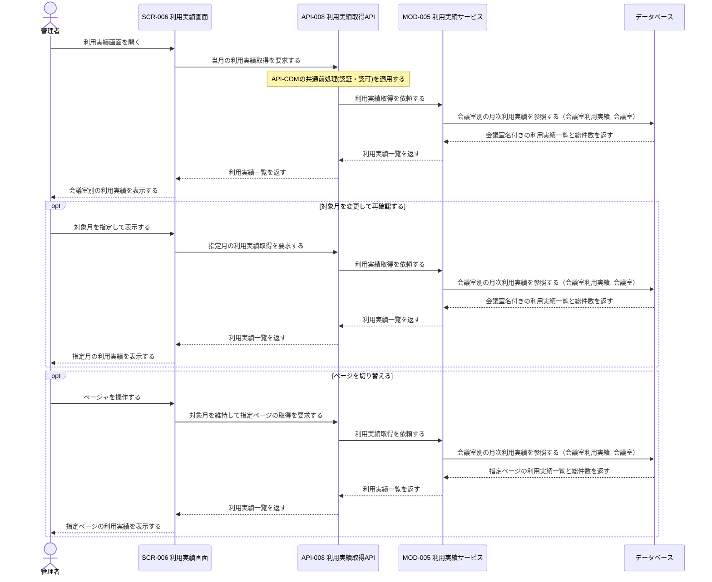
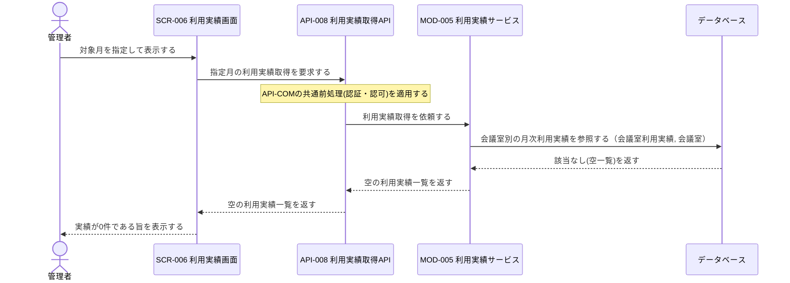
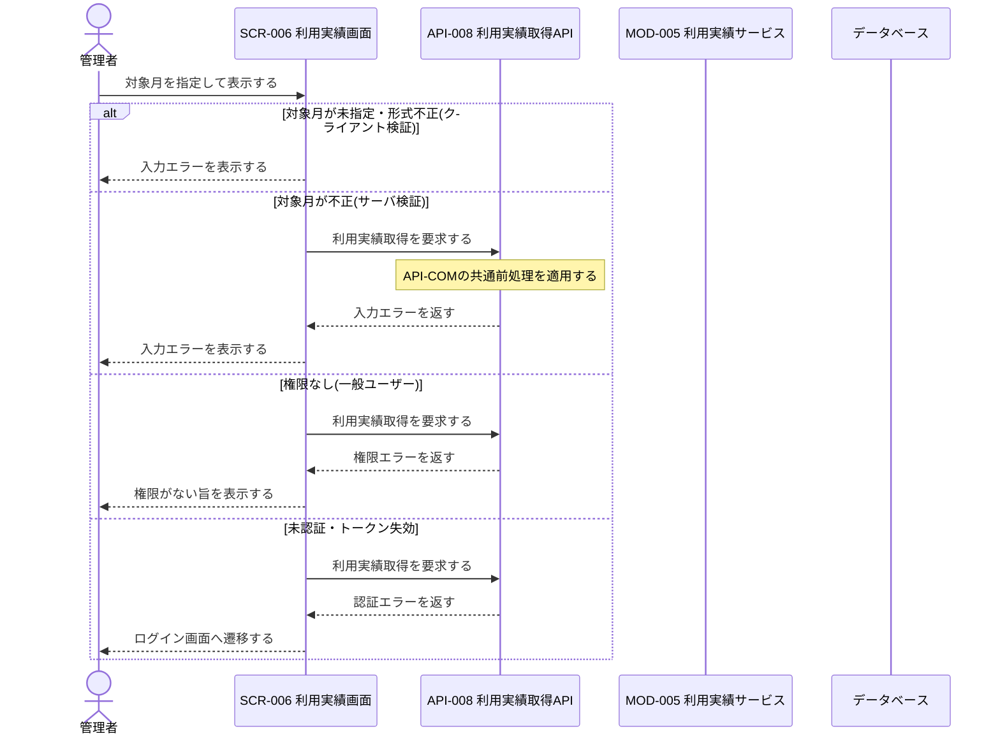

# 1. 基本情報

| 項目 | 内容 |
|---|---|
| シーケンスID | SEQ-010 |
| シーケンス名 | 利用実績レポートシーケンス |
| 目的 | 管理者が指定月の会議室別利用実績(利用件数・利用時間)を確認する際の、画面・API・モジュール・データベース間の参照連携と責務を明確にする。 |
| 対象範囲 | 開始: 管理者がSCR-006で利用実績画面を開く／対象月を指定して表示する / 終了: 会議室別の利用実績、または0件・エラー結果が管理者へ表示される |
| 作成単位 | UC単位／画面主要操作単位 |
| 契機 | 管理者操作(利用実績表示) |
| 関連機能要件ID | FR-006 |
| 関連ユースケースID | FR-006/UC-01 |
| 事前条件 | 管理者としてログイン済みで、JOB-003により集計済みの月次利用実績が蓄積されている。 |
| 事後条件 | 正常時は指定月の会議室別利用実績(件数・利用時間)が管理者へ提示される。予約データは変更されない。0件時は実績なしが提示され、例外時は入力・権限・認証に応じた結果が提示される。 |
| 状態 | 確定 |

# 2. 構成要素

| 要素 | 種別 | ID/参照 | このシーケンスでの役割 |
|---|---|---|---|
| 管理者 | アクター | - | 対象月を指定して会議室別の利用実績を確認する |
| 利用実績画面 | UI | SCR-006 | 対象月入力の受付、API呼び出し、実績一覧・0件・エラー表示を行う |
| 利用実績取得API | API | API-008 | 共通前処理(認証・認可)を行い、利用実績取得をモジュールへ委譲する |
| 利用実績サービス | モジュール | MOD-005 | 指定月の会議室別利用実績を会議室名昇順・ページネーション適用で取得する |
| データベース | DB | MDL-005, MDL-002 | 会議室別の月次利用実績と、対応する会議室名を保持する |

# 3. シーケンス

本シーケンスは、管理者が対象月を指定して会議室別の利用実績(利用件数・利用時間)を参照する連携を扱い、認可・対象月の妥当性検証を経て、実績あり／実績0件を提示する。集計そのものはJOB-003が事前生成した実績を参照するのみで本シーケンスでは行わない。網羅する状態パターン(FR-006/UC-01)を示す。SP-3(権限なし)はFR-006/UC-01/EXC-1、SP-4(対象月不正)はFR-006/UC-01/EXC-2に対応し、画面・APIの設計上の分岐として本シーケンスの例外系で表現する。

| パターンID | 状態パターン(条件) | 本シーケンスでの表現 |
|---|---|---|
| FR-006/UC-01/SP-1 | 管理者・対象月=妥当・実績=1件以上 | 3.1 正常系 |
| FR-006/UC-01/SP-2 | 管理者・対象月=妥当・実績=0件 | 3.2 代替系(実績0件) |
| FR-006/UC-01/SP-3 | 要求者=一般利用者(権限なし) | 3.3 例外系「権限なし(一般ユーザー)」 |
| FR-006/UC-01/SP-4 | 対象月=不正(未指定・形式不正) | 3.3 例外系「対象月が未指定・形式不正(クライアント検証)」「対象月が不正(サーバ検証)」 |

## 3.1 正常系シーケンス

管理者が利用実績画面を開き、対象月を指定して会議室別の利用実績(実績あり)を確認する基本の流れを示す。初期表示は当月を対象とし、対象月変更・ページ切替は同じ取得連携を任意操作として繰り返す。

## 3.2 代替系シーケンス

対象月に完了した予約が0件で、実績が存在しない流れを示す(FR-006/UC-01/ALT-1)。取得連携は正常系と同一で、結果が空一覧となる点のみが異なる。

## 3.3 例外系シーケンス

FR-006/UC-01の例外フロー(EXC-1: 権限なし、EXC-2: 対象月不正)に加え、画面(SCR-006)・API(API-008)の設計で入力検証・認可・認証の分岐を持つため、ブロック連携上の例外として示す。エラーは責務レベルで表現する。

# 4. 連携定義

## 4.1 条件分岐

| 条件ID | 判定箇所 | 条件 | 成立時 | 不成立時 | 根拠 |
|---|---|---|---|---|---|
| COND-01 | SCR-006 | 対象月がYYYY-MM形式で入力されている | API-008へ利用実績取得を要求 | 入力エラーを表示 | FR-006/UC-01 / FR-006/UC-01/SP-4 |
| COND-02 | API-008 | 要求者が管理者である | 利用実績取得を継続 | 権限エラー | FR-006 業務ルール1 / FR-006/UC-01/SP-3 |
| COND-03 | API-008 | 対象月がYYYY-MM形式で有効 | MOD-005へ利用実績取得を依頼 | 入力エラー | FR-006/UC-01 / FR-006/UC-01/SP-4 |
| COND-04 | SCR-006 | 取得した利用実績が1件以上 | 実績一覧を表示 | 0件メッセージを表示 | FR-006/UC-01/ALT-1 / FR-006/UC-01/SP-1, FR-006/UC-01/SP-2 |
| COND-05 | SCR-006 | 総件数が1ページ表示件数を超える | ページャを表示 | ページャを非表示 | FR-006/UC-01 |

## 4.2 データ参照・更新

| データモデル | CRUD | 目的 | 実行主体 |
|---|---|---|---|
| MDL-005 会議室利用実績 | R | 指定月の会議室別の予約件数・利用時間の取得 | MOD-005 |
| MDL-002 会議室 | R | 実績に対応する会議室名の取得 | MOD-005 |

## 4.3 トランザクション境界

| 境界ID | 開始 | 終了 | 対象更新 | ロールバック条件 | 管理主体 |
|---|---|---|---|---|---|
| （なし） | - | - | なし(参照系のみで更新トランザクションを持たない) | - | MOD-005 |

## 4.4 補足事項

| 観点 | 内容 |
|---|---|
| 同期/非同期 | 利用実績の取得・表示は同期処理。要求ごとに利用実績一覧と総件数を同一操作内で返す。 |
| 冪等性・再試行 | API-008は参照系で冪等。同一対象月・同一ページの再要求は同じ結果を返す。 |
| 排他制御 | 参照のみで排他制御は行わない。会議室×対象月の一意性は集計側(JOB-003・MOD-005)で担保する。 |
| 外部連携 | なし。表示対象の集計はJOB-003(月次利用実績集計)が事前に生成・最新化した実績を参照するのみで、本シーケンスは集計を行わない。 |
