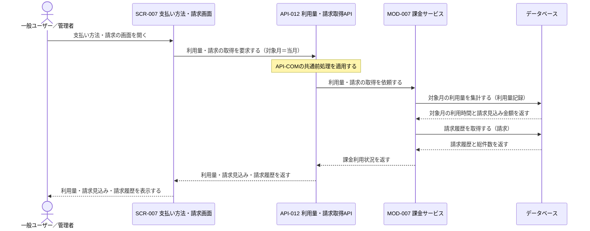
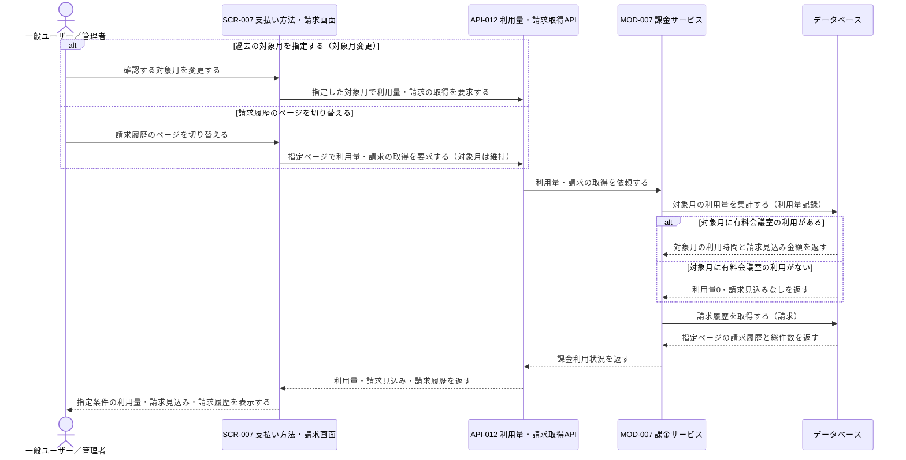
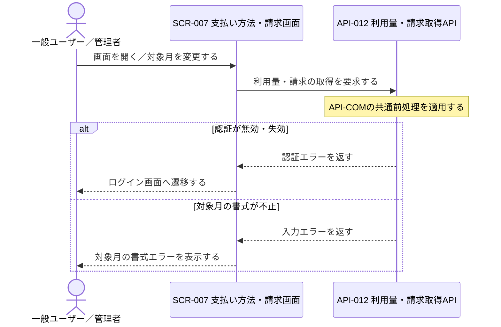

# 1. 基本情報

| 項目 | 内容 |
|---|---|
| シーケンスID | SEQ-011 |
| シーケンス名 | 利用量・請求確認シーケンス |
| 目的 | 利用者本人の対象月の利用量・請求見込みと請求履歴を、課金・請求データを変更せずに集計・提示する連携を明確にする。 |
| 対象範囲 | 開始: 利用者がSCR-007を開く（または対象月変更・請求履歴ページ切替を行う） / 終了: 利用量・請求見込み・請求履歴が利用者へ表示される |
| 作成単位 | UC単位／画面主要操作単位 |
| 契機 | 利用者操作（画面表示・対象月変更・請求履歴ページ切替） |
| 関連機能要件ID | FR-008 |
| 関連ユースケースID | FR-008/UC-02 |
| 事前条件 | 利用者がログイン済みで、会議室に利用単価が設定されている。 |
| 事後条件 | 対象月の利用量・請求見込み・請求履歴が利用者に提示される。課金・請求データは変更されない。 |
| 状態 | 確定 |

# 2. 構成要素

| 要素 | 種別 | ID/参照 | このシーケンスでの役割 |
|---|---|---|---|
| 一般ユーザー／管理者 | アクター | - | 対象月を指定し、利用量・請求見込み・請求履歴を確認する |
| 支払い方法・請求画面 | UI | SCR-007 | 初期表示・対象月変更・請求履歴ページ切替でAPIを呼び出し、利用量・請求を表示する |
| 利用量・請求取得API | API | API-012 | 共通前処理を行い、利用量・請求取得をモジュールへ委譲する |
| 課金サービス | モジュール | MOD-007 | 対象月の利用量・請求見込みの集計と請求履歴の取得を担う |
| データベース | DB | MDL-006, MDL-007 | 利用量記録から対象月の利用量・請求見込みを集計し、請求から請求履歴を取得する |

# 3. シーケンス

本シーケンスは利用量・請求確認の連携を扱い、利用者本人の対象月の利用量・請求見込みと請求履歴を、課金・請求データを変更せずに集計・提示する。網羅する状態パターン(FR-008/UC-02)を示す。なお認証の失効・対象月の書式不正(3.3 例外系)は、FR-008/UC-02が業務例外を定義しない範囲で画面・API設計上に生じる入力段階の分岐であり、UCの状態パターンには対応しない。

| パターンID | 状態パターン(条件) | 本シーケンスでの表現 |
|---|---|---|
| FR-008/UC-02/SP-1 | 対象月=当月(未指定)・対象月に有料会議室の利用あり | 3.1 正常系 |
| FR-008/UC-02/SP-2 | 対象月=過去月・対象月に有料会議室の利用あり | 3.2 代替系「過去の対象月を指定する」 |
| FR-008/UC-02/SP-3 | 対象月に有料会議室の利用なし | 3.2 代替系「対象月に有料会議室の利用がない」 |

## 3.1 正常系シーケンス

利用者が画面を開き、当月の利用量・請求見込みと請求履歴を確認する基本の流れを示す。参照のみで課金・請求データは変更しない。

## 3.2 代替系シーケンス

対象月の変更、請求履歴のページ切替、対象月に有料会議室の利用がない場合の分岐を示す。いずれも同一の取得連携を再利用し、課金・請求データは変更しない。

## 3.3 例外系シーケンス

FR-008/UC-02は業務上の例外フローを定義しないが、画面・API設計上、認証の失効と対象月の書式不正が入力段階で生じうる。いずれも利用量・請求の取得へ進まず、責務レベルの結果を利用者へ返す。

# 4. 連携定義

## 4.1 条件分岐

| 条件ID | 判定箇所 | 条件 | 成立時 | 不成立時 | 根拠 |
|---|---|---|---|---|---|
| COND-01 | API-COM共通前処理 | 認証が有効で、本人のデータへのアクセスである | 利用量・請求の取得を継続 | 認証エラーを返しログイン画面へ誘導 | FR-008/UC-02 事前条件1 |
| COND-02 | API-012 | 対象月が YYYY-MM 形式として妥当（未指定時は当月扱い） | 利用量・請求の取得を継続 | 入力エラーを返す | FR-008/UC-02 |
| COND-03 | MOD-007 | 対象月に有料会議室の利用（完了予約）がある | 集計した利用量・請求見込みを返す | 利用量0・請求見込みなしを返す | FR-008/UC-02/ALT-2 / FR-008/UC-02/SP-1 / FR-008/UC-02/SP-3 |

## 4.2 データ参照・更新

| データモデル | CRUD | 目的 | 実行主体 |
|---|---|---|---|
| MDL-006 利用量記録 | R | 対象月の利用量（利用時間）と請求見込み金額の集計 | MOD-007 |
| MDL-007 請求 | R | 請求履歴（請求対象月・請求金額・請求状態）のページネーション取得 | MOD-007 |

## 4.3 トランザクション境界

| 境界ID | 開始 | 終了 | 対象更新 | ロールバック条件 | 管理主体 |
|---|---|---|---|---|---|
| - | - | - | なし（参照のみ） | - | MOD-007 |

## 4.4 補足事項

| 観点 | 内容 |
|---|---|
| 同期/非同期 | 同期処理。初期表示・対象月変更・請求履歴ページ切替のいずれも同一操作内で結果を返す。 |
| 冪等性・再試行 | API-012は参照系で冪等。再取得しても課金・請求データを変更しない（FR-008 業務ルール7、受入条件7）。登録完了確認のポーリングで同APIを反復呼び出ししても副作用はない。 |
| 排他制御 | なし（参照のみで更新を伴わない）。 |
| 外部連携 | なし。利用量・請求は利用量記録・請求から参照し、確認操作では外部決済サービス連携やデータ変更を行わない。 |
