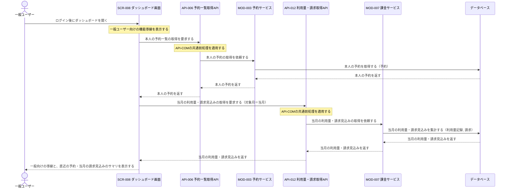
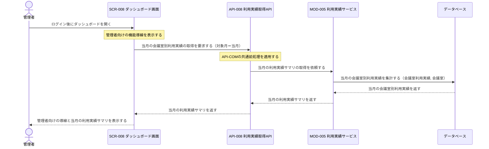
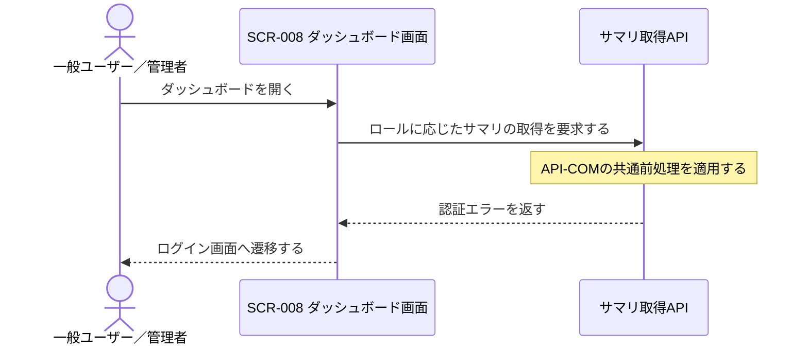

# 1. 基本情報

| 項目 | 内容 |
|---|---|
| シーケンスID | SEQ-012 |
| シーケンス名 | ダッシュボード表示シーケンス |
| 目的 | ログイン後の起点となるダッシュボードで、利用者のロールに応じた利用可能機能の導線と、本人が参照可能な利用状況のサマリを、既存機能のデータを集約して提示する連携を明確にする。 |
| 対象範囲 | 開始: 利用者がログイン後にSCR-008を開く / 終了: ロールに応じた導線とサマリが利用者へ表示される |
| 作成単位 | UC単位／画面主要操作単位 |
| 契機 | 利用者操作（ダッシュボード表示） |
| 関連機能要件ID | CFR-008 |
| 関連ユースケースID | CFR-008/UC-01 |
| 事前条件 | 利用者がログイン済みである。 |
| 事後条件 | 利用者のロールに応じた利用可能機能の導線とサマリが提示される。参照のみで業務データは変更されない。 |
| 状態 | 確定 |

# 2. 構成要素

| 要素 | 種別 | ID/参照 | このシーケンスでの役割 |
|---|---|---|---|
| 一般ユーザー／管理者 | アクター | - | ダッシュボードを開き、ロールに応じた導線とサマリを確認する |
| ダッシュボード画面 | UI | SCR-008 | ロールに応じた機能導線を表示し、サマリ取得のため既存APIを呼び出して表示する |
| 予約一覧取得API | API | API-006 | 共通前処理を行い、本人の予約一覧取得を予約サービスへ委譲する |
| 予約サービス | モジュール | MOD-003 | 本人の予約の取得を担う |
| 利用量・請求取得API | API | API-012 | 共通前処理を行い、当月の利用量・請求見込み取得を課金サービスへ委譲する |
| 課金サービス | モジュール | MOD-007 | 当月の利用量・請求見込みの集計を担う |
| 利用実績取得API | API | API-008 | 共通前処理を行い、当月の利用実績取得を利用実績サービスへ委譲する |
| 利用実績サービス | モジュール | MOD-005 | 当月の会議室別利用実績サマリの取得を担う |
| データベース | DB | MDL-002, MDL-003, MDL-005, MDL-006, MDL-007 | 予約・利用量記録・請求・会議室利用実績・会議室を参照する |

# 3. シーケンス

本シーケンスはログイン後のダッシュボード表示の連携を扱い、利用者のロールに応じて利用可能機能の導線と本人が参照可能なサマリを、既存機能のデータを集約して提示する。網羅する状態パターン(CFR-008/UC-01)を示す。なお認証の失効(3.3 例外系)は、CFR-008/UC-01が業務例外を定義しない範囲で画面・API設計上に生じる入力段階の分岐であり、UCの状態パターンには対応しない。

| パターンID | 状態パターン(条件) | 本シーケンスでの表現 |
|---|---|---|
| CFR-008/UC-01/SP-1 | ロール=一般 | 3.1 正常系 |
| CFR-008/UC-01/SP-2 | ロール=管理者 | 3.2 代替系「管理者のダッシュボード」 |

## 3.1 正常系シーケンス

一般ユーザーがログイン後にダッシュボードを開き、一般向けの機能導線と、直近の予約・当月の請求見込みのサマリを確認する基本の流れを示す。参照のみで業務データは変更しない。

## 3.2 代替系シーケンス

管理者がログイン後にダッシュボードを開き、管理者向けの機能導線と、当月の会議室別利用実績サマリを確認する分岐を示す。参照のみで業務データは変更しない。

## 3.3 例外系シーケンス

CFR-008/UC-01は業務上の例外フローを定義しないが、画面・API設計上、認証の失効がサマリ取得の入力段階で生じうる。この場合サマリ取得へ進まず、ログイン画面へ遷移する。

# 4. 連携定義

## 4.1 条件分岐

| 条件ID | 判定箇所 | 条件 | 成立時 | 不成立時 | 根拠 |
|---|---|---|---|---|---|
| COND-01 | SCR-008 | 利用者のロールが一般である | 一般向けの導線・サマリ（本人の予約・当月の請求見込み）を提示 | 管理者向けの導線・サマリ（当月の利用実績）を提示 | CFR-008/UC-01/SP-1 / CFR-008/UC-01/SP-2 / CFR-008/UC-01/ALT-1 |
| COND-02 | API-COM共通前処理 | 認証が有効で、本人のデータへのアクセスである | サマリの取得を継続 | 認証エラーを返しログイン画面へ誘導 | CFR-008/UC-01 前提条件1 |

## 4.2 データ参照・更新

| データモデル | CRUD | 目的 | 実行主体 |
|---|---|---|---|
| MDL-003 予約 | R | 一般向けサマリのための本人の予約の取得 | MOD-003 |
| MDL-006 利用量記録 | R | 当月の利用量・請求見込みの集計 | MOD-007 |
| MDL-007 請求 | R | 当月の請求見込みの集計 | MOD-007 |
| MDL-005 会議室利用実績 | R | 管理者向けサマリのための当月の会議室別利用実績の取得 | MOD-005 |
| MDL-002 会議室 | R | 利用実績サマリへの会議室情報の付与 | MOD-005 |

## 4.3 トランザクション境界

| 境界ID | 開始 | 終了 | 対象更新 | ロールバック条件 | 管理主体 |
|---|---|---|---|---|---|
| - | - | - | なし（参照のみ） | - | - |

ダッシュボード表示は既存機能のデータの参照のみで DB 更新を伴わないため、トランザクション境界は設けない。

## 4.4 補足事項

| 観点 | 内容 |
|---|---|
| 同期/非同期 | 同期処理。ダッシュボード表示時にロールに応じてサマリ取得を行い、同一操作内で結果を返す。一般向けの複数サマリの取得は並行してよい。 |
| 冪等性・再試行 | 参照系で冪等。再取得しても業務データを変更しない。 |
| 排他制御 | なし（参照のみで更新・排他取得を行わない）。 |
| 外部連携 | なし。サマリは既存機能のデータ（予約・利用量記録・請求・会議室利用実績・会議室）を参照し、ダッシュボード固有の新規データ・外部連携を持たない。各APIの内部処理の詳細は各API設計および SEQ-007・SEQ-010・SEQ-011 を正本とする。 |
