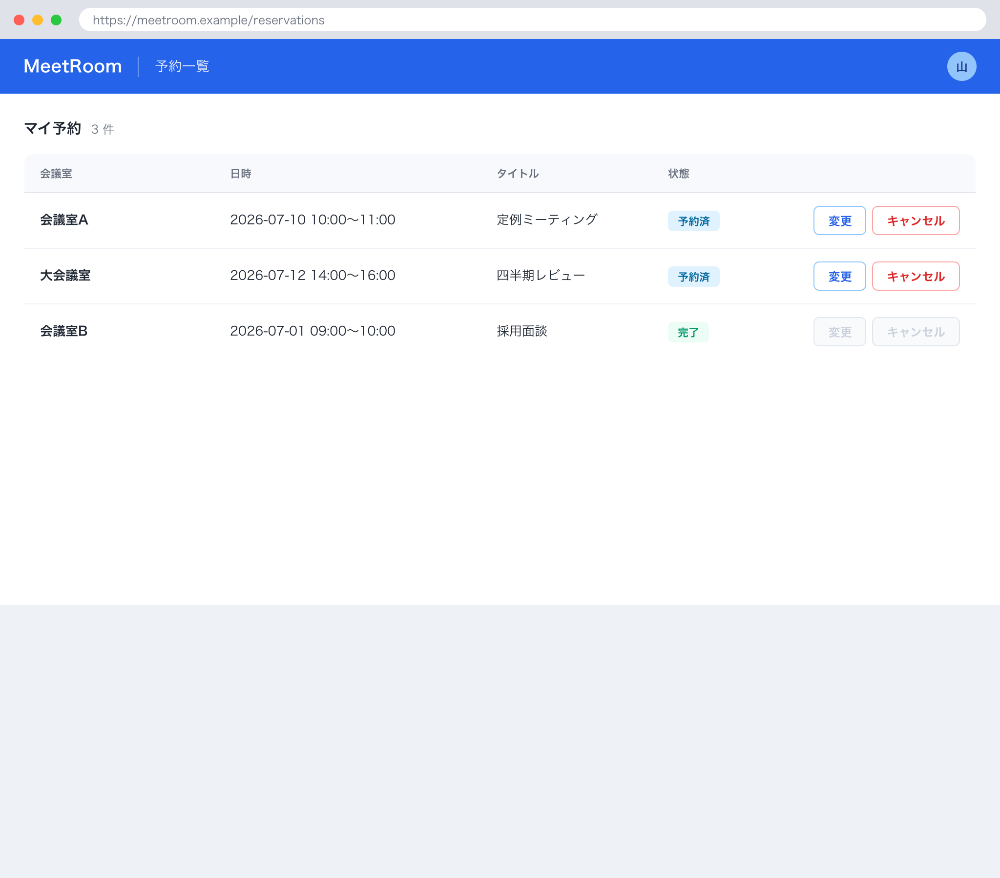

# 1. 基本情報

| 項目 | 内容 |
|---|---|
| 画面ID | SCR-004 |
| 画面名 | 予約一覧・変更・キャンセル |
| 概要 | 自分の予約を一覧表示し、予約済の予約について日時・タイトルの変更、またはキャンセルを行う画面 |
| トレース元 | FR-003/UC-01, FR-003/UC-02 |
| URL / ルート | /reservations |
| 利用可能ロール | DEF-001/CODE-001 |

# 2. 画面レイアウト

# 3. 初期表示

| 項目 | 内容 |
|---|---|
| 表示時に呼び出すAPI | API-006 |
| デフォルト値 | ログイン利用者本人の予約を表示 |
| ソート順 | 開始日時 昇順 |
| 0件時の表示 | 予約が無い旨を表示し、予約一覧を非表示にする |

# 4. 画面項目

| 項目ID | 項目名 | 種別 | 表示/入力 | 必須 | 初期値 | 備考 |
|---|---|---|---|---|---|---|
| ITM-01 | 予約一覧 | 一覧 | 表示 | - | - | 会議室名・日時・タイトル・予約ステータス（DEF-001/CODE-004）を表示。各行に変更・キャンセルボタンを持つ |
| ITM-02 | 変更ボタン（行内） | button | 入力 | - | - | EVT-02 を発火 |
| ITM-03 | キャンセルボタン（行内） | button | 入力 | - | - | EVT-03 を発火 |
| ITM-04 | 利用日（変更フォーム） | date | 入力 | Yes | 対象予約の値 | 変更フォーム内 |
| ITM-05 | 開始時刻（変更フォーム） | select | 入力 | Yes | 対象予約の値 | 15分刻み |
| ITM-06 | 終了時刻（変更フォーム） | select | 入力 | Yes | 対象予約の値 | 15分刻み |
| ITM-07 | タイトル（変更フォーム） | text | 入力 | Yes | 対象予約の値 | 最大100文字 |
| ITM-08 | 保存ボタン（変更フォーム） | button | 入力 | - | - | EVT-04 を発火 |
| ITM-09 | 閉じるボタン（変更フォーム） | button | 入力 | - | - | EVT-06 を発火 |

# 5. 画面イベント

| イベントID | イベント名 | 発火条件 | 呼び出しAPI | 成功時 | 失敗時 |
|---|---|---|---|---|---|
| EVT-01 | 予約一覧取得 | 画面表示時 | API-006 | 本人の予約を予約一覧に表示 | ERR-001 発生時は SCR-001(ログイン)へ遷移 |
| EVT-02 | 変更フォーム表示 | 行の「変更」押下 | - | 対象予約の値を変更フォームに設定して表示 | - |
| EVT-03 | キャンセル確認 | 行の「キャンセル」押下 | - | MSG-002 の確認ダイアログ(OK / キャンセル)を表示。OK 押下で EVT-05 を発火、キャンセル押下はダイアログを閉じるのみ(API を呼ばず予約を残す=ALT-1) | - |
| EVT-04 | 変更保存 | 変更フォームの「保存」押下 | API-004 | MSG-018 表示、変更フォームを閉じ予約一覧を再取得して更新 | ERR-003 発生時 MSG-003 表示 / ERR-004 発生時 MSG-006 表示 / ERR-005 発生時 MSG-017 表示し変更フォームを閉じ予約一覧を再取得。ERR-001 発生時は SCR-001(ログイン)へ遷移 |
| EVT-05 | キャンセル実行 | キャンセル確認で「OK」押下 | API-005 | MSG-019 表示、対象予約をキャンセル状態にし予約一覧を再取得して更新 | ERR-005 発生時 MSG-017 表示し予約一覧を再取得。ERR-001 発生時は SCR-001(ログイン)へ遷移 |
| EVT-06 | 変更フォームを閉じる | 変更フォームの「閉じる」押下 | - | 変更フォームを閉じる（入力は破棄） | - |

# 6. 入力チェック

<!-- クライアント側チェックのみ。サーバ側バリデーションは API 文書に記載 -->

| 対象項目 | チェック内容 | 表示メッセージ |
|---|---|---|
| 開始時刻・終了時刻 | 開始 < 終了 であること | MSG-008 |
| 利用日・開始時刻 | 過去の日時でないこと | MSG-006 |
| タイトル | 必須・100文字以内であること | MSG-005 |

# 7. 表示制御

| 条件 | 対象 | 制御内容 |
|---|---|---|
| 予約ステータスがキャンセル（2）または完了（3） | 行内の変更ボタン・キャンセルボタン | 非活性 |
| 予約の開始日時が現在時刻より過去（開始後） | 行内の変更ボタン・キャンセルボタン | 非活性 |
| 予約が0件 | 予約一覧 | 非表示 |
| 変更フォームを開いていない | 変更フォーム | 非表示 |

# 8. 画面遷移

| 遷移先 | トリガ |
|---|---|
| SCR-001 | API 呼び出しで ERR-001(認証失敗・トークン失効)を受信、または未認証で本画面へアクセス |
| - | 上記以外の他画面への遷移なし（一覧表示・変更・キャンセルは本画面内で完結） |

# 9. メッセージ一覧

本画面が参照する画面表示文言(MSG)を以下にインライン定義する。対応ERR は当該メッセージの表示契機となるエラー(なしは -)。

| MSG ID | 種別 | 文言 | 対応ERR |
|---|---|---|---|
| MSG-002 | 確認 | この予約をキャンセルしますか？ | - |
| MSG-003 | エラー | 指定の時間帯は既に予約されています。時間を変えて再度お試しください。 | ERR-003 |
| MSG-005 | エラー | タイトルは必須です。100文字以内で入力してください。 | ERR-006 |
| MSG-006 | エラー | 過去の日時は予約できません。日時を確認してください。 | ERR-004 |
| MSG-008 | エラー | 終了時刻は開始時刻より後の時刻を指定してください。 | - |
| MSG-017 | エラー | この予約は変更・キャンセルできません。予約の状態が変わった可能性があります。最新の予約一覧をご確認ください。 | ERR-005 |
| MSG-018 | 完了 | 予約を変更しました。 | - |
| MSG-019 | 完了 | 予約をキャンセルしました。 | - |
