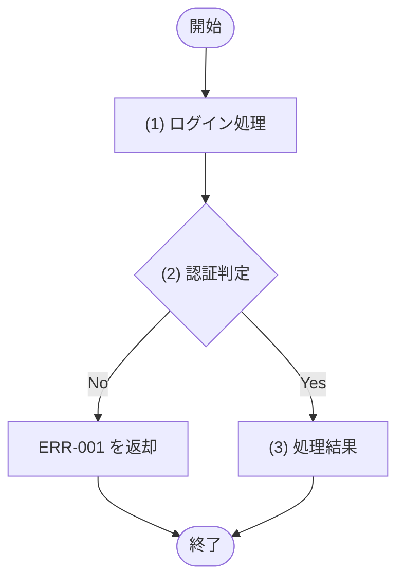

# 1. 基本情報

| 項目 | 内容 |
|---|---|
| API ID | API-001 |
| API名 | ログイン |
| メソッド | POST |
| パス | /api/auth/login |
| 認証 | 不要 |
| 認可 | 全員(認証前のため制限なし) |
| 冪等性 | あり(資格情報の検証のみで永続的な副作用がなく、同一資格情報の再送でも結果は同じ) |
| トレース元 | CFR-001/UC-01 |
| 概要 | メールアドレスとパスワードで本人確認し、認証が必要な API で使用する Bearer JWT(有効期限24時間)を発行する。 |

# 2. リクエスト

| 項目名 | 型 | 必須 | 説明・制約 |
|---|---|---|---|
| メールアドレス | string | Yes | ログインID。メールアドレス形式 |
| パスワード | string | Yes | 8文字以上 |

# 3. レスポンス

| 項目 | 内容 |
|---|---|
| HTTPステータス | 200 |

| 項目名 | 型 | 説明 |
|---|---|---|
| アクセストークン | string | 認証が必要な API で使用する Bearer JWT |
| トークン種別 | string | 認証方式。固定値 "Bearer" |
| 有効期限秒 | int | トークンの有効期限(秒)。86400(24時間) |
| ユーザーID | int | 認証したユーザーの一意な識別子 |
| ユーザー名 | string | 認証したユーザーの名称 |
| ユーザーロール | int | DEF-001/CODE-001 |

# 4. 処理フロー

この API の基本フローをフローチャートで定義する。

# 5. 処理詳細

処理フローの各処理で行う内容を定義する。

## (1) ログイン処理

入力された資格情報を検証し、認証トークンを発行する。認証に失敗した場合(該当利用者が無い、またはパスワードが一致しない)は NULL を返す。

| MOD-ID | 処理名 |
|---|---|
| MOD-001 | ログイン処理 |

| 引数項目 | 値 |
|---|---|
| メールアドレス | リクエスト.メールアドレス |
| パスワード | リクエスト.パスワード |

## (2) 認証判定

(1) ログイン処理の結果をもとに、認証が成立したかを判定する。

### 条件定義

| No | 判定対象 | 条件 |
|---|---|---|
| 条件(1) | (1) ログイン処理の結果 | != NULL |

### 条件分岐マトリクス

条件は ◯=満たす・×=満たさない、処理は ◯=そのパターンで実行・-=実行しない で表す。

| 条件・処理 | #1 正常 | #2 認証失敗 |
|---|---|---|
| 条件(1) | ◯ | × |
| 処理 |  |  |
| (3) 処理結果へ進む | ◯ | - |
| ERR-001 を返却する | - | ◯ |

処理結果以外の処理のため、処理結果は「なし」とする。

| 項目名 | データ型 | 値 | 説明 |
|---|---|---|---|
| なし | - | - | - |

## (3) 処理結果

発行したトークンと認証したユーザー情報をレスポンスとして返却する。

| 項目名 | データ型 | 値 | 説明 |
|---|---|---|---|
| アクセストークン | String | (1) ログイン処理の結果.トークン | 返却するアクセストークン |
| トークン種別 | String | "Bearer" | 返却するトークン種別 |
| 有効期限秒 | Integer | 86400 | 返却する有効期限秒 |
| ユーザーID | Integer | (1) ログイン処理の結果.ユーザーID | 返却するユーザーID |
| ユーザー名 | String | (1) ログイン処理の結果.ユーザー名 | 返却するユーザー名 |
| ユーザーロール | Integer | (1) ログイン処理の結果.ロール | 返却するユーザーロール(DEF-001/CODE-001) |

## エラー結果

個別処理フローで返却するエラーレスポンスの各項目に設定する値を定義する。封筒構造は API-COM §4 エラーレスポンスが正本。

| 項目名 | データ型 | 値 | 説明 |
|---|---|---|---|
| エラーコード | String | ERR-001((2) 認証判定) | 返却するエラーコード |
| 開発者向けメッセージ | String | 返却する ERR の開発者向けメッセージ(§7 エラー、共通エラーは API-COM §4.1) | 返却する開発者向けメッセージ |
| エラー明細 | Array | 空配列(明細なし) | 返却するエラー明細 |

# 6. バリデーション

入力バリデーションの構文ルールを、成立条件(AND / OR の論理式)で定義する。成立条件を満たさない場合、エラー列のコードを返し、違反項目ごとに details[] へ {field=項目名, message=メッセージ列} を設定する。

| 項目名 | 成立条件 | エラー | メッセージ |
|---|---|---|---|
| メールアドレス | 指定あり AND string AND メールアドレス形式 | ERR-006 | メールアドレスは必須で、メールアドレス形式で指定してください |
| パスワード | 指定あり AND string AND 8 ＜＝ 文字数 | ERR-006 | パスワードは必須で、8文字以上で指定してください |

# 7. エラー

認証・入力バリデーションで発生する共通エラーは API-COM_共通設計.md §4.1 共通エラー一覧を参照する。本 API に適用される共通エラーは ERR-001(認証失敗) / ERR-006(バリデーションエラー)。この API では、メールアドレスに一致する利用者が存在しない、またはパスワードが一致しない場合((2) 認証判定)に ERR-001 を返す。この API 固有のエラーはない。
