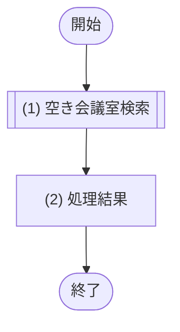

# 1. 基本情報

| 項目 | 内容 |
|---|---|
| API ID | API-002 |
| API名 | 会議室検索 |
| メソッド | GET |
| パス | /api/rooms |
| 認証 | 要 |
| 認可 | 一般=可, 管理者=可 |
| 冪等性 | あり(参照系) |
| トレース元 | FR-001/UC-01, FR-002/UC-01 |
| 概要 | 日時・人数・設備を条件に空き会議室を検索し、一覧を返す。 |

# 2. リクエスト

| 項目名 | 型 | 必須 | 説明・制約 |
|---|---|---|---|
| 利用日 | string | Yes | YYYY-MM-DD 形式(Asia/Tokyo) |
| 開始時刻 | string | Yes | HH:mm 形式(Asia/Tokyo) |
| 終了時刻 | string | Yes | HH:mm 形式(Asia/Tokyo)。開始時刻 ＜ 終了時刻 |
| 利用人数 | int | No | 1以上の整数。未指定時は収容人数で絞り込まない |
| 設備ID | int | No | 設備の一意な識別子。複数指定可(繰り返しパラメータ) |
| ページ | int | No | ページネーション(API-COM §5)。既定 1 |
| 取得件数 | int | No | ページネーション(API-COM §5)。既定 20 |

# 3. レスポンス

| 項目 | 内容 |
|---|---|
| HTTPステータス | 200 |

以下は items 配列の各要素。

| 項目名 | 型 | 説明 |
|---|---|---|
| 会議室ID | int | 会議室の一意な識別子 |
| 会議室名 | string | 会議室の名称 |
| 収容人数 | int | 会議室に収容できる人数 |
| 場所 | string | 会議室の場所 |
| 設備一覧 | array | 会議室に紐づく設備一覧。要素の構造は以下のとおり |
| 設備ID | int | 設備の一意な識別子 |
| 設備名 | string | 設備の名称 |

# 4. 処理フロー

この API の基本フローをフローチャートで定義する。

# 5. 処理詳細

処理フローの各処理で行う内容を定義する。

## (1) 空き会議室検索

指定された条件に合致し、指定時間帯に予約が入っていない会議室を取得する。利用日+時刻(Asia/Tokyo)から ISO8601(UTC)への変換は本 API 層で行う。

| MOD-ID | 処理名 |
|---|---|
| MOD-002 | 空き会議室検索処理 |

| 引数項目 | 値 |
|---|---|
| 利用開始日時 | リクエスト.利用日 + 開始時刻 を Asia/Tokyo として解釈し ISO8601(UTC)へ変換した値 |
| 利用終了日時 | リクエスト.利用日 + 終了時刻 を Asia/Tokyo として解釈し ISO8601(UTC)へ変換した値 |
| 必要収容人数 | リクエスト.利用人数(未指定時は 1) |
| 設備IDリスト | リクエスト.設備ID の配列(未指定時は空配列) |
| ページ | リクエスト.ページ(未指定時は API-COM §5 の既定値) |
| 取得件数 | リクエスト.取得件数(未指定時は API-COM §5 の既定値) |

## (2) 処理結果

(1) 空き会議室検索の結果にページネーションを適用し、レスポンスとして返却する。

| 項目名 | データ型 | 値 | 説明 |
|---|---|---|---|
| 会議室一覧 | Object[] | (1) 空き会議室検索の結果にページネーションを適用した一覧 | 返却する会議室一覧 |
| - 会議室ID | Integer | (1) 空き会議室検索の結果 | 返却する会議室ID |
| - 会議室名 | String | (1) 空き会議室検索の結果 | 返却する会議室名 |
| - 収容人数 | Integer | (1) 空き会議室検索の結果 | 返却する収容人数 |
| - 場所 | String | (1) 空き会議室検索の結果 | 返却する場所 |
| - 設備一覧 | Object[] | (1) 空き会議室検索の結果 | 返却する設備一覧 |
| -- 設備ID | Integer | (1) 空き会議室検索の結果 | 返却する設備ID |
| -- 設備名 | String | (1) 空き会議室検索の結果 | 返却する設備名 |
| 総件数 | Integer | (1) 空き会議室検索の結果の総件数 | 返却する総件数 |

# 6. バリデーション

入力バリデーションの構文ルールを、成立条件(AND / OR の論理式)で定義する。

| 項目名 | 成立条件 | エラーメッセージ |
|---|---|---|
| 利用日 | 指定あり AND YYYY-MM-DD形式 | 利用日を正しく入力してください |
| 開始時刻 | 指定あり AND HH:mm形式 | 開始時刻を正しく入力してください |
| 終了時刻 | 指定あり AND HH:mm形式 | 終了時刻を正しく入力してください |
| 開始時刻 / 終了時刻 | 開始時刻 ＜ 終了時刻 | 終了時刻は開始時刻より後の時刻を指定してください |
| 利用人数 | 指定なし OR(指定あり AND 整数 AND 1 ＜＝ 利用人数) | 利用人数は1人以上で入力してください |
| ページ / 取得件数 | 指定なし OR(指定あり AND 1 ＜＝ 整数) | ページ・取得件数は1以上の数値で指定してください |
