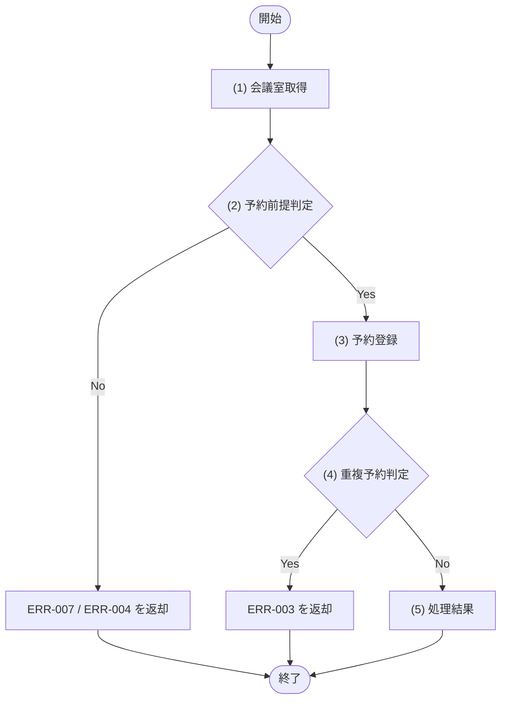

# 1. 基本情報

| 項目 | 内容 |
|---|---|
| API ID | API-003 |
| API名 | 予約登録 |
| メソッド | POST |
| パス | /api/reservations |
| 認証 | 要 |
| 認可 | 一般=可, 管理者=可 |
| 冪等性 | なし(再送で二重登録の可能性。重複チェックで同一時間帯は防止される) |
| トレース元 | FR-002/UC-01 |
| 概要 | 会議室の予約を登録する。同一会議室・同一時間帯の二重予約は登録できない。 |

# 2. リクエスト

| 項目名 | 型 | 必須 | 説明・制約 |
|---|---|---|---|
| 会議室ID | int | Yes | 予約対象の会議室ID |
| 予約タイトル | string | Yes | 100文字以内 |
| 利用開始日時 | string | Yes | ISO 8601 |
| 利用終了日時 | string | Yes | ISO 8601 |

# 3. レスポンス

| 項目 | 内容 |
|---|---|
| HTTPステータス | 201 |

| 項目名 | 型 | 説明 |
|---|---|---|
| 予約ID | int | 予約の一意な識別子 |
| 会議室ID | int | 予約対象の会議室ID |
| 予約タイトル | string | 予約タイトル |
| 利用開始日時 | string | ISO 8601 |
| 利用終了日時 | string | ISO 8601 |
| 予約ステータス | int | DEF-001/CODE-004 |

# 4. 処理フロー

この API の基本フローをフローチャートで定義する。

# 5. 処理詳細

処理フローの各処理で行う内容を定義する。

## (1) 会議室取得

会議室IDに一致する会議室を取得する。該当する会議室が存在しない場合は NULL を返す。

| MOD-ID | 処理名 |
|---|---|
| MOD-002 | 会議室詳細取得処理 |

| 引数項目 | 値 |
|---|---|
| 会議室ID | リクエスト.会議室ID |

## (2) 予約前提判定

(1) 会議室取得の結果と利用開始日時が、予約登録の前提を満たすかを判定する。

### 条件定義

| No | 判定対象 | 条件 |
|---|---|---|
| 条件(1) | (1) 会議室取得の結果 | != NULL |
| 条件(2) | (1) 会議室取得の結果.会議室ステータス | = 1(DEF-001/CODE-003) |
| 条件(3) | リクエスト.利用開始日時 | 現在日時 ＜＝ 利用開始日時 |

### 条件分岐マトリクス

条件は ◯=満たす・×=満たさない・-=判定しない、処理は ◯=そのパターンで実行・-=実行しない で表す。

| 条件・処理 | #1 正常 | #2 会議室なし | #3 利用停止 | #4 過去日時 |
|---|---|---|---|---|
| 条件(1) | ◯ | × | ◯ | ◯ |
| 条件(2) | ◯ | - | × | ◯ |
| 条件(3) | ◯ | - | - | × |
| 処理 |  |  |  |  |
| (3) 予約登録へ進む | ◯ | - | - | - |
| ERR-007 を返却する | - | ◯ | - | - |
| ERR-010 を返却する | - | - | ◯ | - |
| ERR-004 を返却する | - | - | - | ◯ |

## (3) 予約登録

指定された会議室と時間帯で予約を登録する。登録時に同一会議室・同一時間帯の重複予約を防止する。

| MOD-ID | 処理名 |
|---|---|
| MOD-003 | 予約登録処理 |

| 引数項目 | 値 |
|---|---|
| ユーザーID | 認証済みユーザーID |
| 会議室ID | リクエスト.会議室ID |
| 予約タイトル | リクエスト.予約タイトル |
| 利用開始日時 | リクエスト.利用開始日時 |
| 利用終了日時 | リクエスト.利用終了日時 |

## (4) 重複予約判定

(3) 予約登録の結果をもとに、同一会議室・同一時間帯の既存予約があるかを判定する。

### 条件定義

| No | 判定対象 | 条件 |
|---|---|---|
| 条件(1) | (3) 予約登録の重複確認結果 | 重複予約あり=false である |

### 条件分岐マトリクス

条件は ◯=満たす・×=満たさない、処理は ◯=そのパターンで実行・-=実行しない で表す。

| 条件・処理 | #1 | #2 |
|---|---|---|
| 条件(1) | ◯ | × |
| 処理 |  |  |
| (5) 処理結果へ進む | ◯ | - |
| ERR-003 を返却する | - | ◯ |

## (5) 処理結果

登録した予約情報をレスポンスとして返却する。

| 項目名 | データ型 | 値 | 説明 |
|---|---|---|---|
| 予約ID | Integer | (3) 予約登録の結果 | 返却する予約ID |
| 会議室ID | Integer | (3) 予約登録の結果 | 返却する会議室ID |
| 予約タイトル | String | (3) 予約登録の結果 | 返却する予約タイトル |
| 利用開始日時 | String | (3) 予約登録の結果 | 返却する利用開始日時 |
| 利用終了日時 | String | (3) 予約登録の結果 | 返却する利用終了日時 |
| 予約ステータス | Integer | (3) 予約登録の結果 | 返却する予約ステータス |

# 6. バリデーション

入力バリデーションの構文ルールを、成立条件(AND / OR の論理式)で定義する。成立条件を満たさない場合、エラー列のコードを返し、違反項目ごとに details[] へ {field=項目名, message=メッセージ列} を設定する。会議室の存在確認・過去日時など DB 参照・業務ルールを伴う判定は §5 個別処理フロー((2) 予約前提判定)に定義する。

| 項目名 | 成立条件 | エラー | メッセージ |
|---|---|---|---|
| 会議室ID | 指定あり AND int | ERR-006 | 会議室IDは必須で、整数で指定してください |
| 予約タイトル | 指定あり AND string AND 文字数 ＜＝ 100 | ERR-006 | 予約タイトルは必須で、100文字以内で指定してください |
| 利用開始日時 | 指定あり AND string AND ISO 8601形式 | ERR-006 | 利用開始日時は必須で、ISO 8601 形式で指定してください |
| 利用終了日時 | 指定あり AND string AND ISO 8601形式 | ERR-006 | 利用終了日時は必須で、ISO 8601 形式で指定してください |
| 利用開始日時 / 利用終了日時 | 利用開始日時 ＜ 利用終了日時 | ERR-006 | 利用開始日時は利用終了日時より前にしてください |

# 7. エラー

認証・入力バリデーションで発生する共通エラーは API-COM_共通設計.md §4.1 共通エラー一覧を参照する。本 API に適用される共通エラーは ERR-001(認証失敗) / ERR-006(バリデーションエラー)。この API 固有のエラーを以下にインライン定義する。

| ERR ID | エラー名 | HTTPステータス | この API での発生条件 | 開発者向けメッセージ |
|---|---|---|---|---|
| ERR-003 | 予約時間帯重複 | 409 | 同一会議室・時間帯に既存予約がある(他者が先に予約した場合を含む)((4) 重複予約判定) | Reservation time conflict |
| ERR-004 | 過去日時指定 | 400 | 利用開始日時 ＜ 現在日時((2) 予約前提判定) | Start time is in the past |
| ERR-007 | 会議室が存在しない | 404 | 会議室IDが存在しない((2) 予約前提判定) | Room not found |
| ERR-010 | 利用停止会議室指定 | 409 | 指定会議室の会議室ステータスがDEF-001/CODE-003 の利用停止に該当する((2) 予約前提判定・DEF-001/CODE-003) | Room is suspended |
| ERR-008 | 支払い方法未登録 | 402 | 有料会議室(利用単価>0)の予約時、予約者の支払い方法(従量課金契約 課金契約状態=有効)が未登録((2) 予約前提判定・MOD-003→MOD-007) | Payment method required |
