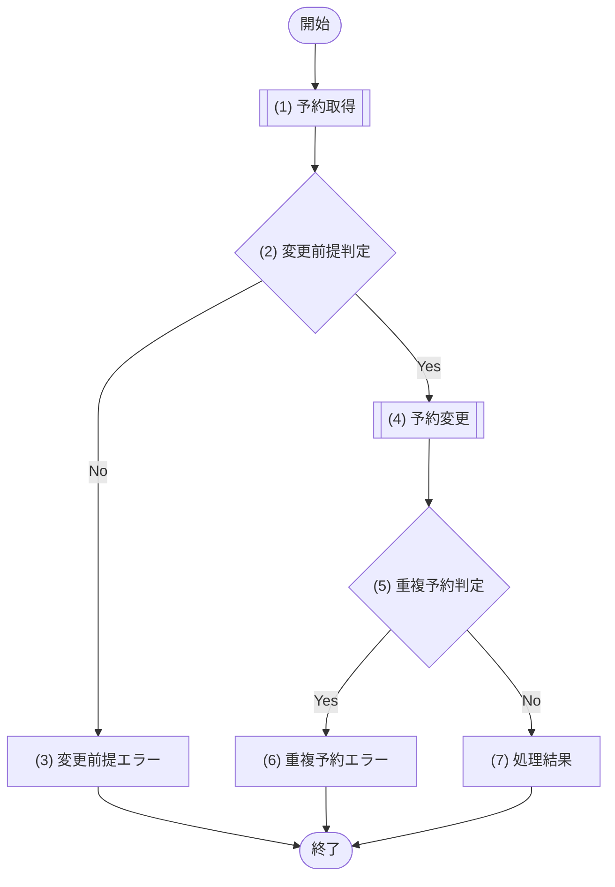

# 1. 基本情報

| 項目 | 内容 |
|---|---|
| API ID | API-004 |
| API名 | 予約変更 |
| メソッド | PUT |
| パス | /api/reservations/{id} |
| 認証 | 要 |
| 認可 | 一般=可, 管理者=可(いずれも予約者本人の予約のみ) |
| 冪等性 | あり(同一内容の再送でも結果は同じ。対象予約を指定内容に更新する) |
| トレース元 | FR-003/UC-01 |
| 概要 | 予約者本人が自分の予約の日時・タイトルを変更する。変更後も同一会議室・同一時間帯の二重予約は不可。キャンセル済み・完了済み・開始済みの予約は変更できない。 |

# 2. リクエスト

| 項目名 | 型 | 必須 | 説明・制約 |
|---|---|---|---|
| 予約ID | int | Yes | パスパラメータ。変更対象の予約ID |
| 予約タイトル | string | Yes | 100文字以内 |
| 利用開始日時 | string | Yes | ISO 8601 |
| 利用終了日時 | string | Yes | ISO 8601 |

# 3. レスポンス

| 項目 | 内容 |
|---|---|
| HTTPステータス | 200 |

| 項目名 | 型 | 説明 |
|---|---|---|
| 予約ID | int | 予約の一意な識別子 |
| 会議室ID | int | 予約対象の会議室ID |
| 予約タイトル | string | 変更後の予約タイトル |
| 利用開始日時 | string | 変更後の利用開始日時(ISO 8601) |
| 利用終了日時 | string | 変更後の利用終了日時(ISO 8601) |
| 予約ステータス | int | DEF-001/CODE-004 |

# 4. 処理フロー

この API の基本フローをフローチャートで定義する。

# 5. 処理詳細

処理フローの各処理で行う内容を定義する。

## (1) 予約取得

変更対象の予約を、認証済みユーザー本人のものに限って取得する。該当が無い場合は NULL を返す。

| MOD-ID | 処理名 |
|---|---|
| MOD-003 | 自予約取得処理 |

| 引数項目 | 値 |
|---|---|
| 予約ID | リクエスト.予約ID |
| ユーザーID | 認証済みユーザーID |

## (2) 変更前提判定

(1) 予約取得の結果と利用開始日時が、予約変更の前提を満たすかを判定する。

### 条件定義

| No | 判定対象 | 条件 |
|---|---|---|
| 条件(1) | (1) 予約取得の結果 | != NULL |
| 条件(2) | (1) 予約取得の結果.予約ステータス | 予約済(1) である |
| 条件(3) | (1) 予約取得の結果.利用開始日時 | 現在日時 ＜ 利用開始日時 |
| 条件(4) | リクエスト.利用開始日時 | 現在日時 ＜＝ 利用開始日時 |

### 条件分岐マトリクス

条件は ◯=満たす・×=満たさない・-=判定しない、処理は ◯=そのパターンで実行・-=実行しない で表す。

| 条件・処理 | #1 正常 | #2 予約なし・他者 | #3 変更不可状態 | #4 開始済み | #5 過去日時 |
|---|---|---|---|---|---|
| 条件(1) | ◯ | × | ◯ | ◯ | ◯ |
| 条件(2) | ◯ | - | × | ◯ | ◯ |
| 条件(3) | ◯ | - | - | × | ◯ |
| 条件(4) | ◯ | - | - | - | × |
| 処理 |  |  |  |  |  |
| (4) 予約変更へ進む | ◯ | - | - | - | - |
| (3) 変更前提エラーへ進む | - | ◯ | ◯ | ◯ | ◯ |

処理結果以外の処理のため、処理結果は「なし」とする。

| 項目名 | データ型 | 値 | 説明 |
|---|---|---|---|
| なし | - | - | - |

## (3) 変更前提エラー

予約変更の前提を満たさない場合のエラーレスポンスを返却する。

| エラーコード | 引数 | 値 |
|---|---|---|
| ERR-005(予約なし・他者 / 変更不可状態 / 開始済み) | {0} 予約ID | リクエスト.予約ID |
| ERR-004(過去日時) | なし | ― |

## (4) 予約変更

対象予約を変更後の内容に更新する。あわせて、同一会議室・同一時間帯で他の予約と重複していないかを確認する。

| MOD-ID | 処理名 |
|---|---|
| MOD-003 | 予約変更処理 |

| 引数項目 | 値 |
|---|---|
| 予約ID | (1) 予約取得の結果.予約ID |
| 会議室ID | (1) 予約取得の結果.会議室ID |
| 予約タイトル | リクエスト.予約タイトル |
| 利用開始日時 | リクエスト.利用開始日時 |
| 利用終了日時 | リクエスト.利用終了日時 |

## (5) 重複予約判定

(4) 予約変更の結果をもとに、変更後の予約が他の予約と時間帯で重複していないかを判定する。

### 条件定義

| No | 判定対象 | 条件 |
|---|---|---|
| 条件(1) | (4) 予約変更の重複確認結果 | 重複予約あり=false である |

### 条件分岐マトリクス

条件は ◯=満たす・×=満たさない、処理は ◯=そのパターンで実行・-=実行しない で表す。

| 条件・処理 | #1 | #2 |
|---|---|---|
| 条件(1) | ◯ | × |
| 処理 |  |  |
| (7) 処理結果へ進む | ◯ | - |
| (6) 重複予約エラーへ進む | - | ◯ |

## (6) 重複予約エラー

変更後の予約が同一会議室・同一時間帯で他の予約と重複する場合のエラーレスポンスを返却する。

| エラーコード | 引数 | 値 |
|---|---|---|
| ERR-003 | なし | ― |

## (7) 処理結果

変更後の予約情報をレスポンスとして返却する。

| 項目名 | データ型 | 値 | 説明 |
|---|---|---|---|
| 予約ID | Integer | (4) 予約変更の結果 | 返却する予約ID |
| 会議室ID | Integer | (4) 予約変更の結果 | 返却する会議室ID |
| 予約タイトル | String | (4) 予約変更の結果 | 返却する予約タイトル |
| 利用開始日時 | String | (4) 予約変更の結果 | 返却する利用開始日時 |
| 利用終了日時 | String | (4) 予約変更の結果 | 返却する利用終了日時 |
| 予約ステータス | Integer | (4) 予約変更の結果 | 返却する予約ステータス |

# 6. バリデーション

入力バリデーションの構文ルールを、成立条件(AND / OR の論理式)で定義する。

- 成立条件を満たさない場合、エラーコードを返し、違反項目ごとに details[] へ {field=項目名, message=違反した成立条件の内容} を設定する。
- 予約の存在確認・状態・過去日時など DB 参照・業務ルールを伴う判定は §5 個別処理フロー((2) 変更前提判定・(5) 重複予約判定)に定義する。

| 項目名 | 成立条件 | エラーコード |
|---|---|---|
| 予約ID | 指定あり AND int | [ERR-006](エラーメッセージ一覧.md) |
| 予約タイトル | 指定あり AND string AND 文字数 ＜＝ 100 | [ERR-006](エラーメッセージ一覧.md) |
| 利用開始日時 | 指定あり AND string AND ISO 8601形式 | [ERR-006](エラーメッセージ一覧.md) |
| 利用終了日時 | 指定あり AND string AND ISO 8601形式 | [ERR-006](エラーメッセージ一覧.md) |
| 利用開始日時 / 利用終了日時 | 利用開始日時 ＜ 利用終了日時 | [ERR-006](エラーメッセージ一覧.md) |

# 7. エラー

本 API が返却するエラーの一覧。定義(エラー名・HTTPステータス・開発者向けメッセージ)は エラーメッセージ一覧.md が正本。発生条件は、共通エラーは API-COM_共通設計.md §7 共通処理フロー、固有エラーは §4/§5 個別処理フローで表現する。

| エラーコード | 区分 | 発生箇所 |
|---|---|---|
| ERR-001 | 共通 | 共通処理フロー(認証) |
| ERR-006 | 共通 | 共通処理フロー(入力バリデーション) |
| ERR-003 | 固有 | 個別処理フロー(§4/§5) |
| ERR-004 | 固有 | 個別処理フロー(§4/§5) |
| ERR-005 | 固有 | 個別処理フロー(§4/§5) |
