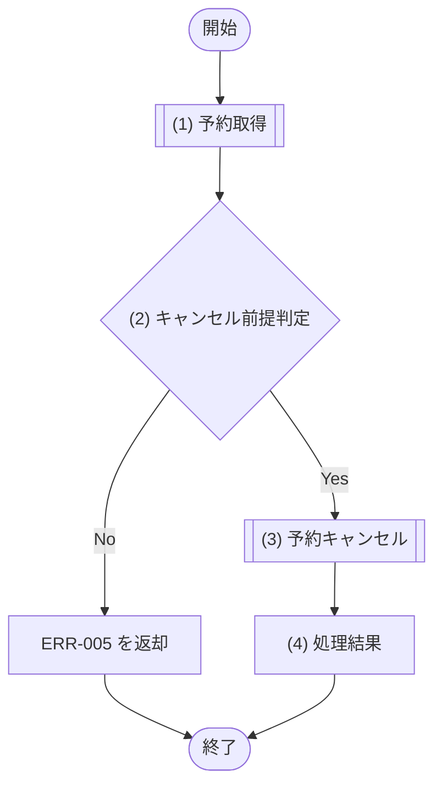

# 1. 基本情報

| 項目 | 内容 |
|---|---|
| API ID | API-005 |
| API名 | 予約キャンセル |
| メソッド | POST |
| パス | /api/reservations/{id}/cancel |
| 認証 | 要 |
| 認可 | 一般=可, 管理者=可(いずれも予約者本人の予約のみ) |
| 冪等性 | なし(POST。ただしキャンセル済みの予約の再送は ERR-005 となり、二重取消は発生しない) |
| トレース元 | FR-003/UC-02 |
| 概要 | 予約者本人が自分の予約をキャンセルし、予約ステータスをキャンセルに更新する。キャンセル済み・完了済み・開始済みの予約はキャンセルできない。 |

# 2. リクエスト

| 項目名 | 型 | 必須 | 説明・制約 |
|---|---|---|---|
| 予約ID | int | Yes | パスパラメータ。キャンセル対象の予約ID |

# 3. レスポンス

| 項目 | 内容 |
|---|---|
| HTTPステータス | 200 |

| 項目名 | 型 | 説明 |
|---|---|---|
| 予約ID | int | 予約の一意な識別子 |
| 予約ステータス | int | DEF-001/CODE-004(キャンセル) |

# 4. 処理フロー

この API の基本フローをフローチャートで定義する。

# 5. 処理詳細

処理フローの各処理で行う内容を定義する。

## (1) 予約取得

キャンセル対象の予約を取得する。該当が無い、または他者の予約の場合は NULL を返す。

| MOD-ID | 処理名 |
|---|---|
| MOD-003 | 自予約取得処理 |

| 引数項目 | 値 |
|---|---|
| 予約ID | リクエスト.予約ID |
| ユーザーID | 認証済みユーザーID |

## (2) キャンセル前提判定

(1) 予約取得の結果が、予約キャンセルの前提を満たすかを判定する。

### 条件定義

| No | 判定対象 | 条件 |
|---|---|---|
| 条件(1) | (1) 予約取得の結果 | != NULL |
| 条件(2) | (1) 予約取得の結果.予約ステータス | 予約済(1) である |
| 条件(3) | (1) 予約取得の結果.利用開始日時 | 現在日時 ＜ 利用開始日時 |

### 条件分岐マトリクス

条件は ◯=満たす・×=満たさない・-=判定しない、処理は ◯=そのパターンで実行・-=実行しない で表す。

| 条件・処理 | #1 正常 | #2 予約なし・他者 | #3 キャンセル不可状態 | #4 開始済み |
|---|---|---|---|---|
| 条件(1) | ◯ | × | ◯ | ◯ |
| 条件(2) | ◯ | - | × | ◯ |
| 条件(3) | ◯ | - | - | × |
| 処理 |  |  |  |  |
| (3) 予約キャンセルへ進む | ◯ | - | - | - |
| ERR-005 を返却する | - | ◯ | ◯ | ◯ |

処理結果以外の処理のため、処理結果は「なし」とする。

| 項目名 | データ型 | 値 | 説明 |
|---|---|---|---|
| なし | - | - | - |

## (3) 予約キャンセル

対象予約の予約ステータスをキャンセルに更新する。

| MOD-ID | 処理名 |
|---|---|
| MOD-003 | 予約キャンセル処理 |

| 引数項目 | 値 |
|---|---|
| 予約ID | (1) 予約取得の結果.予約ID |

## (4) 処理結果

キャンセルした予約情報をレスポンスとして返却する。

| 項目名 | データ型 | 値 | 説明 |
|---|---|---|---|
| 予約ID | Integer | (3) 予約キャンセルの結果 | 返却する予約ID |
| 予約ステータス | Integer | (3) 予約キャンセルの結果(DEF-001/CODE-004) | 返却する予約ステータス |

## エラー結果

個別処理フローで返却するエラーレスポンスの各項目に設定する値を定義する。封筒構造は API-COM §4 エラーレスポンスが正本。

| 項目名 | データ型 | 値 | 説明 |
|---|---|---|---|
| エラーコード | String | ERR-005((2) キャンセル前提判定) | 返却するエラーコード |
| 開発者向けメッセージ | String | 返却する ERR の開発者向けメッセージ(§7 エラー、共通エラーは API-COM §4.1) | 返却する開発者向けメッセージ |
| エラー明細 | Array | 空配列(明細なし) | 返却するエラー明細 |

# 6. バリデーション

入力バリデーションの構文ルールを、成立条件(AND / OR の論理式)で定義する。

- 成立条件を満たさない場合、エラー列のコードを返し、違反項目ごとに details[] へ {field=項目名, message=メッセージ列} を設定する。
- 予約の存在確認・状態など DB 参照・業務ルールを伴う判定は §5 個別処理フロー((2) キャンセル前提判定)に定義する。

| 項目名 | 成立条件 | エラー | メッセージ |
|---|---|---|---|
| 予約ID | 指定あり AND int | ERR-006 | 予約IDは必須で、整数で指定してください |

# 7. エラー

認証・入力バリデーションで発生する共通エラーは API-COM_共通設計.md §4.1 共通エラー一覧を参照する。

- 本 API に適用される共通エラーは ERR-001(認証失敗) / ERR-006(バリデーションエラー)。
- この API 固有のエラーを以下にインライン定義する。
- 各列は API-COM §4 エラーレスポンスの封筒項目に対応する(ERR ID=エラーコード、開発者向けメッセージ)。
- 発生条件は §4/§5 個別処理フローで表現する。

| ERR ID | エラー名 | HTTPステータス | 開発者向けメッセージ |
|---|---|---|---|
| ERR-005 | 予約が存在しない | 404 | Reservation not found |
